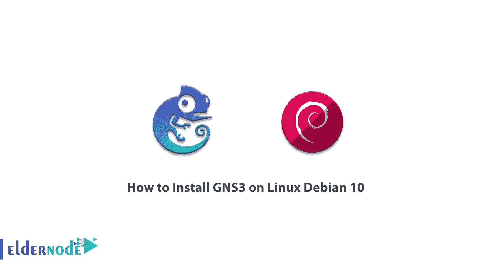

# 如何在 Linux Debian 10 - Eldernode 博客上安装 GNS3

> 原文：<https://blog.eldernode.com/install-gns3-on-linux-debian-10/>



GNS3 是一款免费的开源网络模拟软件，于 2008 年首次发布。GNS3 代表图形网络模拟器 3。该软件允许对网络设备进行虚拟和真实(完整)的图形模拟，从而为教育目的构建完整和复杂的网络。GNS3 软件基于 Dynamips 代码，允许您在 PC 上运行 Cisco iOS，而不是在昂贵的 Cisco 设备上运行。在这篇文章中，我们将学习如何在 Linux Debian 10 上安装 GNS3。你可以访问 [Eldernode](https://eldernode.com/) 提供的包来购买 [Linux VPS](https://eldernode.com/linux-vps/) 服务器。

## **教程在 Linux 上安装 GNS 3 Debian 10**

世界各地的许多网络工程师使用 [GNS3](https://blog.eldernode.com/gns3-software-for-network-engineers/) 软件来模拟他们的企业网络。这个软件是一个流行的模拟软件。

在实施之前，GNS3 能够使用您想要的设备设计您的网络。此外，您可以模拟各种服务器，包括基于云的服务器。

使用这个软件，我们可以使用虚拟和真实的设备，并创建一个非常实用的模拟环境。

在过去，网络工程师只有有限的选择来学习或探索他们的网络。他们必须获得许可或购买设备进行研究，但今天有几个选择这样做，包括 GNS3 模拟器！在这篇文章的后续部分，我们将学习如何在 Linux Debian 10 上安装 GNS3。

### **在 Linux 上安装 GNS 3 Debian 10 | Debian 9**

现在你需要按照下面的步骤在 Linux Debian 10 上安装 GNS3。要在 **Debian Jessie** 上安装 GNS3，需要将以下命令添加到/etc/apt/sources.list 中:

```
deb http://ppa.launchpad.net/gns3/ppa/ubuntu trusty main 
```

```
deb-src http://ppa.launchpad.net/gns3/ppa/ubuntu trusty main 
```

```
sudo apt-get update
```

```
sudo apt-get install -y gns3-gui gns3-server
```

您还必须运行以下命令，在 Debian Stretch 上安装 GNS3:

```
deb http://ppa.launchpad.net/gns3/ppa/ubuntu xenial main
```

```
deb-src http://ppa.launchpad.net/gns3/ppa/ubuntu xenial main
```

***注意:*** 需要注意的是，用于此目的的 Python 库是破的，不起作用。

最后，对于 **Debian Buster** ，你需要更新你的元数据。为此，请运行以下命令来安装所需的软件包:

```
sudo apt update
```

```
sudo apt install -y python3-pip python3-pyqt5 python3-pyqt5.qtsvg \ python3-pyqt5.qtwebsockets \ qemu qemu-kvm qemu-utils libvirt-clients libvirt-daemon-system virtinst \ wireshark xtightvncviewer apt-transport-https \ ca-certificates curl gnupg2 software-properties-common
```

完成上述步骤后，您可以使用以下命令从 **Pypi** 安装 GNS 3:

```
pip3 install gns3-server
```

```
pip3 install gns3-gui
```

然后，在下一步中，您必须通过执行以下命令来输入 **Docker GPG** 键。注意，Buster 现在需要使用“ **edge** ”回购。

```
curl -fsSL https://download.docker.com/linux/debian/gpg | sudo apt-key add -
```

```
sudo add-apt-repository \  "deb [arch=amd64] https://download.docker.com/linux/debian \  $(lsb_release -cs) \  stable edge"
```

成功完成上述步骤后，现在应该刷新元数据，然后安装 **Docker** :

```
sudo apt update
```

```
sudo apt install -y docker-ce
```

您现在应该将以下命令添加到/etc/apt/sources.list 中:

```
deb http://ppa.launchpad.net/gns3/ppa/ubuntu bionic main
```

```
deb-src http://ppa.launchpad.net/gns3/ppa/ubuntu bionic main
```

然后，您需要通过执行以下命令来获取 GPG 密钥:

```
sudo apt-key adv --keyserver keyserver.ubuntu.com --recv-keys F88F6D313016330404F710FC9A2FD067A2E3EF7B
```

您需要再次刷新元数据。然后运行以下命令安装所需的软件包:

```
sudo apt-get update
```

```
sudo apt install dynamips ubridge
```

请注意，您可以将您的用户添加到以下组中:

```
kvm libvirt docker ubridge wireshark
```

例如，您可以使用以下命令将用户添加到现有组中:

```
sudo usermod -aG group your_user
```

需要注意的是，如果你已经安装了 Buster，现在遇到了一个错误，你应该按照下面的步骤操作。第一步，您必须使用以下命令卸载 gns3 和 gns3-server:

```
sudo apt purge --autoremove gns3-server gns3-gui
```

然后，您需要使用 python3.7 为 Python 3.5 创建一个链接。

```
sudo ln -s /usr/bin/python3.7 /usr/bin/python3.5
```

您可以使用以下命令安装 **python-pip** 和 **python3-pip** 。安装 python-pip 和 python3-pip 后，您可以使用 GNS3:

```
sudo apt install python-pip python3-pip
```

你也可以使用 PyPi 来安装 **gns3-server** 和 **gns3-gui** :

```
sudo apt install python3-pyqt5.QtSvg python3-pyqt5.qtwebsockets dynamips
```

最后，在执行完上述所有步骤并安装 GNS3 后，您可以使用以下命令安装所需的**依赖项**:

```
sudo apt install python3-pyqt5.QtSvg python3-pyqt5.qtwebsockets dynamips 
```

## 学习在 Debian 上设置 GNS 3

## 结论

在实际架设网络之前，有必要对目标网络进行建模和仿真，以便进行必要的研究并发现可能的网络问题。这需要一个仿真网络设备的工具。GNS3 仿真器是网络仿真的工具之一。GNS3 是大多数公司和商业组织、网络服务提供商和网络设备制造商用来管理网络配置、模拟和分析的图形网络模拟器。GNS3 允许用户运行多个仿真系统，如 Cisco 路由器、Juniper 路由器、Vyatta 路由器、Windows 和 Linux 虚拟机。在本文中，我们试图学习如何在 Linux Debian 10 上安装 GNS3。