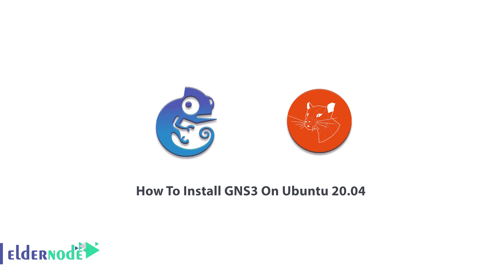
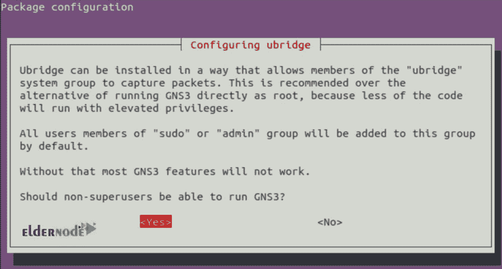
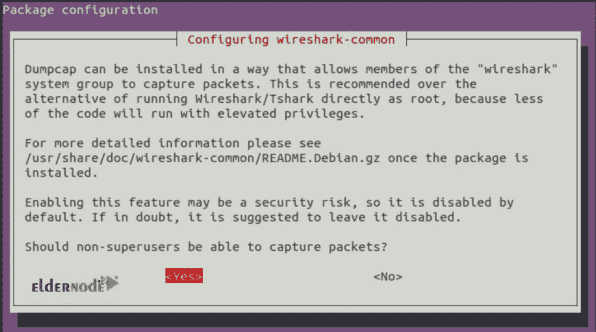
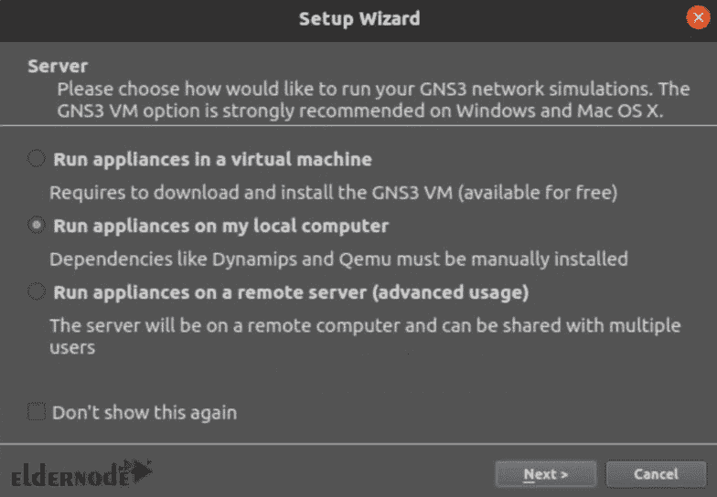
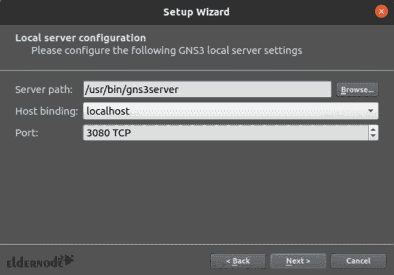
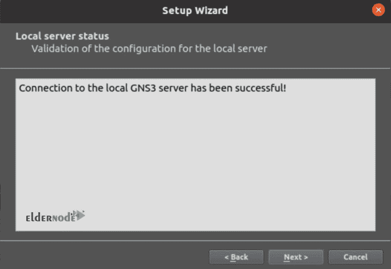
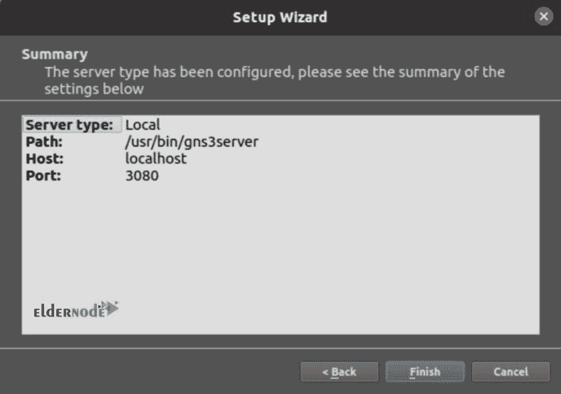

# 如何在 Ubuntu 20.04 - Eldernode 博客上安装 GNS3

> 原文：<https://blog.eldernode.com/install-gns3-on-ubuntu-20-04/>



模拟器是开源的免费软件，对于网络工程师学生准备网络考试或构建、设计和测试网络很有用。使用 GNS3 时，设备的数量并不重要，因为它是为托管在多个服务器上的许多设备而设计的。在本文中，您将学习如何在 Ubuntu 20.04 上安装 GNS3。你可能渴望加入已经下载了 GNS3 的 1100 万人的行列，并将它安装在你自己的 [Ubuntu VPS](https://eldernode.com/ubuntu-vps/) 上。您可以在 [Eldernode](https://eldernode.com/) 上购买安全、VIP、经济的虚拟专用服务器。

## **教程在 Ubuntu 20.04 上安装 GNS 3 LTS**

自 2008 年以来，GNS3 允许网络工程师虚拟化真实的硬件设备。gNS3 提供了一个无风险的虚拟环境，可以根据您的考虑规模设计和构建网络，甚至无需硬件。GNS3 可以安装在 Windows、macOS 和 [Linux](https://blog.eldernode.com/tag/linux/) 上。它支持 Linux 发行版(仅基于 Ubuntu 的 64 位发行版),并模拟 Linux 交换机和多种 Linux 设备。不需要家庭实验室，您可以使用 GNS3 作为寻求认证的网络专业人员的学习工具。让我们通过本指南的步骤来完成在 Ubuntu 20.04 上的 GNS3 安装。这是可能的，从 PPA 仓库。所以，首先要添加库，更新系统，然后在 Ubuntu Linux 上安装需要的包。

### 在 Ubuntu 20.04 | Ubuntu 18.04 上安装 GNS 3

**第一步:**

使用以下命令添加 GNS3 存储库，然后输入您的用户密码并按 **ENTER** 继续。

```
sudo add-apt-repository ppa:gns3/ppa
```

**第二步:**

在此步骤中，您准备安装 GNS3 GUI 和服务器。Ir 将在添加存储库时完成。运行下面的命令并按 y 键接受安装。

如果您希望允许非 root 用户使用 Wireshark 和网桥，系统会提示您。如果是，两次都选择“是”。

```
sudo apt update
```

```
sudo apt install gns3-gui gns3-server
```



并允许它们捕获数据包。



**第三步:**

现在，如果你想要 IOU 支持，运行下面的命令来安装 IOU 包并使用它的特性，通过按下 **y** 键来接受安装提示。

**注意** : IOU 是思科内部工具，用于模拟思科交换机中的 ASICs。如果不跳过这一步，您将能够在实验中使用第 2 层交换。所以，

```
sudo dpkg --add-architecture i386
```

```
sudo apt update
```

```
sudo apt install gns3-iou
```

**Docker 支持**

### 这是一个可选的步骤。如果您希望在网络堆栈中使用 Docker 引擎，请先安装运行时。要安装 Docker CE (Xenial_and_newer)，请运行以下命令删除所有旧版本:

然后，安装以下软件包:

```
sudo apt remove docker docker-engine docker.io
```

现在，要导入正式的 Docker GPG 密钥，请键入:

```
sudo apt-get install apt-transport-https ca-certificates curl \ software-properties-common
```

接下来，将适当的 repo 添加到准备安装 Docker CE 中。

```
curl -fsSL https://download.docker.com/linux/ubuntu/gpg | sudo apt-key add -
```

最后，使用下面的命令安装 Docker CE:

```
sudo add-apt-repository \  "deb [arch=amd64] https://download.docker.com/linux/ubuntu \  $(lsb_release -cs) stable
```

是时候将您的用户添加到以下组中了:

```
sudo apt update
```

```
sudo apt install docker-ce
```

**注意**:要将您的用户添加到这些组中，请使用“sudo usermod -aG group user_name”。并通过注销并重新登录或重新启动系统来重新启动您的用户会话。

```
ubridge libvirt kvm wireshark docker
```

如果你已经很好地完成了所有的步骤，并且没有出现错误信息，那么 GNS3 现在已经安装在 Ubuntu 20.04 上了。因此，从终端或桌面启动器启动它。

在第一页选择“在我的电脑上运行设备”。

```
gns3
```



然后，在第二页上确认本地服务器确认位置。



并确认连接成功。



最后，在 Ubuntu 20.04 Linux 上完成 GNS3 设置。



就是这样！你只需要一步一步地在你的 Ubuntu 服务器上安装 GNS3。

结论

## 在本文中，您已经学习了如何在 Ubuntu 20.04 上安装 GNS3。要管理或 SDN 软件，GNS3 是最佳、最简单且最具成本效益的选择。从现在开始，您可以使用虚拟实验室环境测试多供应商互操作性，而无需提供专用的物理设备。如果您有兴趣阅读更多内容，请找到我们关于[为网络工程师介绍 GNS3 软件](https://blog.eldernode.com/gns3-software-for-network-engineers/)的相关文章。

In this article, you have learned How To Install GNS3 On Ubuntu 20.04\. To manage or SDN software, GNS3 is the best, easiest, and cost-effective choice. From now on, you can test multi-vendor interoperability using a virtual lab environment while there is no need to provide dedicated physical equipment. In case you are interested in reading more, find our related article on [Introducing GNS3 Software For Network Engineers](https://blog.eldernode.com/gns3-software-for-network-engineers/).