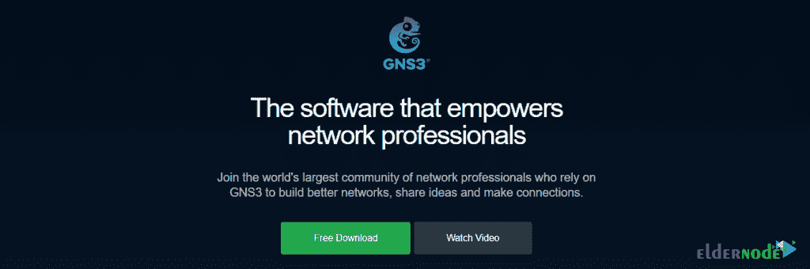
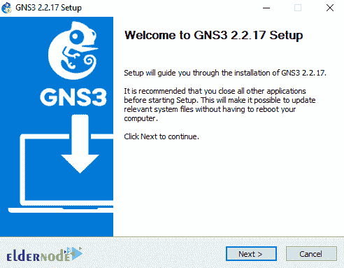
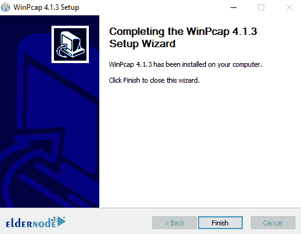

# 如何在 Windows Server 2012 和 2016 上安装 GNS 3-elder node 博客

> 原文：<https://blog.eldernode.com/install-gns3-on-windows-server-2012-and-2016/>

GNS3 软件是一种网络模拟软件，允许您设计复杂的网络拓扑。使用这个功能强大的程序的最新版本，您可以运行模拟操作或配置简单的工作站和功能强大的思科路由器。GNS3 软件基于 Dynamips、Pemu/Qemu 和 Dynagen 工具的性能。在本文中，我们试图向您学习如何在 Windows Server 2012 和 2016 上安装 GNS3。你可以访问 [Eldernode](https://eldernode.com/) 提供的包来购买 [Windows VPS](https://eldernode.com/windows-vps/) 服务器。

## **教程在 Windows Server 2012 和 2016 上安装 GNS 3**

GNS3 软件是模拟复杂网络的免费软件。该软件试图尽可能接近不需要物理网络硬件的真实网络。GNS3 具有用于构建复杂网络的图形环境。GNS3 仿真器基于 Dynamips 代码，允许用户在计算机上虚拟运行 Cisco IOS，而不是在昂贵的 Cisco 设备上运行。GNS3 软件是一种思科工具，允许用户使用思科 IOS。在本文的后续部分，请加入我们，了解如何在 2012 年和 2016 年的 Windows Server 上安装 GNS3。

### **在 Windows Server 2012 和 2016 上安装 GNS 3**

要在 Windows Server 2012 和 2016 上安装 GNS3，必须先去 [GNS3 网站](https://www.gns3.com/)。然后点击**免费下载**。

在此页面上，您必须选择所需的平台，即 **Windows** 。为此，点击 Windows 前面的**下载**按钮。

点击下载后，将显示以下窗口。如果您在 GNS3 中没有帐户，您必须**创建一个帐户**。

填写所需信息并点击**创建账户**。

再次转到下载页面。选择 Windows 平台后，程序下载将开始。

请参考安装文件存储位置。然后双击它开始安装 GNS3。

在打开的窗口中，点击**运行**。

点击**下一步**开始安装。

下一步，看完协议，一定要确认。所以点击**我同意**进入下一步。

现在你需要选择一个开始菜单文件夹。**默认选择 GNS3** 。所以点击**下一个**。

在下一步中，您必须选择所需的安装类型和组件。然后点击**下一个**。

指定文件的安装位置，点击下的**。**

在下一步中，将出现 **WinPCAP** 安装窗口。点击**下一个**。

点击**我同意**接受协议条款。

然后点击**安装**。

点击**完成**完成 WinPCAP 安装。

您现在必须批准 **Npcap** 许可协议。

选择所需选项后，点击**安装**。

**注意:**使用 WinPcap 安装 Npcap 时，请确保在完成安装之前启用“WinPcap API 兼容模式”选项:

最后，点击**完成**。

请注意，如果您选择安装 **Wireshark** ，GNS3 启动软件将下载 Wireshark 安装文件。

再次点击**下一个**。

请注意，在下一步中，如果您感兴趣，请安装 Solarwinds 标准工具集。否则选择否并点击下一个的**。**

最后，点击**完成**完成 GNS3 安装过程。

结论

## 当构建一个新的网络项目时，有一个简单的方法可以在主项目开始之前进行模拟。为此，设计了一个名为 GNS3 的网络模拟器软件。这个软件允许你在你的计算机上模拟一个网络。GNS3 是一款开源仿真器软件。虽然它与真实网络非常相似，并且没有路由器和交换机等网络专用硬件，但却使网络设计成为可能。在本文中，我们试图向您学习如何在 Windows Server 2012 和 2016 上安装 GNS3。

When building a new network project, there is a simple way to simulate it before the main project starts. To do this, a network simulator software called GNS3 is designed. This software allows you to simulate a network on your computer. GNS3 is an open source emulator software. While it is very similar to real networks and without network dedicated hardware such as routers and switches make network design possible. In this article, we tried to learn you how to install GNS3 on Windows Server 2012 and 2016.