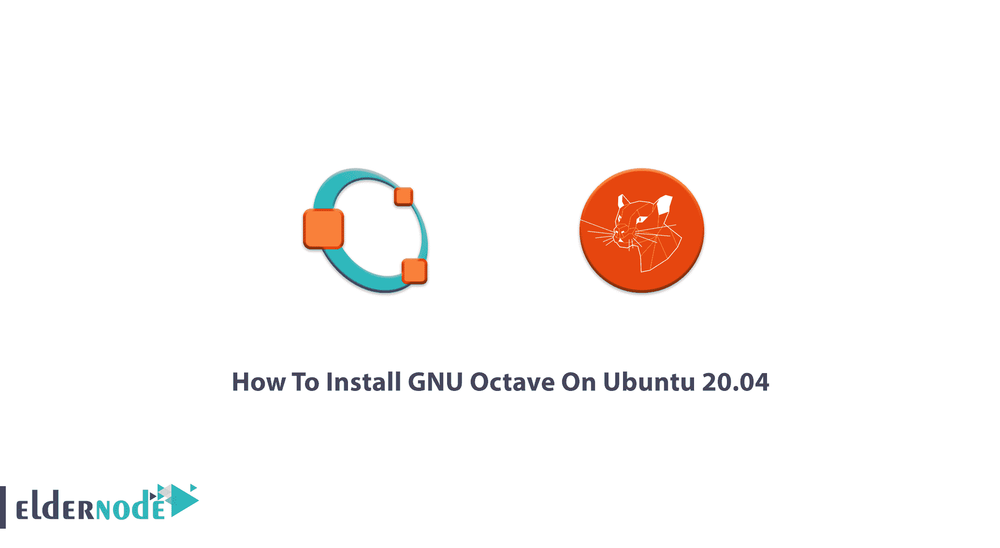
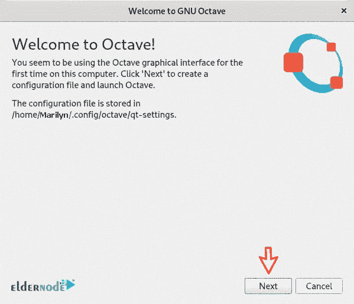
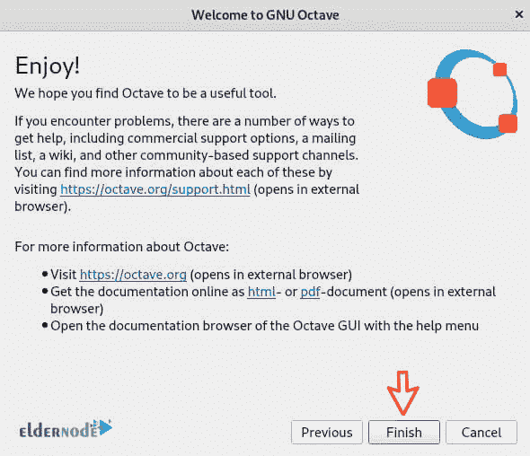
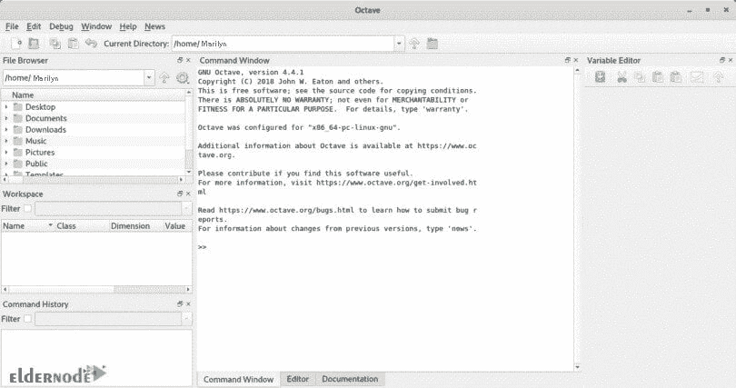

# 如何在 Ubuntu 20.04 - Eldernode 博客上安装 GNU Octave

> 原文：<https://blog.eldernode.com/install-gnu-octave-on-ubuntu-20-04/>



八度可以记住你的音符。虽然音乐被称为国际语言，GNU Octave 也是一种编程语言，对于打算从事技术和数学计算的人来说，它是一个完美的助手。此外，学术界和工业界也不会忽视使用它。如果你习惯使用 Matlab，学习 GNU Octave 对你来说并不困难，因为它与许多 Matlab 脚本兼容。Octave 是开源的，在 GNU 许可下，可以自由地修改、使用和复制。不仅因为它提供了 2D/3D 绘图和可视化工具，还因为它允许用户通过 Octave 的特定编程语言来扩展他们的系统，这在学生中很受欢迎。加入我们这篇文章，学习如何在 Ubuntu 20.04 上安装 GNU Octave。为了准备你自己的 [Linux VPS](https://eldernode.com/linux-vps/) ，在 [Eldernode](https://eldernode.com/) 上找到你考虑过的包。

## **教程在 Ubuntu 20.04 上安装 GNU Octave**

为了让本教程更好地工作，请考虑以下先决条件:
一个拥有 sudo 特权的非根用户。
要进行设置，请遵循我们在 Ubuntu 20.04 上的[初始服务器设置。](https://blog.eldernode.com/initial-server-setup-on-ubuntu-20/)

## **在 Ubuntu 20.04 上安装 GNU Octave**

在写这篇文章的时候，最新版本 6.1.0 发布了。您可以从更新 Ubuntu 开始，因为 APT 包已经在标准的 [Ubuntu](https://blog.eldernode.com/tag/ubuntu/) 库中可用。GNU Octave 包也包括它的文档，并且有一个命令行界面，所以让我们使用下面的命令更新 APT 包存储库 catch。这样，您可以确保拥有最新版本的软件包:

```
sudo apt update
```

然后，运行下面的命令来安装 GNU Octave 和相关的依赖项:

```
sudo apt install octave
```

GNU Octave 包括一个图形用户界面，你可以从你系统的主菜单启动它的版本。或者使用以下命令行来完成此操作:

```
octave-cli
```

出现提示时，按 **Y** 确认安装，按**回车**。GNU 八度应该安装在这里。要查看结果，您可以在 Ubuntu 20.04 的应用程序菜单中进行搜索。点击 GNU Octave 图标启动它。


如果这是您第一次跑步，将会显示欢迎页面，回答一般的基本问题，然后点击**下一步**。



显示以下页面时，再次单击“下一步”。


下一步，你只需要点击 Finish 开始使用 Octave。



一旦你完成了这一部分，GNU Octave 应该已经启动并可以使用了。



如果这是您第一次使用该应用程序，请尝试浏览一次。要追踪它，在磁盘和网上都可以找到。在菜单栏上，单击“帮助”并查看位于“文档”下的“磁盘上”或“联机”两个选项。

## **如何安装 GNU Octave 官方 Flatpak 库**

Flatpak 帮助您更快地安装 Linux 软件包。要部署软件、管理包并为运行应用程序提供沙箱，可以使用 FlatPak。以下步骤向您展示了如何通过 FlatPak 安装 GNU Octave。

首先，更新 apt 包存储库:

```
sudo apt update
```

使用以下命令检查是否安装了 flatpak:

```
flatpak –version
```

虽然您没有收到任何错误，但您可以确保存在该错误，并进入下一步。但是如果没有安装，使用 apt-get 并运行下面的命令:

```
sudo apt-get install flatpak
```

再次出现提示时，按 Y 确认安装，然后按 Enter。所需的包将由 APT 包管理器安装。您还可以添加 Flathub 存储库。在 Linux，你可以去 Appstore。使用下面的命令安装它

```
flatpak remote-add –if-not-exists flathub
```

```
https://flathub.org/repo/flathub.flatpakrepo
```

正如你所猜测的，是时候重启你的电脑了。

```
sudo reboot
```

当你再次回来时，运行下面的命令从 Flathub 安装最新版本的 GNU Octave 让它下载所有大的包，你只需要等待完成。

```
flatpak install flathub org.octave.Octave
```

### 如何移除 GNU Octave 包

任何时候你需要**删除**你通过 flatpak 安装的 GNU Octave 包，运行下面的命令:

```
flatpak uninstall org.octave.Octave
```

此外，如果愿意，您可以使用以下命令卸载 flatpak:

```
sudo apt-get remove flatpak
```

就是这样！你可以使用上述方法之一来安装 GNU Octave。还有，“snap”是另一种替代方式。

**结论**

在本文中，您了解了如何在 Ubuntu 20.04 上安装 GNU Octave。从现在起，你可以用这个应用程序做数值计算了。用户反映他们正在使用 GNU Octave 而不是 Matlab。此外，您可以在 macOS、BSD 和 Microsoft Windows 上运行它。

In this article, you learned How To Install GNU Octave On Ubuntu 20.04\. From now on you can do the numerical computations with this application. Users have reported that they are working with GNU Octave instead of Matlab. Also, you can run it on macOS, BSD, and Microsoft Windows.