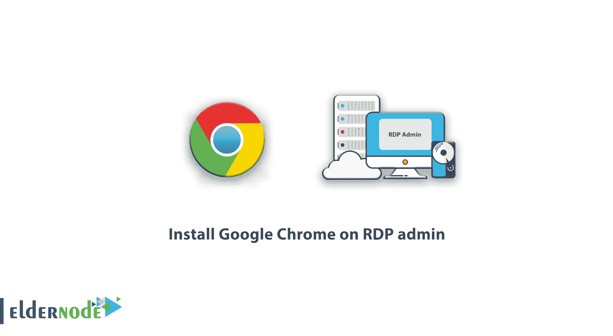
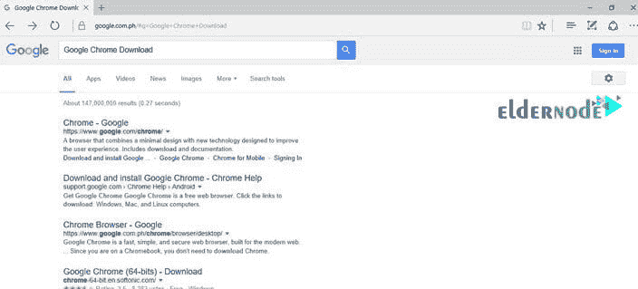
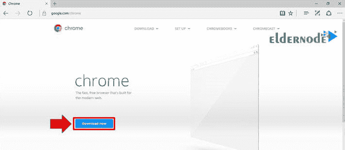
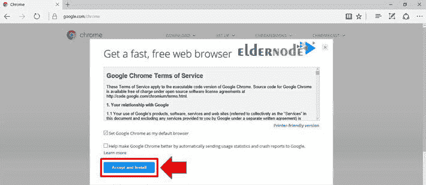
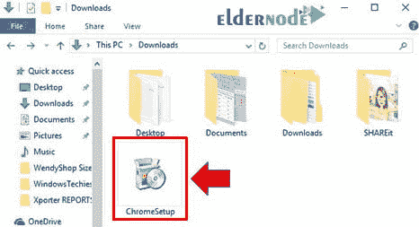
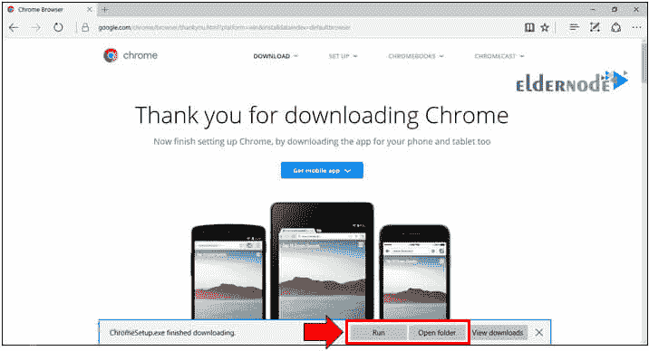
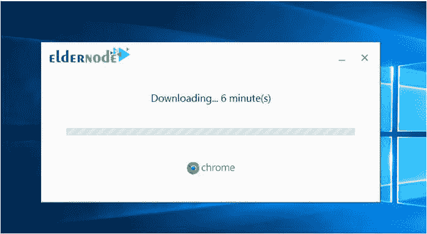

# 在 RDP 管理员节点上安装谷歌浏览器

> 原文：<https://blog.eldernode.com/install-google-chrome-on-rdp-admin/>

教程在 RDP 管理[窗口](https://blog.eldernode.com/tag/windows/)上安装谷歌浏览器。在这篇文章中，我们将教你在 RDP 管理下载和安装流行的谷歌浏览器的完整步骤。谷歌 Chrome 浏览器是由谷歌设计的开源浏览器，是世界上最流行、最强大的浏览器之一。到目前为止，谷歌 Chrome 已经能够在全球所有其他浏览器中排名第一。在[的老年节点](https://eldernode.com/)上有几个 [RDP 管理服务器](https://eldernode.com/buy-rdp/)的服务。你可以选择其中一个计划。

今天，互联网在我们生活的各个方面发挥着非常重要的作用。许多日常活动，如购物、研究、教育、商业、游戏和娱乐都是在互联网上进行的。无法想象没有互联网的世界。互联网甚至使虚拟生活成为可能。因此，浏览器作为用户和互联网之间的接口，起着非常重要的作用。今天，每个计算机系统，如台式计算机和笔记本电脑，以及智能手机，都至少安装了一个互联网浏览器。

谷歌 Chrome 浏览器比其他浏览器更受欢迎，因为它有独特的功能，如更快的更新，音频到文本的转换，防止恶意和病毒文件，以及快速访问设置。因此，我们在这篇教育帖子中包含了在 RDP 管理中下载和安装谷歌 Chrome 浏览器的完整步骤。

## 如何在 RDP 管理系统上安装谷歌浏览器

按照以下步骤在 RDP 管理中下载并安装谷歌浏览器:

**1。**打开当前浏览器，在谷歌搜索引擎中搜索谷歌 Chrome 下载。

**2。**点击第一个搜索结果，进入 Google Chrome 下载页面。然后点击**立即下载**。

**3。**将出现一个名为谷歌 Chrome 服务条款的页面。此页面上有两个选项。第一个选项是选择谷歌 Chrome 作为默认浏览器，第二个选项是报告 bug 和问题以改进谷歌 Chrome 浏览器。你可以选择任何一个选项，也可以不选。无论如何，点击**接受并安装**。

**4。**然后谷歌 Chrome 在线下载文件将被下载。下载过程完成后，转到系统上的下载文件夹。找到一个名为 **ChromeSetup** 的文件。然后双击它。

***注意:*** 如果你使用的是 RDP 管理中的默认浏览器，下载完成后页面底部会出现一条提示信息。

**5。**点击**运行**开始自动下载和安装过程。点击**打开文件夹**将打开 RDP 管理下载文件夹，像前面的方法一样，它将找到下载文件并双击它。

**6。**用户帐户控制窗口将要求您运行下载程序。单击是。然后浏览器会自动下载并安装在您的系统上。

结论

## 谷歌早就有自己的浏览器，在全球雇佣了数百万用户。然而，新用户经常对在他们的计算机上安装这种网络浏览器有疑问。在这篇文章中，我们试图描述如何在 RDP 管理员上安装谷歌浏览器，这样即使是初学者也可以轻松安装上述浏览器。

Google has long had its own browser that employs millions of users around the world. However, new users often have questions about installing this web browser on their computer. In this article, we tried to describe how to Install Google Chrome on RDP admin so that even a beginner can easily install the above browser.