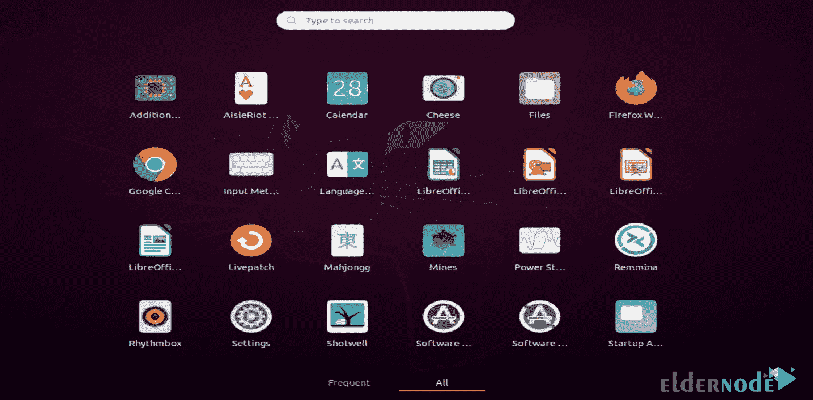

# 在 Ubuntu 20.04 上安装谷歌 Chrome 的 5 种方法

> 原文：<https://blog.eldernode.com/install-google-chrome-on-ubuntu-20-04/>


谷歌浏览器现在是世界上最大的浏览器，世界上一半的人把它作为他们的默认浏览器。在这篇文章中，我们打算向你介绍 5 种在 Ubuntu 20.04 上安装谷歌浏览器的方法。需要注意的是，如果你想购买一台 [Ubuntu VPS](https://eldernode.com/ubuntu-vps/) 服务器，你可以访问 [Eldernode](https://eldernode.com/) 上提供的软件包。

## **在 Ubuntu 20.04 上安装谷歌 Chrome**

在这篇来自 [Ubuntu 培训](https://blog.eldernode.com/tag/ubuntu/)系列的文章的续篇中，我们打算教你如何使用 5 种方法在 Ubuntu 20.04 上安装谷歌 Chrome。

### **从官网下载**

第一种[安装谷歌 Chrome](https://blog.eldernode.com/install-google-chrome-on-rdp-admin/) 的方法，我们在本文中打算教的，就是使用官网。打开你想要的浏览器，输入网址[下载谷歌浏览器](https://www.google.com/intl/en_us/chrome/)。

然后点击**下载 Chrome:**


如下图所示，您必须选择第一个选项，即 **64 位。deb(对于 debian/ubuntu)** 然后点击**接受并安装**:


如下图所示，选择**保存文件**选项，点击**确定**:


在这个阶段，需要参考 Ubuntu 软件中心运行安装文件，并在您自己的 Ubuntu 系统中点击 **Install** :


最后，通过访问 Activities 菜单，您将看到 Google Chrome 已经成功安装:



### **使用 PPA 知识库**

在这一节，我们将教你如何使用 PPA 库在 Ubuntu 上安装谷歌浏览器。

第一步，你需要**设置公钥**来访问 Chrome 库。为此，您需要使用以下命令:

```
wget -q -O - https://dl.google.com/linux/linux_signing_key.pub | sudo apt-key add -
```

现在您需要使用以下命令为 Chrome 设置 Google 存储库:

```
sudo sh -c 'echo "deb [arch=amd64] http://dl.google.com/linux/chrome/deb/ stable main"  >> /etc/apt/sources.list.d/google.list'
```

现在，您应该使用以下命令来更新系统:

```
sudo apt update
```

最后，您可以通过运行以下命令安装 Google Chrome:

```
sudo apt install google-chrome-stable
```

### **手动安装**

在这一步，我们要教如何使用终端或手动在 Ubuntu 20.04 上安装谷歌 Chrome。

因此，您必须首先使用以下命令更新系统:

```
sudo apt update
```

```
sudo apt upgrade
```

现在，您需要通过运行以下命令来检查 wget 版本:

```
wget --version
```

您还可以通过运行以下命令来安装 wget :

```
sudo apt install wget
```

现在，您可以使用以下命令**下载谷歌浏览器**:

```
wget https://dl.google.com/linux/direct/google-chrome-stable_current_amd64.deb
```

通过运行以下命令安装所需的软件包:

```
sudo dpkg -i google-chrome-stable_current_amd64.deb
```

最后，您可以在 Linux 终端中运行以下命令来启动 Google Chrome:

```
google-chrome
```

### **使用抓包**

在这一节中，我们将向您展示如何使用 Snap 在 Ubuntu 20.04 上安装 Google Chrome。使用这种方法，您可以通过运行以下命令轻松安装 Google Chrome:

```
sudo snap install chromium
```

### **使用 Flatpak 包**

在这一节，我们将教你如何使用 Flatpak 包在 Ubuntu 20.04 上安装谷歌 Chrome。如果您的系统上没有安装 Flatpak，您需要通过运行以下命令来安装它:

```
sudo apt install flatpak
```

安装 Flatpak 后，现在需要**添加 Flathub 库**:

```
flatpak remote-add --if-not-exists flathub https://flathub.org/repo/flathub.flatpakrepo
```

现在你可以使用下面的命令**安装谷歌浏览器**:

```
flatpak install flathub com.google.Chrome
```

您也可以使用以下命令**运行谷歌浏览器**:

```
flatpak run com.google.Chrome
```

## 结论

正如本教程中提到的，谷歌浏览器是世界上使用最多的网络浏览器。这是一个快速、简单、安全的网络浏览器。在这篇文章中，我们试图完整地教你在 Ubuntu 20.04 上安装谷歌浏览器的 5 种方法。你可以和我们分享你与这篇文章相关的问题。