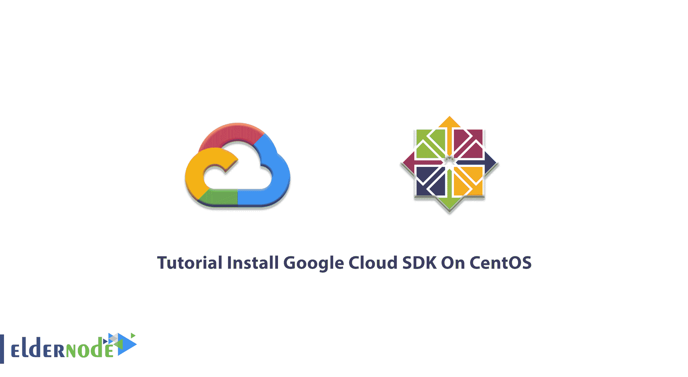

# 教程在 CentOS - Eldernode 博客上安装 Google Cloud SDK

> 原文：<https://blog.eldernode.com/install-google-cloud-sdk-on-centos/>



Google Cloud SDK 是一套工具，用于管理 Google Cloud perform 上托管的应用程序和资源。这些工具包括 *gcloud* 、 *gsutil* 和 *bq* 命令行工具。Cloud**S**software**D**development**K**它包括用于与 Google Cloud 产品和服务交互的工具和库。它支持 [Windows](https://eldernode.com/windows-vps/) 、 [Linux](https://eldernode.com/linux-vps/) 和 macOS 平台，并需要 python 2.7x。如果你有一个谷歌云帐户，Cloud SDK 将免费提供给你。Cloud SDK 为每个支持的平台提供了一个安装程序。本文介绍**教程在 CentOS 上安装 Google Cloud SDK**。在 [Eldernode](https://eldernode.com/) 上准备您自己的 [CentOS VPS](https://eldernode.com/centos-vps/) 并获得折扣和支持。

为了让本教程更好地发挥作用，请考虑以下**先决条件**:

–拥有 Sudo 权限的非 root 用户。

–按照我们的[初始设置 centos 8](https://blog.eldernode.com/initial-set-up-centos-8/) 进行设置

–Google Cloud SDK 需要在您的 Linux 上安装 [Python](https://blog.eldernode.com/python-3-on-rhel-8-centos-8/) 。Python 版本 2.7.9 或更高版本或 Python 3.5 到 3.7。

***注意** :* 在 Google Compute Engine 上使用实例时，默认安装**云 SDK** 。

## **如何在 CentOS 8 |** **CentOS 7** 上安装 Google Cloud SDK

要使用系统终端的命令行界面 CLI 管理谷歌云平台，您需要使用谷歌云 SDK。Cloud SDK 以包的形式安装在 [CentOS](https://blog.eldernode.com/tag/centos/) 上，仅包含 *gcloud* 、 *gcloud alpha* 、 *gcloud beta* 和 *gsutil* 以及 *bq* 命令。但它不包括使用云命令部署应用程序所需的 *kubectl* 或 App Engine 扩展，它们可以单独安装。让我们通过本指南的步骤来回顾安装过程。

*第一步:*

首先，DNF 必须用 **Cloud SDK repo** 信息进行更新。

```
sudo tee -a /etc/yum.repos.d/google-cloud-sdk.repo << EOM
```

```
[google-cloud-sdk]
```

```
name=Google Cloud SDK
```

```
baseurl=https://packages.cloud.google.com/yum/repos/cloud-sdk-el7-x86_64
```

```
enabled=1
```

```
gpgcheck=1
```

```
repo_gpgcheck=1
```

```
gpgkey=https://packages.cloud.google.com/yum/doc/yum-key.gp
```

```
https://packages.cloud.google.com/yum/doc/rpm-package-key.gpg
```

```
EOM
```

*第二步:*

现在，您可以使用下面的命令**安装 Cloud SDK** 。

```
sudo dnf install google-cloud-sdk
```

但是，如果您的系统上没有将**移动到**到 *dnf* ，请使用 yum 运行下面的命令。

```
yum install google-cloud-sdk
```

然后，您可以通过运行以下命令来检查是否已安装:

```
gcloud info
```

首先，为了**配置 SDK** ，运行以下命令并启动:

```
gcloud init
```

*第三步:*

这是一个可选步骤，您可以安装以下任何**附加组件**。

*   Google-cloud-SDK-app-engine-python
*   Google-cloud-SDK-app-engine-python-extras
*   Google-cloud-SDK-app-engine-Java
*   google-cloud-sdk-app-engine-go
*   Google-cloud-SDK-bigtable-模拟器
*   google-cloud-sdk-cbt
*   谷歌-云-SDK-云-构建-本地
*   谷歌-云-SDK-数据实验室
*   谷歌-云-SDK-数据存储-仿真器
*   Google-cloud-SDK-firestore-模拟器
*   Google-cloud-SDK-pubsub-模拟器
*   库贝特尔

以下示例显示了如何使用上述组件之一。可以安装*Google-cloud-SDK-app-engine-Java*组件如下:

```
sudo dnf install google-cloud-sdk-app-engine-java
```

### **如何降级云 SDK 版本**

最近发行的 10 只将在回购中提供。如果您希望恢复到特定版本的 Cloud SDK，其中*版本*的形式为 *123.0.0* ，请运行:

```
sudo dnf downgrade google-cloud-sdk-VERSION
```

### **如何更新谷歌云组件**

您可以使用 gcloud update 更新其组件。在这种情况下，任何时候您需要更新 google cloud 组件，都需要使用 gcloud update 来更新所有必需的组件。使用该命令以下语法:

```
gcloud components update [--version=VERSION] [GCLOUD_WIDE_FLAG …]
```

### **在 CentOS 上启用快照，安装 Google Cloud SDK**

您还可以使用打包的应用程序 Snaps 来安装 Google Cloud SDK。Snap 适用于 CentOS7.6+和 Red Hat Enterprise Linux7.6 及更高版本，可从 Enterprise Linux 存储库的额外软件包中获得。您可以通过运行以下命令将存储库添加到您的系统中:

```
sudo yum install epel-release
```

之后，运行以下命令安装 Snap:

```
sudo yum install snapd
```

安装 Snap 时，必须启用系统单元。它将管理主 snap 通信套接字。

```
sudo systemctl enable --now snapd.socket
```

现在，您可以通过在 **/var/lib/snapd/snap** 和 **/snap** 之间创建一个符号链接来启用快照支持:

```
sudo ln -s /var/lib/snapd/snap /snap
```

为确保正确更新快照的路径，您可以注销并再次返回，或者重新启动系统。

最后，通过运行以下命令安装 Google Cloud SDK:

```
sudo snap install google-cloud-sdk --classic
```

## 结论

在本文中，您了解了如何在 CentOS 上安装 Google Cloud SDK。有两种方法可以安装它。此外，还有更多安装云 SDK 的替代方法。带有脚本或持续集成/部署的云 SDK，并将云 SDK 作为 Docker 映像运行。在 [Eldernode Community](https://community.eldernode.com/) 上与你的朋友讨论，找出哪种方法被广泛使用。