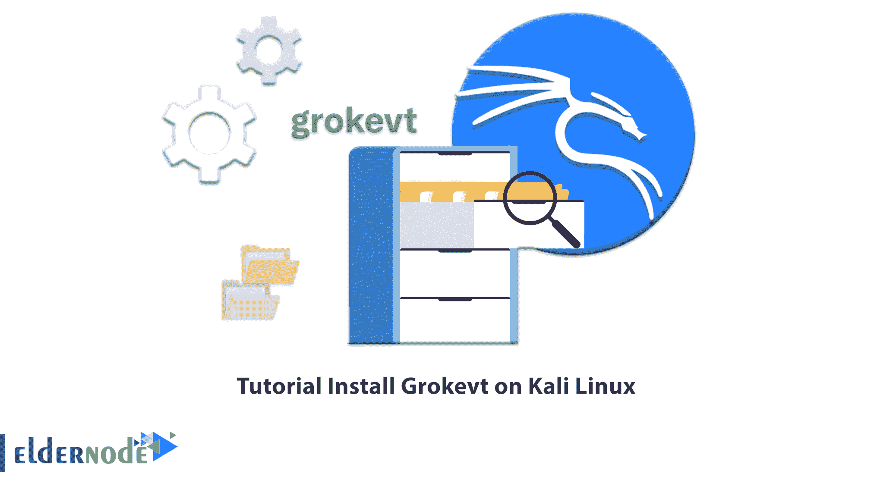

# 教程在 Kali Linux 2022 上安装 Grokevt-elder node 博客

> 原文：<https://blog.eldernode.com/install-grokevt-on-kali-linux/>



你很可能遇到过这样的情况，你想从系统中提取信息，把它变成一个可以理解的报告。Grokevt 是由几个脚本组成的工具之一。在本文中，我们将回顾 grokevt，您将了解如何在 Kali Linux 上安装 Grokevt。您可以访问 [Eldernode](https://eldernode.com/) 网站提供的套装来购买 [**Linux VPS**](https://eldernode.com/linux-vps/) 服务器。

## **如何在 Kali Linux 上安装 Grokevt**

### **什么是 Grokevt？**

Grokevt 是一组安装在一个或多个分区上并协同工作的脚本。这些脚本提取注册表项、消息模式和日志文件等信息，将报告转换为人类可读的格式。Grokevt 在 GNU GPL 下发布，用 Python 实现。

## **在 Kali Linux 上安装 Grokevt**

在这篇来自 Kali Linux 培训系列的文章中，我们将回顾在 Kali Linux 上安装 grokevt 的 3 种方法。

### **如何使用 apt-get 安装 Grokevt**

首先**使用以下命令更新 APT 数据库**:

```
sudo apt-get update
```

然后**使用下面的命令安装 grokevt** :

```
sudo apt-get -y install grokevt
```

### **如何使用 apt** 安装 Grokevt】

首先运行以下命令**更新 APT 数据库**:

```
sudo apt update
```

然后使用下面的命令**安装 grokevt** :

```
sudo apt -y install grokevt
```

### **如何安装 Grokevt 使用资质**

要使用 aptitude 安装 grokevt，需要在 Kali Linux 上安装 aptitude。然后**用下面的命令更新 Apt 数据库**:

```
sudo aptitude update
```

现在您可以用下面的命令安装 grokevt:

```
sudo aptitude -y install grokevt
```

### **如何使用 Grokevt** 的不同工具

1->**Grokevt-add log**:运行以下命令，使用此工具将原始事件日志添加到现有的 Grokevt 数据库中:

```
grokevt-addlog -h
```

2->**Grokevt-builddb**:运行以下命令，在 Windows 系统上构建一个数据库树，转换事件日志:

```
grokevt-builddb -h
```

3->**Grokevt-rip dll**:使用此工具从 PE 格式文件中提取消息源；为此，请使用以下命令:

```
grokevt-ripdll -h
```

4->**Grokevt-dump msgs**:使用此实用程序，转储之前由 **grokevt-ripdll** 创建的消息数据库的内容；为此，运行以下命令:

```
man grokevt-dumpmsgs
```

5->**Grokevt-findlogs**:运行以下命令在原始二进制文件中查找日志文件片段，如内存转储和磁盘映像:

```
grokevt-findlogs --help
```

6->**Grokevt-parse log**:您可以解析 Windows 事件日志，并根据数据库中存储的消息源生成可读的输出。使用下面的命令:

```
grokevt-parselog -h
```

## 常见问题解答

[sp _ easy agreement]

## 结论

在本文中，我们介绍了 Grokevt，它是一组安装在一个或多个分区上并协同工作的脚本，您学习了如何在 Kali Linux 上安装 Grokevt。我们还回顾了 grokevt 的不同工具以及如何使用它们。