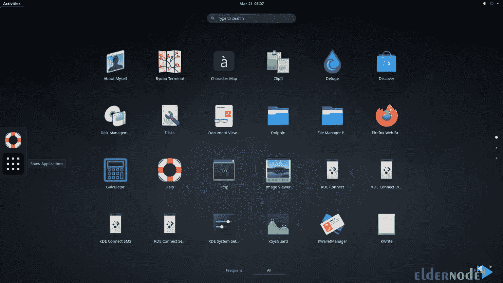
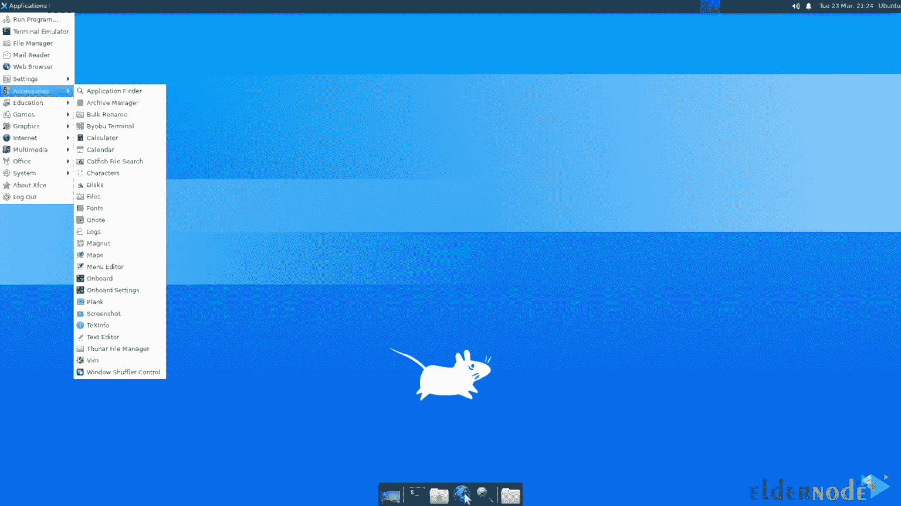
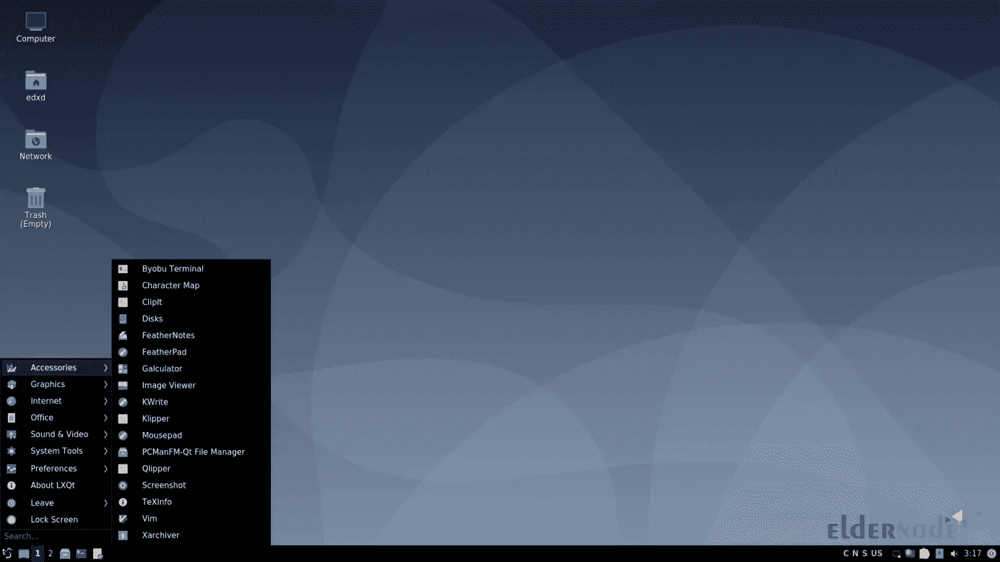
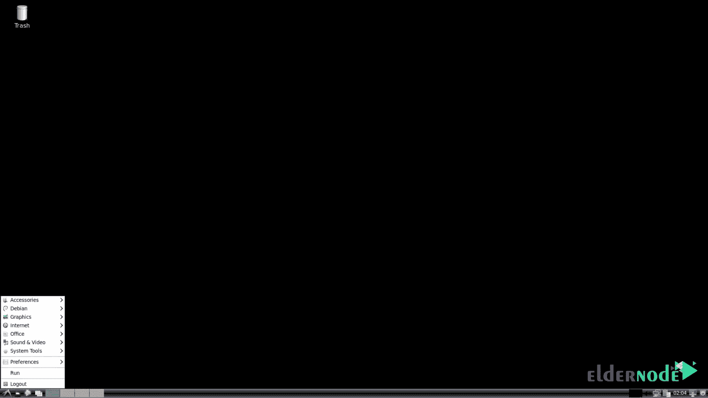
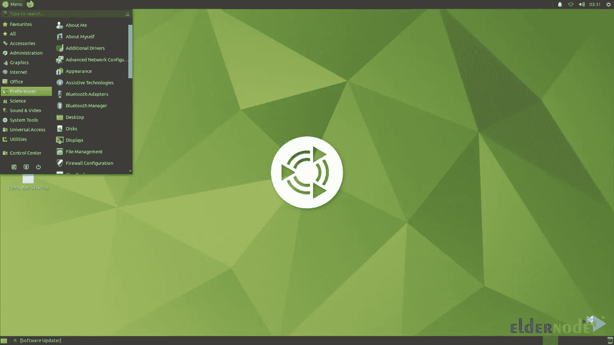

# 在 Ubuntu 20.04/22.04 上安装 GUI 的 5 个最佳步骤

> 原文：<https://blog.eldernode.com/install-gui-on-ubuntu/>


也许你们中的一些人已经在你的服务器上安装了 ubuntu 操作系统，并希望它以图形方式显示，以便你可以使用它。要显示图形环境，您需要安装 GUI 桌面图形环境。在这篇文章中，我们将教你在 Ubuntu 20.04/22.04 上安装 GUI 的 5 个最佳步骤。如果你想购买一台 [Linux VPS](https://eldernode.com/linux-vps/) 服务器，你可以访问 [Eldernode](https://eldernode.com/) 网站上提供的软件包。

## **什么是 GUI？**

操作系统中任何工作的开始都是通过图形界面来完成的，特别是对于那些对命令行不太感兴趣的初学者来说！一般来说，您可以使用 CLI(代表命令行界面)和 GUI(代表图形用户界面)来了解 Linux。

主要由专业 Linux 用户使用的 CLI 在某种程度上更难使用。因为你必须记住每个命令，更重要的是记住它们的选项。但是使用 Linux GUI 要容易得多；该界面允许新手用户通过各种菜单和窗口管理和更改他们的系统设置。

## **在 Ubuntu 20.04/22.04 上安装 GUI**

在这篇来自 [Ubuntu 培训](https://blog.eldernode.com/tag/ubuntu/)系列的文章的续篇中，我们将通过 5 个步骤教你如何在 Ubuntu 上安装 GUI。请在这篇文章中陪伴我们。

### **1)如何在 Ubuntu 上安装 GNOME** 

第一种方法，我们将教你如何在 Ubuntu 上安装 GNOME。为此，只需遵循以下步骤。使用以下命令安装最小 GNOME:

```
sudo apt install gnome-session gnome-terminal
```

您也可以通过运行以下命令来安装 GNOME Desktop:

```
sudo apt install ubuntu-desktop
```

在下图中，你可以看到 [GNOME](https://blog.eldernode.com/install-gnome-environment-on-debian-8/) 桌面环境:



### **2)** 如何在 UbuntuT5 上安装 XFCE

**XFCE 代表 XForms 公共环境。你可以使用下面的命令来安装 XFCE，它只是 [XFCE](https://blog.eldernode.com/install-lxqt-desktop-on-ubuntu/) 桌面环境和一些其他的包:**

```
`sudo apt install xfce4`
```

**在下图中，您可以看到 XFCE 桌面环境:**

****

### ****3)** 如何在 UbuntuT5 上安装 LXQt**

****和其他桌面环境一样，LXQt 是一个类似于 GNOME 2 的轻量级桌面环境。有趣的是，这个桌面环境是基于 Qt 工具包的。要安装 LXQt，只需运行以下命令:****

```
**`sudo apt install lxqt`**
```

********

### ******4)如何在 Ubuntu**T5 上安装 LXDE****

****我们打算教如何安装的第四个桌面环境是 LXDE。这种桌面环境既快速又节能。注意 LXDE 使用了和 GNOME 2 一样的 Openbox 显示管理器(OBDM)。要安装 LXDE，只需使用以下命令:****

```
**`sudo apt install lxde`**
```

********

### ******5)如何在 Ubuntu 上安装 MATE******

****我们将在本文中讨论的第五个也是最后一个桌面环境是 MATE。有趣的是，MATE Desktop 是 GNOME 2 环境的延续。这种桌面环境免费支持现代硬件和软件驱动程序。要在 Ubuntu 上安装 MATE，只需运行以下命令:****

```
**`sudo apt install ubuntu-mate-desktop`**
```

********

## ****结论****

****图形用户界面已经成为编程领域的标准概念。用户可以通过这个界面轻松使用计算机和其他电子设备。用户通过直接操纵诸如按钮、浏览器、窗口、标签、菜单等图形图标来使用该技术。在这篇文章中，我们试图教你在 Ubuntu 20.04/22.04 上安装 GUI 的 5 个最佳步骤。如果你有任何问题，你可以在评论区和我们分享。****