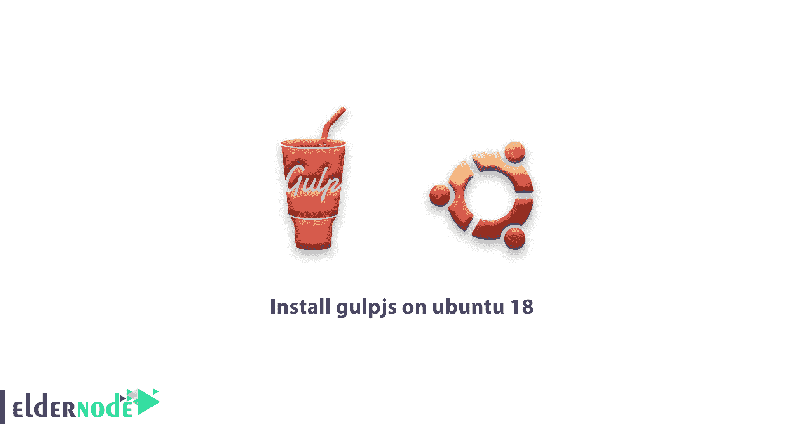

# 如何在 Ubuntu 18.04 上安装 Gulpjs-Linux 教程| Eldernode 博客

> 原文：<https://blog.eldernode.com/install-gulpjs-on-ubuntu-18/>



【更新】Gulp 是一个开源的 JavaScript 工具包，是一个跨平台的，在前端 web 开发中用作流构建。它是一个基于 Node.js 和 npm 的任务运行器，用于自动化 web 开发中耗时和重复的任务，如缩小、连接、缓存破坏、单元测试、林挺、优化等。在这篇文章中，你将学习如何在 Ubuntu 18.04 上安装 Gulp.js。如果您希望准备自己的 [Ubuntu VPS](https://eldernode.com/ubuntu-vps/) ，请依靠我们的技术团队，并在 [Eldernode 上注册您的订单。](https://eldernode.com/)

## 教程在 Ubuntu 18.04 上安装 gulp . js

Gulp 是一个工具包，帮助开发人员在开发过程中自动化痛苦的工作流程。要安装 Gulp，你首先需要安装 [Node.js](https://blog.eldernode.com/install-and-config-node-js-on-ubuntu-20-04/) ，所以你将按照下面的说明在你的 [Ubuntu](https://blog.eldernode.com/tag/ubuntu/) 上安装 Node.js，然后安装 Gulp。

### **Gulp.js Vs 其他任务跑者**

Gulp 与众不同的主要原因是它使用节点流。因为 gulp 将一个任务的输出作为输入传递给下一个任务，所以它读取文件一次，然后通过多个任务处理它。Gulp 最后会写出输出文件。所以，gulp 速度更快，因为不需要在硬盘上创建和读取中间文件。

### **在 Ubuntu 18.04 上安装 Gulp.js 的先决条件**

为了让本教程更好地工作，请考虑以下先决条件:

拥有 Sudo 权限的非 root 用户。

要进行设置，请遵循我们在 Ubuntu 18.04 上的[初始服务器设置。](https://blog.eldernode.com/initial-setup-ubuntu-18/)

## **如何在 Ubuntu 18.04 上安装 gulp . js LTS**

Gulp 是 Node.js 的命令行任务运行程序。使用 Gulp 可以轻松地自动化流程和运行重复性任务。让我们浏览一下本指南的步骤，并在 Ubuntu 18 上安装 Gulp.js 工具包。这种安装方式对于希望在 Ubuntu 16.04 上安装 Gulp.js 的人也很有用。

第一步:

首先，你需要**在你的系统上安装 Nodejs** 。要在你的 Ubuntu 系统中添加 **node.js PPA** 并安装它，运行:

```
sudo apt-get install python-software-properties
```

```
curl -sL https://deb.nodesource.com/setup_8.x | sudo -E bash -
```

```
sudo apt-get install nodejs
```

然后，您可以使用下面的命令来检查它是否安装成功:

```
node --version
```

```
npm --version
```

第二步:

一旦 Node.js 和 Npm 安装完毕，您就可以**安装 Gulp** 了。因此，键入:

```
sudo npm install -g gulp
```

如果一切正常，现在应该安装 Gulp 了。要检查系统上安装的 bower 版本，请使用以下命令:

```
gulp --version
```

这样，您可以查看当前 gulp 的 CLI 和本地版本。

要安装 **gulp 命令行实用程序**，请运行:

```
npm install --global gulp-cli
```

### **如何在 Gulp.js 中创建项目目录**

此时，您可以创建一个项目目录并导航到其中。为此，请使用以下命令:

```
npx mkdirp my-project
```

```
cd my-project
```

### **如何在你的项目目录下创建 package.json 文件**

要接收您的项目名称、版本、描述等，您可以运行以下命令并创建一个 **package.json** 文件:

```
npm init
```

最后，运行下面的命令来**在您的 **devDependencies** 中安装 gulp 包**:

```
npm install --save-dev gulp
```

## 结论

在本文中，您了解了如何在 Ubuntu 18.04 上安装 Gulp.js。Gulp 帮助你自动化工作流程中的许多任务。现在，只要保存了文件，您就可以启动 web 服务器并自动重新加载浏览器。还有，可以参考相关文章，学习[如何在 Ubuntu 20.04](https://blog.eldernode.com/configure-gulp-js-on-ubuntu-20-04/) 上配置 Gulp.js。