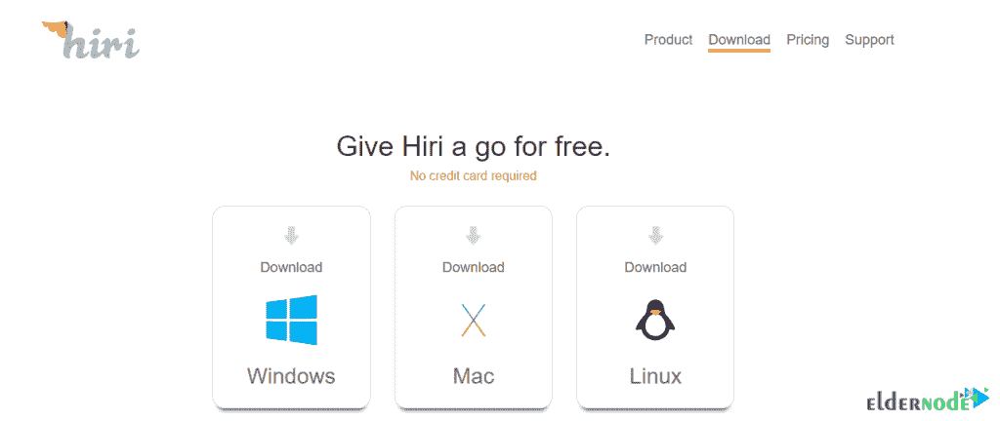

# 在 Windows Server - Eldernode 博客上介绍和安装 Hiri

> 原文：<https://blog.eldernode.com/install-hiri-on-windows-server/>

就节省时间而言，Hiri 是 Windows 中最好的时间管理程序之一。这个应用程序主要是为商业用户做的。Hiri 目前只支持包括 Hotmail、Outlook 和 Exchange 在内的微软电子邮件服务，但家庭用户也很欣赏它的生产力功能。如果你花时间管理、阅读和回复很长的邮件，Hiri 是一个很好的建议。它包括一个智能仪表板，让您可以一目了然地看到有多少邮件尚未阅读，以及在查看它们之前需要等待多长时间。在这篇文章中，我们试着在 Windows 服务器上介绍并安装 Hiri。你可以访问 [Eldernode](https://eldernode.com/) 提供的包来购买 [Windows VPS](https://eldernode.com/windows-vps/) 服务器。

## **在 Windows 上引入并安装 Hiri**

Hiri 是一个桌面电子邮件客户端，用于发送和接收电子邮件，管理日历，联系人和任务。它是作为现有电子邮件客户端和日历应用程序(如 Microsoft Outlook 和 Mozilla Thunderbird)的替代品而创建的。有趣的是，Hiri 使用**跨平台 Qt 框架**在 [Windows](https://blog.eldernode.com/tag/windows/) 、macOS 和 [Linux](https://blog.eldernode.com/tag/linux/) 上运行。还有，Hiri 不支持 IMAP，只使用**微软 Exchange Server** 基础设施。

### **Windows 服务器上的 Hiri 介绍**

Hiri 软件配备了一些工具，可以通过改变我们处理电子邮件的习惯来节省时间。Hiri 工具的优势包括强大的日历、日程安排工具和提高生产力的智能工具。在本文的后续部分，请加入我们来学习如何安装这个应用软件。

### **Hiri 特性:**

以下是 Hiri 的一些特性:

1.评估匿名收到的电子邮件的质量

2.企业单点登录提供商(如 Okta)

3.OAuth 2.0 身份验证

4.自动将电子邮件分类到可操作邮箱和仅供参考邮箱

5.对话视图

6.文件夹管理

7.集成任务管理器

8.全球交换地址列表(GAL)

9.本地 SQLite 数据库，用于快速搜索电子邮件

10.完整日历

### **如何在 Windows 服务器上安装 Hiri**

在安装 Hiri 之前，你要注意这个程序可以安装在 Windows 7、8、10 上。因此，它不支持 Windows XP 和 Vista。

安装 Hiri 需要参考第一步的[下载页面](https://www.hiri.com/download/)。然后从可用的操作系统中点击**窗口**。

如下图所示，下载将开始。

Hiri 下载完成后，转到下载文件的存储位置，双击它，直到出现以下窗口。在这个页面上，你必须点击**运行**。

在语言选择窗口中，选择**英语**，点击**确定**。

在名为**许可协议**的窗口中，你必须确认该协议。然后点击**下一步**进入下一个窗口。

下一步是选择目的地。指定安装 Hiri 的位置后，点击下一个的**。**

您可以在桌面上创建 Hiri 图标，方法是选中下图所示的选项。然后点击**下一步**进入下一步:

最后，在最后一个窗口，你必须点击**安装**开始安装 Hiri。请注意，安装 Hiri 可能需要几分钟时间。

安装完成后点击**完成**。

## 结论

Hiri 是一个电子邮件管理解决方案，帮助您设置收件箱提醒并提高电子邮件性能。该软件适用于接收大量电子邮件的大中型公司的商业用户。在这篇文章中，我们试图介绍并在 Windows 服务器上安装 Hiri。