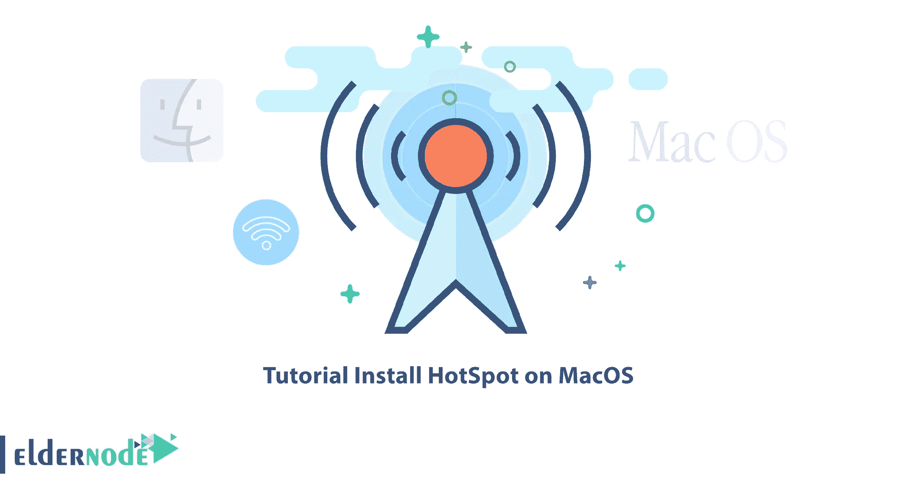
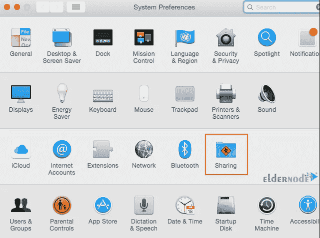
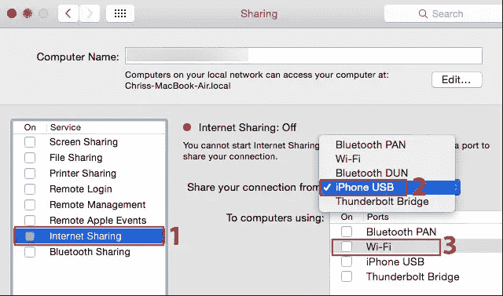
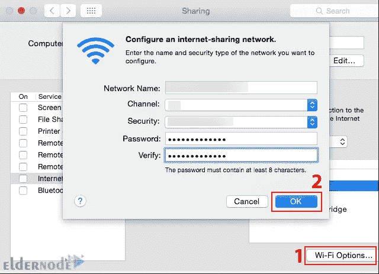
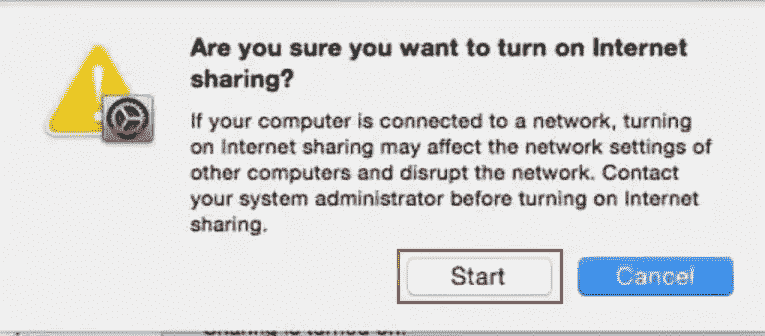

# 教程在 MacOS 上安装 HotSpot

> 原文：<https://blog.eldernode.com/install-hotspot-on-macos/>

您可能会遇到这样的情况:本地 Wi-Fi 网络无法满足您在 iPhone 和 iPad 上的需求，或者您无法将所有设备同时连接到 Wi-Fi。在这种情况下，热点笔记本电脑和连接其他设备到它的 Wi-Fi 是最好的解决方案。你也可以热点你的 MacOS。本文将教你如何在 MacOS 上安装 HotSpot。 [Eldernode](https://eldernode.com/) 网站提供经济型 [VPS](https://eldernode.com/vps/) 服务器，想买就买。

## **如何在 MacOS 上安装热点**

热点是一项功能，允许您与周围的人分享您的互联网。它将您的设备变成一个调制解调器，您可以轻松地连接到互联网。此功能是一种引导和访问 Wi-Fi 的方式，用于传输数据和共享互联网。您的 Mac 可以充当无线热点，并允许您与本地网络上的其他电脑共享互联网。事实上，您可以将其他设备连接到它，并共享它的互联网连接。

### **启用互联网共享**

在这一步中，您将了解 HotSpot 在 Mac 操作系统上的安装过程。为此，请遵循以下步骤。

MacOS 具有互联网共享功能，Wi-Fi 热点选项是其中的一部分。

首先，进入苹果菜单，选择**系统偏好**窗口。然后按下**共享**图标，如下图所示:

现在选择**互联网共享**选项和想要与设备共享的互联网连接。我们选择 iPhone USB。在**到使用**的电脑部分，选择 **Wi-fi** 选项创建一个 Wi-fi 热点。如果您通过以太网适配器将 mac 连接到互联网，请选取“以太网”并通过 Wi-Fi 共享有线连接。如果您的 mac 通过蓝牙连接到互联网或通过 USB 电缆连接到 iPhone，您应该选择与它们相关的选项:

请注意，不能同时连接到 Wi-Fi 网络和托管 Wi-Fi 网络。

### **在 MacOS 上配置热点**

让我们在 MacOS 上配置 Wi-Fi 热点。为此，点击窗口底部的 **Wi-Fi 选项**。

现在你会看到下面的窗口，你应该在其中选择**网络名称**和 Wi-Fi **频道**。然后从**安全**部分选择**WPA2-个人**，并提供密码:

完成后，勾选**互联网共享**框，点击**开始:**

### **在 MacOS 上共享 Wi-Fi 连接**

Mac 的物理 Wi-Fi 接口既可以连接到 Wi-Fi 网络，也可以托管自己的网络。但是您一次只能做其中一项，并且您不能同时连接到同一个 Wi-Fi 网络并通过 Wi-Fi 共享该 Wi-Fi 网络的连接。

还可以通过创建蓝牙 PAN(个人区域网络)来共享 Wi-Fi 连接。所以你需要连接 Wi-Fi，告诉你的 Mac 你想通过蓝牙 PAN 共享 Wi-Fi 连接。然后将其他蓝牙设备与 Mac 的蓝牙配对，并通过蓝牙无线共享 Wi-Fi 连接。

就是这样！

## 结论

热点是一项功能，允许您与周围的人分享您的互联网。你看到 MacOS 也有热点选项。在本文中，我们教你如何在 MacOS 上安装 HotSpot。我希望这篇教程对你有用，能帮助你在 MacOS 上安装 HotSpot。如果你面临任何问题或者有任何建议，可以在评论区联系我们。