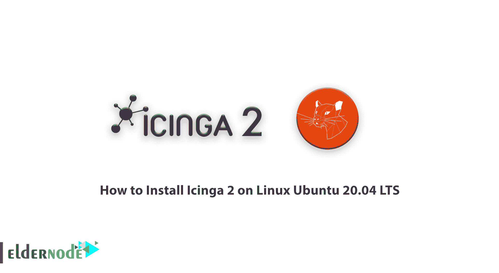

# 如何在 Linux Ubuntu 20.04 上安装 Icinga 2 LTS-elder node 博客

> 原文：<https://blog.eldernode.com/install-icinga-2-on-linux-ubuntu-20-04/>



Icinga 2 软件是一款免费的网络监控软件，以开源形式提供。这个软件作为网络监控软件，检查网络的所有可用资源，并在出现问题时迅速通知用户。Icinga 2 是 Icinga 的修改版本，由于其可伸缩性和实时监控工具，在 IT 专业人员中非常受欢迎。该软件与任何操作系统兼容，可以测量广域网，并提供带有颜色代码的图形。在本文中，我们试图向您介绍**如何在 Linux Ubuntu 20.04 LTS** 上安装 Icinga 2。如果你想买一个 [Ubuntu VPS](https://eldernode.com/ubuntu-vps/) 服务器，你可以在 [Eldernode](https://eldernode.com/) 看到可用的包。

## 教程在 Linux Ubuntu 20.04 LTS 上安装 Icinga 2

Icinga 2 包含一个高度互动的可视化监控界面，方便访问监控。对于一个开源应用程序来说，这也是相当创新的，因为它使用了开源 API 技术。这使得 Icinga 2 能够高速控制其网络。在这篇文章的续篇中，加入我们在 Linux [Ubuntu](https://blog.eldernode.com/tag/ubuntu/) 20.04 LTS 上安装 Icinga 2 的教程。

您必须首先使用以下命令更新必要的程序:

```
sudo apt update && sudo apt upgrade
```

然后，您需要运行以下命令来安装安装过程中需要的程序:

```
sudo apt install -y vim apt-transport-https wget gnupg
```

在安装 Icinga 2 之前，您需要做的最后一步是添加 Icinga 封闭库。因此，您必须将 Icinga 存储库下面的相同映像添加到服务器数据包管理配置中:

```
wget -O - https://packages.icinga.com/icinga.key | sudo apt-key add -  . /etc/os-release; if [ ! -z ${UBUNTU_CODENAME+x} ]; then DIST="${UBUNTU_CODENAME}"; else DIST="$(lsb_release -c| awk '{print $2}')"; fi;  echo "deb https://packages.icinga.com/ubuntu icinga-${DIST} main" | sudo tee /etc/apt/sources.list.d/${DIST}-icinga.list  echo "deb-src https://packages.icinga.com/ubuntu icinga-${DIST} main" | sudo tee -a /etc/apt/sources.list.d/${DIST}-icinga.list
```

最后，您需要被服务器更新以应用更改:

```
sudo apt update
```

## 在 Linux Ubuntu 20.04 上安装 Icinga 2

安装完必要的程序后，就可以使用 apt 包管理器通过执行以下命令来安装 Icinga 2 了:

```
sudo apt install icinga2 -y
```

Icinga 2 在没有安装和运行插件的情况下无法检查服务。因此，您需要使用以下命令，并安装提供各种插件的监控插件项目:

```
sudo apt install monitoring-plugins -y
```

干得好！现在，您需要使用以下命令启动并激活 icinga2:

```
sudo systemctl enable --now icinga2
```

下一步你需要安装 [MySQL](https://blog.eldernode.com/install-mysql-on-linux-ubuntu-20-04/) 或者 MariaDB 并配置 DB IDO MySQL。要做到这一点，你可以参考文章[教程在 Ubuntu 上安装 Mariadb】。](https://blog.eldernode.com/mariadb-installation-on-ubuntu/)

现在您需要使用以下命令安装 DB IDO:

```
sudo apt install icinga2-ido-mysql -y
```

将会打开一个窗口，询问您是否想要启用 **Icinga2 的 ido-mysql 功能**。所以你必须选择 **<是的>** 。

然后询问您是否想用 **dbconfig-common** 为 **Icinga2 的 ido-mysql** 配置数据库。你必须选择**T6【否】T7**来回答这个问题。

现在您需要为 Icinga2 创建一个数据库和用户:

```
$ mysql -u root -p    MariaDB [(none)]> CREATE DATABASE icinga;  MariaDB [(none)]> GRANT SELECT, INSERT, UPDATE, DELETE, DROP, CREATE VIEW, INDEX, EXECUTE ON icinga.* TO 'icinga'@'localhost' IDENTIFIED BY 'icinga';  MariaDB [(none)]> FLUSH PRIVILEGES;  MariaDB [(none)]> quit
```

成功安装数据库并创建用户后，现在必须通过执行以下命令进入 Icinga 2 IDO 设计。如果要求您输入密码，您可以输入 root。

```
$ mysql -u root -p icinga < /usr/share/icinga2-ido-mysql/schema/mysql.sql  Enter password: <Enter-your-root-password>
```

### 如何启用 IDO MySQL 模块

这个模块创建一个新的配置文件，可以安装在**/etc/icing a2/features-available/I do-MySQL . conf**中。为此，请执行以下命令:

```
$ sudo vim /etc/icinga2/features-available/ido-mysql.conf    /**  * The db_ido_mysql library implements IDO functionality  * for MySQL.  */    library "db_ido_mysql"    object IdoMysqlConnection "ido-mysql" {  user = "icinga",  password = "icinga",  host = "localhost",  database = "icinga"  }
```

现在，您应该使用以下命令来启用 ido-mysql 配置文件，这些命令代表 icinga2 属性:

```
$ sudo icinga2 feature enable ido-mysql  Enabling feature ido-mysql. Make sure to restart Icinga 2 for these changes to take effect
```

最后，用下面的命令重新启动 Icinga 2:

```
sudo systemctl restart icinga2
```

## 结论

Icinga 是一个监视系统，它监视网络资源的可用性，通知用户关机，并生成性能数据用于报告。该软件可扩展，可以控制多个位置的大型复杂环境。在这篇文章中，我们试图教你如何在 Linux Ubuntu 20.04 LTS 上安装 Icinga 2。