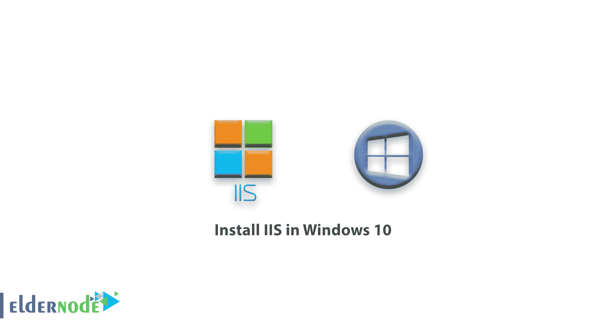
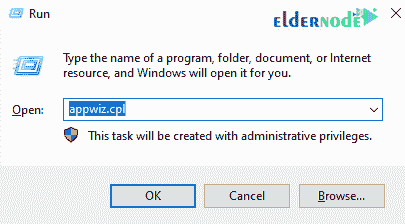
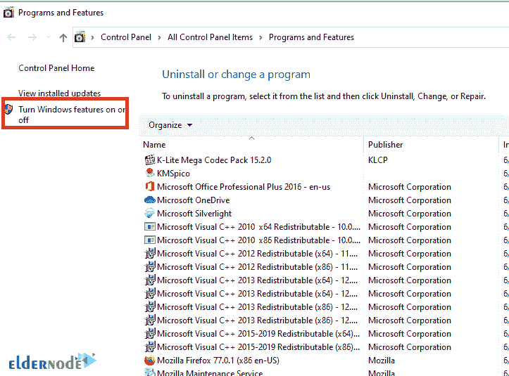
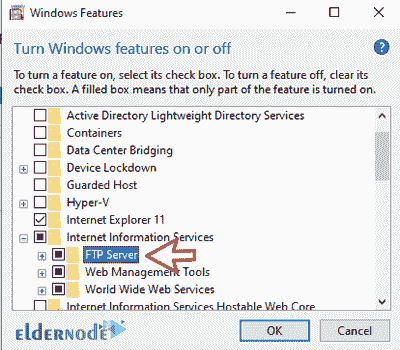
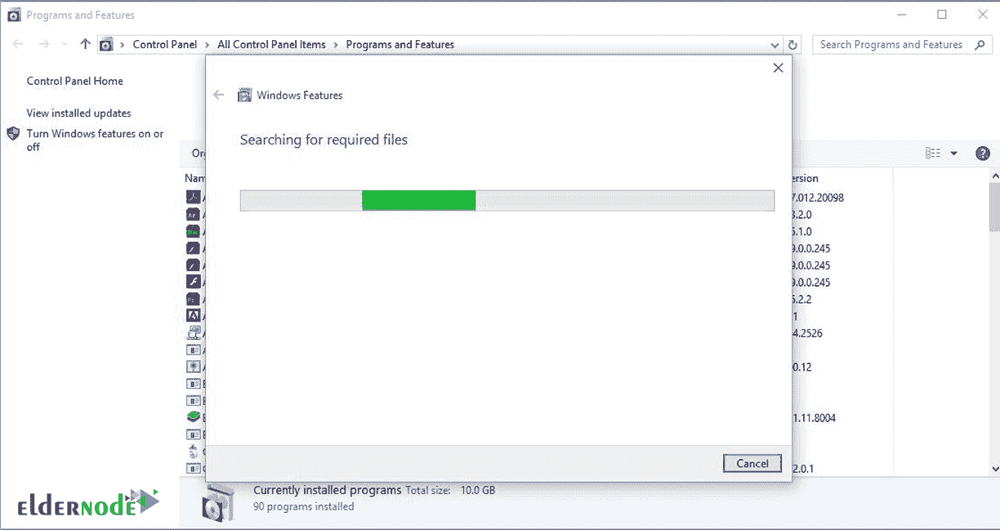
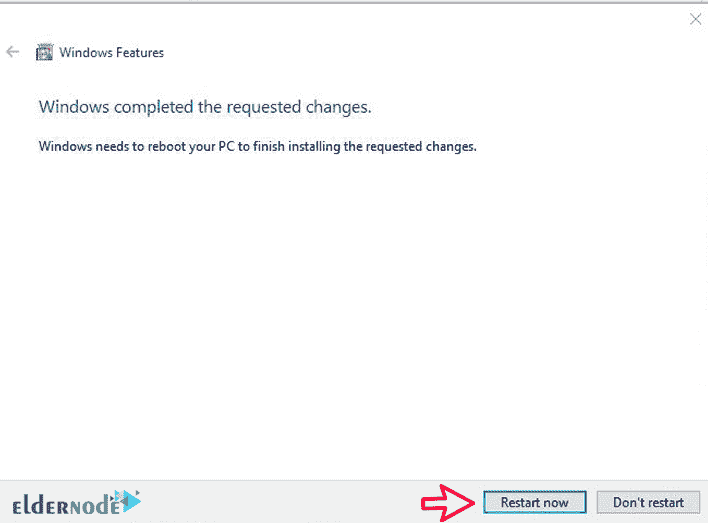

# 如何在 Windows 10 中安装 IIS-elder node

> 原文：<https://blog.eldernode.com/install-iis-in-windows-10/>

IIS 服务或 Microsoft Web 服务器是具有许多功能的顶级 Web 服务器之一。该服务包括 FTP 设置、PHP 支持和 ASP.net 支持。在这篇文章中，我们将了解如何在 Windows 10 中安装 IIS。

在本教程中，想要在 Windows 10 中使用这个 web 服务器的用户将会熟悉安装过程。

我们在[Windows Server 2012](https://eldernode.com/install-iis-on-windows-2012-vps-server/)上的 IIS 安装教程中说过，IIS 是 Windows Server 上一个叫做 Web Server 的卷。但在 Windows 客户端，和 Windows 10 一样，它被称为一个功能。

在 Windows 10 中，由于 Windows 客户端的软硬件限制，IIS 没有能力响应服务器上的 IIS。可以说，它通常用作本地 web 服务器，或者最终用于一次服务不到 50 人。但是，如果你要在 IIS 上为一个特定的网站提供服务，最好在 [Windows 服务器](https://en.wikipedia.org/wiki/Windows_Server)上使用这个服务。

#### 选择您最理想的 [Windows VPS](https://eldernode.com/windows-vps/) 服务器包

在 Windows 10 中安装 IIS

## **1-** 首先，按下 Winkey + R 键打开 Run 窗口。键入 appwiz.cpl 打开**程序和功能**窗口。

**注意:** 您可以在 Windows 控制面板中打开程序和功能窗口。

**2-** 点击开启或关闭 Windows 功能。

**3-** 在打开的页面中，找到**互联网信息系列**选项并勾选。

**注意:** 如果你也打算使用 **FTP 服务**，勾选此选项下面的 FTP 服务器子类别。

**4-** 点击确定开始安装过程。系统将首先搜索 IIS 文件，如果安全，将开始安装该文件。

如果在 Windows 中找不到该文件或该文件不完整，操作系统本身会从互联网上下载该文件。

**5-** 安装完成后，会显示如下窗口。点击立即重启让系统重启，完成在 Windows 10 上安装 IIS。

**6-** 通过开始菜单启动系统后，键入并搜索 IIS。

**7-** 找到 IIS 后，点击打开。

**尊敬的用户**，我们希望您能喜欢这个[教程](https://eldernode.com/category/tutorial/)，您可以在评论区提出关于本次培训的问题，或者想解决[老年人节点培训](https://eldernode.com/blog/)领域的其他问题，请参考[提问页面](https://eldernode.com/ask)部分，并尽快提出您的问题。腾出时间给其他用户和专家来回答你的问题。

如何在 Windows 10 中安装 IIS

好运。

Goodluck.