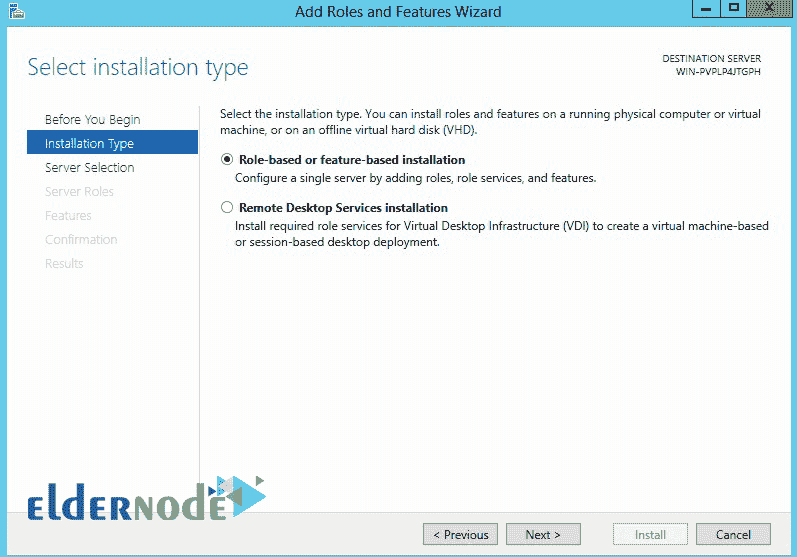

# 在 Windows 2012 vps 服务器上安装 IIS-elder node 博客

> 原文：<https://blog.eldernode.com/install-iis-on-windows-2012-vps-server/>

【更新:添加视频|创建视频作者:Michael Morgan】教程如何在 Windows 2012 vps 服务器上一步一步安装 iis。IIS 或互联网信息服务是一种软件，您可以使用它作为 web 服务器在您的服务器上安装和运行 [Windows Server](https://blog.eldernode.com/tag/windows/) 2012。您可以通过访问 [Eldernode](https://eldernode.com/) 中的购买 [Windows VPS](https://eldernode.com/windows-vps/) 服务器页面查看和购买各种套餐。

在这一系列的 Windows Server 2012 教程中，我们打算在 Windows 2012 vps 服务器上安装 [iis](https://www.iis.net/) 。

## **如何在 Windows server 2012 上安装 IIS**

1.先打开你的 **[Windows 服务器](http://eldernode.com/windows-vps/)** 管理器。

2.打开服务器管理页面后，单击添加角色和功能。

3.在安装类型部分，选择基于角色或基于功能的安装，然后单击下一步。

4.再次单击此页面上的下一步。

5.在“服务器角色”部分，选择 Web 服务器角色。

6.点击 Web 服务器后，会立即出现以下消息:点击添加功能。

下面的消息显示了安装 IIS 的必备功能的安装。

7.点击添加功能后，Web 服务器卷被选中；单击下一步。

8.此时，如果需要，您可以选择功能，然后单击下一步。

安装 IIS 不需要安装和选择特定的功能。

9.阅读下一页后，您将在本页找到对 Web 服务器卷的描述。

10.在此页面上，您将找到与 IIS 相关的组件和服务，如果需要，请选择选项，然后单击下一步。

11.所有选定的服务和组件都将在此阶段显示。安装后单击“确定”。

请记住，如果需要，通过选中此选项允许 Windows 在安装 Web 服务器后重新启动 Windows，页面顶部会显示一段红色文本。

12.单击“安装”后，等待安装完成。

关闭页面，关注继续教育打开 IIS。

IIS 管理部分

13.要打开 IIS，请从“开始”菜单打开“管理工具”菜单。

14.在“管理工具”页面上，打开 Internet 信息服务(IIS)管理器。

15.IIS 安装完成，您将在下面看到 IIS 管理页面的屏幕截图。

Windows Server 2012 上 IIS 的安装已完成。