# 如何在 Windows Server 2019 上安装 IIS Web 服务器- ElderNode 博客

> 原文：<https://blog.eldernode.com/install-iis-web-server-on-windows-server/>

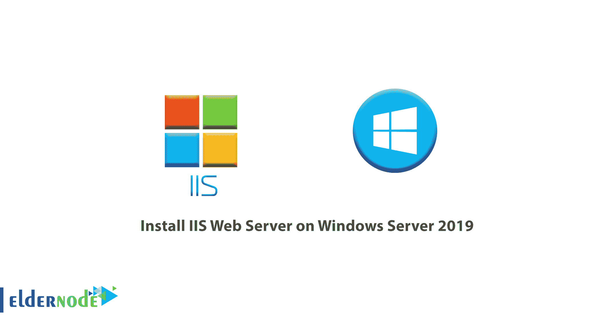

如何在 [Windows Server 2019](https://eldernode.com/tag/windows-server-2019/) 上安装 [IIS](https://eldernode.com/tag/iis/) Web 服务器。IIS Web Server 适用于可以安装在不同版本的 Windows 上的 [Windows Server](https://eldernode.com/tag/windows-server/) 。 IIS Web 服务器允许 Windows 响应 Web 请求。

IIS web 服务器的用户比 [Apache](https://www.apache.org/) 和 [Nginx](https://www.nginx.com/) 少，这可能是因为速度较慢。

**IIS** 代表互联网信息服务器。IIS 是一个依赖于 web 服务器的 Visual Basic 应用程序，它对浏览器请求做出响应。

在本文中，我们将教你如何在 Windows Server 2019 上安装 IIS Web Server。

[**在 Eldernode**](https://eldernode.com/windows-vps/) 选择您的完美 Windows 虚拟专用服务器包

### 1) 打开服务器管理器

你必须去服务器管理器开始安装。点击你的窗口键，搜索服务器管理器。

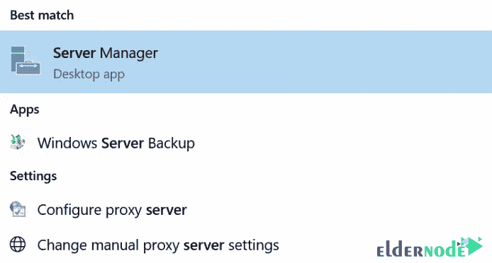

打开后，点击添加角色和功能。

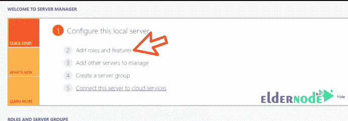

在添加角色和功能向导的**第一页**中，点击下一步。

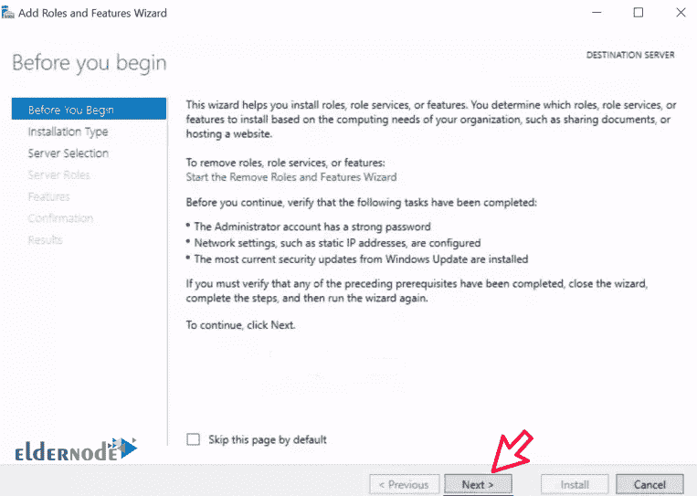

### 2) 安装类型

在**选择安装类型**页面中，选择基于角色或基于功能的安装，点击下一步。

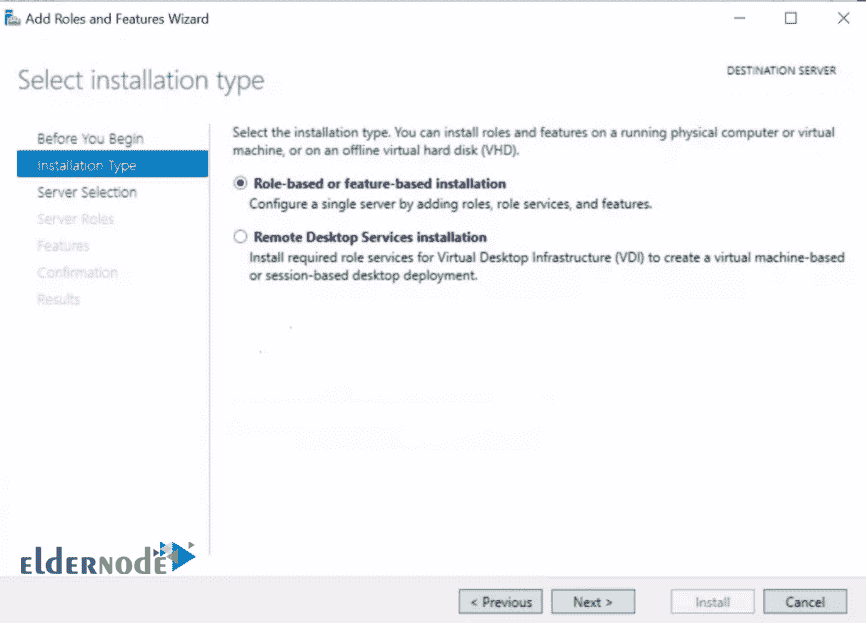

### 3) 目的服务器

选择要安装 NFS 的服务器，点击下一步。

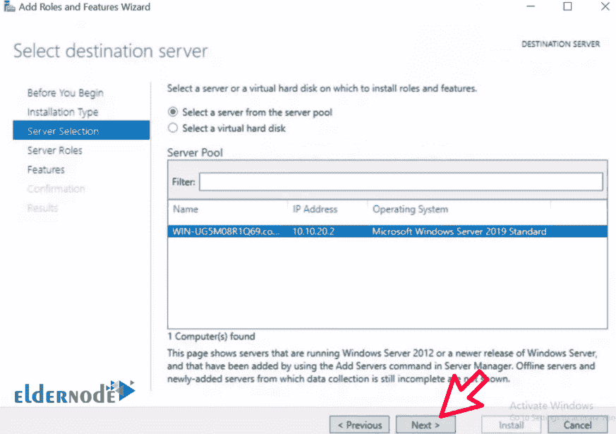

### 4) 服务器角色

在**选择服务器角色**部分，中间窗口的**勾选** WebServer (IIS) 。

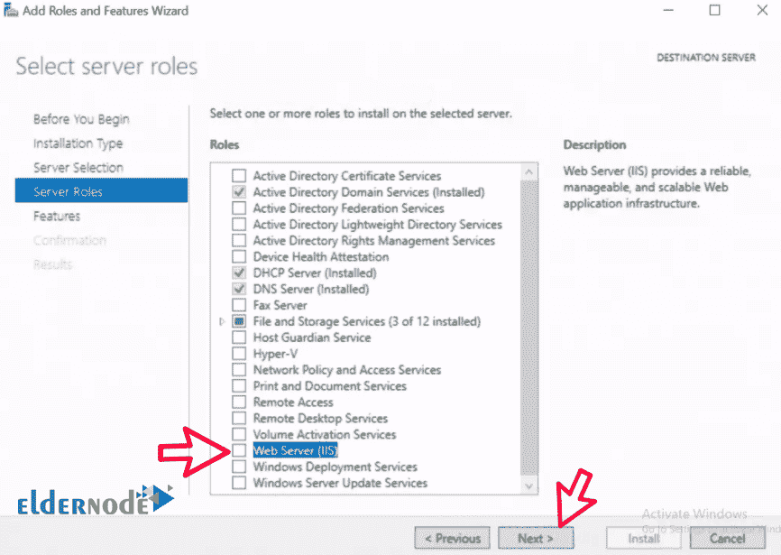

### 5) 特色

在**弹出窗口**中，点击添加功能，然后点击下一步。

之后，在接下来的三个连续窗口中点击下一个，如下图所示:

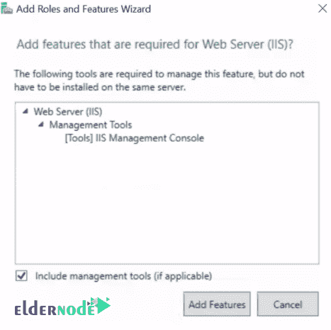

*

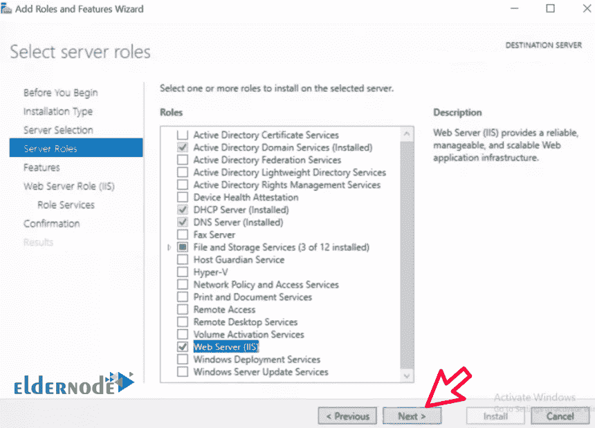

**

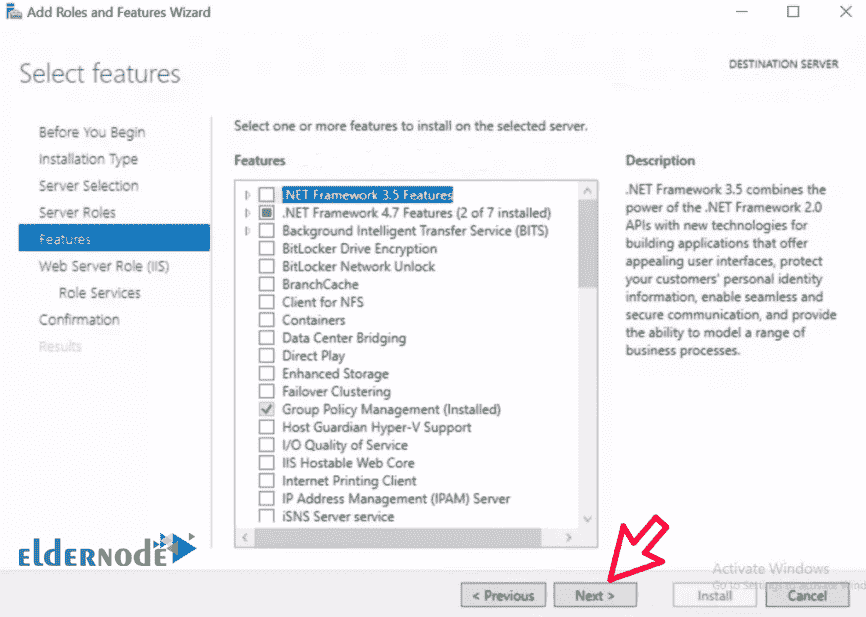

*******

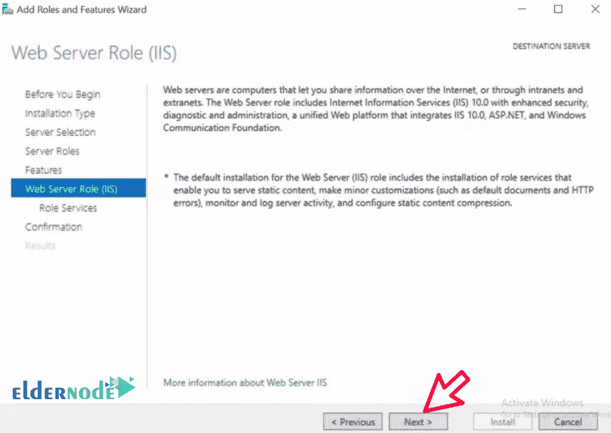

### 6) 确认

在**确认安装选择**页面点击安装。

给它一些时间来完成，之后你只需点击关闭。

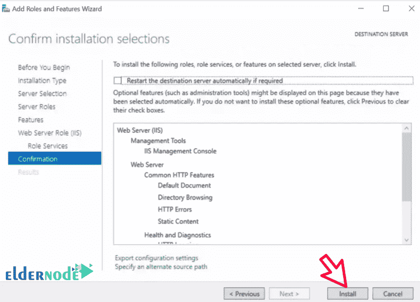

*****

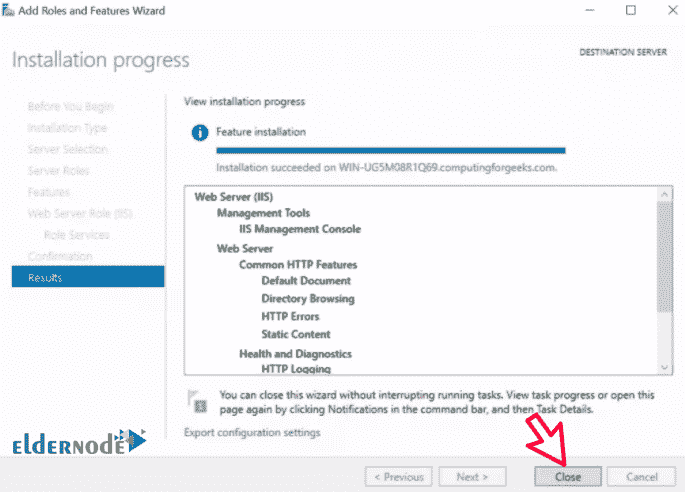

### 7) 证明 Web 服务器正在运行

在服务器内或在能够访问您的 IIS 服务器网络的计算机上打开您的**浏览器**，并在浏览器搜索中输入其 IP 地址，如下所示:

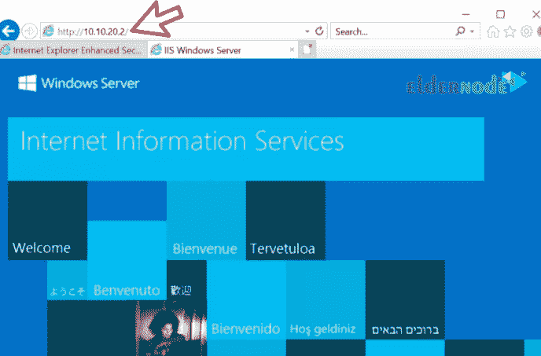

这就是IIS web 服务器安装被**成功完成**的地方。在下面的文章中，我们将教你如何在 Windows Server 2019 中配置 IIS Webserver。

**亦作，见:**

[1。 Windows Server 2019 安装配置教程](https://eldernode.com/windows-server-2019-install-and-config/)

[2。教程在 Windows Server 2019 中配置 NTP 服务器](https://eldernode.com/configure-ntp-server-in-windows-server/)

[3。教程在 Windows IIS Server 2019 上配置虚拟目录](https://eldernode.com/configure-virtual-directory-on-windows-server/)

[4。如何在 Windows Server 2019 上安装和配置 Hyper-V](https://eldernode.com/install-and-configure-hyper-v-on-windows/)

[5。如何在 Windows Server 2019 上安装 Active Directory](https://eldernode.com/install-active-directory-on-windows-server/)

[6。如何在 Windows 服务器上安装和配置 Windows 管理中心](https://eldernode.com/install-and-configure-windows-admin-center-on-windows-server/)

**尊敬的用户**，我们希望您能喜欢这个[教程](https://eldernode.com/category/tutorial/)，您可以在评论区提出关于本次培训的问题，或者想解决[老年人节点培训](https://eldernode.com/blog/)领域的其他问题，请参考[提问页面](https://eldernode.com/ask)部分，并尽快提出您的问题。腾出时间给其他用户和专家来回答你的问题。

好运。