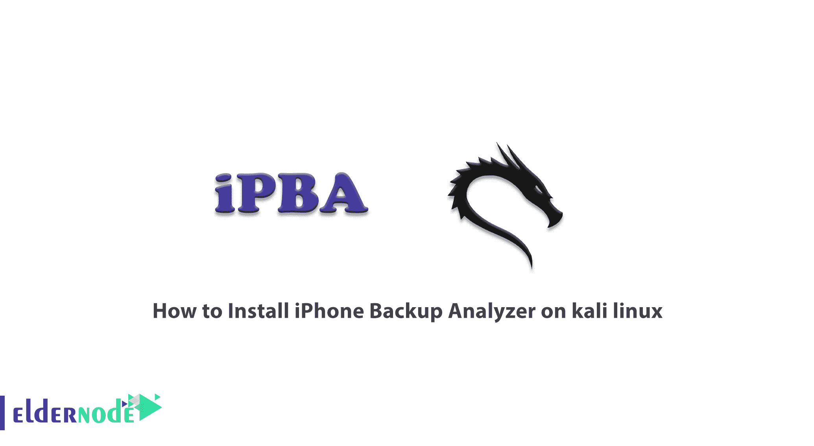
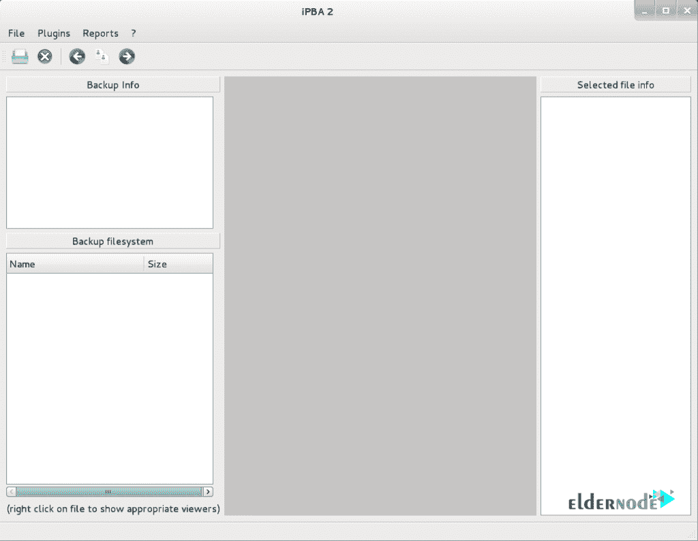

# 如何在 kali linux - Eldernode 博客上安装 iPhone 备份分析器

> 原文：<https://blog.eldernode.com/install-iphone-backup-analyzer-on-kali-linux/>



iPhone 备份分析器是一个工具，旨在方便浏览 iPhone 或任何其他 iOS 设备的备份文件夹。您可以读取配置文件、浏览归档文件和搜索数据库。在这篇文章中，我们试图学习你如何在 kali linux 上安装 iPhone 备份分析器。你可以访问 [Eldernode](https://eldernode.com/) 提供的包来购买 [Linux VPS](https://eldernode.com/linux-vps/) 服务器。

## **教程在 kali linux 上安装 iPhone 备份分析器**

iPhone Backup Analyzer 是一款基于 Java 的产品，可以在多种操作系统上使用，如 [Windows](https://blog.eldernode.com/tag/windows/) 、 [Linux](https://blog.eldernode.com/tag/linux/) 和 Mac。应该注意的是，在 Kali Linux 环境中安装这个工具很容易。在本教程中跟随我们。

IPhone 备份分析器软件允许用户搜索 iPhone/iPad 备份内容。该软件与理解和显示文件内容所需的所有程序一起使用。注意，IPBA 分析备份目录并显示解码的文件系统树。

### **iPhone 备份分析器的特点:**

该软件(iPhone 备份分析器)的一些功能包括:

–指定备份文件夹中的真实名称

–文件 UNIX 权限

–哈希数据

–指定用户 ID 和组 ID

–修改时间、访问时间、创建时间

–显示幻数的文件类型

### **在 kali linux 上安装 iPhone 备份分析器【一步一步】**

安装 iPhone 备份分析器可以很容易地完成。为此，只需运行以下命令:

```
sudo apt-get install iphone-backup-analyzer
```

请注意，iphone-backup-analyzer 和任何其他依赖于它的包都将通过执行上面的命令来安装。

通过执行以下命令，您可以在下图中看到 iphone 备份分析器环境:

```
[[email protected]](/cdn-cgi/l/email-protection):~# iphone-backup-analyzer
```



## 结论

在本文中，我们在简要介绍和解释了 iPhone Backup Analyzer 的特性之后，试图向您学习如何在 kali linux 服务器上安装 iPhone Backup Analyzer。也可以从 [Kali Linux](https://blog.eldernode.com/tag/kali-linux/) 版块阅读其他与 Kali Linux 相关的教程。