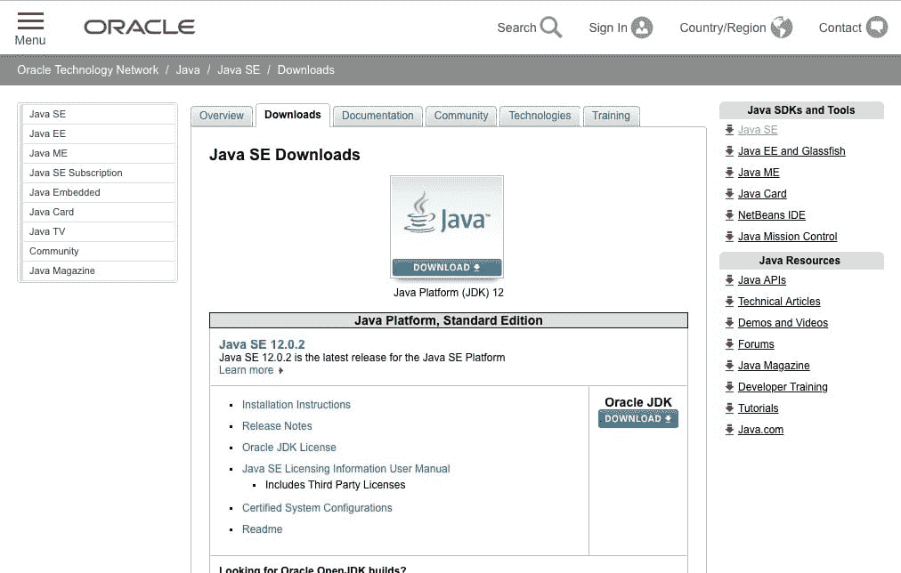
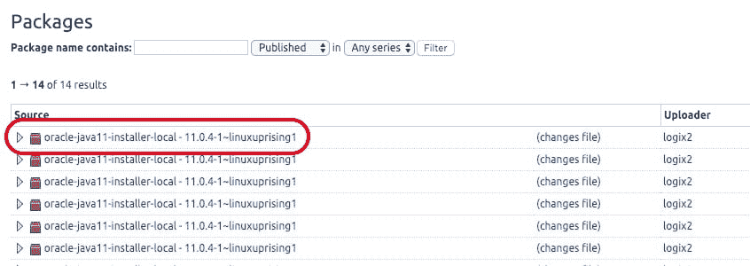
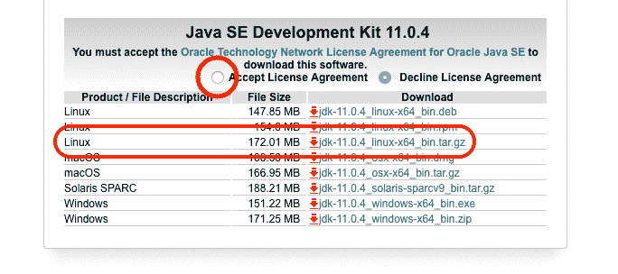

# 如何在 Debian 10 上用 Apt 安装 Java-Debian 10 中的 Java

> 原文：<https://blog.eldernode.com/install-java-apt-debian-10/>


许多软件都需要 Java 和 Java 虚拟机。在本文中，你将学习如何在 Debian 10 上用 Apt 安装 Java。请遵循本指南，查看不同版本的 Java 安装。

您将安装 OpenJDK 11 以及 Oracle 的官方 Java 11 软件，并选择您喜欢的版本用于您的项目。然后，您可以使用 JDK 来开发软件，或者使用 Java 运行时来运行软件。

**先决条件**

如果您知道以下内容，本教程可能会更有用:

## 如何在 Debian 10 上用 Apt 安装 Java

让我们通过以下步骤来完成这个有趣而简单的指南。

### 安装默认的 JRE/JDK

你会看到安装 Java 最简单的选择，就是使用 Debian 打包的版本。因为 Debian 10 默认包含 OpenJDK version 11，是 JRE 和 JDK 的开源变种，与 Java 11 兼容。

首先，更新你的 **apt** 包索引:

```
sudo apt update
```

检查 Java **是否已经安装**或者**没有安装**:

```
java -version 
```

如果**不是**，你会看到下面的输出

输出

```
-bash: java: command not found
```

使用以下命令安装 OpenJDK:

```
sudo apt install default-jre 
```

这样，您将安装 Java 运行时环境(JRE)，允许您运行几乎所有的 Java 软件。

要验证安装，请执行以下操作:

输出

```
openjdk version "11.0.4" 2019-07-16  OpenJDK Runtime Environment (build 11.0.4+11-post-Debian-1deb10u1)  OpenJDK 64-Bit Server VM (build 11.0.4+11-post-Debian-1deb10u1, mixed mode, sharing)
```

为了编译和运行一些特定的基于 Java 的软件，你可能还需要 Java 开发工具包(JDK)。

```
sudo apt install default-jdk 
```

检查 **javac** 的版本，看是否安装了 JDK。

```
javac -version 
```

输出

```
javac 11.0.4
```

[购买 Linux 虚拟私有服务器](https://eldernode.com/linux-vps/)

安装 Oracle JDK

### 您必须直接从 Oracle 下载一些文件来安装正式的 Oracle JDK。

首先，从甲骨文的网站下载 [Java](https://www.java.com/en/) 。

下载甲骨文的 Java SE 软件包

#### 由于 Oracle 处理 Java 许可的方式发生了一些变化，请创建一个 Oracle 帐户，并在继续安装之前直接从其网站下载软件。

**注意**:使用 Oracle 的帐户创建页面创建一个帐户，然后导航到 Oracle 的 Java SE 下载页面。



**重要提示**:确保下载正确版本的 Java。因为它必须符合安装者的期望。请访问安装程序软件仓库的软件包列表进行检查。

找到**Oracle-Java 11-installer-local…**文件:



如您所见，安装程序预期的版本是 11.0.4。忽略软件包版本号中**–**连字符后面的任何数字。因为您知道正确的版本号，所以向下滚动 Java 下载页面，直到找到正确的版本。


要查看下面的屏幕，请按下载按钮。



然后选择**接受许可协议**单选按钮，再点击 Linux 的 **.tar.gz** 包，你的下载就开始了。如果系统询问您，请再次登录您的 Oracle 帐户。

接下来，通过你熟悉的文件传输软件将下载的文件上传到我们的服务器上。

使用 **scp** 将文件上传到您的服务器。根据系统需要调整文件路径:

在您的服务器上安装了正确的 Java 软件包之后，添加包含我们将用来安装 Java 的安装程序的 repo。

```
scp ~/Downloads/jdk-11.0.4_linux-x64_bin.tar.gz  noodi@your_server_ip:~ 
```

添加安装程序的 Apt 库

### 在这一步中，您必须安装软件-属性-公共包，它将**add-apt-repository**命令添加到您的系统中:

并导入用于验证您将要安装的软件的签名密钥:

```
sudo apt install software-properties-common 
```

要将回购添加到我们的包来源列表中:

```
sudo apt-key adv --keyserver keyserver.ubuntu.com --recv-keys EA8CACC073C3DB2A 
```

输出

```
sudo add-apt-repository ppa:linuxuprising/java 
```

要继续安装，请按回车。的可能消息**没有找到有效的 OpenPGP 数据** 可以忽略。

```
 Oracle Java 11 (LTS) and 12 installer for Ubuntu, Linux Mint and Debian.    Java binaries are not hosted in this PPA due to licensing. The packages in this PPA download and install Oracle Java 11, so a working Internet connection is required.    The packages in this PPA are based on the WebUpd8 Oracle Java PPA packages: https://launchpad.net/~webupd8team/+archive/ubuntu/java    Created for users of https://www.linuxuprising.com/    Installation instructions (with some tips), feedback, suggestions, bug reports etc.:    . . .    Press [ENTER] to continue or ctrl-c to cancel adding it
```

**最后**，更新您的软件包列表，使新软件可供安装:

安装下载的 Java 软件

```
sudo apt update 
```

### 此时，创建一个安装程序用来查找 Java 软件包的特定目录，然后将 **.tar.gz** 文件复制到:

然后安装**Oracle-Java 11-installer-local 包** 即可安装 Oracle 的 Java 11，文件复制完成。

```
sudo mkdir -p /var/cache/oracle-jdk11-installer-local/  sudo cp ~/jdk-11.0.4_linux-x64_bin.tar.gz /var/cache/oracle-jdk11-installer-local/
```

当安装程序询问您时，接受 Oracle 许可协议，让它提取 Java 包并安装它。

```
sudo apt install oracle-java11-installer-local
```

无论如何，你已经安装了多个版本的 Java，所以让我们来看看如何选择你想要使用哪个版本的 Java。

管理 Java

### 您可以在一台服务器上安装多个 Java。要配置默认使用的版本:

输出

```
sudo update-alternatives --config java
```

如果您想将它用作缺省值，请选择与 Java 版本相关联的数字。或者保持当前设置不变，按 **回车。** (其他 Java 命令也可以这样做，比如编译器 **javac**

```
There are 2 choices for the alternative java (providing /usr/bin/java).      Selection    Path                                         Priority   Status  ------------------------------------------------------------    0            /usr/lib/jvm/java-11-openjdk-amd64/bin/java   1111      auto mode    1            /usr/lib/jvm/java-11-openjdk-amd64/bin/java   1111      manual mode  * 2            /usr/lib/jvm/java-11-oracle/bin/java          1091      manual mode    Press <enter> to keep the current choice[*], or type selection number:
```

```
sudo update-alternatives --config javac 
```

`设置 JAVA_HOME 环境变量`

### `为了确定使用哪个 Java 安装位置，许多用 Java 编写的程序使用了 **JAVA_HOME** 环境变量。`

`确定 Java 的安装位置，设置这个环境变量。`

`输出`

```
`sudo update-alternatives --config java`
```

`然后，您可以看到下面的安装路径( java 可执行文件的路径。)`

```
 `Selection    Path                                         Priority   Status  ------------------------------------------------------------    0            /usr/lib/jvm/java-11-openjdk-amd64/bin/java   1111      auto mode    1            /usr/lib/jvm/java-11-openjdk-amd64/bin/java   1111      manual mode  * 2            /usr/lib/jvm/java-11-oracle/bin/java          1091      manual mode`
```

`Oracle Java 11 位于**/usr/lib/JVM/Java-11-Oracle/bin/Java**。`

`OpenJDK 11 位于**/usr/lib/JVM/Java-11-open JDK-amd64/bin/Java**。`

`选择自己喜欢的安装路径并复制(不包括后面的 bin/java 组件)。使用您喜欢的文本编辑器打开 **/etc/environment** 。`

`在文件末尾添加下面一行(文件最初可能是空白的)。`

`/etc/环境`

```
`sudo nano /etc/environment` 
```

`**注意**:确保用自己复制的路径替换高亮显示的路径。`

`当您修改这个文件时，您将为系统上的所有用户设置 JAVA_HOME 路径。`

```
`JAVA_HOME="/usr/lib/jvm/java-11-oracle/"` 
```

`您现在可以保存文件并退出编辑器，然后重新加载该文件，以将更改应用到当前会话:`

`接下来，验证是否设置了环境变量:`

`输出`

```
`source /etc/environment`
```

`其他用户将需要执行命令 source /etc/environment 或注销并重新登录以应用此设置。`

```
`echo $JAVA_HOME` 
```

`亲爱的用户，我们希望这篇关于如何在 Debian 10 上用 Apt 安装 Java 的教程能对你有所帮助，如果你有任何问题或者想查看我们用户关于这篇文章的对话，请访问 [提问页面](https://eldernode.com/ask) 。也是为了提高自己的见识，准备了这么多有用的教程给 [Eldernode 培训](https://eldernode.com/blog/) 。`

```
`/usr/lib/jvm/java-11-oracle/`
```

`Other users will need to execute the command source /etc/environment or log out and log back in to apply this setting.`

`Dear user, we wish this tutorial how to install Java with Apt on Debian 10 would be helpful for you, to ask any question or review the conversation of our users about this article, please visit [Ask page](https://eldernode.com/ask). Also to improve your knowledge, there are so many useful tutorials ready for [Eldernode training](https://eldernode.com/blog/).     `