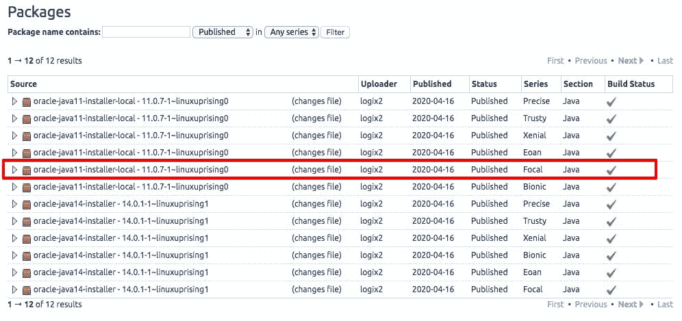
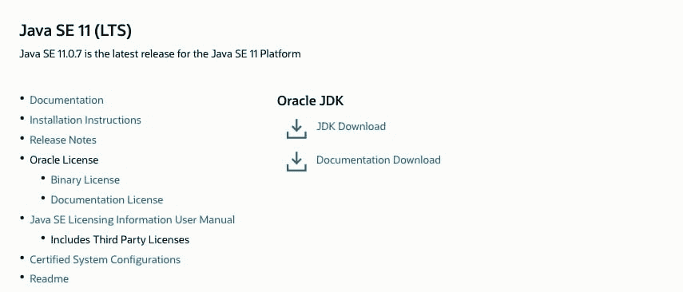
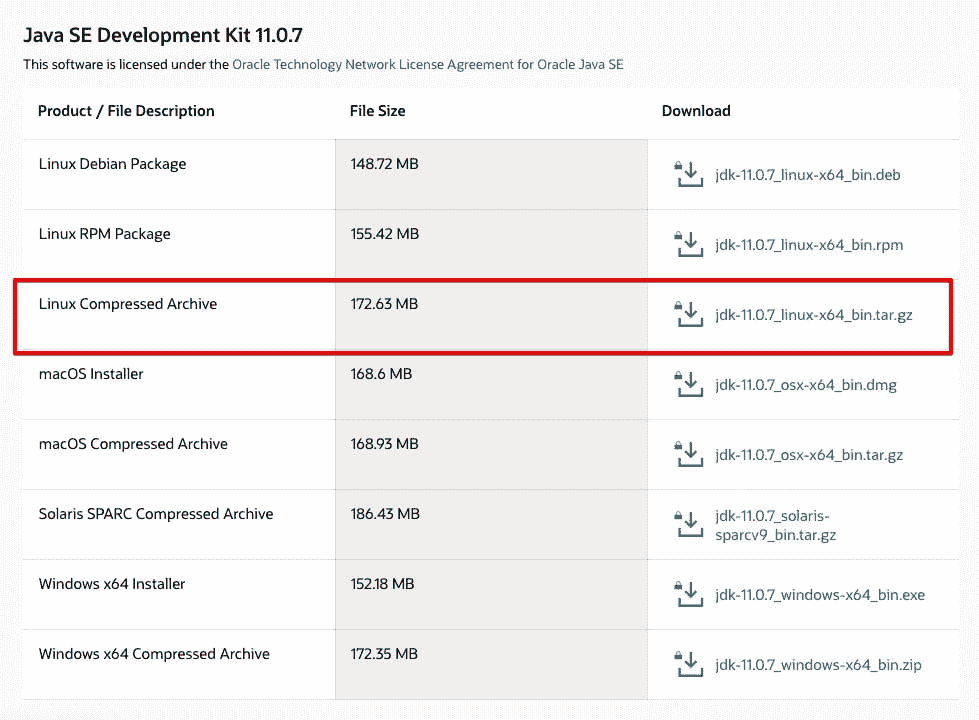

# 如何在 Ubuntu 20.04 上用 Apt 安装 Java——如何管理 Java

> 原文：<https://blog.eldernode.com/install-java-apt-ubuntu-20/>


最近，你阅读了关于 [Java](https://eldernode.com/install-java-apt-debian-10/) 的内容，在本教程中，你将学习**如何在 Ubuntu 20.04** 上用 Apt 安装 Java。正如你所经历的，很多种类的软件都需要 java 和 JVM (Java 的虚拟机)，包括 [Tomcat](http://tomcat.apache.org/) ， [Jetty](https://www.eclipse.org/jetty/) ， [Glassfish](https://javaee.github.io/glassfish/) ， [Cassandra](http://cassandra.apache.org/) 和 [Jenkins](https://jenkins.io/) 。

加入我们，了解如何使用 apt 和 OpenJDK 以及 Oracle 官方 JDK 安装各种版本的 Java 运行时环境(JRE)和 Java 开发工具包(JDK)。然后选择您希望用于项目的版本。完成后，您将能够使用 JDK 来开发软件，或者使用 Java 运行时来运行软件。

**先决条件**

如果你考虑到:
一个拥有 sudo 特权
的非 root 用户要设置，遵循我们在 Ubuntu 20.04 上的 [初始服务器设置。](https://eldernode.com/initial-server-setup-on-ubuntu-20/)

## 如何在 Ubuntu 20.04 上用 Apt 安装 Java

让我们通过本指南的步骤来看看**如何在 Ubuntu 20.04** 上用 Apt 安装 Java。

### 安装默认的 JRE/JDK

你就放心用 Ubuntu 打包的版本安装 Java 吧。但是由于 Ubuntu 20.04 包含了 Open JDK 11，默认情况下是 JRE 和 JDK 的开源变种，你需要先更新包索引。

```
sudo apt update
```

如果已经安装了 Java，则:

```
java -version
```

但是如果当前没有安装 Java，您会看到下面的输出。

输出

```
Command 'java' not found, but can be installed with:    sudo apt install default-jre              # version 2:1.11-72, or  sudo apt install openjdk-11-jre-headless  # version 11.0.7+10-3ubuntu1  sudo apt install openjdk-13-jre-headless  # version 13.0.3+3-1ubuntu2  sudo apt install openjdk-14-jre-headless  # version 14.0.1+7-1ubuntu1  sudo apt install openjdk-8-jre-headless   # version 8u252-b09-1ubuntu1
```

现在，您可以使用以下命令来安装默认的 Java 运行时环境(JRE ),它将从 OpenJDK 11 安装 JRE:

```
sudo apt install default-jre
```

JRE 将允许你运行几乎所有的 Java 软件。

要验证安装，请执行以下操作:

```
java -version
```

输出

```
openjdk version "11.0.7" 2020-04-14  OpenJDK Runtime Environment (build 11.0.7+10-post-Ubuntu-3ubuntu1)  OpenJDK 64-Bit Server VM (build 11.0.7+10-post-Ubuntu-3ubuntu1, mixed mode, sharing)
```

为了编译和运行一些特定的基于 Java 的软件，除了 JRE 之外，您可能还需要 Java 开发工具包(JDK)。因此，使用下面的命令安装 JDK，这也将安装 JRE:

```
sudo apt install default-jdk
```

通过检查 Java 编译器 javac 的版本来验证是否安装了 JDK:

```
javac -version
```

输出

```
javac 11.0.7
```

## **[用比特币购买 VPS](https://eldernode.com/bitcoin-vps/)**

安装甲骨文 JDK 11

### 因为 Oracle 的 Java 许可协议不允许通过包管理器自动安装。您必须创建一个 Oracle 帐户并手动下载 JDK，以便为您要用来安装 Oracle JDK 的版本添加一个新的软件包存储库，该版本是 Oracle 发布的正式版本。

**注意**:您需要下载的甲骨文 JDK 版本必须与安装程序脚本的版本相匹配。要了解您需要哪个版本，请访问 oracle-java11-installer 页面。

找到**焦点**的包装，如下图所示:


由于脚本的版本是 11.0.7 ，所以需要 Oracle JDK 11.0.7。但是你不需要从这个页面下载任何东西，只需要很快通过 apt 下载安装脚本。

之后，您必须访问 **下载页面** ，找到您需要的版本。



点击 **JDK 下载**按钮，您将进入显示可用版本的屏幕。点击 Linux 的 .tar.gz 包。



然后，您将看到一个屏幕，要求您接受 Oracle 许可协议。选择复选框接受许可协议，并按下**下载**按钮。您的下载将开始。在下载开始之前，您可能需要再次登录您的 Oracle 帐户。

文件下载完成后，您需要将它传输到您的服务器。在本地机器上，将文件上传到服务器。在使用 Linux 的 Windows 子系统的 macOS、Linux 或 Windows 上，使用 scp 命令将文件传输到您的 noodi 用户的主目录。以下命令假设您已经将 Oracle JDK 文件保存到本地机器的下载文件夹中:

接下来，返回到您的服务器并添加第三方存储库，它将在文件上传完成后帮助您安装 Oracle 的 Java。

```
scp Downloads/jdk-11.0.7_linux-x64_bin.tar.gz noodi@your_server_ip:~
```

安装软件-属性-公共包，它将 add-apt-repository 命令添加到您的系统中:

然后，导入用于验证您即将安装的软件的签名密钥:

```
sudo apt install software-properties-common
```

输出

```
sudo apt-key adv --keyserver keyserver.ubuntu.com --recv-keys EA8CACC073C3DB2
```

接下来，使用 add-apt-repository 命令将 repo 添加到您的包源代码列表中。

```
gpg: key EA8CACC073C3DB2A: public key "Launchpad PPA for Linux Uprising" imported  gpg: Total number processed: 1  gpg:               imported: 1
```

输出

```
sudo add-apt-repository ppa:linuxuprising/java
```

要继续安装，请按 ENTER 来查看关于没有找到有效的 OpenPGP 数据的消息，但是您可以安全地忽略它。

```
 Oracle Java 11 (LTS) and 12 installer for Ubuntu, Linux Mint and Debian.    Java binaries are not hosted in this PPA due to licensing. The packages in this PPA download and install Oracle Java 11, so a working Internet connection is required.    The packages in this PPA are based on the WebUpd8 Oracle Java PPA packages: https://launchpad.net/~webupd8team/+archive/ubuntu/java    Created for users of https://www.linuxuprising.com/    Installation instructions (with some tips), feedback, suggestions, bug reports etc.:    . . .    Press [ENTER] to continue or ctrl-c to cancel adding it
```

更新您的软件包列表以使新软件可供安装:

安装程序会在/var/cache/Oracle-JDK 11-installer-local中寻找你下载的 Oracle JDK。创建此目录并将 Oracle JDK 归档文件移动到此处:

最后，安装软件包:

```
sudo apt update
```

管理 Java

```
sudo mkdir -p /var/cache/oracle-jdk11-installer-local/  sudo cp jdk-11.0.7_linux-x64_bin.tar.gz /var/cache/oracle-jdk11-installer-local/ 
```

如果您在一个服务器上安装了多个 Java，那么使用 update-alternatives 命令配置哪个版本是命令行上使用的默认版本。

```
sudo apt install oracle-java11-installer-local
```

输出

### 然后，按下键，输入保留当前设置，或者选择与 Java 版本相关的数字作为默认值。

此外，您还可以对其他 Java 命令执行此操作，例如编译器(javac):

```
sudo update-alternatives --config java
```

该命令可以运行的其他命令包括但不限于 keytoo l、 javadoc、和 jarsigner 。

```
There are 2 choices for the alternative java (providing /usr/bin/java).      Selection    Path                                         Priority   Status  ------------------------------------------------------------    0            /usr/lib/jvm/java-11-openjdk-amd64/bin/java   1111      auto mode    1            /usr/lib/jvm/java-11-openjdk-amd64/bin/java   1111      manual mode  * 2            /usr/lib/jvm/java-11-oracle/bin/java          1091      manual mode    Press <enter> to keep the current choice[*], or type selection number:
```

设置 JAVA_HOME 环境变量

请注意，许多程序是用 JAVA 编写的，使用 JAVA_HOME 环境变量来确定 Java 的安装位置。

```
sudo update-alternatives --config javac
```

`要设置这个环境变量，首先要确定 Java 的安装位置。`

### ``输出``

``在这种情况下，安装路径如下:``

``OpenJDK 11 位于/usr/lib/JVM/Java-11-open JDK-amd64/bin/Java。``

```
``sudo update-alternatives --config java``
```

```Oracle Java 位于/usr/lib/JVM/Java-11-Oracle/JRE/bin/Java。```

```
```There are 2 choices for the alternative java (providing /usr/bin/java).      Selection    Path                                         Priority   Status  ------------------------------------------------------------    0            /usr/lib/jvm/java-11-openjdk-amd64/bin/java   1111      auto mode    1            /usr/lib/jvm/java-11-openjdk-amd64/bin/java   1111      manual mode  * 2            /usr/lib/jvm/java-11-oracle/bin/java          1091      manual mode    Press <enter> to keep the current choice[*], or type selection number:```
```

``从您的首选安装中复制路径。然后使用 nano 或您喜欢的文本编辑器打开 /etc/environment :``

1.  ``在这个文件的末尾，添加下面一行，确保用您自己复制的路径替换高亮显示的路径，但是**不要**包括路径的 bin/ 部分:``
2.  ``/etc/环境``

``修改这个文件将为系统上的所有用户设置 JAVA_HOME 路径。``

```
``sudo nano /etc/environment``
```

``现在，您可以保存文件并退出编辑器。``

``接下来，重新加载该文件以将更改应用到当前会话:``

```
``JAVA_HOME="/usr/lib/jvm/java-11-openjdk-amd64"`` 
```

``要验证是否设置了环境变量:``

``输出``

``您需要使用 source /etc/environment 或注销并重新登录，以其他用户身份应用此设置。``

```
``source /etc/environment``
```

``**好样的** ！你都准备好了！您已经安装了多个版本的 Java，并学会了如何管理它们。您现在可以安装运行在 Java 上的软件，如 Tomcat、Jetty、Glassfish、Cassandra 或 Jenkins。``

```
``echo $JAVA_HOME``
```

``Output``

```
``/usr/lib/jvm/java-11-openjdk-amd64``
```

``You need to use the source /etc/environment or log out and log back in to apply this setting as other users.``

``**如果你需要更多的阅读:**``

``**In case you need to read more:**``