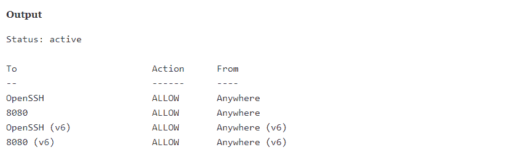

# 教程在 Ubuntu 20.04 上安装 Jenkins 更新] - Eldernode 博客

> 原文：<https://blog.eldernode.com/install-jenkins-ubuntu-20/>


[更新] Jenkins 是一个工具，用于自动化一些过程，并从自动化过程中获得输出。该工具来自 Hudson 项目，其开发者在与 Oracle 发生分歧后发布了该项目。Jenkins 是基于 Java 的自动化服务器。此外，它是从 Ubuntu 软件包中安装的，或者通过下载并运行其 web 应用程序归档文件来安装，web 应用程序归档文件是一个文件集合，构成了一个完整的 web 应用程序，可以在服务器上运行。您将能够很容易地使用它来设置持续集成和持续交付(CI/CD)管道。在本文中，我们将向您介绍**教程在 Ubuntu 20.04 上安装 Jenkins**。如果你想购买一台 [Ubuntu VPS](https://eldernode.com/ubuntu-vps/) 服务器，你可以访问 [Eldernode](https://eldernode.com/) 中提供的软件包。

## **如何在 Ubuntu 20.04 上安装 Jenkins**

加入我们这个教程来验证如何在 [Ubuntu](https://blog.eldernode.com/tag/ubuntu/) 20.04 上安装 Jenkins 以及为什么你需要安装它。在下面的内容中，您将启动开发服务器并创建一个管理用户，让您开始探索 Jenkins 可以做什么。

### **在 Ubuntu 20.04 上安装 Jenkins 的先决条件**

为了让本教程更好地工作，请考虑以下先决条件:

_ 一台配置了 root 或具有 Sudo 权限的非 root 用户的 Ubuntu 20.04 服务器。

_ 要设置，请遵循我们在 Ubuntu 20.04 上的[初始服务器设置。](https://blog.eldernode.com/initial-server-setup-on-ubuntu-20/)

_ 至少 1 GB 的内存

_ 已安装 Oracle JDK 11，遵循我们关于在 Ubuntu 20.04 上安装特定版本 OpenJDK 的指南[。](https://blog.eldernode.com/install-java-apt-ubuntu-20/)

## **在 Ubuntu 20.04 上安装 Jenkins**

而你会在 Jenkins 版本中找到默认的 Ubuntu 包。它落后于项目本身的最新可用版本。然而，为了确保您拥有最新的补丁和特性，请使用项目维护的包来安装 Jenkins。

首先，使用下面的命令和**将存储库密钥**添加到系统中:

```
wget -q -O - https://pkg.jenkins.io/debian-stable/jenkins.io.key | sudo apt-key add -
```

添加钥匙后，系统将返回 **OK** 。

现在，让我们将 Debian 包存储库地址附加到服务器的 **sources.list** :

```
sudo sh -c 'echo deb http://pkg.jenkins.io/debian-stable binary/ > /etc/apt/sources.list.d/jenkins.list'
```

输入这两个命令后，我们将运行 **Update** 以便 **apt** 将使用新的存储库:

```
sudo apt update
```

最后，运行下面的命令来**安装 Jenkins** 及其依赖项:

```
sudo apt install jenkins
```

### **如何在 Ubuntu** 上启动 Jenkins

首先，使用以下命令启动 Jenkins:

```
sudo systemctl start jenkins 
```

您可能不会收到来自 systemctl 的状态输出。所以使用 状态命令来验证 Jenkins 启动成功:

```
sudo systemctl status jenkins
```

如果输出状态显示服务是活动的，并配置为在引导时启动，这意味着到此为止一切正常。


### **如何使用詹金斯**打开防火墙

再次使用 Ubuntu 20.04 上的[初始服务器设置](https://blog.eldernode.com/initial-server-setup-on-ubuntu-20/)来设置一个 **UFW 防火墙**。由于 Jenkins 在端口 8080 上运行，您应该使用 **ufw** 打开该端口:

```
sudo ufw allow 8080
```

另外，如果您发现防火墙不活动，您可以使用以下命令**允许 OpenSSH** 和**启用防火墙**:

```
sudo ufw allow OpenSSH 
```

```
sudo ufw enable
```

现在，要确认新规则，请使用以下命令检查 UFW 的状态:

```
sudo ufw status
```



***注意** :* 注意通知，上面写着允许流量从任何地方进入 8080 端口。

### **如何在 Ubuntu 20.04 上设置 Jenkins**

在最后一步，您将访问 Jenkins 的默认端口 8080 来设置您的安装。

为此，使用您的服务器域名或 [IP 地址](https://blog.eldernode.com/find-server-public-ip-linux/) :

**http://your _ server _ IP _ or _ domain:8080**

当您收到**解锁詹金斯**屏幕时，这意味着您可以看到初始密码的位置:


另外，您可以在终端窗口中使用 **cat** 命令来查看密码:

```
sudo cat /var/lib/jenkins/secrets/initialAdminPassword
```

此时，从终端复制 32 个字符的字母数字密码并粘贴到**管理员密码**字段，然后点击**继续**。

通过接收下面的屏幕，您可以看到安装建议插件或选择特定插件的选项:


一旦你点击**安装建议插件**选项，安装过程将立即开始。


完成安装后，您需要设置第一个管理用户。您将面临两个选择，跳过它或者继续使用您上面使用的初始密码作为 **admin** ，但是您将需要一点时间来创建用户。


因此，您应该输入您的用户的用户名和密码:


毕竟，您应该会收到一个**实例配置**页面，要求您确认 Jenkins 实例的首选 URL。确认服务器的域名或服务器的 IP 地址:


确认适当信息后，点击**保存并完成**。然后等待收到确认页面，确认**“詹金斯准备好了！”**:


现在，要访问 Jenkins 主仪表板，请点击**开始使用 Jenkins。**


## 结论

在本文中，我们将尝试教你如何在 Ubuntu 20.04 上安装 Jenkins。此外，您还学习了如何使用项目提供的包、启动服务器、打开防火墙以及创建管理用户。