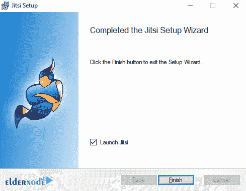

# 如何在 Windows 10 上安装 Jitsi Meet RDP-elder node 博客

> 原文：<https://blog.eldernode.com/install-jitsi-meet-on-windows-10/>

Jitsi 是一个开源项目的集合，您可以使用它来轻松开发和实现安全的视频会议解决方案。Jitsi 的核心是两个部分，叫做 Jitsi 视频桥和 Jitsi 会议，它们允许你在互联网上建立视频会议。而此集合中的其他项目为用户提供了其他功能，如音频、连接(拨入)、多重录制和回放。Jitsi 最初是作为一种在互联网上通过音频和视频连接人们的工具。然而，在十年的过程中，这个项目变得更大了。在这篇文章中，我们将一步一步地教你如何在 Windows 10 RDP 上安装 Jitsi Meet。如果你需要购买一台 [Windows VPS](https://eldernode.com/windows-vps/) 服务器，你可以访问 [Eldernode](https://eldernode.com/) 提供的软件包。

## **教程在 Windows 10 上安装 Jitsi Meet RDP**

与其他视频会议技术不同，Jitsi 视频桥是 Jitsi 的心脏，它将视频和音频发送给每个与会者，而不是混合在一起。结果是具有更少延迟和更好质量的关系。如果使用自己的服务，可伸缩性会更容易、更便宜。Jitsi 完全符合免费网络通信标准 WebRTC。

Jitsi 还支持高级视频路由概念，如多次回放、带宽估计、可伸缩视频编码等。需要注意的是，Jitsi 是使用 Java 编程语言和所谓的 Native 进行编码的。

在本文中，我们将在第一步介绍和表达 Jitsi Meet 的一些特性。然后我们会教你如何在 [Windows 10 RDP](https://eldernode.com/windows-10-rdp/) 上安装 Jitsi Meet。请加入我们。

### **什么是 Jitsi 遇见**

Jitsi 是一套免费的开源多用途语音应用程序(VoIP)、视频会议和即时消息，适用于 web、Windows、 [Linux](https://blog.eldernode.com/tag/linux/) 、Mac OS、iOS 和 Android 应用程序。

Jitsi 项目以前被称为 SIP Communicator。随着 WebRTC 的发展，项目组的重点转移到了 Jitsi 视频桥，以支持多方向的网络视频通话。该团队后来增加了 Jitsi Meet。Jitsi Meet 是一个完整的视频会议应用程序，包括 Android 和 iOS 操作系统的 web 客户端。

Jitsi 还使用了 Meet.jit.si，这是 Jitsi 托管的 Jitsi Meet 的一个版本，可以在社区中免费使用。该软件得到了各种机构的支持，如 NLnet 基金会、斯特拉斯堡大学和阿尔萨斯地区。

在下一节中，我们将提到 Jitsi Meet 的一些特性。然后我们会教你如何在 Windows 10 RDP 上安装 Jitsi Meet。

### **Jitsi 满足特性**

在这一节中，我们想介绍 Jitsi Meet 的一些特性。这些功能包括:

–简单的软件工作

–高功率、速度和安全性

–无限制上传文件

–进行视频会议通话

–使用 ICE 协议建立直接多媒体通信

–强大的加密

–XMPP、AIM / ICQ、Windows Live Messenger、YIM 的文件传输

–使用 OTR 加密消息

–IPv6 支持 SIP 和 XMPP

–SIP 和 XMPP 的音频和视频通话使用 H.264、H.263 或 VP8 进行视频加密

–支持群组视频通话

–免费、开源、兼容 WebRT

## **在 Windows 10 上安装 Jitsi Meet RDP**

在您完全熟悉了前面几节中的 Jitsi Meet 之后，现在我们想一步一步地教您如何安装 Jitsi Meet。为此，只需遵循以下步骤。

第一步，你需要去 Jitsi 网站[下载 Jitsi](https://desktop.jitsi.org/Main/Download.html) 。

然后去你下载文件的地方。双击它开始 Jitsi 安装过程。在打开的窗口中，点击**运行**。

点击下一个的**。**

在许可协议页面上，点击**我接受……**，然后点击**下一步**。

在下一步中，选择您想要安装 Jitsi 的路径，然后单击 **Next** 。

在此部分，您必须选择您想要的设置，并再次点击**下一步**。

***注意:*** 让“SIP”和“XMPP”保持选中状态，以便让 Jitsi 在您点击特殊网页链接时接听电话和进行聊天会话。

现在你必须点击 **Install** 来开始安装 Jitsi:

*

最后，点击 **Finish** 完成 Jitsi 安装过程。

### **如何在 Windows 10 上使用 Jitsi Meet RDP**

在您成功完成安装 Jitsi meet 的步骤后，现在我们想教您如何使用这个软件。

正如你在下图中看到的，Jitsi 允许你一次登录几个聊天账户。填写您已经拥有的帐户的用户名和密码。如果您没有列出的提供商的任何帐户，请通过单击“**尚未注册**”链接之一创建一个新帐户。填写好您想要使用的账户的用户名和密码后，点击**登录**

一旦您创建了您的帐户，您将需要等待 Jitsi 连接。当状态变为“**在线**，就可以聊天了。

## 结论

Jitsi 是一组开源项目，允许您构建和部署安全的视频会议解决方案。Jitsi Meet 有很多特性，并且在不断地添加，其中一些已经提到。在本文中，我们还试图教你如何在 Windows 10 RDP 上安装 Jitsi Meet。