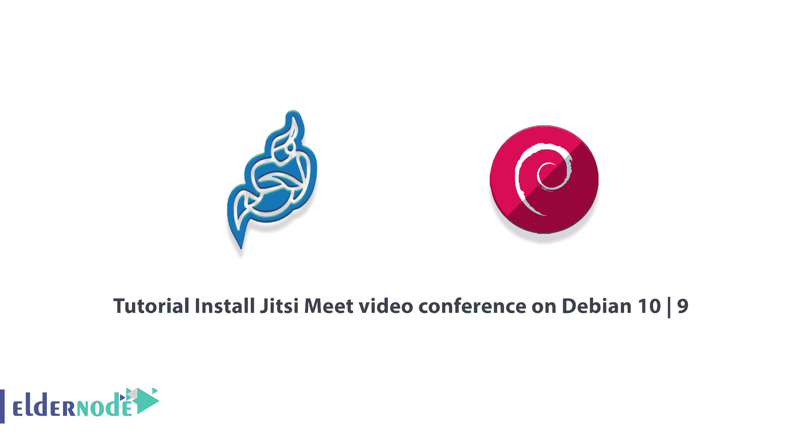
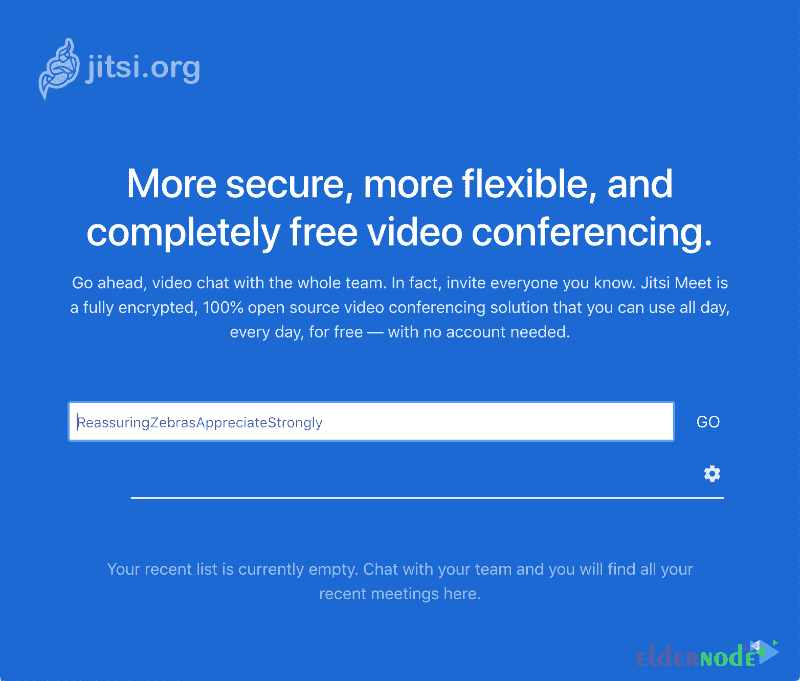
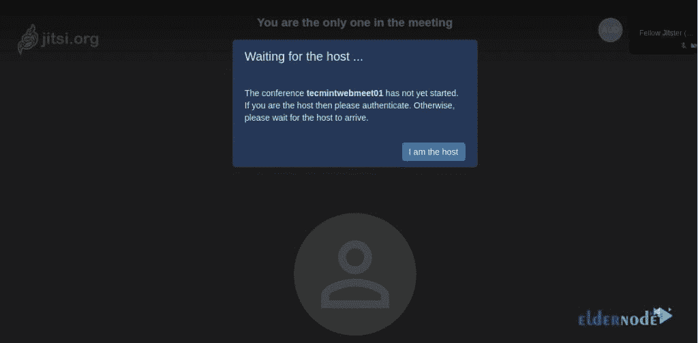
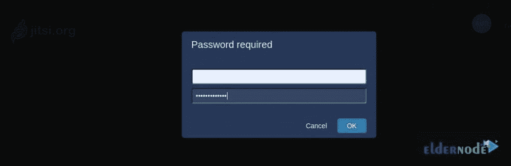

# 教程在 Debian 10 | 9 - Eldernode 上安装 Jitsi Meet 视频会议

> 原文：<https://blog.eldernode.com/install-jitsi-meet-video-conference-on-debian/>



Jitsi Meet 是一个免费的视频会议解决方案。有了这组开源项目，您将能够构建和部署安全的视频会议。音频、拨号、录音和联播都是免费的。Jitsi Meet 是安全、灵活和匿名的。因此，你甚至不必创建一个帐户或订阅。Jitsi 最出名的是它的 Jitsi Meet 视频会议平台 meet.jit.si，在那里他们托管了一个 Jitsi Meet 实例，社区可以使用它来进行完全免费的视频会议。Jitsi 视频桥支持所有多方视频功能。本指南是教程**在 Debian 10，9** 上安装 Jitsi Meet 视频会议。如果你打算购买自己的 **[Linux VPS](https://eldernode.com/linux-vps/)** ，你可以在 [Eldernode](https://blog.eldernode.com/) 中选择一个可用的软件包，订购你真正需要的。

## **如何在 Debian 10 | 9 上安装 Jitsi Meet 视频会议**

如果您熟悉 Unix 安装，那么设置 Jitsi Meet 对您来说将是一种简单的体验。在接下来的指南中，你会学到更多关于 Jitsi 的知识，以及在 Debian 10 | 9 上安装 Jitsi 的方法。

### **什么是 Jitsi 满足？**

Jitsi Meet 是一个 100%开源视频会议解决方案。它采用高级[安全](https://blog.eldernode.com/tag/security/)设置进行完全加密。您可以与整个团队开始视频聊天，并通过一个简单的自定义 URL 邀请任何人。你可以自由使用和开发它。Jitsi 还免费托管和运行 **meet.jit.si** 。您可能希望录制 Jitsi 会议。你只需要将你的会议直播到 YouTube 上，并在那里观看录像。它很容易录制。作为一名 web 开发人员，您可以将 Jitsi 会议呼叫嵌入到您的网站中。

因为它有一个外部 API，所以只需几行代码就可以将现有的 Jits Meet 实例嵌入到任何网页中。会议选项可以通过配置文件更改，您可以使用各种命令和事件主动控制会议。

### **Jitsi 项目**

吉西有一堆。但是让我们回顾一些最流行的和主要的 Jitsi 项目:

**1- Jitsi 会议**

安全、简单且可扩展的视频会议，可用作独立应用程序或嵌入到您的 web 应用程序中。

**2- Jitsi Videobridg**

媒体服务器引擎(又名选择性转发单元(SFU))支持 Jitsi 的所有多方视频会议。

**3- Jigasi**

将 SIP 电话连接到 Jitsi 视频桥会议的网关服务

*Jibri:* 一个广播器和记录器，用于保存视频通话记录并流式传输到 YouTube Live。

4-季德莎

屏幕共享的 Chrome 和 Firefox 扩展。

### **Jitsi 特性**

为了帮助开发人员，Jitsi Meet 包括统计和集成特性以及 callstats.io 集成。然而，它有这么多的功能。以下是它的主要特征:

1-自动查看活动发言人或点击任何与会者查看他们的视频

2- Android 和 iOS 应用程序

3-文本聊天(仅网络)

4-用密码锁定房间

5 屏共享(如果设置了季德莎，仅在 Chrome 中需要)

6-将会议流式传输到 YouTube live(如果配置了 Jibri)

7-基于以太网平台的共享文本文件

8-举起/放下你的手以引起注意

9-参与者发言时间统计

10-一键通模式

11-向所有与会者播放 YouTube 视频

12-仅音频选项

13-电话拨入会议(如果设置了 Jigasi)

14-拨出电话给电话参与者(如果设置了 Jigasi)

15-集成到其他应用程序/网站中

### **在 Debian 上安装 Jitsi 的先决条件满足**

为了让本教程更好地工作，请考虑以下先决条件:

_ 拥有 Sudo 权限的非 root 用户。

_ 要进行设置，请遵循我们在 Debian 10 上的[初始服务器设置。](https://blog.eldernode.com/initial-setup-with-debian-10/)

必须使用 _ OpenJDK 8 或 OpenJDK 11。

_ 至少 4 GB 内存

_ 指向您的实例的域或子域

## **如何在 Debian 上安装 Jitsi Meet 10 |****Debian****9**

要在自己的桌面或服务器上运行 Jitsi，从其[官网](https://jitsi.org/downloads/)下载 Jitsi Meet 和所有 Jitsi 相关项目。让我们浏览一下本指南的步骤，在基于 Debian 的 GNU/Linux 系统上快速安装 Jitsi-Meet。

第一步:

首先，您需要**将服务器的主机名**配置为您将用于 Jitsi 实例的域名。要设置当前主机名并修改 **/etc/hostname** ，请运行以下命令:

```
sudo hostnamectl set-hostname jitsi.your-domain
```

要检查它是否成功运行，请键入:

```
hostname
```

第二步:

在这一步中，您将**设置并配置您的[防火墙](https://blog.eldernode.com/set-up-firewall-ufw-debian-10/)T3。要允许流量进入 Jitsi Meet 服务器，必须在防火墙中打开以下端口:**

**–80 TCP–**用于 SSL 证书验证/更新，使用“让我们加密”

**–443 TCP–**用于对 Jitsi 会议的一般访问

**–10000 UDP—**用于一般网络视频/音频通信

**–22 TCP–**如果您使用 SSH 访问您的服务器(如果不是 22，请相应地更改端口)

**–3478 UDP—**用于查询 stun 服务器(Coturn，可选，需要更改 config.js 才能启用)

**–5349 TCP–**用于通过 TCP 进行回退网络视频/音频通信(例如，当 UDP 被阻止时)，由 coturn 提供服务

在使用 **ufw** 的情况下，可以使用以下命令:

```
sudo ufw allow 80/tcp
```

```
sudo ufw allow 443/tcp
```

```
sudo ufw allow 10000/udp
```

```
sudo ufw allow 22/tcp
```

```
sudo ufw allow 3478/udp
```

```
sudo ufw allow 5349/tcp
```

```
sudo ufw enable
```

然后，运行下面的命令来检查**防火墙状态**:

```
sudo ufw status verbose
```

第三步:

现在您已经准备好从这个存储库中安装 Jitsi Meet 包了。运行以下命令将 Jitsi 存储库密钥安装到您的系统上:

```
curl https://download.jitsi.org/jitsi-key.gpg.key | sudo sh -c 'gpg --dearmor > /usr/share/keyrings/jitsi-keyring.gpg'
```

现在，使用存储库类型创建一个 **sources.list.d** 文件:

```
echo 'deb [signed-by=/usr/share/keyrings/jitsi-keyring.gpg] https://download.jitsi.org stable/' | sudo tee /etc/apt/sources.list.d/jitsi-stable.list > /dev/null
```

第四步:

接下来，**更新**你的包列表，**安装 JIT 满足**:

```
sudo apt-get -y update
```

***注意* :** 安装程序将检查 [Nginx](https://blog.eldernode.com/install-nginx-debian-10/) 或 [Apache](https://blog.eldernode.com/install-apache-web-server-debian/) 是否存在(按此顺序)并在它找到的 web 服务器中配置一个虚拟主机来服务 Jitsi Meet。

如果您已经在同一台机器的端口 443 上运行 Nginx，将跳过 turn 服务器配置，因为它将与您当前的端口 443 冲突。

```
sudo apt-get -y install jitsi-meet
```

此外，您可以只安装您需要的软件包:

```
sudo apt-get -y install jitsi-videobridge
```

```
sudo apt-get -y install jicofo
```

```
sudo apt-get -y install jigasi
```

### **如何获得签名的 TLS 证书**

要进行加密通信，你需要一个 TLS 证书。在安装 Jitsi Meet 的过程中，您可以选择生成一个新的自签名证书并在以后创建一个 Let-Encrypt 证书(推荐选项),或者选择不同的挑战类型 Let's Encrypt。如果您不想使用不同证书，首先创建那个证书，然后安装 Jitsi meet 并选择 ***我想使用我自己的证书*** 。

Jitsi Meet 提供了一个程序，可以使用 Certbot 实用程序为您的域名自动下载 TLS 证书。因此，在运行证书安装脚本之前，请安装此程序。

要安装 Certbot 软件包，请运行:

```
sudo apt install certbot
```

因为您的服务器现在已经准备好运行 TLS 证书安装程序，所以运行以下命令来生成一个加密证书:

```
sudo /usr/share/jitsi-meet/scripts/install-letsencrypt-cert.shsudo /usr/share/jitsi-meet/scripts/install-letsencrypt-cert.sh
```

***注意* :** 这将安装 Nginx 并将其配置为使用 Jitsi。

### **如何确认 Jitsi Meet 安装在 Debian 10 | 9**

确认您的安装是否正常工作，请遵循以下路径。打开您最喜欢的浏览器，在地址栏中输入上一步中的主机名或 IP 地址。如果您使用自签名证书，您的 web 浏览器将要求您确认您是否信任该证书。如果您正在从 iOS 或 Android 应用程序进行测试，如果您使用的是自签名证书，它可能会在这一点上失败。

## **如何使用 Jitsi 在 Debian 10 | 9 上召开视频会议**

最后，您应该会看到一个提示您创建新会议的网页。请确保您可以成功创建会议，并且其他参与者能够加入会话。如果您没有遇到错误，并且看到一切都在工作，这意味着您有一个可操作的 Jitsi 会议服务。

现在，让我们在韵律中创建用户以支持会议。

运行下面的命令**在韵律中创建一个用户**。这样，将创建会议室:

```
sudo prosodyctl register Eldernode meet.testprojects.me [[email protected]](/cdn-cgi/l/email-protection)
```

接下来，让我们使用 systemctl 命令**重启**所有 Jitsi 服务以应用最近的更改，如下所示:

```
sudo systemctl restart prosody && sudo systemctl restart jicofo && sudo systemctl restart jitsi-videobridge2
```

如果您没有遇到错误，并且看到一切都在工作，这意味着您有一个可操作的 Jitsi 会议服务。



会议室显示如下后，点击“**我是主持人**”开始会议。



然后输入你的**用户名**和**密码**进行认证，点击 **OK** 。



### 如何在 Debian 10 | 9 上卸载 Jitsi Meet

如果您需要卸载 Jitsi Meet，请运行以下命令将其删除:

```
sudo apt purge jigasi jitsi-meet jitsi-meet-web-config jitsi-meet-prosody jitsi-meet-turnserver jitsi-meet-web jicofo jitsi-videobridge2
```

如果您发现 Jigasi 和 Jitsi video bridge 包还没有删除，再次运行 uninstall 命令，应该没问题。

## 结论

在本文中，您学习了在 Debian 10 | 9 上安装 Jitsi Meet 视频会议。如果您正在使用 Jitsi Meet，尝试在 [Eldernode Community](https://community.eldernode.com/) 上与您的朋友分享您的经验，并询问他们有关使用 Jitsi 托管安全和私人视频会议室的信息。