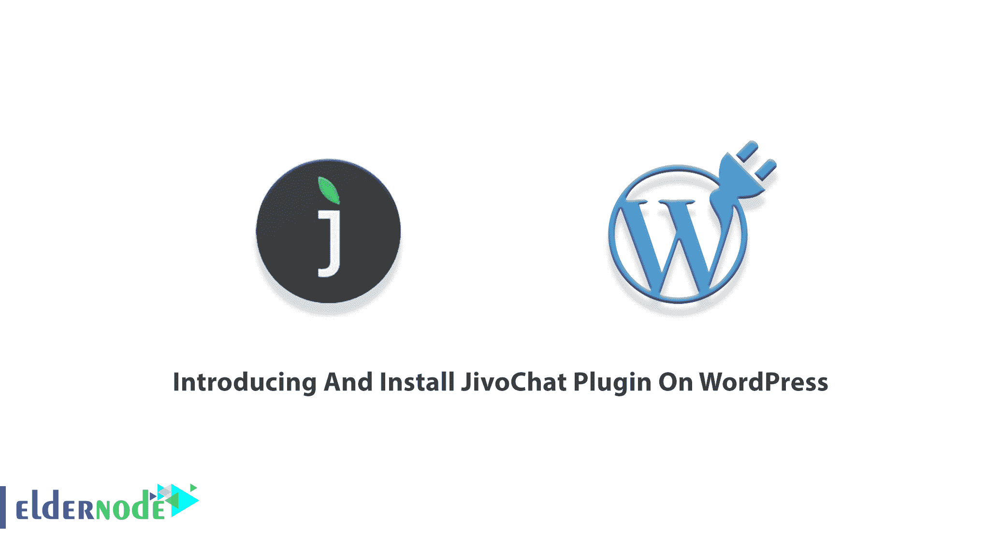
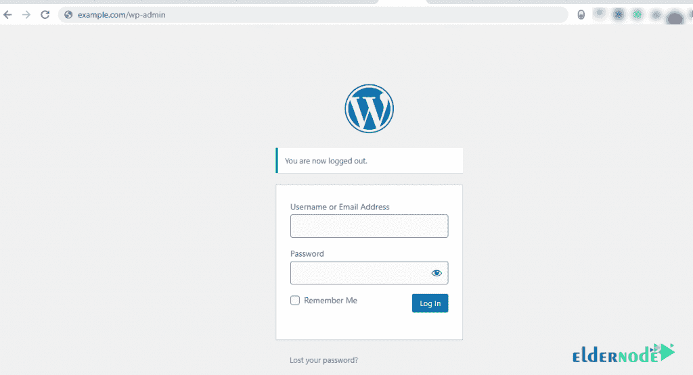
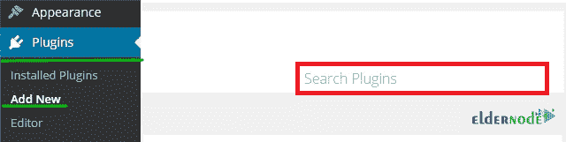
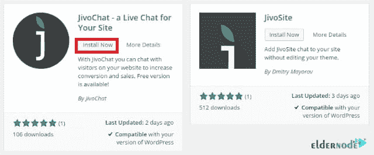
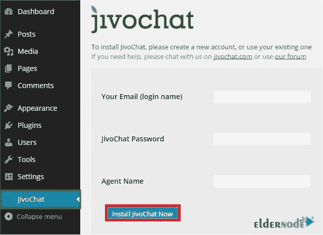

# 在 WordPress - Eldernode 上介绍并安装 JivoChat 插件

> 原文：<https://blog.eldernode.com/install-jivochat-plugin/>

如果你不想错过任何建立联系的机会，JivoChat 是一个为 WordPress 优化的商务信使。毫无疑问，你希望增加你的转换和销售。所以，开始和你的顾客交谈吧。使用 JivoChat，您可以为客户提供高效的客户支持。实时聊天、电话、电子邮件和社交媒体让您的客户随时随地与您保持密切联系。这篇文章是**在 WordPress** 上介绍和安装 JivoChat 插件。各种月度和年度托管计划可在 [Eldernode](https://eldernode.com/) 上获得。订购您自己的 [WordPress VPS](https://eldernode.com/wordpress-vps/) ，入住我们酒店。

## **介绍 JivoChat 插件**

JivoChat 是一个一体化的商务信使，可以节省您的金钱、时间和精力，将客户带到您的网站。由于大多数访问者可能没有购买或留下信息和电子邮件就离开了你的网站，你需要一个信使将他们转化为付费客户。最好是免费软件来定制和配置。你可以使用 JivoChat 作为一个单独的应用程序来连接你所有的沟通渠道。它可以让你实时联系你的访客。JivoChat 集成了 Weebly、Zapier、Pipedrive、Wix 等流行服务。接下来，你将会读到它的主要特性以及如何在 [WordPress](https://blog.eldernode.com/tag/wordpress/) 上**安装和使用 JivoChat。然后，你就可以在你的 WordPress 网站上使用你的聊天工具了。**

### **JivoChat 特性**

这个插件帮助你提供更好的客户服务。让我们回顾一下它的易用特性:

1- CMR 集成、API 和 Webhooks

2-文件传输

3-服务质量评级

4-离线销售线索生成器和离线消息

5-电子邮件聊天记录

6-黑名单

7-复试

8-多代理聊天

9-无限存档

10 人小组聊天

11-提醒

12-快速短语和固定回答

13-详细的访客信息

14-翻译

15- GeoIP 区域

16- 25 种支持的语言

## **如何在 WordPress** 上安装 JivoChat 插件

通过 JivoChat 为您的客户提供舒适和自信的体验，并在您的网站上创建一种高效和经济的方式来联系他们。让我们浏览一下本指南的步骤，看看 JivoChat 在 [WordPress](https://blog.eldernode.com/install-wordpress-on-iis/) 上的安装情况如何。

第一步:

第一步，你必须通过输入用户名和密码登录到 WordPress 仪表盘。

现在，你需要**在 WordPress 上安装并激活**这个插件。为此，你可以直接在 WP 插件页面打开插件并安装。但是让我们选择通过“搜索插件功能”安装插件的简单方法。沿着下面的路径找到它。

管理窗格 l > > **插件** > > **添加新的**。

一旦你搜索了 **JivoChat** 插件，你将面对两个可用的插件。选择第一个(JivoChat——你的网站的实时聊天),点击“**立即安装**,然后**激活**它。

第二步:

Jivochat 安装成功完成后，您必须创建一个**新的 JivoChat 帐户**或使用您自己的现有帐户。点击左边 WordPress 导航菜单上的“ **JivoChat** ”。然后，添加您的**登录凭证**，然后点击**立即安装 JivoChat】。**

一旦你看到“恭喜你！您已经成功地在您的网站上安装了 JivoChat”您可以确保 JivoChat 插件已成功安装。

结论

## 我们不希望您在安装时遇到严重的问题。JivoChat 可让您提高参与度并捕捉更多销售线索。如果你安装了这个插件，你将收获更多的销售，你将能够更快地解决你的客户的问题。最后，如果你渴望的话，你可以用自己专有的颜色和外观创建自己的定制部件。在这篇文章中，向您介绍了 JivoChat，您学习了如何在 WordPress 上安装 JivpChat。

We don’t expect you to encounter serious issues while the installation. JivoChat allows you to increase engagement and capture more leads. If you install this plugin, you will reap more sales and you will be able to solve the problems of your customers faster. Finally, if you are eager, it is possible to create your very own custom widget, with your own proprietary colors and looks. In this article, the JivoChat was introduced to you and you learned how to install JivpChat on WordPress.