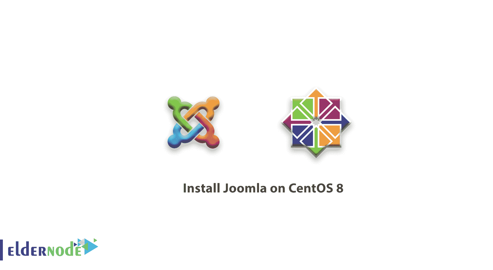

# 如何在 CentOS 8 上安装 Joomla-Joomla 安装

> 原文：<https://blog.eldernode.com/install-joomla-centos-8/>



你最近已经了解了[](https://eldernode.com/install-joomla-on-debian-10/)**。在这篇文章中，你将再次学习**如何在 CentOS 8** 上安装 Joomla。Joomla 是一个用 PHP 编写的流行的免费开源内容管理系统 ( **CMS** )。尽管它不像它的对手 **WordPress** 那样受欢迎，但它仍然被用于创建有限或没有网络编程知识的博客/网站。**

**它有一个简洁直观的 web 界面，易于使用，并包含许多可以用来增强网站外观和功能的附加组件，知道这一点很有用。**

#### **先决条件**

**由于 **Joomla** 是一个 **PHP** 平台，将在前端管理并存储数据，所以你需要在 CentOS 8 上安装一个 [灯栈。](https://eldernode.com/install-lamp-stack-on-centos-8/)**

## **如何在 CentOS 8 上安装 Joomla**

**加入我们，完成本指南的步骤，成为如何在 CentOS 8 上安装 Joomla 的专家。**

### **1-在 CentOS 8 安装 PHP 模块**

**一旦你把 [灯安装到位](https://eldernode.com/install-lamp-stack-on-centos-8/) ，你就可以开始安装一些额外的 **PHP** 模块，这对 **Joomla** 的安装至关重要。**

```
`sudo dnf install php-curl php-xml php-zip php-mysqlnd php-intl php-gd php-json php-ldap php-mbstring php-opcache` 
```

### 

****[购买 VPS 比特币](https://eldernode.com/bitcoin-vps/)****

### **2-创建 Joomla 数据库**

**当 PHP 模块安装完成后，您需要为 Joomla 创建一个数据库来保存文件。**

**启动 **MariaDB** 服务器并确认 **MariaDB** 服务器的状态:**

```
`sudo systemctl start mariadb  sudo systemctl status mariadb`
```

**您成功运行了服务器。现在登录到 **MariaDB** 数据库引擎:**

```
`mysql -u root -p` 
```

**然后，让我们在 MariaDB 数据库引擎中执行下面的命令，为 Joomla 创建一个数据库和一个数据库用户。**

```
`**MariaDB [(none)]>** CREATE DATABASE joomla_db;  **MariaDB [(none)]>** GRANT ALL ON joomla_db.* TO ‘joomla_user’@’localhost’ IDENTIFIED BY ‘[[email protected]](/cdn-cgi/l/email-protection)’;  **MariaDB [(none)]>** FLUSH PRIVILEGES;  **MariaDB [(none)]>** EXIT;`
```

### **3-下载 Joomla 安装包**

**这一步，进入 [Joomla 官网](https://downloads.joomla.org/cms)下载最新安装包。**

**运行以下命令下载压缩包:**

```
`sudo wget  https://downloads.joomla.org/cms/joomla3/3-9-16/Joomla_3-9-16-Stable-Full_Package.zip?format=zip` 
```

**接下来，将文件解压到 **/var/www/html** 目录。**

```
`sudo unzip Joomla_3-9-16-Stable-Full_Package.zip  -d /var/www/html` 
```

**现在，分配适当的文件权限和所有权。**

```
`sudo chown -R apache:apache /var/www/html/joomla  sudo chmod 755 /var/www/html/joomla` 
```

### **`4-为 Joomla 配置 Apache`**

**`让我们配置您的**Apache**web 服务器来服务 Joomla 的网页。为此，您必须创建一个虚拟主机文件。`**

```
``sudo /etc/httpd/conf.d/joomla.conf`` 
```

**`然后在下面添加几行。`**

```
``<VirtualHost *:80>     ServerAdmin [[email protected]](/cdn-cgi/l/email-protection)     DocumentRoot "/var/www/html/joomla"     ServerName joomla.example.com     ErrorLog "/var/log/httpd/example.com-error_log"     CustomLog "/var/log/httpd/example.com-access_log" combined    <Directory "/var/www/html/joomla">     DirectoryIndex index.html index.php     Options FollowSymLinks     AllowOverride All     Require all granted  </Directory>  </VirtualHost>`` 
```

**`现在您可以保存更改并退出文件。`**

**`要应用更改，请重新启动 Apache 服务器。`**

```
``sudo systemctl restart httpd`` 
```

**`至此，您差不多完成了配置。然而，你需要允许外部用户从我们的服务器访问 Joomla。为此，打开端口 **80** 和 **443** ，它们是 HTTP 和 HTTPS 端口。`**

```
``sudo firewall-cmd --permanent --add-service=http  sudo firewall-cmd --permanent --add-service=https``
```

**`重新加载防火墙以应用更改。`**

```
``sudo firewall-cmd --reload`` 
```

### **`5-敲定 Joomla 安装`**

**`最后也是唯一剩下的步骤是通过 web 浏览器完成安装。为此，请在 URL 栏中键入服务器的 IP 地址。`**

```
``http://server-IP``
```

**`然后你会看到下面的屏幕。`**

**``**

**`如您所知，您应该填写所有必要的详细信息，如站点名称、站点信息、管理员用户名和密码、电子邮件地址，然后单击“**下一步**”按钮。`**

**`然后你会看到这个网页会提示你的数据库详情。因此，提供数据库类型作为 **MySQL** ，并输入数据库名称、用户名和密码等其他细节。`**

**``**

**`然后点击“**下一个**按钮，让它将您带到要求您查看所有设置的页面。如果一切正常。点击“**安装**按钮。`**

**``**

**`接下来，你会得到一个通知，告诉你已经安装了 Joomla。`**

**``**

**`建议您删除安装文件夹以完成安装。因此点击“**删除安装文件夹**按钮，彻底清除安装目录。`**

**``**

**`现在，在地址栏中输入以下内容来访问 Joomla 控制面板。`**

```
``http://server-IP/administrator``
```

**`提供用户名和密码，点击 **登录** 按钮。还有 Joomla 的仪表盘！你现在可以开始创建令人惊叹的博客和网站。`**

**``**

**`**好样的** ！通过到达这里，你成功地完成了本教程。`**

**`亲爱的用户，我们希望这篇关于如何在 CentOS 8 上安装 Joomla 的教程能对你有所帮助，如果你有任何问题或想查看我们的用户关于这篇文章的对话，请访问 [提问页面](https://eldernode.com/ask) 。也是为了提高自己的见识，准备了这么多有用的教程给 [Eldernode 培训](https://eldernode.com/blog/) 。`**

**`**阅读更多:**`**

**`[如何在 Debian 10 中安装 own cloud](https://eldernode.com/install-owncloud-debian-10/)`**

**`[教程 PostgreSQL 安装 Ubuntu 20.04](https://eldernode.com/tutorial-postgresql-installation-ubuntu-20/)`**