# 如何在 debian 上安装 Joomla 10-在 Debian 上安装 Joomla

> 原文：<https://blog.eldernode.com/install-joomla-on-debian-10/>

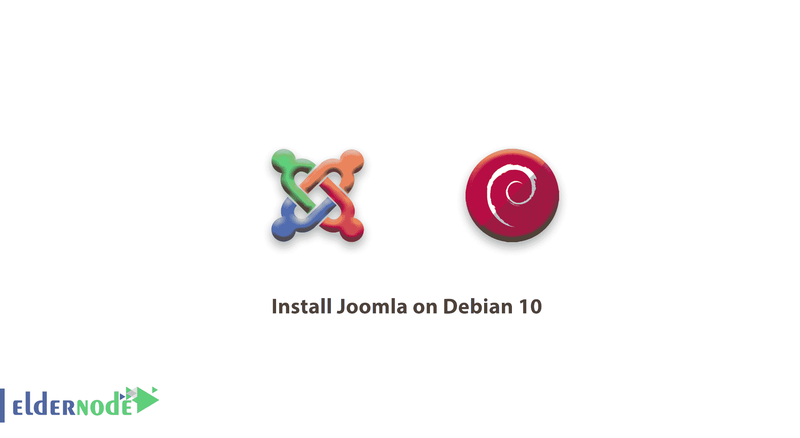

你可以寻找合适的软件来发布网页内容，在这篇文章中，你将学习如何在 Debian 10 上安装 Joomla。 Joomla 是一个免费的开源 CMS(内容管理系统),非常受欢迎，广泛用于创建很少或没有标记或 web 编程语言知识的网站。它有数以千计的免费扩展和模板，允许你定制你的网站，以满足你的特定需求，并配有大量的 **PHP** 代码、插件和主题，可以帮助你立刻从头开始

## 如何在 Debian 10 上安装 Joomla

让我们用的 6 个步骤来带你完成 **Joomla CMS** 的安装过程。

### 1-更新 Debian 系统软件包

通过运行下面的命令，您将把 **Debian** 系统更新到它们的最新版本。

```
sudo apt update -y && sudo apt upgrade -y      [[email protected]](/cdn-cgi/l/email-protection)-10:~$ sudo apt update -y && sudo apt upgrade -y  Hit:1 https://packages.sury.org/php buster InRelease  Hit:2 https://deb.debian.org/debian buster InRelease  Hit:4 https://dl.yarnpkg.com/debian stable InRelease  Hit:5 https://deb.debian.org/debian buster-updates InRelease  Hit:6 https://security.debian.org/debian-security buster/updates InRelease  Ign:3 https:// attic.owncloud.org/download/repositories/10.2.1/Debian-9.0  InRelease  Hit:7 https://download.owncloud.org/download/repositories/10.2.1/Debian-9.0  Release  Reading package lists... 0% 
```

[购买 Debian 虚拟私有服务器](https://eldernode.com/linux-vps/)

### `2-在 Debian 上安装灯栈`

`如果你已经安装了一个**灯**，你可以跳过这一步。你可以从安装 **Apache** web 服务器、 **PHP、**以及最后 [**MariaDB**](https://eldernode.com/mariadb-installation-on-debian-10/) 服务器开始。要安装 **Apache** ，请执行以下命令:`

```
`sudo apt install apache2 apache2-utils      [[email protected]](/cdn-cgi/l/email-protection)-10:~$ sudo apt install apache2 apache2-utils  Reading package lists... Done  Building dependency tree  Reading state information... Done  apache2 is already the newest version (2.4.38+deb10u3).  apache2-utils is already the newest version (2.4.38+deb10u3).  apache2-utils set to manually installed.` 
```

`然后启动并启用**Apache**web 服务器。`

```
`sudo systemctl start apache2`
```

```
`sudo systemctl enable apache2`
```

`使用下面的命令确保 Apache 服务器正在运行。`

```
`sudo systemctl status apache2`
```

``

`根据上面的输出，您可以清楚地看到 Apache webserver 已经启动并按预期运行。所以你只需要浏览你的服务器的 IP，如图所示。`

```
`http://server-IP`
```

`如果您的 web 服务器已经启动并运行，您应该会收到下面的确认信息。`

``

`现在你应该用 PHP 安装 **PHP 7.2，**这是一种服务器端的 web 编程语言，开发者用来设计动态网页。`

```
`sudo apt install libapache2-mod-php7.2 openssl php-imagick php7.2-common php7.2-curl php7.2-gd php7.2-imap php7.2-intl php7.2-json php7.2-ldap php7.2-mbstring php7.2-mysql php7.2-pgsql php-smbclient php-ssh2 php7.2-sqlite3 php7.2-xml php7.2-zip` 
```

``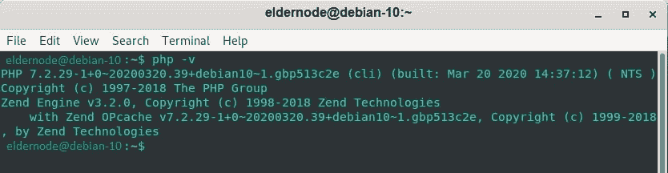``

``要安装 **MariaDB** ，请运行以下命令:``

```
``sudo apt install mariadb-server`` 
```

``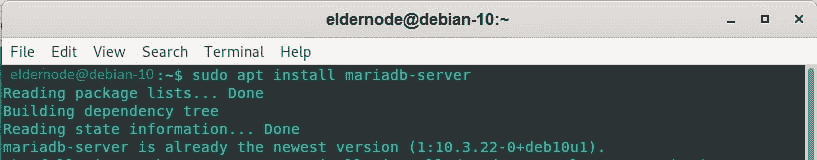``

``要加固服务器，请运行以下命令:``

```
``sudo mysql_secure_installation``
```

``当要求您输入 root 密码时，按键输入，然后按 Y 键设置 root 密码。``

``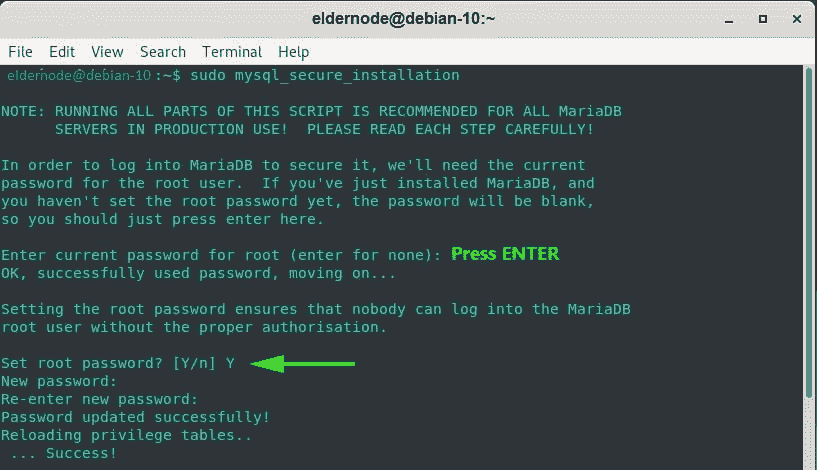``

``再次直到结束，只需键入‘Y’并按下**回车键**进行推荐设置。``

``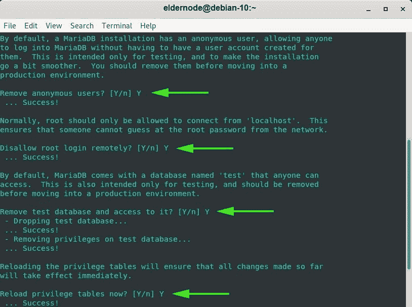``

``现在，您的数据库引擎是安全的。``

### ``3-创建 Joomla 数据库``

``您将为 Joomla 创建一个数据库，在安装期间和安装之后存储它的文件。要登录到 **MariaDB** 运行以下命令。``

```
 ``sudo mysql -u root -p``
```

``要创建 Joomla 数据库并授予数据库用户权限，请使用下面的命令。``

```
``**MariaDB [(none)]>** CREATE DATABASE joomla_db;  **MariaDB [(none)]>** GRANT ALL ON joomla_db.* TO ‘joomla_user’@’localhost’ IDENTIFIED BY ‘[[email protected]](/cdn-cgi/l/email-protection)’;  **MariaDB [(none)]>** FLUSH PRIVILEGES;  **MariaDB [(none)]>** EXIT;`` 
```

### ``4-在 Debian 下载 Joomla``

``这一步，你需要从[Joomla 官方网站](https://downloads.joomla.org/cms)下载 Joomla 的安装包。为此，请运行 wget 命令。``

```
``sudo wget https://downloads.joomla.org/cms/joomla3/3-9-16/Joomla_3-9-16-Stable-Full_Package.zip``
```

``然后，在 webroot 目录下新建一个目录**‘Joomla’**，如图所示。``

```
``sudo mkdir -p /var/www/html/joomla``
```

``现在，将压缩的 Joomla 文件解压到刚刚创建的**‘Joomla’**目录。``

```
``sudo unzip Joomla_3.19-16-Stable-Full_package.zip -d /var/www/html`` 
```

``接下来，更改权限并将目录的目录所有权设置为 Apache user。``

```
``sudo chown -R www-data:www-data /var/www/html/joomla  sudo chmod -R 755 /var/www/html/joomla``
```

``为 systemd 重新启动 Apache 服务器以使更改生效``

```
``sudo systemctl restart apache2``
```

### ``5-为 Joomla 配置 Apache``

``为 Joomla 创建一个虚拟主机文件，以配置 Apache webserver 来服务 Joomla web 页面。``

```
``sudo vim /etc/apache2/sites-available/joomla.conf`` 
```

``将以下配置粘贴到文件中并保存。``

```
``<VirtualHost *:80>     ServerName joomla.example.com      ServerAdmin [[email protected]](/cdn-cgi/l/email-protection)     DocumentRoot /var/www/html/joomla     <Directory /var/www/html/joomla>  	    Allowoverride all     </Directory>  </VirtualHost>`` 
```

``启用 Joomla 虚拟主机文件，禁用默认配置文件。``

```
``sudo a2dissite 000-default.conf  sudo a2ensite joomla.conf`` 
```

``然后重新启动 Apache webserver 服务，以使更改生效。``

```
``sudo systemctl restart apache2`` 
```

### ``6-在 Debian 中完成 Joomla 安装``

``现在你应该完成 Joomla 的安装。为此，启动您的浏览器并浏览您的服务器的 URL，如下所示。``

```
``http://server-IP/``
```

``若要继续，请确保您填写了所需的详细信息，如网站名称、电子邮件地址、用户名和密码。``

``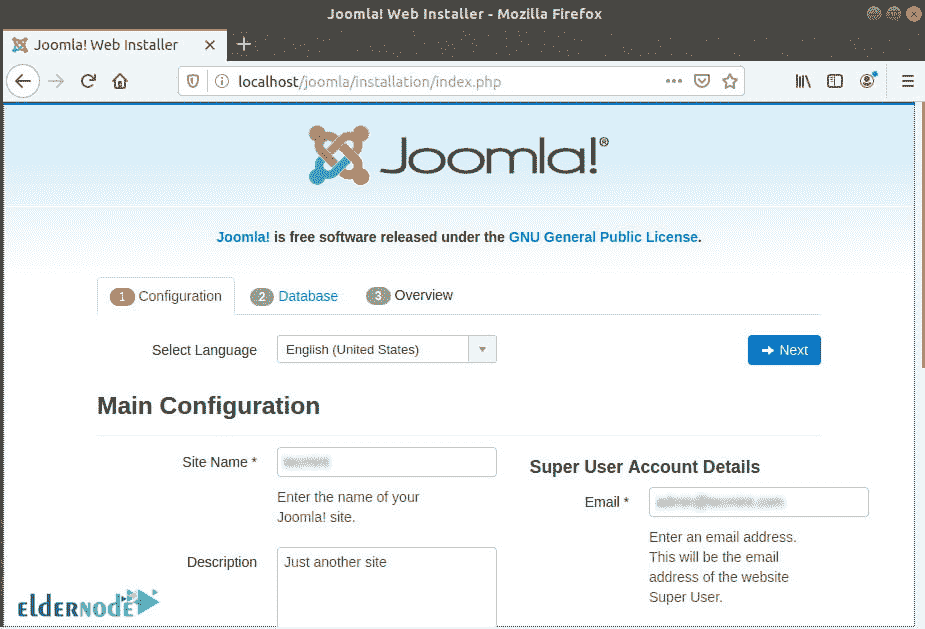``

``然后，点击下一个按钮的**。下一节将要求您填写之前为 Joomla 创建数据库时指定的数据库细节。这些包括数据库名称、数据库用户和密码。**``

``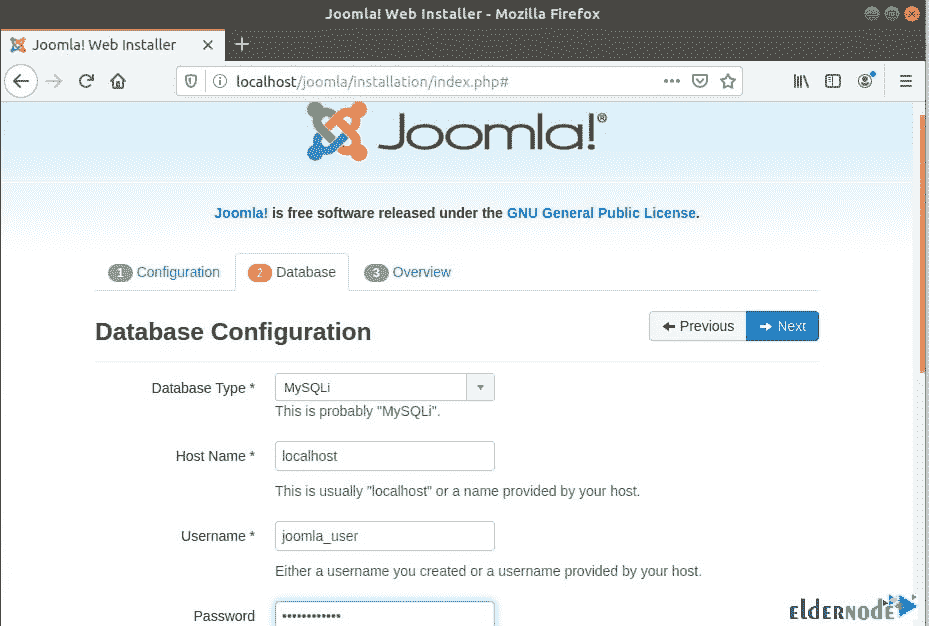``

``下一页将为您提供所有设置的概述，并允许您执行安装前检查。再次点击**下一个**``

``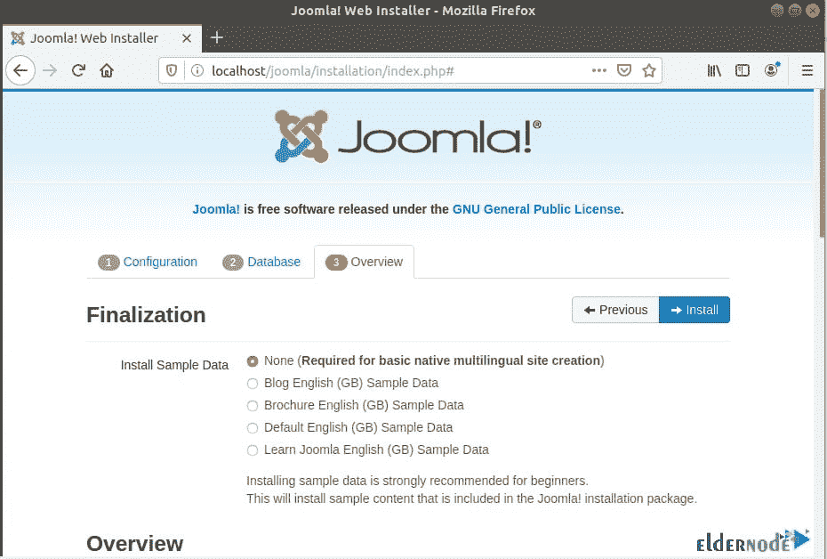``

``为了确保所有设置和已安装的软件包版本符合推荐的指南，向下滚动到'**安装前检查**和'**推荐设置**部分``

``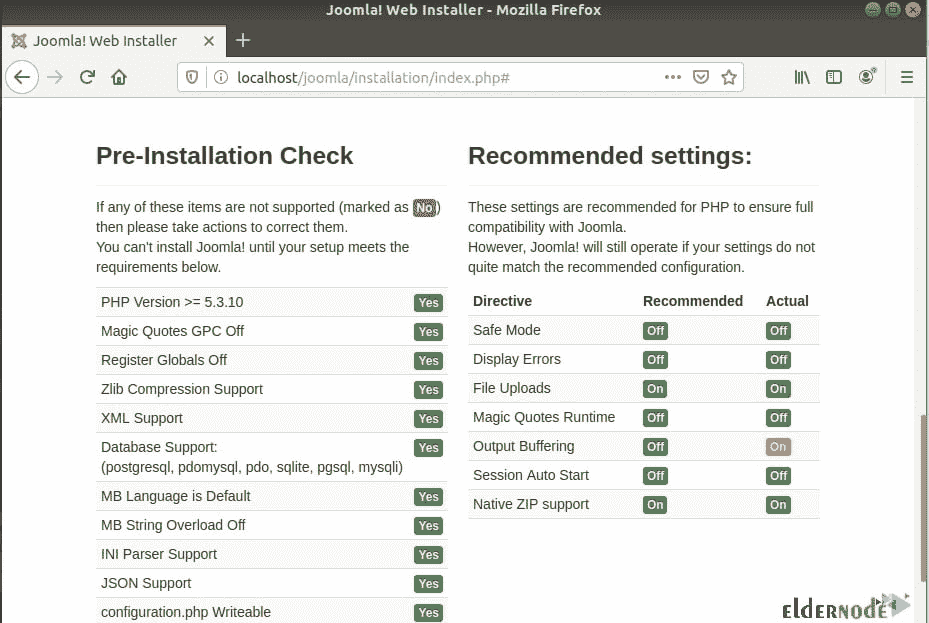``

``现在，要开始 Joomla 设置，请单击“**安装**按钮。当您收到下面的通知，这意味着 Joomla 已经安装。``

``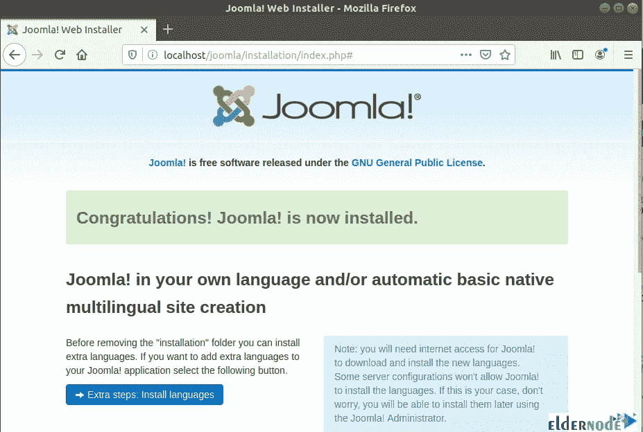``

``若要继续，您需要清除或删除安装文件夹。所以向下滚动并点击“**删除安装文件夹**按钮。``

``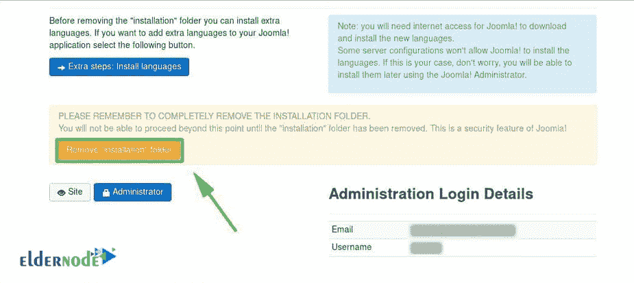``

``点击“**管理员**按钮，登录后端或仪表盘，进入登录页面。``

``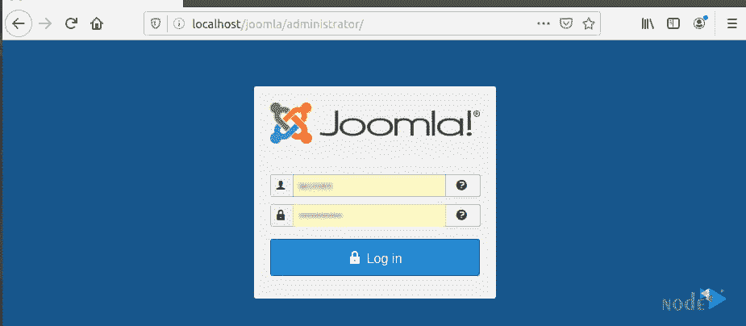``

``是时候提供你的用户名和密码了，点击“**登录**按钮进入 Joomla 的控制面板。``

``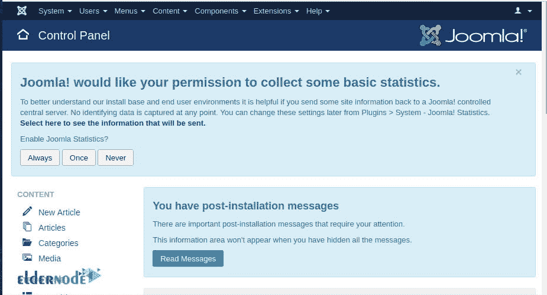``

``最后，至此，你已经在 **Debian 10** 上成功安装了 **Joomla** 。``

``亲爱的用户，我们希望这篇教程能对你有所帮助，如果你有任何问题或想查看我们的用户关于这篇文章的对话，请访问[提问页面](https://eldernode.com/ask)。也为了提高你的知识，有这么多有用的教程为[老年节点培训](https://eldernode.com/blog/)准备。``