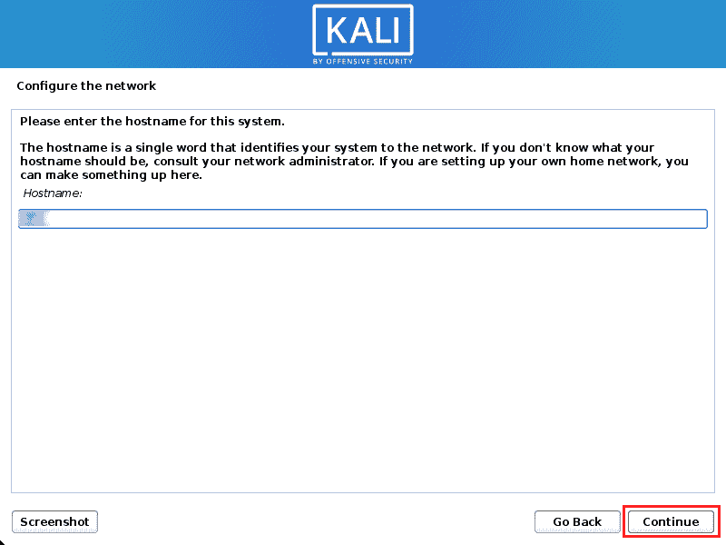

# 如何与 Windows - Eldernode Blog 一起安装 Kali Linux

> 原文：<https://blog.eldernode.com/install-kali-linux-alongside-with-windows/>


所有的 Linux 操作系统都有不同的发行版，并且由特定的公司发行和支持。Kali Linux 是一种 Linux 发行版。在这篇文章中，我们将教你如何安装 Kali Linux 以及 Windows VPS 或 Windows RDP。如果您需要购买一台 [**Windows VPS**](https://eldernode.com/windows-vps/) 服务器，您可以在 [Eldernode](https://eldernode.com/) 中查看可用的软件包。

## **教程将 Kali Linux 与 Windows VPS 一起安装**

### **什么是 Kali Linux？**

Kali Linux 是一个没有 GUI 环境的命令行系统，是基于 Debian 操作系统的最重要的 Linux 发行版之一。Kali Linux 用于高级渗透测试和安全审计，并使用 600 多种安全设备来防止任何黑客攻击和入侵。Kali Linux 软件由一家名为进攻性安全的安全公司生产，该公司在安全培训领域享有特殊的声誉。第一个 Kali Linux 发行版发布于 2012 年，是 Backtrack 的更新版本。

### **卡莉 Linux 的主要特性**

*   开源
*   免费下载
*   可定制的
*   多语言支持
*   大量工具的可用性

## **如何在 Windows 中下载 Kali Linux**

首先你要去 [Kali Linux 的官网](https://www.kali.org/get-kali/)选择你的平台。然后向下滚动找到可以下载 Kali Linux ISO 文件的 Live Boot 部分。Kali Linux ISO 文件可以在 USB 上引导。


现在点击实时启动部分，查看可用版本。然后你应该选择正确的版本，点击下载图标。我们会选择 64 位版本。


这一步，你要下载[通用 USB 安装程序](https://www.pendrivelinux.com/universal-usb-installer-easy-as-1-2-3/)。打开链接后，向下滚动并点击**下载 UUI** 。


现在以管理员身份打开通用 USB 安装程序。在第一部分中，您应该选择用于制作可引导 USB 的操作系统。在本教程中，我们将选择 Kali Linux。


现在，你应该选择你之前下载的 [Kali Linux](https://blog.eldernode.com/tag/kali-linux/) ISO 文件并点击**打开**。

然后，选择您的 USB 驱动器号。完成以上所有操作后，点击**创建**。

现在可启动 USB 进程将开始。这个过程大概需要半个小时。过程完成后，点击**关闭**。

在这一步中，您应该在硬盘上创建一个分区。通过使用所需的安装介质引导 Kali Linux 的实时会话，可以将分区调整到所需的大小。请注意，Kali Linux 将全部位于内存中，磁盘不会被使用。如果在 Windows 10 中不关闭快速启动，在调整分区大小时会出现错误。为此，您应该打开**控制面板**，选择**硬件和声音**，然后选择**电源选项**。在左侧，单击**选择电源按钮的功能，**然后在顶部单击**更改当前不可用的设置。**最后，您应该取消选择“打开快速启动”选项，并单击“保存更改”。

现在插入 Kali Linux 安装介质并打开设备电源。您应该会在启动菜单中看到一个新选项。根据制造商、硬件以及系统的配置和安装方式，您可能会看到更多选项。

在这一步中，您应该会看到下面的页面。在这种情况下，选择 Live 来引导 Kali Linux 默认桌面。


现在您应该启动 GParted，它可以缩小现有的 Windows 分区，给你足够的空间在空闲空间安装 Kali Linux。


GParted 打开后，你需要选择你的 [Windows](https://blog.eldernode.com/tag/windows/) 分区并调整大小，以留出足够的空间来安装 Kali Linux。通常，第二种选择是 Windows 分区。当然，这也取决于你的设置。我们有三个分区:

*   Windows 的引导分区(/dev/sda1)
*   Windows 的主操作系统(/dev/sda2)
*   Windows 的系统恢复分区(/dev/sda3)

如果您移动到另一个非白色分区，那么您正在编辑正在使用的分区。

确保只移除该区域中未使用的分区。您应该保留第三个分区(/dev/sda3)，并收缩实际安装(/dev/sda2)。


在调整 Windows 分区大小的最后，您应该应用硬盘上的所有操作。最后，退出 GParted 并重启系统。


## 在 Windows 旁边安装 Kali Linux】

1)您应该使用您选择的安装介质启动。现在在下面的 Kali Linux 启动屏幕中选择**图形化安装**。然后按**键进入**。


然后选择您想要的语言，将用于安装过程，并使用 Kali Linux。然后点击**继续**。


接下来，选择您的位置并点击**继续**。


选择你的键盘布局，点击**继续**。


在设置过程中，会探测网络连接并搜索 DHCP 服务。然后你需要为你的系统输入一个主机名，点击**继续**。



接下来，提供一个默认域名。


现在，您应该为系统创建用户帐户。为此，请输入您的全名、用户名和密码。


现在您应该设置您的时区，并点击**继续**。


你应该选择**“引导–使用最大连续空闲空间”**而不是“引导–整个磁盘”。空闲空间是在上一步中用 GParted 创建的。然后点击**继续**。


最后，您应该会看到一个 GRUB 引导菜单，允许您引导到 Kali Linux 或 Windows。


如果 Windows 和 Linux 系统之间的时间发生变化，您可以执行以下操作:

```
[[email protected]](/cdn-cgi/l/email-protection):~$ timedatectl set-local-rtc 1 --adjust-system-clock
```

```
[[email protected]](/cdn-cgi/l/email-protection):~$
```

要撤消此操作，您可以:

```
[[email protected]](/cdn-cgi/l/email-protection):~$ timedatectl set-local-rtc 0 --adjust-system-clock
```

```
[[email protected]](/cdn-cgi/l/email-protection):~$
```

## 结论

在本文中，我们教你如何在 Windows 上安装 Kali Linux。在 Windows 安装旁边安装 Kali Linux 有它的好处。我希望这篇教程对你有用。如有疑问，可在评论中联系我们。