# 教程在 MacOS 上安装 Kali Linux

> 原文：<https://blog.eldernode.com/install-kali-linux-on-macos/>

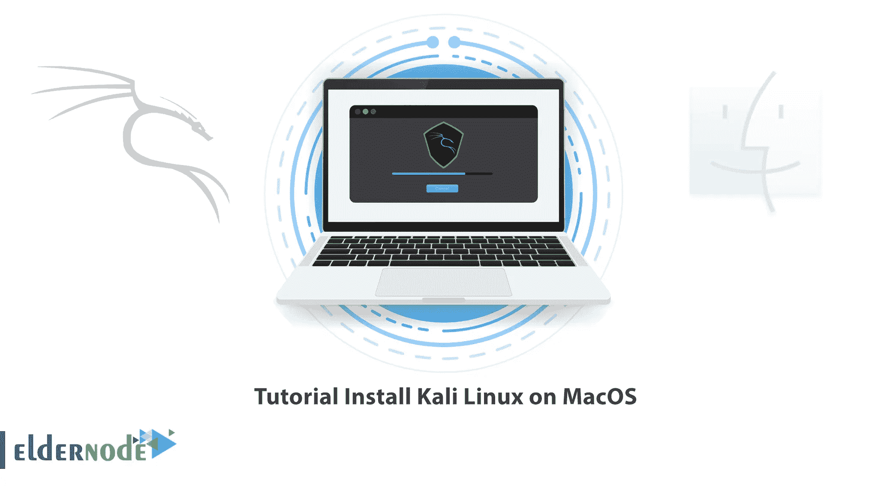

Mac 操作系统使用基于 ARM 的架构，并且不在本地支持 Kali Linux。但是你可以在使用 M1、M1 和 M1 处理器的 Mac OS 上安装 Kali Linux。本文将教你如何在 MacOS 上安装 Kali Linux。如果你打算购买自己的 [VPS](https://eldernode.com/vps/) 服务器，你可以查看 [Eldernode](https://eldernode.com/) 网站上提供的软件包。

## **用最好的方法在 MacOS 上安装 Kali Linux**

Linux 有数百种不同的发行版，每一种都有自己的特性。 [Kali Linux](https://blog.eldernode.com/tag/kali-linux/) 是 Linux Debian 衍生的一个发行版，设计开发的目的是执行渗透测试和识别漏洞。这个强大的操作系统具有非常高的渗透能力，所有在黑客和安全领域工作的人都应该完全熟悉这个操作系统及其各种工具。

### **在 MacOS 上下载 Kali Linux**

首先，导航至 Kali Linux 官网[下载 Kali Linux 安装程序](https://www.kali.org/get-kali/#kali-installer-images)图片:

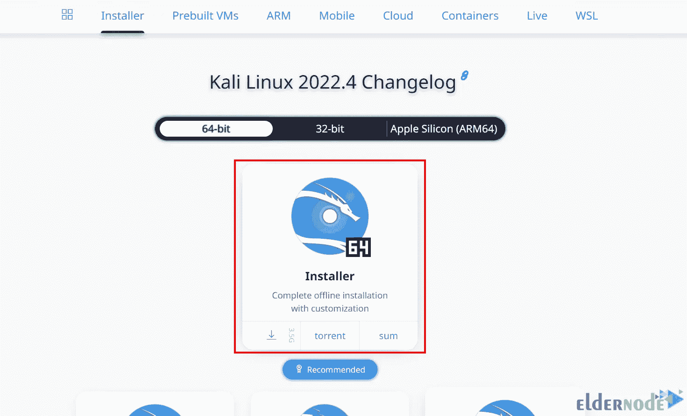

从 GPG 官方网站为您的平台安装适合 GPG 的版本。为此，点击**下载**:

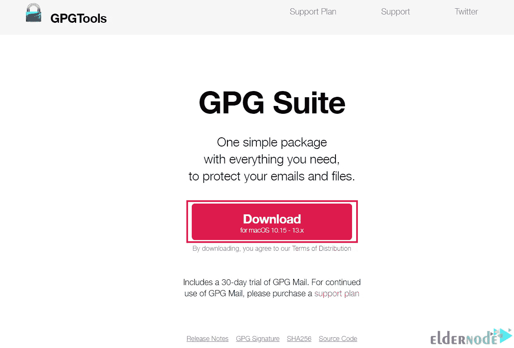

安装完成后，使用以下命令下载并导入一份 [Kali Linux](https://blog.eldernode.com/tag/kali-linux/) 官方密钥:

```
wget -q -O - https://archive.kali.org/archive-key.asc | gpg --import
```

现在运行下面的命令来验证密钥安装:

```
gpg --fingerprint 44C6513A8E4FB3D30875F758ED444FF07D8D0BF6
```

在此步骤中，您应该通过从下载的 ISO 映像生成 SHA256 校验和来验证下载的 ISO 文件。为此，请运行以下命令:

```
shasum -a 256 kali-linux-2022.3-live-amd64.iso
```

### **调整 MacOS 程序大小**

你需要在硬盘上分配空间。如果你使用 macOS/OS X 塞拉(10.12)较早，这将是 macOS 扩展(HFS+)。可以通过 Kali Linux 实时会话中的 GParted 来调整 mac 的大小。

但如果你使用的是 macOS/OS X High Sierra (10.13)及更高版本，默认将是苹果文件系统(APFS)。可以在正常的 macOS/OS X 会话或恢复模式下调整 mac 的大小。

#### **HFS+/GParted**

在做任何事情之前，插入您的 Kali Linux 安装介质并在设备上加电。然后按住 **Alt** 键打开引导菜单。

现在，您应该看到启动许多两个卷，这是 EFI 启动和 Windows。EFI Boot 是支持 UEFI 的新硬件，通常用于 GUID 分区表分区。但是 Windows 是非 EFI 引导，使用 BIOS 的旧硬件使用它。

因此，选择 EFI 引导卷:

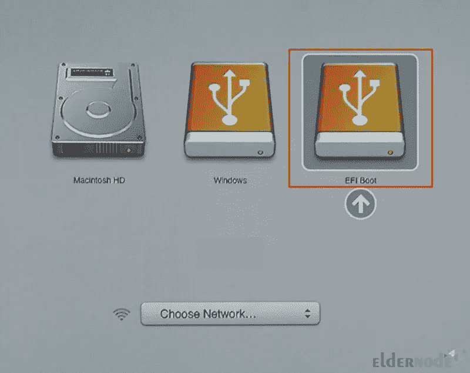

***注意:*** 如果安装挂起，应该重新开机，选择 Windows。

将出现 Kali Linux 引导屏幕。选择 Live 以引导至 Kali Linux 默认桌面:

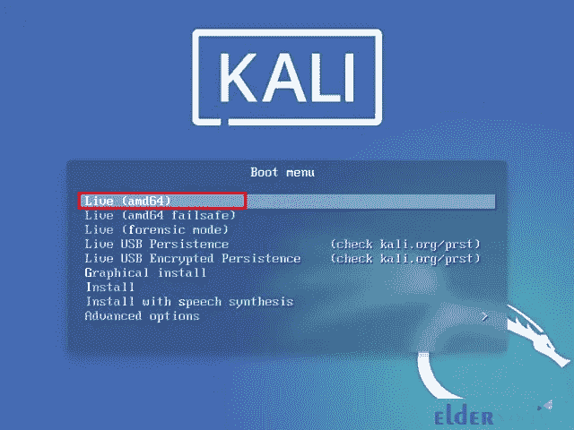

然后在搜索栏中键入 GParted 来启动它。GParted 允许您缩小现有的 macOS/OS X 分区，以便在空闲空间中提供足够的空间来安装 Kali Linux:

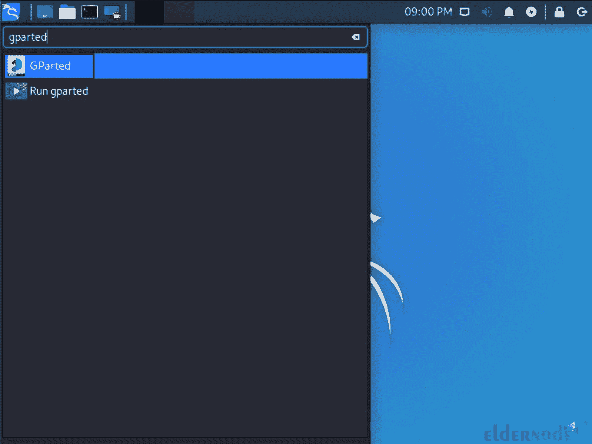

GParted 打开后，你应该选择你的 macOS/OS X 分区，并调整它的大小，以留出足够的空间来安装 Kali Linux。请记住，第二个选项通常具有最大的分区:

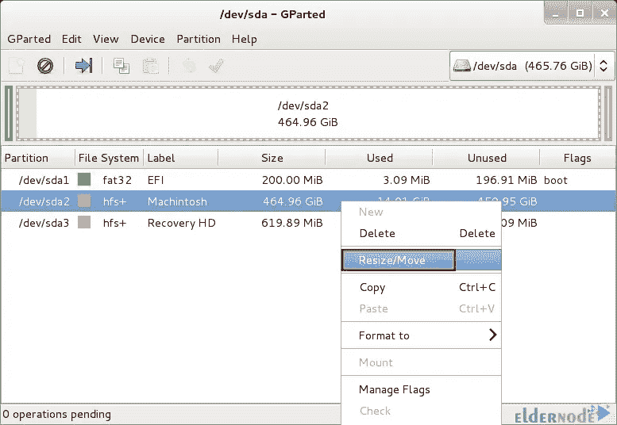

最后，您应该应用硬盘上的所有操作，并在退出 GParted 后重新启动系统。

#### **【APFS】/恢复**

您可以使用命令行和磁盘工具来调整 MacOS 程序的大小。这两个选项都支持在“正常”会话中调整大小，或者引导到恢复模式。在恢复模式下，驱动器将不使用，命令行选项将允许创建空分区。

导航到**聚光灯> >终端**路径以访问命令行。

若要查看您想要调整大小的磁盘列表:

```
diskutil list
```

您可以将 500GB 减少到 400GB，使 Kali Linux 达到 100GB，如下所示:

```
sudo diskutil apfs resizeContainer disk0s2 400g
```

再次检查列表以查看它是否成功:

```
diskutil list
```

## **在 MacOS 上安装 Kali Linux**

首先，按住 **Alt** 打开引导菜单。

然后选择“**导向-使用最大的连续自由空间**”:

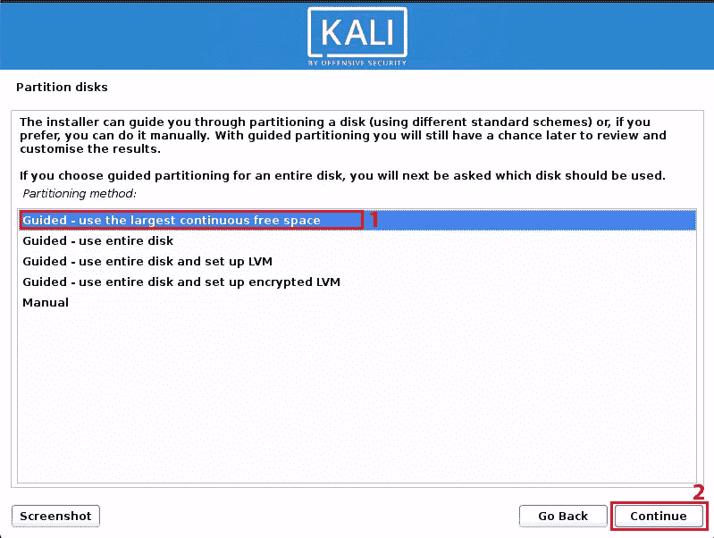

安装完成后，重新启动系统。默认情况下，macOS/OS X 会自动启动。

现在再次按住 **Alt** 打开启动菜单。然后输入 **rEFInd** 作为替换引导管理器:

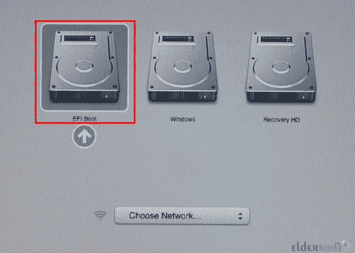

### **安装 rEFInd**

rEFInd 是一个引导管理器，可以在安装 Kali Linux 之前或之后安装，也可以从 macOS/OS X 或 Kali Linux 安装。这取代了 macOS/OS X 的限制性默认设置，并允许更多的选项。

注:如果您使用的是 macOS/OS X EI Capitan (10.11)，您需要一次性绕过或禁用系统完整性保护(SIP)来安装使用 macOS/OS X 的 rEFInd

#### **使用 MacOS 安装 rEFInd**

rEFInd 在恢复模式下可用的空间和工具/库有限，因此您不能在恢复模式下轻松下载它。在正常的 macOS/OS X 会话中下载 rEFInd，然后重启到恢复模式进行安装。

要**下载 rEFInd** ，只需运行以下命令:

```
curl -s -L https://sourceforge.net/projects/refind/files/0.12.0/refind-bin-0.12.0.zip -o ~/Downloads/refind.zip
```

输入以下命令检查 rEFInd 的有效 zip 文件:

```
file Downloads/refind.zip
```

提取下载的文件:

```
unzip -q -d Downloads/ Downloads/refind.zip
```

重启你的 MacOS，同时按下**命令(⌘)** 和 **R** 键打开开机 logo。如果您有固件密码，您应该输入它以继续。

使用固件内置的 macOS/OS X 恢复系统版本将绕过 SIP。

下载完成后，进入**实用程序> >终端**路径:

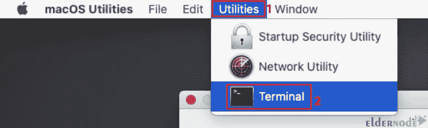

提取的文件夹路径基于硬盘和 rEFInd 的用户名和版本，路径会有所不同。然后使用以下命令打开提取的文件夹:

```
cd /Volumes/Macintosh\ HD/Users/username/Downloads/refind-bin-0.12.0/
```

```
pwd
```

现在运行 shell 脚本 refind-install:

```
./refind-install
```

接下来进入**苹果>重启**菜单重启 macOS:

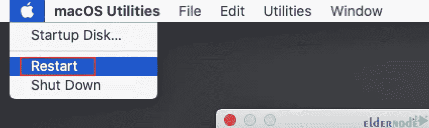

重新启动后，将出现新的启动管理器。

#### **使用 Kali Linux** 安装 rEFInd

也可以用 Kali Linux 安装 rEFInd。为此，只需运行以下命令:

```
sudo apt update
```

```
sudo apt install -y refind
```

在安装过程中，您将得到一个自动运行 rEFInd 的提示。您可以按“是”或稍后运行以下命令:

```
sudo dpkg-reconfigure refind
```

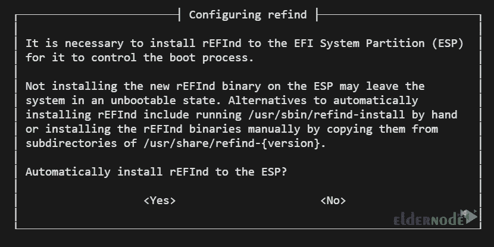

重新启动后，您应该会看到新的 rEFInd 引导管理器。

### **在 MacOS 上配置 rEFInd**

以下是改变 rEFInd 的各种方法:

–>默认操作系统选择

–>菜单选择超时

–>直接引导至默认操作系统

–>添加自定图标/主题

### **refind . conf**

您可以通过编辑 rEFInd 的配置文件进行上述任何更改。在 macOS/OS X EI Capitan 或更高版本中，使用以下命令挂载 EFI 引导卷以访问该文件:

```
cd ~/Downloads/refind-bin-*/
```

```
sudo ./mountesp
```

```
vim /Volumes/ESP/EFI/refind/refind.conf
```

在 macOS/OS X Yosemite (10.10)或更早版本中，配置文件位于以下路径，不需要挂载:

```
sudo vim /EFI/refind/refind.conf
```

Kali Linux 中的配置文件位于以下位置:

```
sudo vim /boot/efi/EFI/refind/refind.conf
```

就是这样！

## 结论

Kali Linux 是基于 Debian 的 Linux 发行版，它执行渗透测试并识别易受攻击的点。在本文中，我们教你如何在 MacOS 上安装 Kali Linux。我希望这篇教程对你有用，并帮助你在 Mac 操作系统上成功安装 Kali Linux。如果你在安装过程中遇到任何问题，你可以在评论区联系我们。