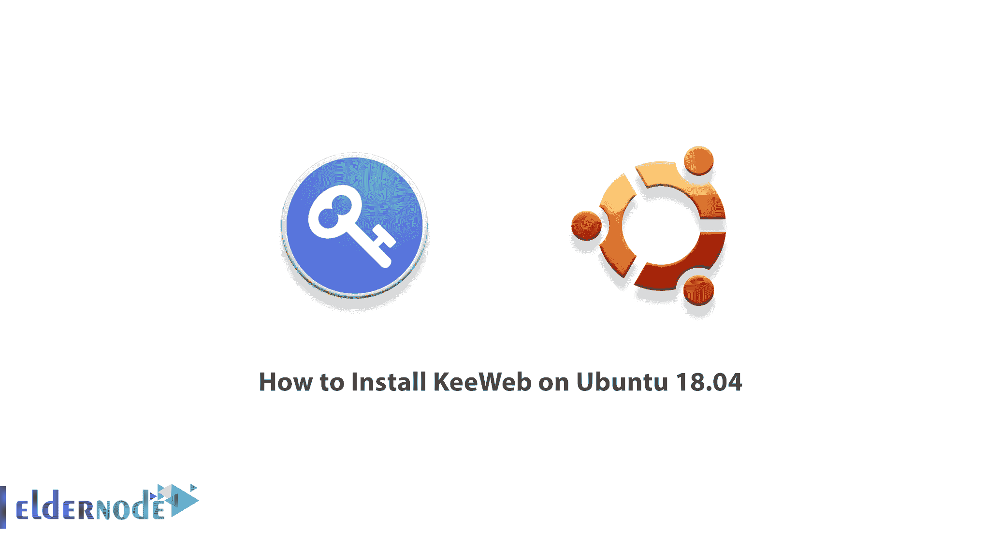
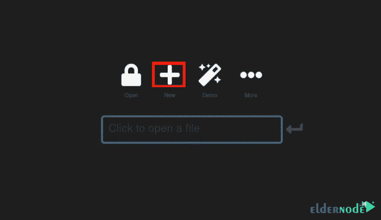
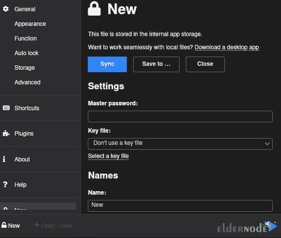
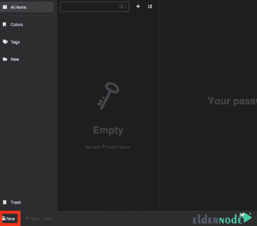

# 如何在 Ubuntu 18.04 - Eldernode 博客上安装 KeeWeb

> 原文：<https://blog.eldernode.com/install-keeweb-on-ubuntu-18-04/>



像 KeeWeb 这样的密码管理软件还有很多，每一款都试图让你的生活变得更简单。这个软件保证你的个人信息是安全的。KeeWeb 是一个应用程序，使您能够打开，浏览和编辑 KeePass 数据库文件。KeeWeb 作为 Github 支持的 Web 应用程序，允许您在桌面上脱机使用 KeePass 数据库，而不必在浏览器中打开它们。另一方面，KeeWeb 可以创建新的数据库，也可以通过 Dropbox 帐户同步数据。在这篇文章中，我们将教你如何在 Ubuntu 18.04，Ubuntu 20.04 上安装 KeeWeb。需要注意的是，你可以访问 [Eldernode](https://eldernode.com/) 中可用的包来购买一台 **[Ubuntu VPS](https://eldernode.com/ubuntu-vps/)** 服务器。

## **教程在 Ubuntu 18.04 上安装 KeeWeb【完整】**

KeeWeb 是查看和编辑 KeePass 密码数据库的一个很好的选择。这款软件拥有漂亮的用户界面，可以离线工作，并提供使用 [Dropbox](https://blog.eldernode.com/dropbox-on-linux-ubuntu-20-10/) 云服务的能力。在下一节，我们将提到 KeeWeb 的特性，然后我们将教你如何在 [Ubuntu](https://blog.eldernode.com/tag/ubuntu/) 18.04 上安装 KeeWeb。请加入我们。

### **KeeWeb 功能**

在本节中，我们将介绍 KeeWeb 的 6 个最重要的功能:

1-保存和使用密码的能力

2-在数据库中查找帐户、密码、用户名和其他个人信息

3-注册新用户时生成安全密码

4-将所有密码存储在便携式设备上

5-从备份副本恢复数据库

6-保护密码免受未经授权的访问

## **在 Ubuntu 18.04 上安装 KeeWeb | Ubuntu 20.04**

在这一节中，我们将向您展示如何在 Ubuntu18.04 的 [**版本上安装 KeeWeb。请注意，第一步是更新您的系统软件包。为此，请运行以下命令:**](https://blog.eldernode.com/install-keeweb-on-ubuntu-18-04/)

```
sudo apt update
```

```
sudo apt-get install apt-transport-https git ca-certificates curl software-properties-common gnupg2 unzip
```

然后在下一步，你需要安装 **docker 依赖包**。注意，要安装 Docker，您必须首先使用以下命令将 Docker 存储库密钥添加到您的系统中:

```
curl -fsSL https://download.docker.com/linux/ubuntu/gpg | sudo apt-key add -
```

```
sudo apt-key fingerprint 0EBFCD88
```

现在使用下面的命令添加一个**稳定的 Docker 存储库**:

```
sudo add-apt-repository "deb [arch=amd64] https://download.docker.com/linux/ubuntu $(lsb_release -cs) stable"
```

在此步骤中，您必须使用以下命令安装 **Docker CE** :

```
sudo apt-get install docker-ce
```

成功安装 Docker 后，现在必须运行以下命令来确认 **Docker 版本**:

```
docker -v
```

请注意，如果您想以非根用户**的身份运行 Docker，您必须将您的帐户添加到 Docker 组。为此，您只需执行以下命令:**

```
`sudo usermod -aG docker $USER`
```

```
`sudo chmod 666 /var/run/docker.sock`
```

****重启**您的系统以应用更改:**

```
`sudo systemctl restart docker`
```

**成功完成上述步骤后，我们现在开始安装 KeeWeb。运行以下命令**从 git 下载最新版本的 KeeWeb 包**:**

```
`git clone https://github.com/SvenC56/docker-keeweb.git`
```

**现在您需要使用以下命令**下载所有需要的 Docker 包**:**

```
`cd docker-keeweb`
```

```
`docker build -t svenc56/keeweb .`
```

```
`docker images`
```

**在下一步中，您应该从下载的图像中为 KeeWeb 创建一个容器。然后使用以下命令在端口 80 上公开它:**

```
`docker run -d -p 80:80 svenc56/keeweb`
```

**最后，您可以使用以下命令来确认正在运行的容器:**

```
`docker ps`
```

### ****如何在 Ubuntu 18.04 上访问和使用 KeeWeb****

**在前面的步骤中，您已经能够在 Ubuntu 18.04 系统上成功安装 KeeWeb。在这一步，我们将教你如何访问和使用 KeeWeb。要访问 KeeWeb 仪表板，您可以打开您最喜欢的 Web 浏览器，然后转到服务器名称或 IP 地址。**

****

**打开上面的页面后，点击 **+** 图标向**添加一个新的密码文件**。**

****

**现在您可以点击底部的**新建**到**创建一个新的文件**条目:**

****

## **结论**

**KeeWeb 是一个新的软件，可以让你在一个美丽的环境中生成复杂而强大的密码。因此，您可以在该软件中输入与您的许多服务和帐户相关的密码，并且只需输入密码进入 KeeWeb 软件环境，您就可以访问您的所有密码。在这篇文章中，我们试图教你如何在 Ubuntu 18.04 上安装 KeeWeb。**