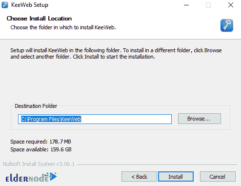

# 如何在 Windows - Eldernode 博客上安装 KeeWeb

> 原文：<https://blog.eldernode.com/install-keeweb-on-windows/>

有许多密码管理软件，每一个都试图让你的生活更轻松，同时确保你的个人信息是安全的。KeeWeb 是一个应用软件，使您能够打开、浏览和编辑 KeePass 数据库文件。KeeWeb 作为 Github 支持的 Web 应用，可以让你在桌面上让 KeePass 数据库离线，而不必在浏览器中打开。另一方面，KeeWeb 可以创建新的数据库，并通过 Dropbox 帐户同步数据。在这篇文章中，我们将一步一步地教你如何在 Windows 上安装 KeeWeb。如果你想买一个 [**Windows VPS**](https://eldernode.com/windows-vps/) 托管服务器，你可以在 [Eldernode](https://eldernode.com/) 看到可用的软件包。

## **教程在 Windows 上安装 KeeWeb**

KeeWeb 是查看和编辑 KeePass 密码数据库的一个很好的替代选择，它有一个漂亮的用户界面，可以离线工作，并允许你使用 Dropbox 云服务。

在这篇文章的续篇中，加入我们来教你如何在 [Windows Server](https://blog.eldernode.com/tag/windows/) 2012，2019，2016 上安装 KeeWeb。

### **KeeWeb 功能**

KeeWeb 软件最重要的功能:

–能够保存和使用密码

–在数据库中查找帐户、密码、用户名和其他个人信息

–注册新用户时生成安全密码

–将所有密码存储在便携式设备上

–从备份副本恢复数据库

–保护密码免受未经授权的访问

## **在 Windows 2012、2016、2019 上安装 KeeWeb**

在前面几节中熟悉了 KeeWeb 及其特性之后，我们现在转向如何在 Windows 上安装 KeeWeb。为此，只需遵循以下步骤。

第一步是访问 [KeeWeb 网站](https://keeweb.info/)。然后点击**下载 KeeWeb for Windows** 开始下载文件。

要安装 KeeWeb，你需要到你下载文件的地方。然后双击它。在打开的窗口中，点击**运行**。

点击**下一步**继续安装 KeeWeb。

在下一步中，您需要指定**目标文件夹**来安装 KeeWeb，然后点击**安装**。

*

最后，点击**完成**完成 KeeWeb 安装。

下一步，我们将教你如何使用这个软件。

### **如何在 Windows 10 上使用 KeeWeb**

成功安装 KeeWeb 后，您可以从**桌面**或通过搜索**开始菜单**来访问它。

在打开的窗口中，点击 **+** 符号，开始添加一个**新密码**文件。

下一步，点击左下方的“**新建**”。然后提供**主密码**，**名字**，**备份**如果你需要的话，以及你可能需要的其他设置。

*

完成所需设置后，点击“**保存至**”。需要注意的是，你会选择保存到一个文件或者与 **Dropbox** 、 **OneDrive、**和 **Google drive** 等**云存储**集成。

请注意，添加后，您的新密码文件将出现在 KeeWeb 应用程序的左侧。

您现在只需点击 **+** 即可开始添加内容，然后选择输入。

## 结论

处理在线服务时，密码管理非常重要。您需要能够记住密码，但最重要的是确保密码是安全的。使用 KeeWeb，您可以保证强密码的安全。在本文中，我们试图一步一步地教你如何在 Windows 上安装和使用 KeeWeb。