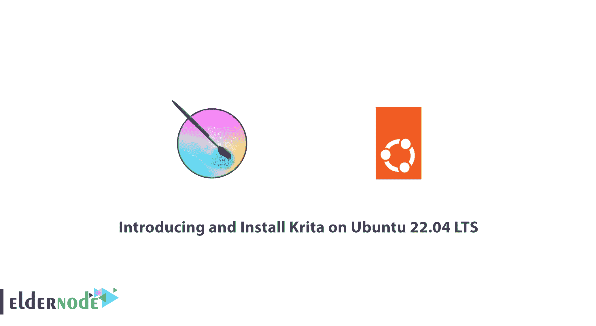
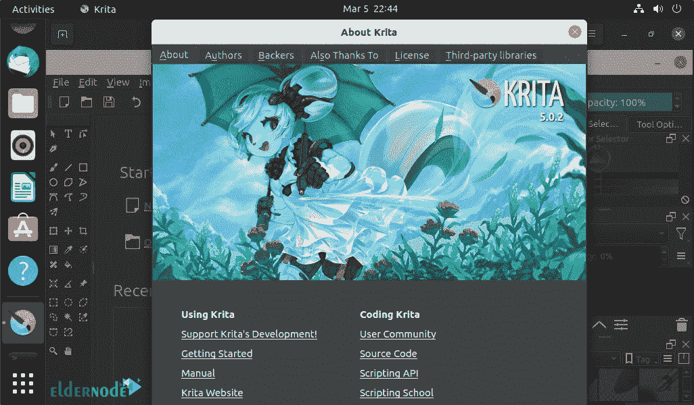

# 在 Ubuntu 22.04 上介绍和安装 Krita LTS-elder node 博客

> 原文：<https://blog.eldernode.com/install-krita-on-ubuntu-22-04/>



Krita 是一个新的图像编辑软件，以最好和最快的方式做到这一点。Krita 是 Photoshop 的强大竞争对手，你可以用你的创造力创造独特的图片。在本文中，我们将介绍 Krita 及其特性，然后您将了解如何在 Ubuntu 22.04 LTS 版上安装 Krita。如果您想购买一台 [**Ubuntu VPS**](https://eldernode.com/ubuntu-vps/) 服务器，我们建议您访问 [Eldernode](https://eldernode.com/) 网站上提供的软件包。

## 教程在 LTS Ubuntu 22.04 上安装 Krita

### **什么是 Krita？**

大多数电脑用户都熟悉 Photoshop。一个非常强大的图像编辑软件，任何人都可以使用它来创建独特的效果。但是一段时间以来，这个软件已经找到了一个叫 Krita 的竞争者。大多数用户认为所有的平面设计都是完全在 Photoshop 中完成的，但事实是，还有其他比 Photoshop 更有创意但没有得到太多关注的强大软件。Krita 软件是这些用于绘画、绘图和编辑图像的创造性工具之一。

Krita 是一个强大的数字绘画工具，旨在通过其工具包增强用户的创造力。这个程序的黑色界面完全是现代的。此外，Krita 主窗口包含几乎所有绘图和绘画所需的工具。插画师、艺术家、漫画家、计算机图形艺术家甚至游戏设计艺术家都可以使用这个软件。

### **克里塔**的重要特征

–>拥有完整的编辑、绘图和绘画工具

–>支持图像中的颜色校正工具

–>有分层系统，如 Photoshop

–>支持常见视频格式


## **如何在 Ubuntu 22.04 上安装 Krita LTS**

首先，运行以下命令**更新已安装的软件包**:

```
sudo apt update
```

```
sudo apt upgrade
```

要从官方的 [Ubuntu](https://blog.eldernode.com/tag/ubuntu/) 库安装最新版本的 Krita ，运行以下命令:

```
sudo apt install krita
```

安装完成后，在**应用启动器**中搜索 **Krita** 软件。然后点击程序图标运行它:



运行以下命令**更新**和**升级**软件:

```
sudo apt update
```

```
sudo apt upgrade
```

如果你不再需要 Ubuntu 上的 Krita，你可以用下面的命令**卸载**这个程序:

```
sudo apt-get remove --auto-remove krita
```

## 结论

要开始在 Ubuntu 的世界中绘画，Krita 是一个伟大的程序，它允许你用数千种工具进行数字绘画。在本文中，您将熟悉 Krita 的特性，然后学习如何在 Ubuntu 22.04 LTS 版上安装 Krita。