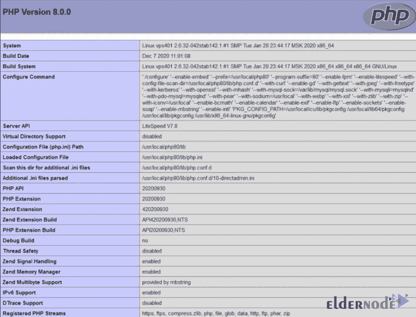

# 如何在 Debian 10 - ElderNode 博客上安装 LAMP

> 原文：<https://blog.eldernode.com/install-lamp-debian-10/>


[更新]LAMP(Linux、Apache、MariaDB、PHP)堆栈是一组流行的开源软件，通常安装在一起以使服务器能够托管动态网站和 web 应用程序。每一层都代表了堆栈的一个基本层，它们一起可以创建一个数据库驱动的动态网站。Linux 是操作系统，Apache 是 HTTP 服务器，MariaDB 是数据库管理系统，PHP 是编程语言。在这篇文章中，你将学习如何在 Debian 10 上安装 LAMP。要购买自己的 **[Linux VPS](https://eldernode.com/linux-vps/)** ，看看 [Eldernode](https://eldernode.com/) 上可用的软件包，买下你考虑的所有东西。

## **教程在 Debian 10 上逐步安装 LAMP**

为了帮助 web 应用程序工作，LAMP Stack 必须包括操作系统、web 服务器、数据库和编程语言。在本教程中，我们使用 [Mariadb](https://eldernode.com/mariadb-installation-on-debian-10/) 作为数据库管理系统。让我们执行以下步骤来开始并完成安装。和我们一起阅读这个指南，预览在 Debian 10 上安装 LAMP 的必要步骤。

### **在 Debian 10 Linux 上安装 LAMP 的先决条件**

如果您知道以下内容，本教程可能会更有用:

_ 拥有 Sudo 权限和配置有 ufw 防火墙的非 root 用户。

_ 要设置，请按照 Debian 10 的[初始设置](https://eldernode.com/initial-setup-with-debian-10/)

### **如何安装 Apache 并更新防火墙**

由于 Apache 是世界上最流行的 web 服务器之一，我们选择它来托管网站。

首先，你需要安装 Apache。所以，运行:

```
sudo apt update
```

```
sudo apt install apache2
```

若要查看应用程序配置文件列表，请运行以下命令。

```
sudo ufw app list
```

您可以使用 *WWW* 配置文件来管理 web 服务器使用的端口。

**输出**

```
Available applications:  . . .    WWW    WWW Cache    WWW Full    WWW Secure  . . . 
```

如您所见，交通对于 80 和 443 是启用的

```
sudo ufw app info "WWW Full"
```

**输出**

```
Profile: WWW Full  Title: Web Server (HTTP,HTTPS)  Description: Web Server (HTTP,HTTPS)    Ports:    80,443/tcp
```

对于此配置文件，允许传入的 HTTP 和 HTTPS 流量。

```
sudo ufw allow in "WWW Full" 
```

并在 web 浏览器中访问服务器的公共 IP 地址，检查一切是否按计划进行。

```
http://your_server_ip
```

在下面，你会看到默认的 Debian 10 Apache 网页，显示了信息和测试的目的。


有很多方法可以找到 IP 地址，这是你用来通过 [SSH](https://eldernode.com/tutorial-connect-to-ssh-on-linux/) 连接到你的服务器的地址。第一种方法是使用下面的命令:

```
ip addr show eth0 | grep inet | awk '{ print $2; }' | sed 's/\/.*$//' 
```

或者使用以下替代方法:

```
sudo apt install curl 
```

```
curl http://icanhazip.com 
```

### **如何安装 MariaDB**

在这一步中，您将安装数据库系统，以便能够为您的站点存储和管理数据。运行以下命令安装该软件:

```
sudo apt install mariadb-server 
```

接下来，建议您运行 MariaDB 预安装的安全脚本:

```
sudo mysql_secure_installation
```

刚安装完 MariaDB 时，在 prom 上按 ***进入*** 。而且由于 MariaDB 对 **root** 用户使用了特殊的认证方法，你需要键入 ***N*** 然后按 ***回车*** 。之后，您可以按下 ***Y*** 然后 ***输入*** 接受所有后续问题的默认设置。

完成后，登录到 MariaDB 控制台:

```
sudo mariadb
```

**输出**

```
Welcome to the MariaDB monitor.  Commands end with ; or \g.  Your MariaDB connection id is 74  Server version: 10.3.15-MariaDB-1 Debian 10    Copyright (c) 2000, 2018, Oracle, MariaDB Corporation Ab and others.    Type 'help;' or '\h' for help. Type '\c' to clear the current input statement.    MariaDB [(none)]>
```

为了提高安全性，最好为每个数据库设置特权较少的专用用户帐户。为此，您需要创建一个新的数据库。

```
mariaDB [ (none) ] > CREATE DATABASE example_database; 
```

创建新用户并授予他们对定制数据库的完全权限后，使用下面的命令将该用户的密码定义为一个*密码。*

```
mariaDB [ (none) ] > GRANT ALL ON example_database.* TO 'example_user'@'localhost' IDENTIFIED BY 'password' WITH GRANT OPTION; 
```

如果您需要确保它们已保存并在当前会话中可用:

```
mariaDB [ (none) ] > FLUSH PRIVILEGES; 
```

然后，您可以退出 MariaDB shell:

```
mariaDB [ (none) ] > exit
```

要确认您有权访问 **example_database** 数据库，请在登录 MariaDB 控制台后键入以下命令。

然后，您可以退出 MariaDB shell:

```
mariaDB [ (none) ] > SHOW DATABASES;
```

**输出**

```
+--------------------+  | Database           |  +--------------------+  | example_database   |  | information_schema |  +--------------------+  2 rows in set (0.000 sec)
```

同样，要退出 MariaDB shell，请键入:

```
mariaDB [ (none) ] > exit
```

### **如何在 Debian Linux 上安装 PHP**

PHP 处理代码来显示动态内容和运行脚本，连接到 MariaDB 数据库来获取信息，并将处理后的内容交给 web 服务器来显示。为了确保 PHP 代码可以在 Apache 服务器下运行并与您的 MariaDB 数据库对话:

```
sudo pt install php libapache2-mod-php php-mysql 
```

让 Apache 首先查找一个**index.php**文件，然后通过下面的命令在一个具有 root 权限的文本编辑器中打开 **dir.conf** 文件:

```
sudo nano /etc/apache2/mods-enabled/dir.conf 
```

```
<IfModule mod_dir.c>      DirectoryIndex index.html index.cgi index.pl *index.php* index.xhtml index.htm  </IfModule>
```

在 **DirectoryIndex** 规范之后，将 PHP 索引文件移动到 **DirectoryIndex** 规范之后的第一个位置。

```
<IfModule mod_dir.c>      DirectoryIndex index.php index.html index.cgi index.pl index.xhtml index.htm  </IfModule>
```

然后，您可以使用以下命令重新加载 Apache 的配置:

```
sudo systemctl reload apache2 
```

运行这个命令来检查 **apache2** 服务的状态:

```
sudo systemctl status apache2
```

**样本输出**

```
● apache2.service - The Apache HTTP Server     Loaded: loaded (/lib/systemd/system/apache2.service; enabled; vendor preset: enabled)     Active: active (running) since Mon 2019-07-08 12:58:31 UTC; 8s ago       Docs: https://httpd.apache.org/docs/2.4/    Process: 11948 ExecStart=/usr/sbin/apachectl start (code=exited, status=0/SUCCESS)   Main PID: 11954 (apache2)      Tasks: 6 (limit: 4719)     Memory: 11.5M     CGroup: /system.slice/apache2.service             ├─11954 /usr/sbin/apache2 -k start             ├─11955 /usr/sbin/apache2 -k start             ├─11956 /usr/sbin/apache2 -k start             ├─11957 /usr/sbin/apache2 -k start             ├─11958 /usr/sbin/apache2 -k start             └─11959 /usr/sbin/apache2 -k start
```

### 如何为你的网站创建虚拟主机

为了测试您的 PHP 环境，您需要创建一个新的虚拟主机。它允许你在一台 Apache 服务器上托管多个网站。为 **your_domain** 创建 web 根目录。

```
sudo mkdir /var/www/your_domain 
```

引用您当前的系统用户

```
sudo chown -R $USER:$USER /var/www/your_domain 
```

通过您喜欢的命令行编辑器，在 Apache 的 **sites-available** 目录中打开一个新的配置文件

```
sudo nano /etc/apache2/sites-available/your_domain.conf 
```

```
VirtualHost *:80>      ServerName your_domain      ServerAlias www.your_domain       ServerAdmin [[email protected]](/cdn-cgi/l/email-protection)      DocumentRoot /var/www/your_domain      ErrorLog ${APACHE_LOG_DIR}/error.log      CustomLog ${APACHE_LOG_DIR}/access.log combined  </VirtualHost>
```

要启用该虚拟主机，请使用 **a2ensite** :

```
sudo a2ensite your_domain 
```

如果您想禁用 Apache 的默认网站，请键入:

```
sudo a2dissite 000-default 
```

要检查配置语法错误，请运行:

```
sudo apache2ctl configtest
```

要使更改生效，请重新加载 Apache:

```
sudo systemctl reload apache2
```

### **如何在你的 Web 服务器上测试 PHP 处理**

在这一步中，您将确认 Apache 能够处理 PHP 文件请求。因此，在你的自定义 webroot 文件夹中创建一个名为**info.php**的新文件:

```
nano /var/www/your_domain/info.php
```

```
<?php  phpinfo(); 
```



完成后，保存并关闭文件。

要测试您的 web 服务器是否能够正确显示这个 PHP 脚本生成的内容，您应该在 web 浏览器中访问这个页面。

您想要访问的地址是:

```
http://your_domain/info.php
```

当您检查 PHP 服务器信息时，删除您创建的文件，因为它包含关于您的 PHP 环境和 Debian 的敏感信息:

```
serversudo rm /var/www/your_domain/info.php 
```

### **如何从 PHP 测试数据库连接**

您可以使用数据库用户连接到 MariaDB 控制台:

```
mariadb -u example_user -p 
```

```
mariaDB [ (none) ] > CREATE TABLE example_database.todo_list (  mariaDB [ (none) ] >   item_id INT AUTO_INCREMENT,  mariaDB [ (none) ] > content VARCHAR(255),  mariaDB [ (none) ] > PRIMARY KEY(item_id)  mariaDB [ (none) ] > );
```

然后，在测试表中插入几行内容:

```
mariaDB [ (none) ] > INSERT INTO example_database.todo_list (content) VALUES ("My first important item"); 
```

运行以下命令，确认数据已成功保存到您的表中:

```
mariaDB [ (none) ] > SELECT * FROM example_database.todo_list;
```

**输出**

```
+---------+--------------------------+  | item_id | content                  |  +---------+--------------------------+  |       1 | My first important item  |  |       2 | My second important item |  |       3 | My third important item  |  |       4 | and this one more thing  |  +---------+--------------------------+  4 rows in set (0.000 sec) 
```

当您可以确认表中有有效数据时，退出 MariaDB 控制台:

```
mariaDB [ (none) ] > exit
```

通过您喜欢的编辑器，在您的自定义 web 根目录下创建一个新的 PHP 文件:

```
nano /var/www/your_domain/todo_list.php
```

现在，将这些内容复制到您的 **todo_list.php** 脚本中:

```
<?php  $user = "example_user";  $password = "password";  $database = "example_database";  $table = "todo_list";
```

```
try {  $db = new PDO("mysql:host=localhost;dbname=$database", $user, $password);  echo "<h2>TODO</h2><ol>";  foreach($db->query("SELECT content FROM $table") as $row) {  echo "<li>" . $row['content'] . "</li>";  }  echo "</ol>";  } catch (PDOException $e) {  print "Error!: " . $e->getMessage() . "<br/>";  die();  }
```

编辑完成后，保存并关闭文件。通过访问您网站的域名或公共 IP 地址，y 通过访问您网站的域名或公共 IP 地址。最后，您应该会看到您在测试表中插入的内容，如下所示:


当您到达这一步时，您的 PHP 环境就准备好与您的 MariaDB 服务器进行连接和交互了。

## 结论

在这篇文章中。您学习了如何在 Debian 10 上安装 LAMP。此外，您可以安装 [Composer](https://blog.eldernode.com/install-composer-debian-10/) 用于 PHP 中的依赖和包管理，以改进您当前的设置。你也可以围绕这个主题继续阅读。所以，请参考[在 CentOS 8 上安装灯](https://blog.eldernode.com/install-lamp-stack-on-centos-8/)和 [Ubuntu 20.04](https://blog.eldernode.com/how-to-install-lamp-on-ubuntu-20-04/) 。