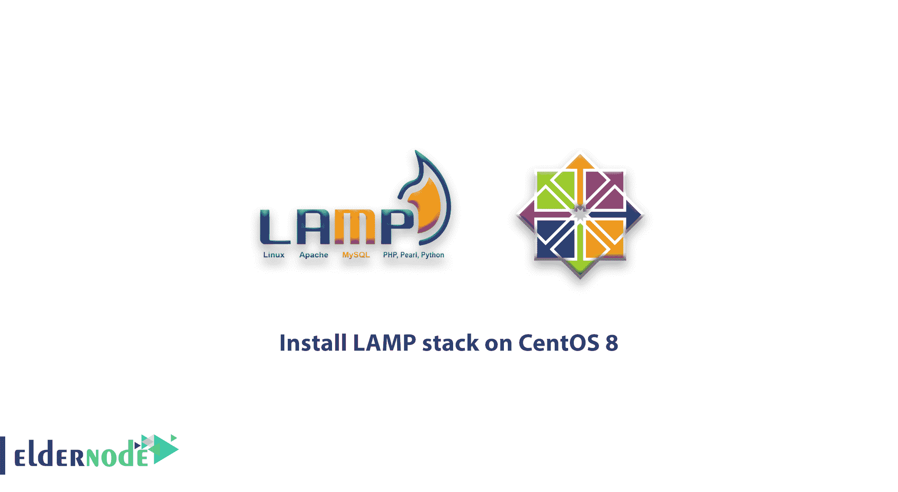
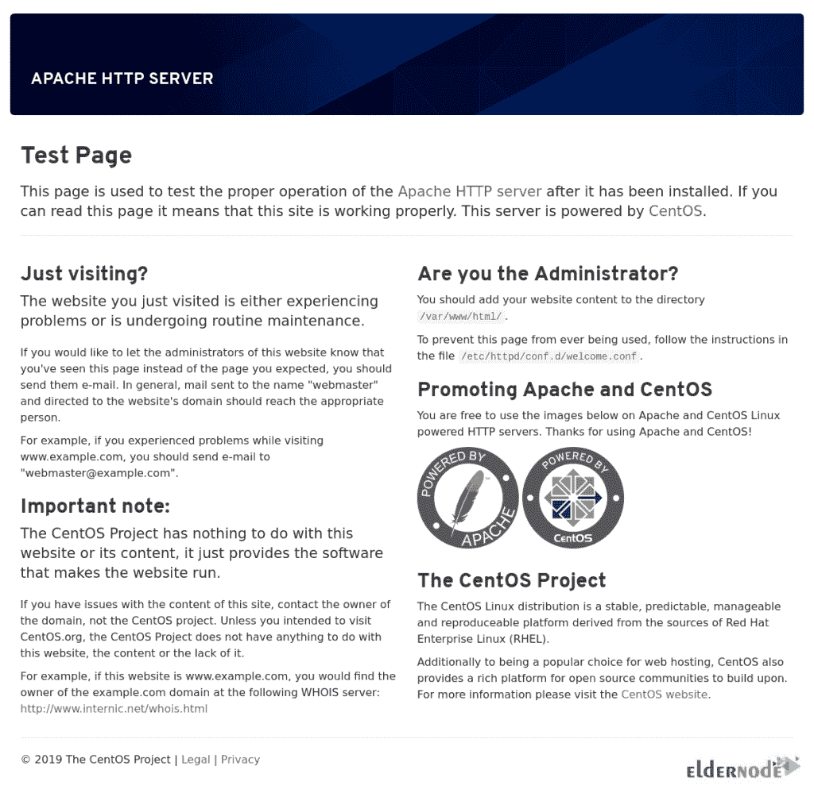
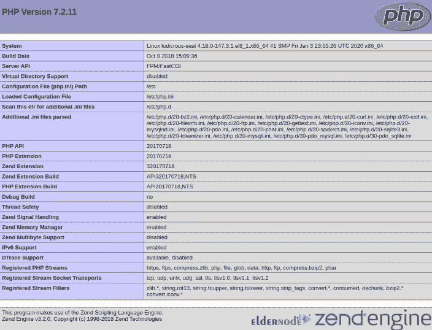

# 如何在 CentOS 8[完整版] - ElderNode 博客上安装 LAMP stack

> 原文：<https://blog.eldernode.com/install-lamp-stack-on-centos-8/>



【更新】LAMP 是 **L** inux、 **A** pache、 **M** ySQL、 **P** HP 的缩写。这组开源软件被网站管理员和开发者用来测试和托管动态网站。LAMP 是最常见和最流行的软件栈，支持动态网站和 web 应用程序，如 WordPress、Laravel 和 Drupal。在本文中，您将了解如何在 CentOS 8 上安装 LAMP stack。访问 [Eldernode](https://eldernode.com/) 上的可用软件包，购买您自己的 [CentOS VPS](https://eldernode.com/centos-vps/) 。

## **教程在 CentOS 8 上安装灯栈**

LAMP 服务器由 4 个核心组件组成:Apache web 服务器、 [MySQL](https://blog.eldernode.com/how-to-install-mysql-on-centos-8/) 或 MariaDB 数据库，以及 PHP，这是一种用于创建动态网页的流行脚本语言。

### **在 CentOS 8** 上安装灯组的先决条件

为了让本教程更好地工作，请考虑以下先决条件:

_ 拥有 Sudo 权限的非 root 用户。

_ 要进行设置，请遵循 CentOS 8 上的[初始服务器设置。](https://blog.eldernode.com/initial-set-up-centos-8/)

_ 在本教程中，我们使用 DNF 命令来安装软件包。DNF 命令预装在 CentOS 8 中。如果没有安装，可以遵循 CentOS 8 教程上的 [DNF 命令。](https://blog.eldernode.com/dnf-command-on-centos-8/)

## **在 CentOS 8 | CentOS 7**T3 上安装灯组

让我们通过本指南的步骤来了解如何在 [CentOS](https://blog.eldernode.com/tag/centos/) 8 上安装流行的托管堆栈 LAMP。

第一步:

一如既往，我们建议您在安装之前更新软件包。因此，打开终端窗口并运行以下命令:

```
sudo dnf update
```

第二步:

现在，您应该**安装 Apache 服务器**。因此，键入:

```
sudo dnf install httpd httpd-tools
```

安装完成后，运行以下命令来启用并启动服务器:

```
sudo systemctl enable httpd
```

接下来，**启动****Apache 服务**，使用下面的命令:

```
sudo systemctl start httpd
```

此外，您可以确认 Apache web 服务器是否正在运行。为此，请键入:

```
sudo systemctl status httpd
```

如果 firewalld 处于活动状态，您将需要运行以下命令，以允许在**端口 80** 上进行外部访问:

```
sudo firewall-cmd --permanent --zone=public --add-service=http
```

```
sudo firewall-cmd --permanent --zone=public --add-service=https
```

```
sudo firewall-cmd --reload
```

您可以通过从 web 浏览器访问服务器的公共 IP 地址或域名来测试服务器是否启动并运行。你会看到这样一个页面:

```
http://server-IP
```



### 第三步:

这一步，是时候**在 CentOS 8 上安装 MariaDB** 了。Oracle 社区开发的原始 MySQL 服务器的分支。要安装它，请运行:

安装后，使用以下命令启用并**启动 MariaDB** 服务器:

```
dnf install mariadb-server mariadb -y
```

要验证 MariaDB 的状态，请运行:

```
systemctl start mariadb 
```

```
systemctl enable mariadb
```

为了提高数据库的安全性，您必须运行以下命令并按照说明进行操作:

```
systemctl status mariadb
```

第一个提示将要求您输入当前数据库的 root 密码，因为您还没有任何密码，只需按下 **输入** 键继续这些步骤。

```
mysql_secure_installation
```

现在你必须键入一个新的根密码和确认密码。之后，您可以通过按下 **Y** 和 **键跳过所有步骤，进入** 。

第四步:

现在，灯堆中的最后一个组件。你需要**安装 PHP** 。PHP 是一种用于开发动态网页的脚本 web 编程语言。要安装最新版本的 PHP 和 EPEL 库，请运行:

然后，您可以使用下面的命令安装 **yum-utils** 并启用 **Remi-repository** :

```
sudo dnf install https://dl.fedoraproject.org/pub/epel/epel-release-latest-8.noarch.rpm
```

接下来，使用以下命令搜索可供下载的 PHP 模块:

```
sudo dnf install dnf-utils http://rpms.remirepo.net/enterprise/remi-release-8.rpm
```

这样，你可以查看当前安装的 PHP 版本是 PHP 7.2。运行以下命令安装新版本 PHP 7.4，重置 PHP 模块:

```
sudo dnf module list php
```

重置 PHP 模块后，通过运行以下命令启用 PHP 7.4 模块:

```
sudo dnf module reset PHP
```

最后，使用下面的命令安装 PHP、PHP-FPM (FastCGI 进程管理器)和相关的 PHP 模块:

```
sudo dnf module enable php:remi-7.4
```

此外，您可以验证要运行的安装版本。因此，键入:

```
sudo dnf install php php-opcache php-gd php-curl php-mysqlnd
```

现在应该已经安装了 PHP 7.4。使用以下命令在启动时启动并启用 PHP-FPM:

```
php -v
```

然后，您可以检查其状态。执行以下命令:

```
sudo systemctl start php-fpm
```

```
sudo systemctl enable php-fpm
```

要指示 **SELinux** 允许 Apache 通过 PHP-FPM 运行来执行 PHP 代码:

```
sudo systemctl status php-fpm
```

最后，使用下面的命令**重启****Apache webserver**，以便 PHP 与 Apache web server 一起工作:

```
setsebool -P httpd_execmem 1
```

**如何在 CentOS 8 上测试 PHP 信息**

```
sudo systemctl restart httpd
```

### 在本节中，您可以使用 web 服务器测试 PHP。首先，在文档根目录下创建一个**info.php**文件:

然后，插入下面的 PHP 代码并保存文件:

```
vi /var/www/html/info.php
```

最后，打开您最喜欢的浏览器，在下面输入 URL:

```
<?php  phpinfo ();  ?>
```

***注意* :** 记得用你服务器的实际 IP 地址替换服务器 IP 地址。

```
http://server-ip-address/info.php
```



结论

## 在本文中，您学习了如何在 CentOS 8 上安装 LAMP。如果你有兴趣了解更多，参考 Debian 10 上的[灯安装](https://blog.eldernode.com/install-lamp-debian-10/)和 [Ubuntu 20.04](https://blog.eldernode.com/how-to-install-lamp-on-ubuntu-20-04/) 。

In this article, you learned How To Install LAMP on CentOS 8\. If you are interested to learn more, refer to the [LAMP installation on Debian 10](https://blog.eldernode.com/install-lamp-debian-10/) and [Ubuntu 20.04](https://blog.eldernode.com/how-to-install-lamp-on-ubuntu-20-04/).