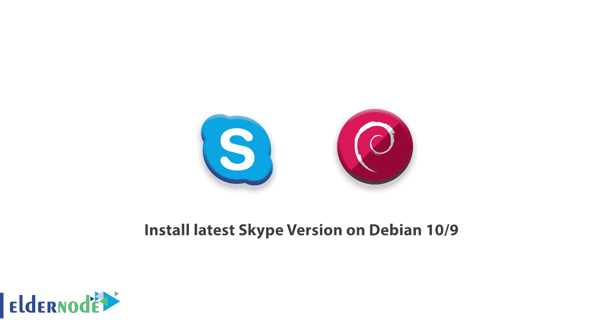
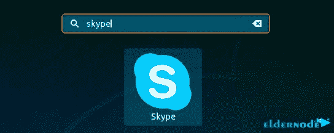
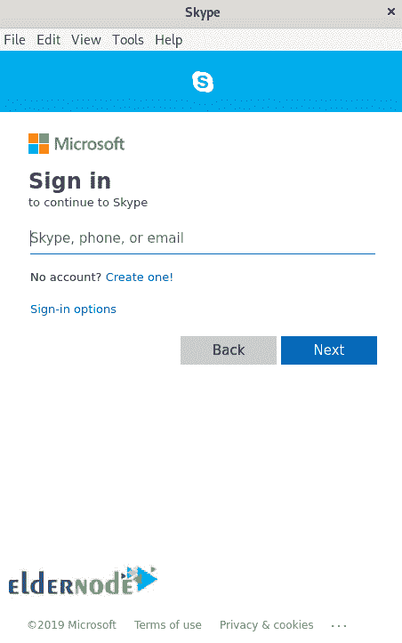

# 如何在 Debian 10/9 | Eldernode 博客上安装最新版本的 Skype

> 原文：<https://blog.eldernode.com/install-latest-skype-version-on-debian-10-9/>



【更新日期:2021-01-08】免费的通讯工具总是很受欢迎，被广泛使用。Skype 就是这些在线音频和视频通话应用之一。你可能在手机上至少用过一次这个多平台应用。作为雇员或自由职业者，您肯定会将 Skype 用于更多的官方目的，如会议和项目交流。所以，毫无疑问，你已经发现它的高效和可靠。在这篇文章中，你将学习如何在 Debian 10/9 上安装最新的 Skype 版本。在 [Eldernode](https://eldernode.com/) 上找到我们的经济型 VIP 套餐，并准备好您自己的 [Linux VPS](https://eldernode.com/linux-vps/) 为该指南做好准备。

为了让本教程更好地发挥作用，请考虑以下**先决条件**:

拥有 sudo 权限的非 root 用户。

要进行设置，请遵循我们在 Debian 10 上的[初始服务器设置。](https://blog.eldernode.com/initial-setup-with-debian-10/)

## 教程在 Debian 10、Debian 9 上安装最新的 Skype 版本

Skype 是一个文本、音频和视频信使。Skype 由微软公司提供和支持。Skype 帐户也可以免费进行语音和视频通话。因为 Skype 不是开源的，所以它不包含在默认的 [Debian](https://blog.eldernode.com/tag/debian/) 仓库中。因此，您将使用 Skype APT 储存库安装它。让我们通过这个指南的步骤来学习和完成它。

### **逐步在 Debian 上安装最新的 Skype 版本**

**第一步:**

要下载最新的 Skype **deb 软件包**，请打开您的终端并运行以下命令:

```
wget https://go.skype.com/skypeforlinux-64.deb
```

**注意**:如果您的系统中没有 *wget* ，您需要先安装它，运行:

```
sudo apt -y install wget
```

**第二步:**

运行以下命令，确保下载完成后能够**安装 Skype** :

```
sudo apt install ./skypeforlinux-64.deb
```

或者，

```
sudo dpkg -i ./skypeforlinux-64.deb
```

这样，Skype 就安装在了你的 Debian 桌面上。接下来，你将学习如何启动和使用它。


**第三步:**

现在，你可以看到 Skype 已经安装在你的 Debian 桌面上。你可以用两种方式启动它。所需的**命令行**是:

第二种方式是**点击 skype 图标**(应用>互联网> Skype)。

当您启动 Skype 时，会出现如下所示的窗口。

```
skypeforlinux
```



现在，您可以用您的 Microsoft 帐户登录 Skype 或创建一个新帐户，开始使用该应用程序，享受免费的好处，如聊天、通话和视频通话。



**如何在 Debian 服务器上更新 Skype**

安装时，官方 Skype 储存库会添加到系统来源列表中。因此，要验证文件内容，请键入:

### 要更新已安装的软件包，请使用以下命令:

如何在 Debian 上卸载 Skype

```
cat /etc/apt/sources.list.d/skype-stable.list
```

如果您愿意随时删除 Skype，只需运行以下命令:

```
sudo apt update  sudo apt -y upgrade
```

结论

```
sudo apt remove skypeforlinux
```

在本文中，您了解了如何在 Debian 9/10 上安装最新的 Skype 版本。完成本指南的步骤后，它就可以免费、安全、高质量地连接您的联系人了。

## Conclusion

In this article, you learned How to Install the latest Skype Version on Debian 9/10\. After completing the steps of this guide it is ready to connect you to your contacts free, safe, and with the highest possible quality.