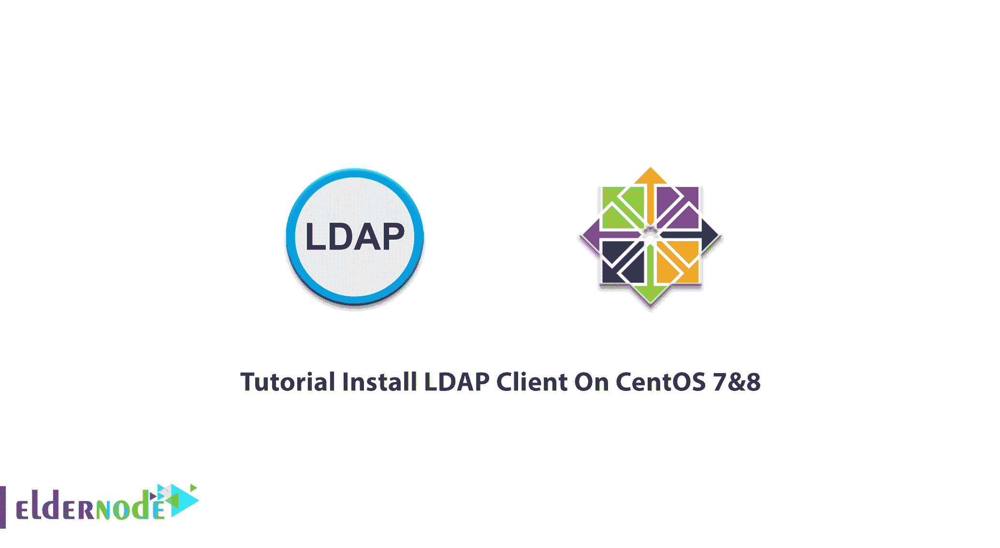

# 教程在 CentOS 7 和 8 - Eldernode 博客上安装 LDAP 客户端

> 原文：<https://blog.eldernode.com/install-ldap-client-on-centos/>



**LDAP** 是轻量级目录访问协议的缩写。LDAP 是一个供应商中立的应用程序协议，它允许您通过 Internet 协议网络目录访问协议来访问和维护分布式目录信息服务。有许多不同的方法来提供一个目录。使用 LDAP 有助于您提供一个中心位置来存储用户名和密码。因此，会有许多不同的应用程序和服务可以连接到 LDAP 服务器来验证用户。本文介绍了在 Centos 7 & 8 上安装 LDAP 客户端的**教程。在 [Eldernode](https://eldernode.com/) 上根据自己的需求选择合适的套装，购买自己的 [CentOS VPS](https://eldernode.com/centos-vps/) 。**

为了让本教程更好地发挥作用，请考虑以下**先决条件**:

拥有 sudo 权限的非 root 用户。

要进行设置，请遵循我们的[初始设置 centos 8](https://blog.eldernode.com/initial-set-up-centos-8/) 。

## **在 CentOS 7 | CentOS 8** 上安装 LDAP 客户端

不同种类的信息以不同的方式存储在目录中。您可以考虑关于如何引用、查询、更新该信息的不同要求，以及防止其被授权访问的方式。

## **如何在 CentOS 7**T3 上安装和配置 LDAP 客户端

加入我们，浏览本指南的步骤，在 CentOS 7 上**安装和配置 OpenLDAP。请注意正确执行每个步骤，以完成简单的安装过程。**

*第一步:*

像往常一样，出于一些[安全](https://blog.eldernode.com/how-to-increase-website-security/)原因，建议你更新系统。使用下面的命令**更新**你所有的系统软件包到最新的可用版本:

```
yum update
```

*第二步:*

要**安装 OpenLDAP 功能所需的包**,运行:

```
yum -y install openldap compat-openldap openldap-clients openldap-servers openldap-servers-sql openldap-devel
```

然后，您必须启动 LDAP 守护程序，并在根目录上启用它。因此，键入:

```
systemctl start slapd.service  systemctl enable slapd.service
```

*第三步:*

要设置一个 **LDAP root 密码**并保存输出，请使用下面的命令来帮助您配置 OpenLDAP。

```
slappasswd
```

*第四步:*

要开始**配置 OpenLDAP** ，您需要创建 db.idif 文件。使用 nano 或您喜欢的文本编辑器，将以下内容粘贴到:

```
nano db.ldif
```

```
dn: olcDatabase={2}hdb,cn=config  changetype: modify  replace: olcSuffix  olcSuffix: dc=field,dc=eldernode,dc=com    dn: olcDatabase={2}hdb,cn=config  changetype: modify  replace: olcRootDN  olcRootDN: cn=ldapadm,dc=field,dc=eldernode,dc=com    dn: olcDatabase={2}hdb,cn=config  changetype: modify  replace: olcRootPW  olcRootPW: hashed_output_from_the_slappasswd_command
```

现在，部署配置:

```
ldapmodify -Y EXTERNAL -H ldapi:/// -f db.ldif
```

接下来，您可以将监视器访问权限仅限于 ldapadm 用户:

```
nano monitor.ldif
```

```
dn: olcDatabase={1}monitor,cn=config  changetype: modify  replace: olcAccess  olcAccess: {0}to * by dn.base="gidNumber=0+uidNumber=0,cn=peercred,cn=external, cn=auth" read by dn.base="cn=ldapadm,dc=field,dc=eldernode,dc=com" read by * none
```

同样，通过运行以下命令来部署配置更改:

```
ldapmodify -Y EXTERNAL -H ldapi:/// -f monitor.ldif
```

*第五步:*

在这一步中，您需要生成一个证书和私有密钥，以便能够安全地与 OpenLDAP 服务器通信。运行以下命令通过此步骤。

```
openssl req -new -x509 -nodes -out \
```

```
/etc/openldap/certs/myldap.field.eldernode.com.cert \
```

```
-keyout /etc/openldap/certs/myldap.field.eldernode.com.key \
```

```
-days 365
```

要更改所有者和组权限，请键入下面的命令。它允许 OpenLDAP 读取文件:

```
chown -R ldap:ldap /etc/openldap/certs
```

*第六步:*

要配置 OpenLDAP 并使用 LDAPS 协议，您必须创建 certs.ldif

```
nano certs.ldif
```

```
dn: cn=config  changetype: modify  replace: olcTLSCertificateFile  olcTLSCertificateFile: /etc/openldap/certs/myldap.field.eldernode.com.cert
```

```
dn: cn=config  changetype: modify  replace: olcTLSCertificateKeyFile  olcTLSCertificateKeyFile: /etc/openldap/certs/myldap.field.eldernode.com.key
```

同样，您可以部署配置:

```
ldapmodify -Y EXTERNAL -H ldapi:/// -f certs.ldif
```

您也可以通过运行以下命令来测试配置:

```
slaptest -u
```

### **如何设置 OpenLDAP 数据库**

当上述步骤完成后，您就可以设置 LDAP 数据库了。要启动该过程，您必须将示例数据库配置文件复制到'/var/lib/ldap '并更改文件权限。

```
cp /usr/share/openldap-servers/DB_CONFIG.example /var/lib/ldap/DB_CONFIG
```

```
chown -R ldap:ldap /var/lib/ldap
```

然后，添加 LDAP 模式。

```
ldapadd -Y EXTERNAL -H ldapi:/// -f /etc/openldap/schema/cosine.ldif
```

```
ldapadd -Y EXTERNAL -H ldapi:/// -f /etc/openldap/schema/nis.ldif
```

```
ldapadd -Y EXTERNAL -H ldapi:/// -f /etc/openldap/schema/inetorgperson.ldifv
```

接下来，为您的域创建一个 base.ldif 文件:

```
nano base.ldif
```

```
dn: dc=field,dc=eldernode,dc=com  dc: field  objectClass: top  objectClass: domain
```

```
dn: cn=ldapadm,dc=field,dc=eldernode,dc=com  objectClass: organizationalRole  cn: ldapadm  description: LDAP Manager
```

```
dn: ou=People,dc=field,dc=eldernode,dc=com  objectClass: organizationalUnit  ou: People
```

```
dn: ou=Group,dc=field,dc=eldernode,dc=com  objectClass: organizationalUnit  ou: Group
```

使用 ldapadm 用户将这些配置更改部署到 OpenLDAP 服务器:

```
ldapadd -x -W -D "cn=ldapadm,dc=field,dc=linuxhostsupport,dc=com" -f base.ldif
```

当系统询问您时，请输入 root 密码。如果您喜欢添加用户，可以使用 GUI。此外，建议您 0 为此使用 Apache Directory Studio 或 JXplorer。

就是这样！LDAP 现在应该已经安装在 CentOS 7 服务器上了。

## **如何在 CentOS 8**T3 上安装和配置 LDAP 客户端

CentOS 8 存储库没有最新版本的 OpenLDAP，应提供可用版本。继续本指南的步骤，在 [CentOS 8 上完成 LDAP 安装过程。](https://blog.eldernode.com/tag/centos/)

*第一步:*

要**更新**您的系统包，运行以下命令:

```
dnf update
```

*第二步:*

然后，您需要**安装所需的依赖项**和构建工具。要安装依赖项和构建工具的数量，请运行:

```
dnf install cyrus-sasl-devel make libtool autoconf libtool-ltdl-devel openssl-devel libdb-devel tar gcc perl perl-devel wget vim
```

*开始 3:*

现在，是时候**创建 OpenLDAP 系统帐户**了。因为 OpenLDAP 将运行一个非特权系统用户，所以使用下面的命令创建一个具有自定义用户和组 id 的 OpenLDAP 系统用户。

```
useradd -r -M -d /var/lib/openldap -u 55 -s /usr/sbin/nologin ldap
```

*开始 4:*

为了**下载 OpenLDAP 源码 tarball** ，最好导航到 [OpenLDAP 下载的页面](https://www.openldap.org/software/download/)并接收该页面的最新稳定版本。

```
VER=2.4.57
```

```
wget ftp://ftp.openldap.org/pub/OpenLDAP/openldap-release/openldap-$VER.tgz
```

*第五步:*

现在，您可以**提取 OpenLDAP 源代码 tarball** 。使用下面的命令来完成此操作:

```
tar xzf openldap-$VER.tgz
```

*第六步:*

您需要运行配置脚本来使 OpenLDAP 适应您的系统，以便能够在 CentOS 8 上编译 OpenLDAP。使用以下命令检查是否缺少任何必需的依赖项。

```
cd openldap-$VER
```

使用配置脚本构建 OpenLDAP 时，可以启用或禁用各种选项。

```
./configure --prefix=/usr --sysconfdir=/etc --disable-static \
```

```
--enable-debug --with-tls=openssl --with-cyrus-sasl --enable-dynamic \
```

```
--enable-crypt --enable-spasswd --enable-slapd --enable-modules \
```

```
--enable-rlookups --enable-backends=mod --disable-ndb --disable-sql \
```

```
--disable-shell --disable-bdb --disable-hdb --enable-overlays=mod
```

**注意**:如果您需要关于配置选项的更多信息，请寻求帮助:

```
./configure --help
```

一旦配置脚本顺利完成，您将在最后一行看到以下命令。

```
Please run "make depend" to build dependencies
```

正如您所猜测的，您需要运行 *make depend* 命令来构建 OpenLDAP 依赖关系。

```
make depend
```

最后，要在 CentOS 8 上编译 OpenLDAP，请键入:

```
make
```

如果您希望运行测试套件来验证 OpenLDAPbuild 是否有任何错误，请键入:

```
make test
```

**注意**:运行上述命令是可选的，可能需要时间。

*第七步:*

一旦 OpenLDAP 的编译成功完成，您就可以使用下面的命令**在 CentOS 8** 上安装 OpenLDAP 了。

```
make install
```

OpenLDAP 配置文件现在安装在 */etc/openldap* 上。

```
ls /etc/openldap/  certs ldap.conf ldap.conf.default schema slapd.conf slapd.conf.default slapd.ldif slapd.ldif.default
```

**注意**:库安装在 */usr/libexec/openldap* 下。

### **如何在 CentOS 8 上配置 OpenLDAP**

当您完成 OpenLDAP 安装过程后，就可以开始配置了。

要创建 OpenLDAP 数据和数据库目录，请运行:

```
mkdir /var/lib/openldap /etc/openldap/slapd.d
```

现在，您可以在 OpenLDAP 方向和配置文件上设置适当的所有权和权限。

```
chown -R ldap:ldap /var/lib/openldap
```

```
chown root:ldap /etc/openldap/slapd.conf
```

```
chmod 640 /etc/openldap/slapd.conf
```

## 结论

在本文中，向您展示了在 CentOS 7 & 8 上安装 LDAP 客户端的教程。有些目录服务是本地的，有些是全球的。本地服务向受限制的上下文提供服务，如单个机器上的 finger 服务，而全局服务向更广泛的上下文提供服务。如果你有兴趣阅读更多关于 LDAP 的内容，可以找到我们的相关文章[如何在 Ubuntu 20.04 上安装 LDAP 客户端](https://blog.eldernode.com/install-ldap-client-on-ubuntu-20-04/)