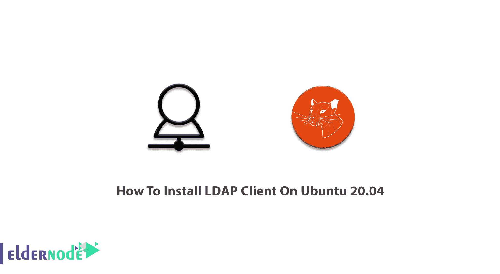
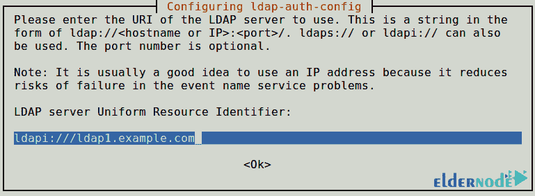
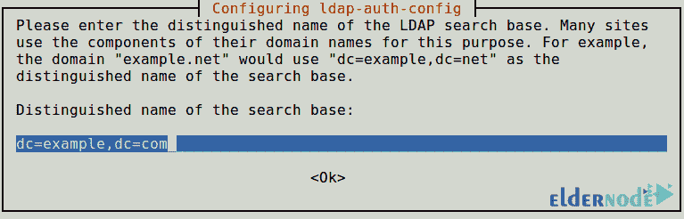
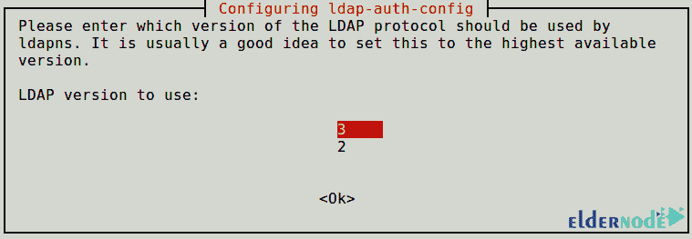
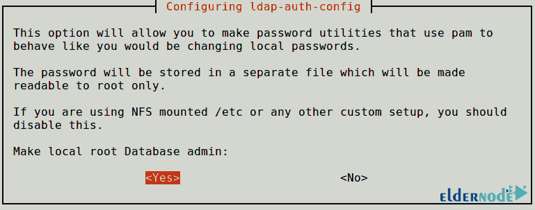
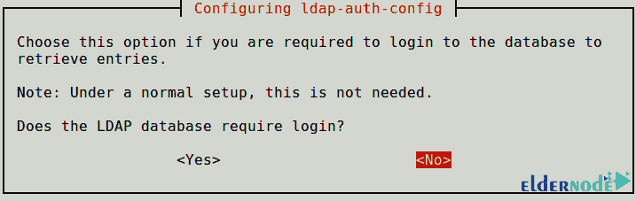
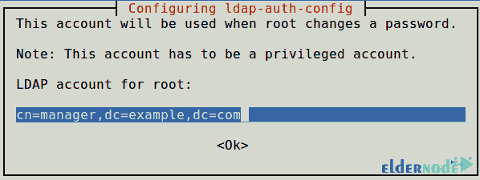
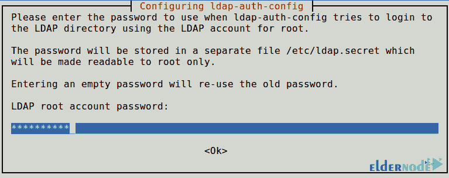
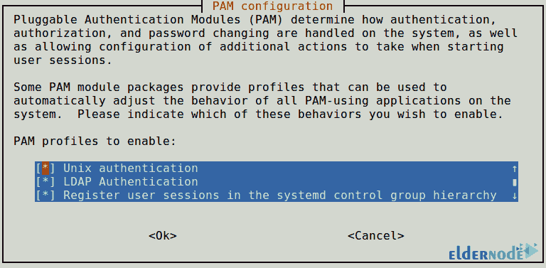

# 如何在 Ubuntu 20.04 - Eldernode 博客上安装 LDAP 客户端

> 原文：<https://blog.eldernode.com/install-ldap-client-on-ubuntu-20-04/>



轻型目录访问协议是为目录服务开发的核心协议。它被设计用来分发组织成目录信息树的信息列表，该目录信息树存储在 LDAP 数据库中。用户必须首先验证他们的身份，才能访问存储在 LDAP 数据库中的信息。你可能因为一个很不可爱的同学很擅长你们共同的项目而被迫容忍他！为了达成目标，你接受这种象征性的关系。此外，LDAP 客户机和服务器之间有一种符号关系。事实上，服务器需要客户机向它询问诸如用户名、主目录位置、组成员等问题。客户机需要服务器向它提供信息，它将负责传递这些信息。在本文中，你将学习如何**在 Ubuntu 20.04** 上安装 LDAP 客户端。如果您需要购买一台[专用服务器](https://eldernode.com/dedicated-server/)，我们将与您保持真正的关系，不分昼夜随时为您提供支持。安全购买自己的 [Ubuntu VPS](https://eldernode.com/ubuntu-vps/) 。

为了让本教程更好地发挥作用，请考虑以下**先决条件**:

拥有 sudo 权限的非 root 用户。

要设置，请遵循我们在 Ubuntu 20.04 上的[初始服务器设置。](https://blog.eldernode.com/initial-server-setup-on-ubuntu-20/)

## **教程在 Ubuntu 20.04 上安装 LDAP 客户端**

LDAP 是一个开源的跨平台协议，用于目录服务认证。有许多不同的实现可用。它用于从分层目录结构中存储和检索数据。

## **在 Ubuntu 20.4 上安装并配置 LDAP 客户端| Ubuntu 18.04**

当您配置 LDAP 服务器并添加用户帐户时，您就可以开始安装和配置 LDAP 客户端了。

如果您的网络中没有活动的 [DNS 服务器](https://blog.eldernode.com/private-dns-server-on-ubuntu-20-04/)，请将 LDAP 服务器地址添加到 */etc/hosts* 。

```
sudo vim /etc/hosts  192.168.18.50 ldap.example.com
```

要在 Ubuntu 系统上安装 LDAP 客户端实用程序，请运行:

```
sudo apt -y install libnss-ldap libpam-ldap ldap-utils
```

### **LDAP 客户端配置**

*第一步:*

现在，您可以设置 LDAP URL。它可以是 IP 地址或主机名。将提示您输入 LDAP 服务器的详细信息。自动安装的 **ldap-auth-config** 包将根据您输入的内容进行大部分配置。



*第二步:*

然后，您应该输入 LDAP 搜索库的名称，以便设置搜索库的可分辨名称。你可以使用他们域名的组成部分。



*第三步:*

选择要使用的 LDAP 版本 3 并点击**确定**。



*第四步:*

为了能够使使用 Pam 的密码实用程序表现得就像您被更改了本地密码一样。因此，要使*成为本地根数据库管理员*，请按**是**。



第五步:

在这一步中，您将为*回答**否**LDAP 数据库需要登录吗？*禁用对 LDAP 数据库的登录要求。



*第六步:*

您需要为 root 设置 **LDAP 帐户**。



*第七步:*

当 **ldap-auth-config** 试图使用 root 的 ldap 帐户登录 LDAP 目录时，您需要考虑一个密码。



*第八步:*

您可以在文件 **/etc/ldap.config** 中找到对话框的结果。如果您需要进行一些更改，请使用您认为合适的命令行编辑器打开并编辑该文件。

现在，要为 NSS 配置 LDAP 配置文件，请键入:

```
sudo auth-client-config -t nss -p lac_ldap
```

*第九步:*

接下来，要通过更新 **PAM** 配置来使用 LDAP 进行身份验证，您必须配置系统。从菜单中选择 LDAP，并使用基于 LDAP 的凭据登录。

```
sudo pam-auth-update
```



*第十步:*

如果您希望自动创建用户的主目录，请在公共会话 PAM 文件中再执行一次配置。

```
sudo vim /etc/pam.d/common-session
```

并在其中添加下面一行:

```
session required pam_mkhomedir.so skel=/etc/skel umask=077
```

*第十一步:*

此时，您可以保存更改并关闭文件。**通过运行以下命令重新启动名称服务 Cashe 守护进程** (NCSD):

```
sudo systemctl restart nscd
```

```
sudo systemctl enable nscd
```

在使用复制的情况下，LDAP 客户端将需要引用在 **/etc/ldap.conf** 中指定的多个服务器。按照以下格式指定所有服务器:

```
uri ldap://ldap1.example.com ldap://ldap2.example.com
```

这意味着请求将超时，如果提供者变得没有响应，消费者将尝试处理它。

将*ldap1.example.com*的提供者视为*ldap2.example.com*的消费者

最后，使用下面的命令从服务器检查特定用户的 LDAP 条目。

```
getent passwd eldernode
```

*就是那个*！一旦您从/etc/passwd 文件中查看了特定用户的详细信息，这意味着您的客户机已经被**配置为**使用 LDAP 服务器进行身份验证。因此，您应该能够使用基于 LDAP 的凭证登录。

## 结论

在本文中，您了解了如何在 Ubuntu 20.04 上安装 LDAP 客户端。使用 LDAP 有助于您拥有与其他目录服务服务器进行应用程序通信的通信语言。用户的信息需要与网络上的其他实体共享，目录服务存储用户、密码和计算机帐户。