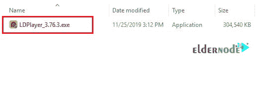

# 如何在 Windows RDP - Eldernode 博客上安装 LDPlayer

> 原文：<https://blog.eldernode.com/install-ldplayer-on-windows/>

LDPlayer 是面向 Windows 用户的 Android 模拟器软件，可以在 Windows 上轻松运行。基于 Android 5.1.1 的 LDPlayer，支持在运行高性能游戏、高显卡的电脑上广泛兼容。除了在 Windows 上运行 Android 游戏，你还可以访问谷歌 Play 商店来下载其他应用程序并定位设备。凭借其多功能的设计和用户友好的设置，LDPlayer 实际上比真正的智能手机更好地工作。要运行该软件，您的处理器必须具备虚拟化功能(英特尔 VT-x / AMD-V ),并且必须在主板设置中启用虚拟技术选项。在这篇文章中，我们试着教你如何在 Windows RDP 上安装 LDPlayer。如果你想 **[购买 RDP 服务器](https://eldernode.com/buy-rdp/)** ，可以在 [Eldernode](https://eldernode.com/) 看到可用的包。

## **教程在 Windows 上安装 LD player RDP**

LDPlayer 模拟的环境支持 Android 的所有官方特性。其中最重要的一点是能够以出色的图形质量运行数千款流行游戏。如果你也想在你的电脑上安装你想要的 Android 应用程序的安装文件，我们建议你安装有吸引力的 LDPlayer 模拟器，并享受它。

在下一节中，我们将提到 LDPlayer 的特性。然后我们会一步一步教你如何在 RDP 的 Windows 系统上安装 LDPlayer。最后，我们将解释如何设置 LDPlayer。请继续关注本文的其余部分。

### **LDPlayer 功能**

_ 高速运行不挂不慢

_ 非常高的定制能力

_ 专业美观的黄色用户界面

_ 向仿真器分配资源(RAM 和 CPU)的能力

_ 使用虚拟箱执行沙盒和虚拟化操作

_ 使用 CPU 中可用的虚拟化技术，这些技术由 CPU 制造商 Intel 和 AMD 共同拥有。您可以从主板 BIOS 设置中启用此功能。

_ 在应用程序环境中拖放 APK 文件功能

_ 支持谷歌商店及其游戏

_ 能够在演奏时使用键盘(并非所有模拟器都有此功能)

_ 能够通过应用内功能录制和拍摄屏幕照片

_ 将您的硬盘用作您的文件系统和文件存储

## **在 Windows 上安装 LD player RDP**

在这一节中，我们将教你如何在 Windows RDP 上安装 LDPlayer。为此，只需按顺序执行以下步骤。第一步，你必须在 Windows 开始菜单的搜索部分输入短语 **Remote desktop** 并运行它。然后你要输入你想进入 **Windows RDP** 的 IP 和密码，点击**连接**。

进入 Windows RDP 环境后，您必须打开一个您想要的浏览器。然后你要进入网站后像下图一样 **[下载 Ldplayer](https://www.ldplayer.net/)** 。

在下一步中，您需要转到下载文件的位置。双击**LDPlayer.exe**文件开始安装过程。

在打开的窗口中，选中图像左下角的**阅读并同意 LDPlayer 许可证**选项。然后点击**安装**。

你需要等待几秒钟来下载安装包。

最后点击**开始**，就完成了 LDPlayer 的安装。

### **如何在 Windows RDP 上运行 LD player**

在上一步中，您能够成功安装 LDPlayer。在这一部分，我们想教你如何运行和设置这个模拟器。

第一步是从**开始菜单**中搜索并运行 **LDPlayer** 。

在下图中，你可以看到 **LDPlayer 主屏幕**。

需要注意的是，你必须用你的 Google 帐户登录才能使用这个模拟器。要注册你的**谷歌账户**，你必须首先输入你的**电子邮件地址**。然后点击**下一步**。

现在你需要为你的谷歌账户输入**密码**并再次点击**下一步**。

下一步，点击**是的，我在**里。

然后你要点击**我同意**。

最后点击**接受**使用 LDPlayer。

## 结论

LDPlayer 是市场上最新的 Android 模拟器。这款免费软件以 Windows 中模拟器的形式为您带来了流畅快速的 Android 操作系统体验。使用该软件，用户可以在他们的台式电脑上模拟一个版本的 Android 操作系统，并期待在手机或平板电脑上也能实现同样的效果。在这篇文章中，我们试图教你如何一步一步地在 Windows RDP 上安装 LDPlayer。如果你想熟悉其他 Android 仿真软件，也可以参考文章[如何在 Windows RDP 上安装 MEmu Play](https://blog.eldernode.com/install-memu-play-on-windows/)。