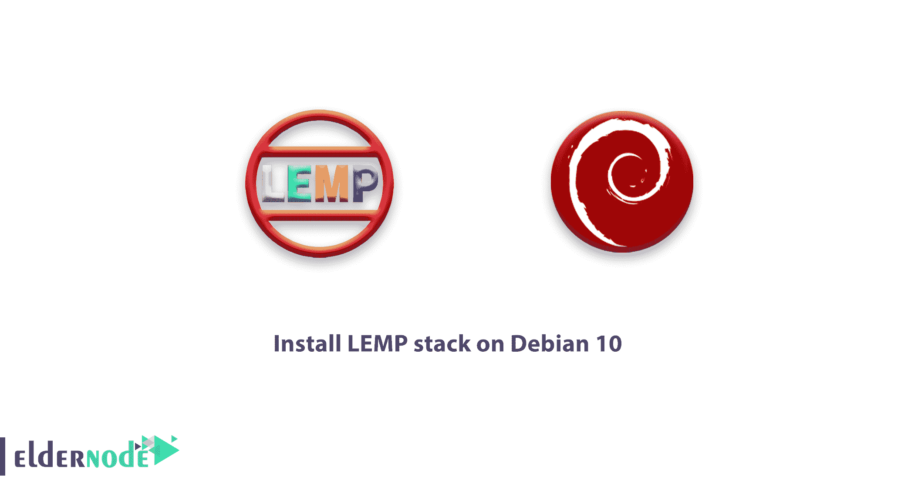

# 如何在 Debian 10 - Eldernode 上安装 LEMP 堆栈

> 原文：<https://blog.eldernode.com/install-lemp-debian-10/>



LEMP 由四个开源组件组成，用于服务动态网页和 web 应用程序。LEMP 有四个 Linux 操作系统缩写。分别是， **L** 代表 Linux， **E** 代表 Nginx (engine-x)， **M** 代表 MariaDB 或者 MySQL， **P** 代表 PHP，Perl 或者 Python。

你可以发现 MySQL 在 LEMP 栈中作为数据库管理系统。但是 Debian 和其他一些 Linux 发行版计划使用 [MariaDB](https://mariadb.org/) 而不是 MySQL。首先，你首先需要有自己的 [Linux VPS](https://eldernode.com/linux-vps/) 。

为了让本教程更好地发挥作用，请考虑以下**先决条件**:

拥有 sudo 权限的非根用户

要进行设置，请按照 Debian 10 的[初始设置进行。](https://eldernode.com/initial-setup-with-debian-10/)

## 如何在 Debian 10 上安装 LEMP 堆栈

加入我们，浏览本指南的步骤，向您展示如何使用 MariaDB 作为数据库管理系统，在 Debian 10 服务器上安装 LEMP 堆栈。你可能也有兴趣学习[如何在 CentOS 8](https://blog.eldernode.com/install-lemp-on-centos-8/) **上安装 LEMP 或者** [如何在 Debian 10](https://blog.eldernode.com/install-lamp-debian-10/) 上安装 LAMP。

### 第一步:如何安装 Nginx Web 服务器

你选择流行的 Nginx 来为你的访问者提供网页。像本指南中的其他软件一样，它直接来自 Debian 的默认软件包仓库。这意味着您可以使用 **apt** 包管理套件来完成安装。

如果您还没有使用 **apt** ，您需要从更新您的本地包索引开始。然后安装服务器:

```
sudo apt update  sudo apt install nginx
```

Nginx 在安装时开始运行，因为它是在 Debian 10 中设计的。如果 **ufw** 防火墙正在运行，允许连接到 Nginx。找到最严格的配置文件，仍然允许您想要启用的流量。至此，您还没有为您的服务器配置 SSL，因此您需要允许端口 **80** 上的 HTTP 流量。

使用以下命令启用此功能:

```
sudo ufw allow 'Nginx HTTP'
```

您可以通过键入以下命令来验证更改:

```
sudo ufw status
```

输出

```
Status: active    To                         Action      From  --                         ------      ----  OpenSSH                    ALLOW       Anywhere  Nginx HTTP                 ALLOW       Anywhere  OpenSSH (v6)               ALLOW       Anywhere (v6)  Nginx HTTP (v6)            ALLOW       Anywhere (v6) 
```

要测试服务器是否已启动并运行，请通过在 web 浏览器中访问服务器的域名或公共 IP 地址来进行检查。你可能会发现你的服务器没有域名，你也不知道你的服务器的公共 IP 地址。以下是找到它的解决方案:

```
ip addr show eth0 | grep inet | awk '{ print $2; }' | sed 's/\/.*$//'
```

您使用上面的命令打印出几个 IP 地址，在您的 web 浏览器中依次尝试每个 IP 地址。在下面的内容中，您可以键入您在 web 浏览器中收到的一个地址，让它带您到

Nginx 的默认登陆页面:

```
http://your_domain_or_IP 
```

``

`如果你看到上面的页面，说明你已经成功安装了 Nginx。`

### `第二步:如何安装 MariaDB`

`在这一步中，您应该安装数据库系统，以便能够存储和管理您站点的数据，因为您已经启动并运行了 web 服务器。`

`传统上用来安装 mysql 服务器的元包 **mysql-server** ，在 Debian 10 中被替换为**default-MySQL-server**。`

`这个元包引用了 MariaDB，它是 Oracle 最初的 MySQL 服务器的一个社区分支，也是目前基于 Debian 的包管理器存储库中默认的 MySQL 兼容的数据库服务器。`

`但是，建议您使用程序的实际包 mariadb-server 安装 MariaDB 来替换元包。`

`键入以下命令安装该软件:`

```
`sudo apt install mariadb-server`
```

`建议您在安装后运行 MariaDB 预安装的安全脚本。您可以使用它来删除一些不安全的默认设置，并锁定对数据库系统的访问。通过运行以下命令启动交互式脚本:`

```
`sudo mysql_secure_installation`
```

`使用该脚本完成一系列提示，您可以在其中对 MariaDB 设置进行一些更改。准备好第一个提示，要求您输入当前的数据库根密码。这不要与系统根混淆。数据库 root 用户是对数据库系统拥有完全权限的管理用户。因为你刚刚安装了 MariaDB，还没有做任何配置更改，所以这个密码会是空白的，所以只要在提示处按 **输入** 即可。`

`让我们看看下一个提示是什么。系统会询问您是否愿意设置一个**数据库根**密码。因为 MariaDB 为 **root** 用户使用一种特殊的认证方法，这种方法通常比使用密码更安全，所以现在不需要设置密码。键入 **N** 然后按 **回车** 。要接受所有后续问题的默认值，请按下 **Y** ，然后按下 **回车。**`

`这将删除匿名用户和测试数据库，禁用远程 **root** 登录，并加载这些新规则，以便 MariaDB 立即考虑您所做的更改。
完成后，通过键入以下命令登录到 MariaDB 控制台:`

```
`sudo mariadb`
```

`这将作为管理数据库用户 **root** 连接到 MariaDB 服务器，这是在运行该命令时通过使用 **sudo** 推断出来的。`

`输出`

```
`Welcome to the MariaDB monitor.  Commands end with ; or \g.  Your MariaDB connection id is 74  Server version: 10.3.15-MariaDB-1 Debian 10    Copyright (c) 2000, 2018, Oracle, MariaDB Corporation Ab and others.    Type 'help;' or '\h' for help. Type '\c' to clear the current input statement.    MariaDB [(none)]>`
```

`**注意**:作为 **root** 用户，你不需要提供密码就可以连接。这是可能的，因为管理 MariaDB 用户的默认身份验证方法是 **unix_socket** 而不是 **密码** 。这有助于数据库服务器更加安全，因为只允许具有 sudo 权限的系统用户作为根用户登录，这些用户从控制台或通过具有相同权限的应用程序进行连接。请考虑，实际上，这意味着您将无法使用管理数据库根用户从您的 PHP 应用程序连接。`

`此外，您可以为每个数据库设置特权较少的专用用户帐户，以提高安全性。当您计划在服务器上托管多个数据库时，建议使用此选项。`

`为了演示这样的设置，我们将创建一个名为 **example_database** 的数据库和一个名为 **example_user** 的用户，但是您可以用不同的值替换这些名称。`

`从 MariaDB 控制台键入以下命令创建一个新数据库。`

```
`MariaDB [(none)]  CREATE DATABASE example_database;`
```

`之后，您就可以创建一个新用户，并授予他们刚刚创建的自定义数据库的全部权限。详细了解该用户的密码为 **密码** 。但是请记住用您自己选择的安全密码替换这个值。`

```
`MariaDB [(none)]> GRANT ALL ON example_database.* TO 'example_user'@'localhost' IDENTIFIED BY 'password' WITH GRANT OPTION;`
```

`这将赋予 **example_user** 用户对 **example_database** 数据库的全部权限，同时防止该用户在您的服务器上创建或修改其他数据库。`

`并确保它们被保存并在当前会话中可用:`

```
`MariaDB [(none)]> FLUSH PRIVILEGES;`
```

`要退出 MariaDB shell:`

```
`MariaDB [(none)]> Exit`
```

`然后，通过再次登录 MariaDB 控制台来测试新用户是否具有适当的权限，这一次使用自定义用户凭据:`

```
`mariadb -u example_user -p`
```

`**注意**该命令中的 **-p** 标志，它会提示您在创建 **example_user** 用户时使用的密码。登录到 MariaDB 控制台后，确认您有权访问 example_database 数据库:`

```
`MariaDB [(none)]> SHOW DATABASES;`
```

`输出`

```
`+--------------------+  | Database           |  +--------------------+  | example_database   |  | information_schema |  +--------------------+  2 rows in set (0.000 sec)`
```

`要退出 MariaDB shell，请键入:`

```
`MariaDB [(none)]> Exit`
```

`至此，您的数据库系统已经设置好了，您可以继续安装 PHP，这是 LEMP 堆栈的最后一个组件。`

### `第三步:如何安装 PHP 进行处理`

`安装 [Nginx](https://blog.eldernode.com/install-nginx-debian-10/) 和 MySQL 之后，让我们安装 PHP 来处理代码并为 web 服务器生成动态内容。Nginx 需要一个外部程序来处理 PHP，并充当 PHP 解释器本身和 web 服务器之间的桥梁，而我们知道 Apache 在每个请求中都嵌入了 PHP 解释器。在需要额外配置后，在大多数基于 OHP 的网站中提供更好的性能`

`你需要安装 **php-fpm** ，它代表“php fastCGI 进程管理器”，并告诉 Nginx 将 PHP 请求传递给该软件进行处理。此外，你还需要 **php-mysql** ，一个允许 php 与基于 mysql 的数据库通信的 PHP 模块。核心 PHP 包将作为依赖项自动安装。`

`键入以下命令安装 **php-fpm** 和 **php-mysql** 包:`

```
`sudo apt install php-fpm php-mysql`
```

### `步骤 4:如何配置 Nginx 使用 PHP 处理器`

`您可以使用服务器块来封装配置详细信息，并在一台服务器上托管多个域。请注意，我们使用 **your_domain** 作为示例域名。`

`您可以找到一个默认启用的服务器块，它被配置为在 Debian 10 中为 Nginx 在**/var/www/html**提供目录外的文档。您可能会发现，如果您托管多个站点，即使单个站点运行良好，也很难管理。此外，您可以在 **/var/www** 中为 **your_domain** 网站创建一个目录结构，保留//var/www/html`

`现在，为 **your_domain** 创建根 web 目录，如下所示:`

```
`sudo mkdir /var/www/your_domain`
```

`然后，使用$USER 环境变量分配目录的所有权，该变量应该引用您当前的系统用户:`

```
`sudo chown -R $USER:$USER /var/www/your_domain`
```

`然后，使用您喜欢的命令行编辑器在 Nginx 的 **sites-available** 目录中打开一个新的配置文件。在这里，我们将使用T5【纳米】T6:`

```
`sudo nano /etc/nginx/sites-available/your_domain`
```

`这将创建一个新的空白文件。粘贴以下基本配置:`

`/etc/nginx/sites-available/your _ domain`

```
`server {      listen 80;      listen [::]:80;        root /var/www/your_domain;      index index.php index.html index.htm;        server_name your_domain;        location / {          try_files $uri $uri/ =404;      }        location ~ \.php$ {          include snippets/fastcgi-php.conf;          fastcgi_pass unix:/var/run/php/php7.3-fpm.sock;      }  }`
```

`您会看到一个基本配置，它监听端口 **80** ，并从您刚刚创建的 webroot 提供文件。它只会响应对在 **服务器名** 之后提供的主机或 IP 地址的请求，以及任何以 **结尾的文件。php** 会被 **php-fpm** 处理后，Nginx 才会把结果发给用户。`

`编辑完成后，保存并关闭文件。如果您使用 **nano** 来创建文件，请通过键入**CTRL**+**X**然后 **y** 和 **回车** 来确认。`

`通过链接到 Nginx 的 **站点启用的** 目录中的配置文件来激活您的配置:`

```
`sudo ln -s /etc/nginx/sites-available/your_domain /etc/nginx/sites-enabled/`
```

`这将告诉 Nginx 在下次重新加载时使用该配置。要测试您的配置是否存在语法错误，请运行以下命令:`

```
`sudo nginx -t`
```

`你可能会面临一个错误。要解决这个问题，您可以在继续之前返回到您的配置文件查看其内容。`

`准备就绪后，重新加载 Nginx 以进行更改:`

```
`sudo systemctl reload nginx`
```

`最后，您将在新的 web 根目录中创建一个文件来测试 PHP 处理。`

### `第五步:如何创建 PHP 文件来测试配置`

`至此，您的 LEMP 堆栈应该已经完全设置好了。你可以测试一下，验证 Nginx 可以正确的处理 **。php** 文件发送到你的 php 处理器。`

`为此，在您的文档根目录下创建一个测试 PHP 文件。在你的文本编辑器中打开一个名为**【info.php】**的新文件:`

```
`nano /var/www/your_domain/info.php`
```

`将下列行键入或粘贴到新文件中。这是一个有效的 PHP 代码，它将返回关于您的服务器的信息:`

`/var/www/your _ domain/info .PHP`

```
`<?php  phpinfo();  ?>`
```

`保存并关闭文件，输入**CTRL**+**X**然后输入 **y** 和 **回车** 确认完成。`

`现在，您可以通过访问您在 Nginx 配置文件中设置的域名或公共 IP 地址，然后访问 **/info.php** ，在 web 浏览器中访问该页面:`

```
`http://your_domain/info.php`
```

`您将看到一个包含服务器详细信息的网页:`

``

`建议您在通过该页面检查了您的 PHP 服务器的相关信息后删除您创建的文件，因为它包含了您的 PHP 环境和 Debian 服务器的敏感信息。`

`使用下面的命令来完成此操作:`

```
`rm /var/www/your_domain/info.php`
```

`一旦您再次需要它，您将能够重新生成该文件。`

### ``第六步:如何从 PHP 测试数据库连接(可选)``

``创建一个测试表虚拟数据，并从 PHP 脚本中查询其内容，以帮助您测试 PHP 是否能够连接到 MariaDB 并执行数据库查询。``

``如果您同意，第一步是将 MariaDB 控制台与您在本指南的步骤 2 中创建的数据库用户连接起来:``

```
``mariadb -u example_user -p``
```

``创建一个名为 **todo_list** 的表格。从 MariaDB 控制台，运行以下语句:``

```
``CREATE TABLE example_database.todo_list (      item_id INT AUTO_INCREMENT,      content VARCHAR(255),      PRIMARY KEY(item_id)  );``
```

``在测试表中插入几行内容。您可能希望使用不同的值重复下一个命令几次:``

```
``MariaDB [(none)]> INSERT INTO example_database.todo_list (content) VALUES ("My first important item");``
```

``然后，您需要确认您已经将数据保存到您的表``

```
``MariaDB [(none)]> SELECT * FROM example_database.todo_list;``
```

``输出``

```
``+---------+--------------------------+  | item_id | content                  |  +---------+--------------------------+  |       1 | My first important item  |  |       2 | My second important item |  |       3 | My third important item  |  |       4 | and this one more thing  |  +---------+--------------------------+  4 rows in set (0.000 sec)`` 
```

``在确认您的测试表中有有效的数据之后，您可以退出 MariaDB 控制台:``

```
``MariaDB [(none)]> Exit``
```

``之后，您可以创建 PHP 脚本，该脚本将连接到 MariaDB 并查询您的内容。因此，您可以使用自己喜欢的编辑器在自定义的 webroot 目录中创建新的 PHP 文件。我们用**纳米**:``

```
``nano /var/www/your_domain/todo_list.php``
```

``将以下内容添加到您的 PHP 脚本中:``

``编辑后保存并关闭文件。``

``通过访问您在 Nginx 配置文件中设置的域名或公共 IP 地址，然后访问**/todo _ list . PHP**:，现在可以在您的网络浏览器中访问该页面``

```
``http://your_domain/todo_list.php``
```

``您应该会看到这样一个页面，显示您在测试表中插入的内容:``

````

``这意味着您的 PHP 环境已经准备好与 MariaDB 服务器进行连接和交互。``

## ``结论``

``在本文中，您了解了如何在 Debian 10 上安装 LEMP 堆栈。从现在开始，你有了一个灵活的基础，可以使用 Nginx 作为 web 服务器，为你的访问者提供 PHP 网站和应用程序。设置 Nginx 后可以通过 **php-fpm** 处理 PHP 请求，设置 MariaDB 数据库后可以存储自己网站的数据。为了 进一步改进你当前的设置，你可以 [安装 Composer](https://eldernode.com/install-composer-debian-10/) 用于 PHP 中的依赖和包管理，你也可以 [使用 Let's Encrypt 为你的网站安装一个 OpenSSL 证书](https://eldernode.com/secure-nginx-encrypt-ubuntu/) 。``