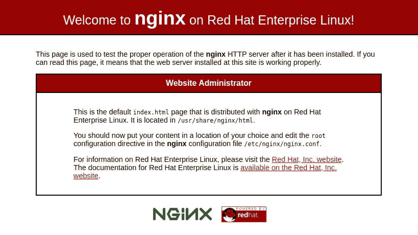

# 如何在 CentOS 8 上安装 LEMP——安装 Linux、Nginx、MySQL、PHP

> 原文：<https://blog.eldernode.com/install-lemp-on-centos-8/>


在本文中，我们将学习如何在 CentOS 8 上安装 LEMP。我们将逐步完成建立 LEMP 堆栈的过程，使用 [MariaDB](https://mariadb.org/) 作为数据库管理系统。

**先决条件**

为了让这个指南更有用，你需要以 sudo 用户的身份访问 [CentOS 8](https://eldernode.com/initial-set-up-centos-8/) 服务器。

## 如何在 CentOS 8 上安装 LEMP

### 1- 安装 Nginx

要安装 Nginx 包，运行下面的。

```
sudo dnf install nginx
```

要启用并启动服务器，请在安装完成后运行以下命令。

```
sudo systemctl start nginx 
```

如果 firewalld 处于活动状态，运行以下命令以允许外部访问端口 80 (HTTP):

```
sudo firewall-cmd --permanent --add-service=http 
```

要使更改生效，请重新加载防火墙配置

```
sudo firewall-cmd --reload
```

如果添加新的防火墙规则，您可以通过从 web 浏览器访问服务器的公共 IP 地址或域名来测试服务器是否启动并运行。这样，下面的页面就会出现。



**阅读更多:**

**和**

### 2- 安装 MariaDB

要安装 MariaDB，请键入:

```
sudo dnf install mariadb-server
```

安装完成后，使用以下命令启用并启动 MariaDB 服务器:

```
sudo systemctl start mariadb
```

建议您运行 MariaDB 预安装的安全脚本，以提高数据库服务器的安全性。通过以下命令，启动交互式脚本。

```
sudo mysql_secure_installation
```

您将被要求输入当前的**数据库根**密码。密码为空，在提示下按键输入。下一个提示希望您设置一个**数据库 root** 密码。您不需要设置密码，因为 MariaDB 对根用户使用特殊的认证方法，这通常比使用密码更安全。键入 N 并按下键进入

### 3- 安装 PHP-FPM

键入以下命令进行安装。

```
sudo dnf install php-fpm php-mysqlnd
```

完成安装后，您应该编辑 /etc/php-fpm.d/www.conf 文件来调整一些设置。为了方便编辑这些文件，你需要安装 nano 。

```
sudo dnf install nano 
```

然后，使用 nano 或您选择的编辑器打开/etc/PHP-fpm . d/www . confc配置文件:

```
sudo nano /etc/php-fpm.d/www.conf 
```

确保将这两个值从 apache 更改为 Nginx:

```
…  ; RPM: apache user chosen to provide access to the same directories as httpd  user = nginx  ; RPM: Keep a group allowed to write in log dir.  group = nginx  …
```

编辑后，保存并关闭文件。并运行下面的命令来启用和启动 php-fpm

```
sudo systemctl start php-fpm
```

是时候重启 Nginx web 服务器了，它会加载由 php-fpm 安装创建的配置文件:

```
sudo systemctl restart nginx
```

[购买 Linux 虚拟私有服务器](https://eldernode.com/linux-vps/)

### 4- 用 Nginx 测试 PHP

您需要在 Nginx 的文档根目录下修改默认的所有者和组，以便能够使用常规的非根系统用户在该位置创建和修改文件:

```
sudo chown -R noodi.noodi /usr/share/nginx/html/
```

在 /usr/share/nginx/html 目录下创建一个名为info.php的新 PHP 文件:

```
nano /usr/share/nginx/html/info.php  
```

要查看服务器上运行的当前 PHP 环境的信息，请使用下面的 PHP 代码。

```
<?php    phpinfo(); 
```

将此内容复制到您的info.php文件中，并务必保存。

要测试您的 web 服务器是否正确显示 PHP 脚本生成的内容，请使用您的浏览器并访问您的服务器主机名或 IP 地址，然后输入 /info.php :

```
http://server_host_or_IP/info.php
```

您可能会看到如下页面。


亲爱的用户，我们希望这篇教程能对你有所帮助，如果你有任何问题或想查看我们的用户关于这篇文章的对话，请访问[提问页面](https://eldernode.com/ask)。也为了提高你的知识，有这么多有用的教程为[老年节点培训](https://eldernode.com/blog/)准备。

**同样，参见**

[如何在 Ubuntu 20.04 上安装 lamp](https://eldernode.com/how-to-install-lamp-on-ubuntu-20-04/)

**Also, see**

[How to install lamp on Ubuntu 20.04](https://eldernode.com/how-to-install-lamp-on-ubuntu-20-04/)