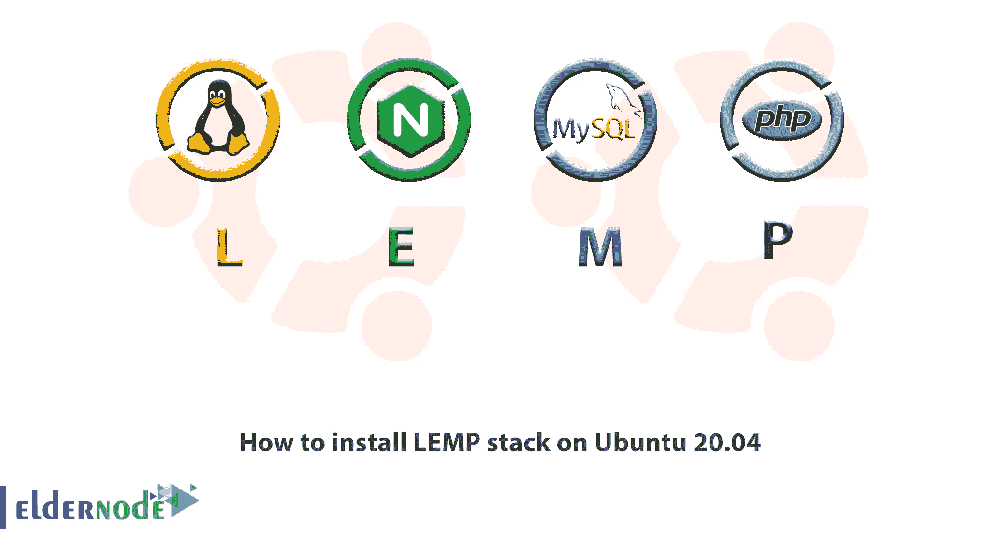

# 如何在 Ubuntu 20.04 上安装 LEMP 栈——Linux，Nginx，MySQL，PHP

> 原文：<https://blog.eldernode.com/install-lemp-stack-ubuntu20/>



Ubuntu 操作系统满足了第一个要求。在这篇文章中，我们将向你学习如何在 Ubuntu 20.04 上安装 LEMP 堆栈，并让其余的组件正常运行。

LEMP 软件栈(Linux，Nginx，MySQL，PHP)是一组软件，可以用来服务于用 [PHP](https://www.php.net/) 编写的动态网页和网络应用，它描述了一个带有 Nginx 网络服务器的 **L** inux 操作系统。后端数据存储在 **M** ySQL 数据库中，动态处理由 **P** HP 处理。

#### 先决条件

如果您知道以下内容，本教程可能会更有用:

## 如何在 Ubuntu 20.04 上安装 LEMP 栈

让我们通过下面的步骤来完成教程，学习如何在 Ubuntu 20.04 上**安装** **Linux，Nginx，MySQL，PHP。**

**另外，您可以在:**中找到相关文章

**[如何在 CentOS 8 上安装 LEMP](https://eldernode.com/install-lemp-on-centos-8/)**

**[灯堆教程](https://eldernode.com/tag/lamp-stack/)**

**[如何在 CentOS 8 上安装 LEMP](https://eldernode.com/install-lemp-on-centos-8/)**

### 1-安装 Nginx Web 服务器

您需要使用 Nginx，一种高性能的 web 服务器，向您的站点访问者显示网页。为此，请使用 **apt** 软件包管理器来获取该软件。但是请考虑你必须更新它，因为这是第一次使用 apt 。

运行以下命令来更新并安装 Nginx:

```
sudo apt update  sudo apt install nginx
```

当你输入 **Y** 确认你要安装 Nginx 时，Nginx 网络服务器将会在你的 Ubuntu 20.04 服务器上激活并运行。

由于我们建议您启用 **ufw** 防火墙，当您这样做时，您将需要允许连接到 Nginx。幸运的是，Nginx 在安装时用**ufw** 注册了一些配置文件。

要查看哪些 UFW 简档可用:

```
sudo ufw app list
```

输出

```
Available applications:    Nginx Full    Nginx HTTP    Nginx HTTPS    OpenSSH
```

建议您启用仍允许您需要的流量的最严格的配置文件。此外，您只需要允许端口 80、上的常规 HTTP 流量，因为您可能没有在本指南中为您的服务器配置 SSL。

使用下面的命令来启用

```
sudo ufw allow 'Nginx HTTP' 
```

要验证更改，请执行以下操作:

```
sudo ufw status
```

如果现在允许 HTTP 流量，您将看到以下输出:

输出

```
Status: active    To                         Action      From  --                         ------      ----  OpenSSH                    ALLOW       Anywhere  Nginx HTTP                 ALLOW       Anywhere OpenSSH (v6)               ALLOW       Anywhere (v6)  Nginx HTTP (v6)            ALLOW       Anywhere (v6)
```

您将添加新的防火墙规则，以便能够通过在 web 浏览器中访问服务器的域名或公共 IP 地址来测试服务器是否启动并运行。如果您没有指向您的服务器的域名，并且您不知道您的服务器的公共 IP 地址，请运行下面的命令来找到它。

**注意**:在打印出几个 IP 地址后，您可以在您的网络浏览器中依次尝试每一个:

```
ip addr show eth0 | grep inet | awk '{ print $2; }' | sed 's/\/.*$//' 
```

Aso，您可以从互联网上的其他位置查看哪个 IP 地址是可访问的:

```
curl -4 icanhazip.com
```

要访问 Nginx 的默认登录页面，请键入您在网络浏览器中收到的地址。

```
http://server_domain_or_IP
```


当您看到上面的页面时，这意味着您已经成功安装了 Nginx，并为您的 web 服务器启用了 HTTP 流量。

[**购买 VPS 服务器**](https://eldernode.com/vps/)

### 2-安装 MySQL

在建立并运行 web 服务器之后，让我们安装数据库系统，以便能够为您的站点存储和管理数据。如你所知，MySQL 是 PHP 环境中使用的一个流行的数据库管理系统。

同样，我们使用 apt 来获取并安装该软件:

```
sudo apt install mysql-server 
```

通过键入 Y ，然后输入，当询问您时确认安装。

安装完成后，建议您运行 MySQL 预安装的安全脚本。这样做是为了让脚本删除一些不安全的默认设置，并锁定对数据库系统的访问。通过运行以下命令启动交互式脚本:

```
sudo mysql_secure_installation
```

接下来，它会询问您是否要配置 **验证密码插件** 。如果您启用它，不符合指定标准的密码将被 MySQL 拒绝并出错。因此，禁用验证是安全的，但是您应该始终使用强大、唯一的 [密码](https://eldernode.com/how-to-create-strong-password/) 作为数据库凭证。

此时，回答 **Y** 为是，否则不启用继续。

```
VALIDATE PASSWORD PLUGIN can be used to test passwords  and improve security. It checks the strength of password  and allows the users to set only those passwords which are  secure enough. Would you like to setup VALIDATE PASSWORD plugin?    Press y|Y for Yes, any other key for No:
```

之后，如果您回答“是”，将要求您选择密码验证的级别。不要忘记，如果您输入 **2** 作为最强级别，当您试图设置任何不包含数字、大小写字母和特殊字符或基于常用字典单词的密码时，您将会收到错误。

```
There are three levels of password validation policy:    LOW    Length >= 8  MEDIUM Length >= 8, numeric, mixed case, and special characters  STRONG Length >= 8, numeric, mixed case, special characters and dictionary              file    Please enter 0 = LOW, 1 = MEDIUM and 2 = STRONG: 1
```

无论您是否选择设置 **验证密码插件** ，您的服务器接下来都会要求您选择并确认 MySQL **root** 用户的密码。这不要与**系统根**混淆。**数据库根用户**是对数据库系统拥有完全权限的管理用户。您需要在这里定义一个强密码作为额外的安全措施，即使 MySQL root 用户的默认身份验证方法不使用密码，**即使设置了密码。**

然后，如果您启用了密码验证，您将看到刚才输入的根密码的密码强度，您的服务器将询问您是否要继续使用该密码。如果您对自己的选择持肯定态度，请在提示符下输入 Y 表示“是”。

```
Estimated strength of the password: 100   Do you wish to continue with the password provided?(Press y|Y for Yes, any other key for No) : y
```

要删除一些匿名用户和测试数据库，禁用远程 root 登录并加载这些新规则，以便 MySQL 立即尊重您所做的更改，请按下 Y 并在其余问题的每个提示处点击 ENTER 键。

要测试您是否能够登录到 MySQL 控制台:

```
sudo mysql
```

输出

```
Welcome to the MySQL monitor.  Commands end with ; or \g.  Your MySQL connection id is 22  Server version: 8.0.19-0ubuntu5 (Ubuntu)    Copyright (c) 2000, 2020, Oracle and/or its affiliates. All rights reserved.    Oracle is a registered trademark of Oracle Corporation and/or its  affiliates. Other names may be trademarks of their respective  owners.    Type 'help;' or '\h' for help. Type '\c' to clear the current input statement.    mysql>
```

要退出 MySQL 控制台:

```
mysql > exit
```

关于额外的要点，我们可以提到，你不需要提供密码来作为 **root** 用户连接，即使你在运行**MySQL _ secure _ installation**脚本时已经定义了一个密码。原因是管理员 MySQL 用户的默认认证方式是 **unix_socket** 而不是 **密码** 。虽然这起初看起来像是一个安全问题，但它使数据库服务器更加安全，因为只允许拥有 sudo 权限的系统用户作为 **root** MySQL 用户登录，这些系统用户从控制台或通过以相同权限运行的应用程序进行连接。事实上，这意味着您将无法使用管理数据库根用户从您的 PHP 应用程序进行连接。为 **root** MySQL 账户设置密码是一种保护措施，以防默认认证方法从 unix_socket 更改为密码。

提高安全性的最佳方式似乎是为每个数据库设置特权较少的专用用户帐户，尤其是如果您计划在服务器上托管多个数据库。

### 3-安装 PHP

现在，是时候安装 PHP 来处理代码并为 web 服务器生成动态内容了。

为了在大多数基于 PHP 的网站中获得更好的整体性能，Apache 在每个请求中嵌入了 PHP 解释器，Nginx 需要一个外部程序来处理 PHP，并充当 PHP 解释器本身和 web 服务器之间的桥梁，但这需要额外的配置。但是，它还需要额外的配置。接下来你要安装**php-fpm**(PHP fastCGI 进程管理器)并告诉 Nginx 将 PHP 请求传递给这个软件进行处理。记住 **php-mysql** ，一个允许 php 与基于 mysql 的数据库通信的 PHP 模块是必需的，核心 PHP 包将作为依赖项自动安装。

使用以下命令安装 php-fpm 和 php-mysql 包。

```
sudo apt install php-fpm php-mysql 
```

像往常一样，输入 **Y** 和 **当你被询问时，输入** 确认安装。

### 4-配置 Nginx 使用 PHP 处理器

类似于 Apache 中的虚拟主机，当使用 Nginx web 服务器封装配置细节并在单个服务器上托管多个域时，可以创建服务器块。

在 Ubuntu 20.04 上，Nginx 有一个默认启用的服务器块，配置为在 **/var/www/html** 提供目录外的文档。如果您托管多个站点，管理起来会变得很困难，直到这对于单个站点很有效。

此外，您可以在 your_domain 网站的 **/var/www** 中创建一个目录结构，保留//var/www/html作为缺省目录，以便在客户端请求不匹配任何其他站点时提供服务，而不是修改 **/var/www/html** 。

要为您的 _domain 创建根 web 目录，请执行以下操作:

```
sudo mkdir /var/www/your_domain 
```

然后，使用 $USER 环境变量分配目录的所有权，该变量将引用您当前的系统用户:

```
sudo chown -R $USER:$USER /var/www/your_domain 
```

使用您喜欢的命令行编辑器在 Nginx 的 sites-available 目录中打开一个新的配置文件。

```
sudo nano /etc/nginx/sites-available/your_domain
```

在创建一个新的空白文件时，粘贴以下的基本配置。【T2 

/etc/nginx/sites-available/your _ domain

```
server {      listen 80;      server_name your_domain www.your_domain;      root /var/www/your_domain;        index index.html index.htm index.php;        location / {          try_files $uri $uri/ =404;      }        location ~ \.php$ {          include snippets/fastcgi-php.conf;          fastcgi_pass unix:/var/run/php/php7.4-fpm.sock;       }        location ~ /\.ht {          deny all;      }    }
```

要查看这些指令和位置块的作用，请看下面的列表。

1- 监听 —定义 Nginx 将监听的端口。在这种情况下，它将监听端口 80，【HTTP 的默认端口。

2–根 —定义存储该网站提供的文件的文件根。

3- 索引 —定义 Nginx 为该网站排列索引文件的优先顺序。一种常见的做法是列出优先级高于 index.php 文件的 index.html 文件，以便在 PHP 应用程序中快速建立维护登录页面。您可以调整这些设置，以更好地满足您的应用需求。

4- 服务器名 —定义该服务器块应响应的域名和/或 IP 地址。**将此指令指向您的服务器的域名或公共 IP 地址。**

5- 位置/ —第一个位置块包括一个 try_files 指令，它检查是否存在与 URI 请求相匹配的文件或目录。如果 Nginx 找不到合适的资源，它将返回 404 错误。

6- 地点~ \。php$ —这个位置块通过将 Nginx 指向 fastcgi-php.conf 配置文件和 php7.4-fpm.sock 文件来处理实际的 php 处理，这两个文件声明了哪个套接字与 php-fpm 相关联。

7- 地点~ /\。ht —最后一个位置块处理。htaccess 文件，Nginx 不处理这些文件。通过添加拒绝所有指令，如果有的话。htaccess 文件碰巧找到了进入文档根的路径，它们不会被提供给访问者。

如果你使用的是 nano 保存并关闭文件T3，方法是输入 CTRL+X ，然后输入 y 和回车确认你完成了编辑。

链接到 Nginx 的 sites-enabled 目录中的配置文件，激活您的配置。

```
sudo ln -s /etc/nginx/sites-available/your_domain /etc/nginx/sites-enabled/ 
```

因此，Nginx 将被告知在下次重新加载时使用该配置。

要测试配置中的语法错误，请执行以下操作:

```
sudo nginx -t 
```

如果遇到任何错误，您可以在继续之前返回到配置文件中查看其内容。

然后，重新加载 Nginx 以应用更改:

```
sudo systemctl reload nginx 
```

您的新网站现在是活动的，但是 webroot/var/www/your _ domain仍然是空的。因此，为了测试您的新服务器块是否按预期工作，在那个位置创建一个 index.html 文件。

```
nano /var/www/your_domain/index.html 
```

/var/www/your _ domain/index . html

```
<html>    <head>      <title>your_domain website</title>    </head>    <body>      <h1>Hello World!</h1>        <p>This is the landing page of <strong>your_domain</strong>.</p>    </body>  </htm
```

要进入浏览器并访问服务器的域名或 IP 地址:

http://server _ domain _ or _ IP

将出现如下页面:

**注意** :查看此页面意味着您的 Nginx 服务器模块正在按预期工作。


现在，你可以把这个文件留在原处作为你的应用程序的临时登陆页面，直到你建立一个index.php文件来替换它。所以，不要忘记从你的文档根目录中删除或重命名 index.html 的文件，因为默认情况下它优先于 index.php 的文件。

### 5-用 Nginx 测试 PHP

直到这一步，你已经完全设置好了你的 **LEMP 堆栈**。为了验证 Nginx 能够正确的处理。php 文件下载到您的 php 处理器，您可以按照我们下面的解释来测试它。

为此，在您的文档根目录中创建一个测试 PHP 文件。在文本编辑器的文档根目录下打开一个名为info.php的新文件:

```
nano /var/www/your_domain/info.php 
```

接下来，将下面几行粘贴到新文件中。这是一个有效的 PHP 代码，它将返回关于您的服务器的信息:

/var/www/your_domain/info.php

```
<?php  phpinfo();
```

再次，保存并关闭文件，方法是键入 CTRL + X ，然后 y 和输入 以确认完成。然后，您可以通过访问您在 Nginx 配置文件中设置的域名或公共 IP 地址，然后通过 /info.php ，在您的 web 浏览器中访问该页面:

http://server _ domain _ or _ IP/info . PHP

之后，您将看到一个网页，其中包含有关您的服务器的详细信息:


最好删除您创建的文件，因为它包含了您的 PHP 环境和 Ubuntu 服务器的敏感信息，当您通过该页面检查 PHP 服务器的相关信息时。使用 rm 删除该文件。

```
sudo rm /var/www/your_domain/info.php
```

**注意**:如果以后需要，您可以随时重新生成该文件。

### 6-从 PHP 测试数据库连接(可选)

使用虚拟数据创建一个测试表，并从 PHP 脚本中查询其内容，以测试 PHP 是否能够连接到 MySQL 并执行数据库查询。但是首先，您需要创建一个测试数据库和一个正确配置的新 MySQL 用户来访问它。

然后，创建一个名为 **example_database** 的数据库和一个名为 **example_user** 的用户，你可以用不同的值替换这些名称。

使用 **root** 帐户连接到 MySQL 控制台:

```
sudo mysql
```

使用以下命令创建新数据库:

```
mysql > CREATE DATABASE example_database; 
```

之后，您可以创建一个新用户，并授予他们刚刚创建的自定义数据库的全部权限。

通过运行下面的命令，您将创建一个名为 example_user 的新用户，使用 mysql_native_password 作为默认的身份验证方法。记得用你自己选择的安全密码替换这个值(密码)。

```
mysql > CREATE USER 'example_user'@'%' IDENTIFIED WITH mysql_native_password BY 'password'; 
```

接下来，授予该用户对 example_database 数据库的权限:

```
mysql >GRANT ALL ON example_database.* TO 'example_user'@'%'; 
```

这将赋予 **example_user** 用户对 **example_database** 数据库的全部权限，同时防止该用户在您的服务器上创建或修改其他数据库。

要退出 MySQL shell:

```
mysql > exit
```

通过再次登录 MySQL 控制台，您可以测试新用户是否具有适当的权限，这一次使用自定义用户凭证:

```
mysql -u example_user -p 
```

在这个命令中，注意 **-p** 标志，它会提示您在创建 **example_user** 用户时使用的密码。登录 MySQL 控制台后，确认您有权访问 example_database 数据库:

```
mysql > SHOW DATABASES; 
```

输出

```
+--------------------+  | Database           |  +--------------------+  | example_database   |  | information_schema |  +--------------------+  2 rows in set (0.000 sec)
```

现在，创建一个名为 **todo_list** 的测试表。从 MySQL 控制台，运行以下语句:

```
mysql >CREATE TABLE example_database.todo_list ( mysql >item_id INT AUTO_INCREMENT,  mysql >content VARCHAR(255),  mysql >PRIMARY KEY(item_id)  mysql >);
```

在测试表中插入几行内容，您可以使用不同的值重复下一个命令几次:

```
INSERT INTO example_database.todo_list (content) VALUES ("My first important item");
```

运行以下命令，确认您已将数据成功保存到表中。

```
mysql > SELECT * FROM example_database.todo_list; 
```

输出

```
`+---------+--------------------------+  | item_id | content                  |  +---------+--------------------------+  |       1 | My first important item  |  |       2 | My second important item |  |       3 | My third important item  |  |       4 | and this one more thing  |  +---------+--------------------------+  4 rows in set (0.000 sec)`
```

`在确认测试表中有有效数据后，您可以退出 MySQL 控制台。`

```
`mysql > exit`
```

`下面的 PHP 脚本连接到 MySQL 数据库。并查询 **todo_list** 表的内容，在列表中显示结果。如果数据库连接有问题，它会抛出一个异常。将这些内容复制到您的 todo_list.php 脚本中:`

`/var/www/your _ domain/todo _ list . PHP`

`user = "example _ user "；
密码= " 密码"；
数据库= " 示例 _ 数据库"；
table = "todo _ list"；`

`试试{
db =新 PDO(" MySQL:host = localhost；dbname =数据库”，用户，密码)；
echo "<H2>TODO</H2>ol>；【foreach】(db->query(" SELECT content FROM table ")as row){
echo "<Li>"。第['content']行。”</李>；
}
echo</ol>；
} catch (PDOException e) {
打印“错误！: " .getMessage()。"<br/>"；
die()；
}`

`现在，您可以保存并关闭文件。`

`**最后，**您将看到这样一个页面，显示您在测试表中插入的内容:`

``

`因此，在这一点上，这意味着您的 PHP 环境已经准备好与您的 MySQL 服务器进行连接和交互。`

`亲爱的用户，我们希望你喜欢这个教程**如何在 Ubuntu 20.04** 上安装 LEMP 堆栈，你可以在评论区提出关于这个培训的问题，或者解决 [Eldernode](https://eldernode.com/) 培训领域的其他问题，请参考 [提问页面](https://eldernode.com/ask) 部分并在其中提出你的问题。`

##### `**也，读作**`

`**[在 Ubuntu 18.04 上用 LEMP 安装 WordPress](https://eldernode.com/wordpress-nginx-mariadb-php-ubuntu/)**`

`**[如何在 Ubuntu 20.04 上安装灯](https://eldernode.com/how-to-install-lamp-on-ubuntu-20-04/)**`

`**[在 CentOS 8 上安装灯栈](https://eldernode.com/install-lamp-stack-on-centos-8/)**`

`**[如何在 Debian 10 上安装 LEMP 栈](https://eldernode.com/install-lemp-debian-10/)**`