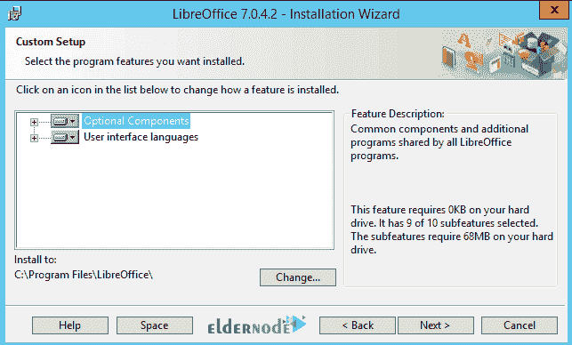

# 在 Windows RDP 2012 上安装 LibreOffice 教程- Eldernode 博客

> 原文：<https://blog.eldernode.com/install-libreoffice-on-windows-rdp-2012/>

LibreOffice 是由自由文档基金会开发的免费办公套件软件。这个软件取自 OpenOffice 套件。LibreOffice 制造商的目标是创建一个具有 ODF 支持的独立办公套件，这不是一个版权问题。LibreOffice 是用微软 Office 替代它的免费软件。使用过功能强大的 OpenOffice 软件的用户都知道，它的工作原理类似于 Microsoft Office。过了一段时间，OpenOffice 的创造者决定对软件进行修改，这导致了 OpenOffice 的一个分支 LibreOffice 的创建。LibreOffice 软件非常强大，在某些情况下可以成为微软 Office 的竞争对手。在本文中，我们试图让您了解如何在 Windows RDP 2012 上安装 LibreOffice。您可以在 [Eldernode](https://eldernode.com/) 查看套装，购买 [Admin RDP](https://eldernode.com/buy-rdp/) 服务器。

## **如何在 Windows RDP 2012 上安装 libre office**

LibreOffice 是一款针对 [Windows](https://blog.eldernode.com/tag/windows/) 操作系统的免费且功能强大的软件。该程序通过提供丰富的数据处理功能来满足您的需求。该软件的文字处理器可以快速完整地编辑数据，还可以打印文档。该程序的默认图像和插入预定义表情符号的能力是该程序的其他功能。

存储和创建数学方程和符号的可能性可以尽快输入到这个程序中。您可以使用免费的 LibreOffice 套件作为 Microsoft Office 的便捷替代品，并利用其丰富的功能。

### **在 Windows 上安装 LibreOffice 的先决条件**

在开始在 [Windows RDP](https://eldernode.com/buy-rdp/) 2012 上安装 LibreOffice 之前，考虑以下先决条件很重要。还建议您在安装程序之前备份您的系统。

**–**微软 Windows 7 SP1 版、Windows 8、Windows Server 2012 或 [Windows 10](https://eldernode.com/windows-10-rdp/)

**–**兼容奔腾的电脑(推荐奔腾 III、Athlon 或更新的系统)

**–**256 MB 内存(建议使用 512 MB 内存)

**–**高达 1.5 GB 的可用硬盘空间

**–**1024×768 分辨率(推荐更高分辨率)，至少 256 色

### **在 Windows RDP 2012 服务器上安装 libre office**

第一步是下载 LibreOffice 软件。所以去 [LibreOffice 网站](https://www.libreoffice.org/)从**下载**部分选择你想要的平台，下载 LibreOffice。

第二步，你需要去你下载 LibreOffice 文件的地方。然后双击它开始安装过程。

在打开的窗口中，点击**运行**。

然后点击**下一步**继续安装过程。

在此步骤中，您必须选择安装类型。如果您想要默认设置，单击下一个的**。但是如果你想自定义设置，选择**自定义**，点击**下一个**。我们在这里选择自定义。**

如果你想安装拼写词典，断字规则，词库和语法术语，你必须点击选项旁边的(+)号。完成所需设置后，点击**下一步**进入下一步。

下一个窗口叫做**文件类型**，是关于选择用 LibreOffice 打开 Microsoft Office 文档。需要注意的是，如果希望 LibreOffice 打开 Microsoft Office 文件，必须勾选所有项目。然后点击**下一个**。

如果您想在桌面上创建程序的快捷方式，请选择第一个选项。您也可以选择第二个选项，在引导系统时加载程序。然后点击**安装**。

最后，点击 **Finish** 成功完成安装过程。

## 结论

LibreOffice 是一款免费且功能强大的 Windows 操作系统软件。这个软件可以让你快速编辑数据，插入符号和数学方程式。这个软件是一个强大的文字处理器，功能丰富，取代了微软 Office。也兼容微软 Office、Excel、Powerpoint 等格式的所有文件格式。您还可以将它们保存为 Microsoft Office 格式和您需要的其他格式。在本文中，我们试图教你如何在 Windows RDP 2012 上安装 LibreOffice。