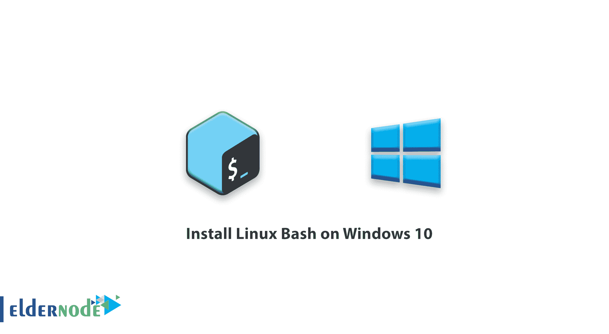
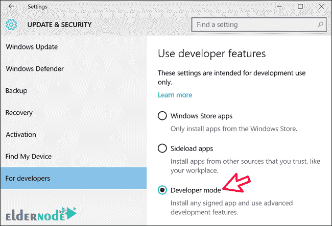
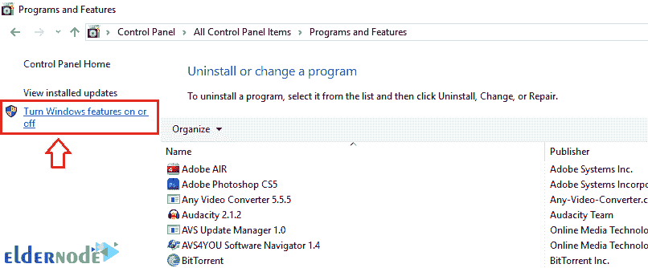
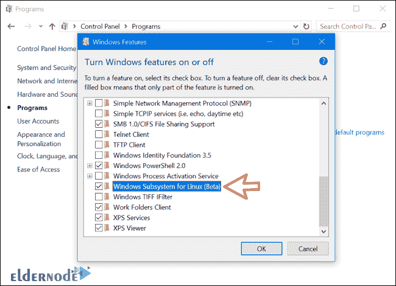
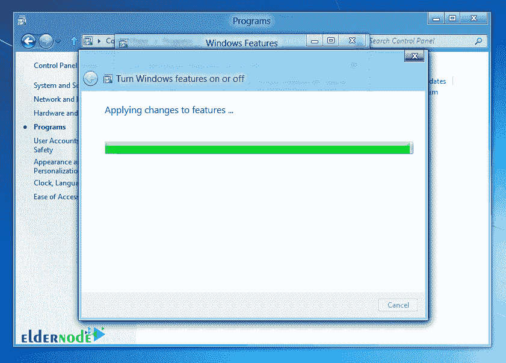
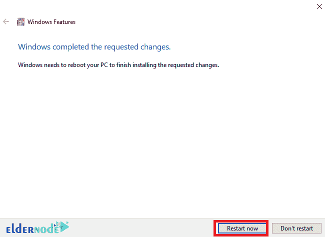
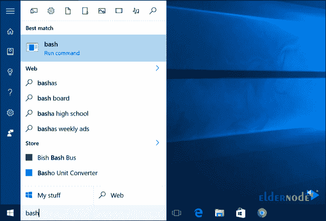
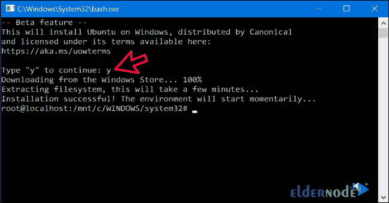
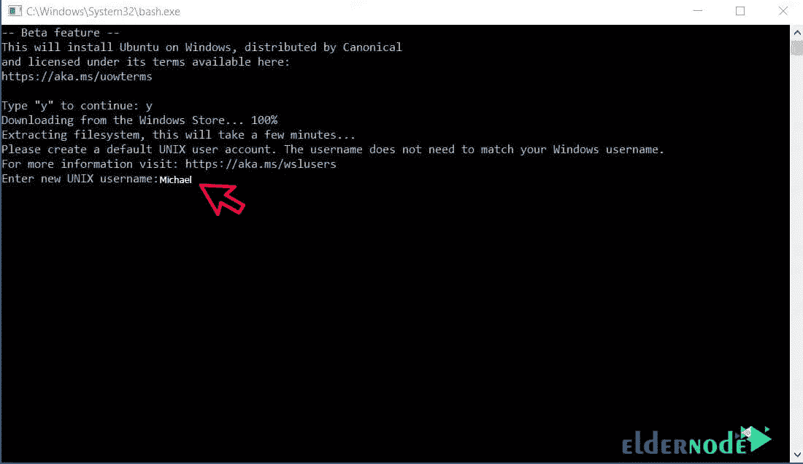

# 如何在 Windows 10 - Windows VPS 服务器上安装 Linux Bash

> 原文：<https://blog.eldernode.com/install-linux-bash-on-windows/>

如何在 Windows 10 上安装 Linux Bash？在 Windows 中发布 creator 更新后，[微软](https://www.microsoft.com/en-us/)增加了一个功能，允许用户在 Windows 10 中安装 Bash Linux 。

在 Windows 中安装了 Linux Bash 或 Linux 终端后，Windows 用户将能够在 Windows 中执行并使用 Linux 命令。在本文中，我们将讨论如何在 Windows 10 中使用和安装 Linux Bash。

**注:**Windows 上的 Linux Bash 只能用于运行 OS Build 14393.0 或更高版本的 Windows。
Windows Build OS 10 将在设置窗口中可见。

[**在 Eldernode**](https://eldernode.com/windows-vps/) 选择您的完美 Windows 虚拟专用服务器包

## 在 Windows 10 上安装 Linux Bash

该功能默认未启用，用户可以通过激活开发者模式来添加。

**1。**T3 首先，通过**开始菜单**打开设置窗口。

**2。** 然后进入开发者部分，点击开发者模式进行选择。

**3。** 通过控制面板打开程序和功能。

要打开程序和功能，可以通过按 **Winkey + R** 打开运行窗口，进入 appwiz.cpl 打开该窗口。

**4。**T3 点击开启或关闭 Windows 功能。

**5。** 导航至页面底部，选择[Linux 的 Windows 子系统](https://msdn.microsoft.com/en-us/commandline/wsl/install-win10) ，点击确定。

**6。**T3 等待功能安装到完成。

**7。** 完成这一步后，点击立即重启到**重启**系统。

**8。** 通过开始菜单启动系统后，搜索短语 bash 并打开。

**9。** 打开**终端**后，输入 **y** 到完全下载 Bash 。

**10。** 完成下载后，会要求你输入用户名和密码才能**登录**。

输入它们以创建下次登录的用户名和密码。

**11。** 完成后就可以在 Windows 上使用Bash Linux，它是基于 Ubuntu 的。

**尊敬的用户**，我们希望您能喜欢这个[教程](https://eldernode.com/category/tutorial/)，您可以在评论区提出关于本次培训的问题，或者解决[老年人节点培训](https://eldernode.com/blog/)领域的其他问题，请参考[提问页面](https://eldernode.com/ask)部分，并尽快提出您的问题。腾出时间给其他用户和专家来回答你的问题。

好运。