# 如何在 Windows 10 上安装 Linux Mint RDP-elder node 博客

> 原文：<https://blog.eldernode.com/install-linux-mint-on-windows-10/>

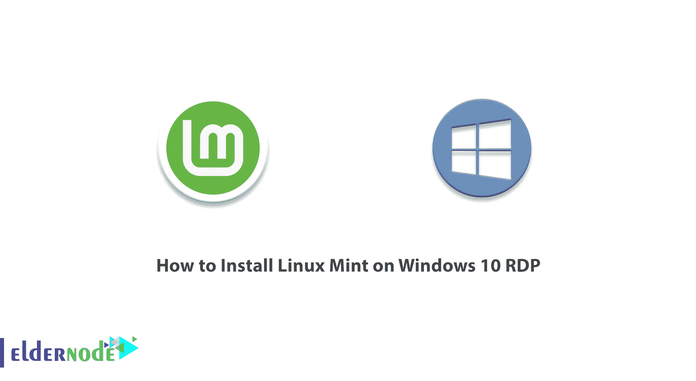

Mint 是基于 Debian 和 Ubuntu 的 Linux 发行版，刚加入 Linux 的用户可以轻松使用。在这篇文章中，我们将教你如何在 Windows 10 RDP 上安装 Linux Mint。此外，如果你想购买一台 [Windows 10 RDP](https://eldernode.com/windows-10-rdp/) ，你可以访问 [Eldernode](https://eldernode.com/) 中提供的软件包。

## **教程在 Windows 10 上安装 Linux Mint RDP**

### **什么是 Linux Mint？**

Linux Mint 是最受欢迎的免费开源 Linux 发行版之一，被数百万人使用。这个操作系统比大多数 Linux 发行版更容易安装。与大多数 Linux 发行版不同，Mint 包括专有的第三方浏览器插件、Java、多媒体支持和其他组件，以支持普遍接受的标准。这种支持允许 DVD 和蓝光播放以及 flash 播放媒体。Mint 的主要许可是 GNU GPL 和 LGPL。Linux Mint 由几个不同的软件包组成，这些软件包是在一个免费许可证下发布的。

### **如何在 Windows 10 上下载 Linux Mint RDP**

首先你要从你喜欢的网页浏览器上[官方 Linux Mint 网站](https://linuxmint.com/)。

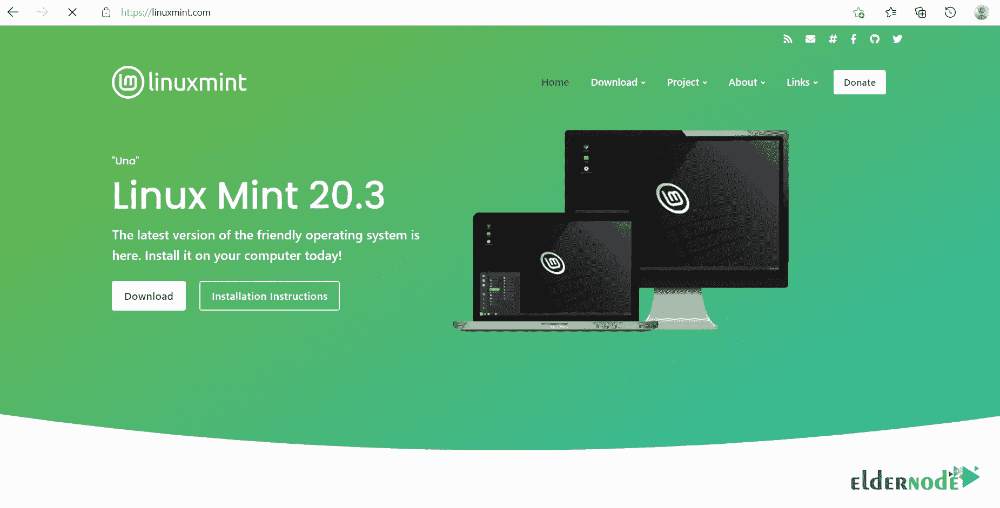

然后进入**下载**部分，向下滚动查看 Linux Mint 的版本。您应该选择想要安装的 Linux Mint 的期望版本。如果你想要一个更稳定更轻便的版本，你可以选择 **XFCE** 版本。但是如果你想要一个有更多功能的版本，肉桂色版本是一个更好的选择。

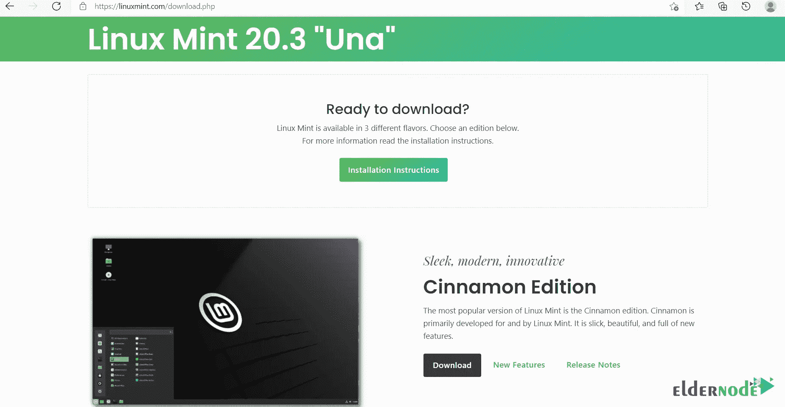

*

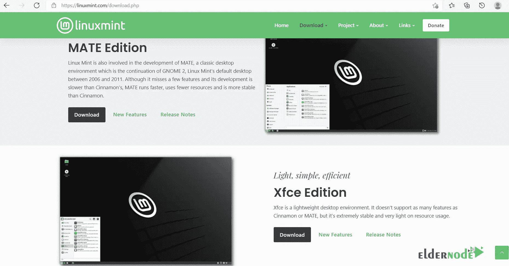

您可以从您所在国家的**下载镜像直接下载**或者从 Torrent 选项下载。

现在你应该点击想要的链接，在打开的窗口中选择**“保存文件”**并点击**确定**。

接下来，下载肯定已经开始了。下载完成后，进入下载文件夹，点击**下载的文件**。

请记住，您应该创建可引导介质、DVD 或 USB 驱动器来安装操作系统。您可以使用 Rufus 软件创建可引导介质。

这一步你要从 [Rufus 官网](https://rufus.ie/en/)下载 Rufus 软件。如果你下载了可移植版本，你不需要在你的系统上安装它。

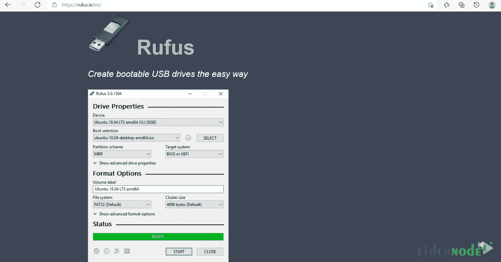

然后进入**下载**文件夹，打开下载的文件。打开文件后，您可以看到没有连接 USB 驱动器，您必须插入一个 USB 驱动器。

在**设备**部分，可以看到导入的 u 盘。你应该在第二部分**引导选择**中选择**“磁盘或 ISO 镜像”**，最后点击**选择**。

接下来，你需要选择下载的 **Linux Mint ISO 文件**。

分区方案部分有两个选项，包括 MBR 和 GPT。首先，你应该检查你的硬盘驱动器的分区方案，然后选择其中一个你要安装 Linux Mint。为此，您可以右键单击桌面上的**“这台电脑”**，然后选择**管理**。

电脑管理打开后，你应该选择**磁盘管理**。

现在**在你想要安装 Linux Mint 的磁盘上右击**，点击**属性**。然后你可以在**卷**部分决定你硬盘的分区方式。

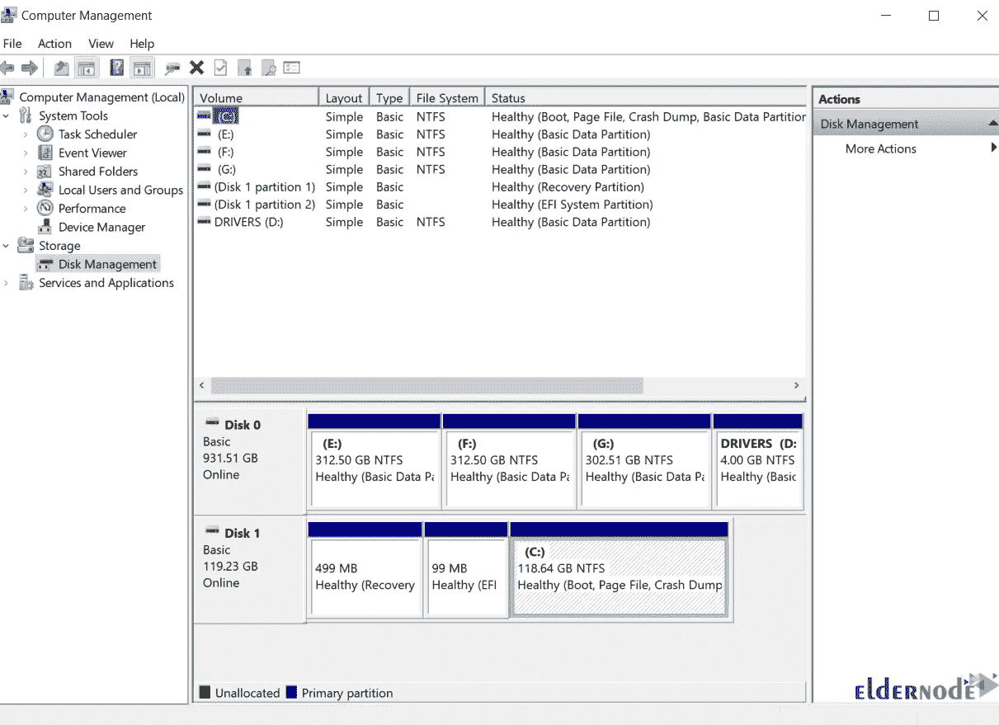

如果你的硬盘风格分区是 **MBR** ，你应该在分区方案部分选择 MBR，点击**开始**。

下载完成后，点击**确定**。

然后，您将收到一条警告，提示您 USB 驱动器上的所有数据都将被销毁，您应该备份闪存驱动器上的所有文件。

等待几分钟以完成该过程。过程完成后点击**关闭**。

最后，您应该弹出 USB 驱动器并关闭 Windows。

## **在 Windows 10 上安装 Linux Mint RDP**

首先，再次打开电脑，按下**启动菜单键**。您必须按下特殊功能键，并告诉机器固件(UEFI)从适当的 DVD 或 USB 驱动器启动。然后**重启**电脑。

记住特殊功能键通常是 **F12** 、 **F10** 或 **F2** 取决于主板制造商。

现在 USB 驱动器应该在**引导**菜单中列为 USB。你必须选择它并按下**回车**。

在这一步，您应该看到 Linux Mint 欢迎屏幕。选择**启动 Linux Mint** 并按**回车**。

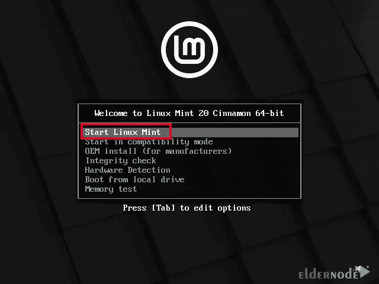

系统加载到 RAM 后，点击**“安装 Linux Mint”**。

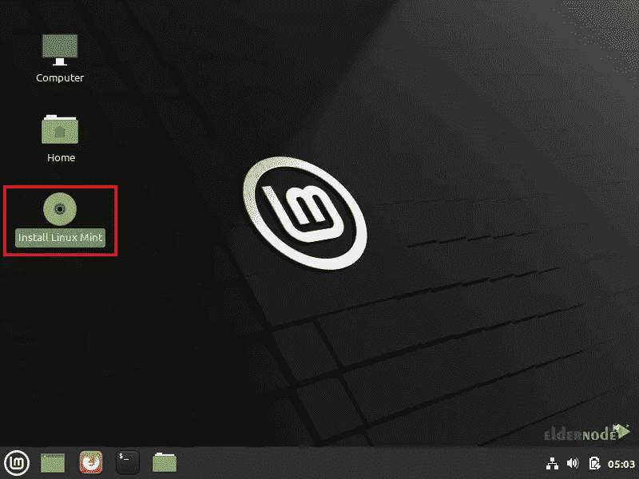

现在你应该选择你的**语言**，点击**继续**。

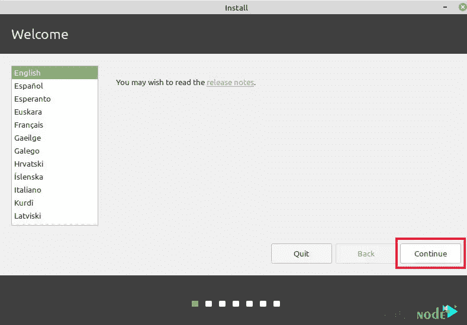

在这一步，你可以选择你的**键盘布局**。选择键盘布局后点击**继续**。

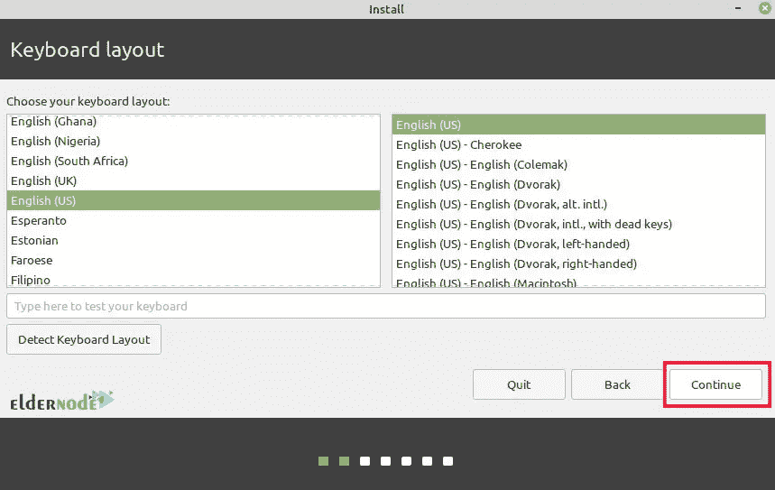

现在，您应该选中复选框以下载并安装多媒体编解码器，然后单击**继续**。

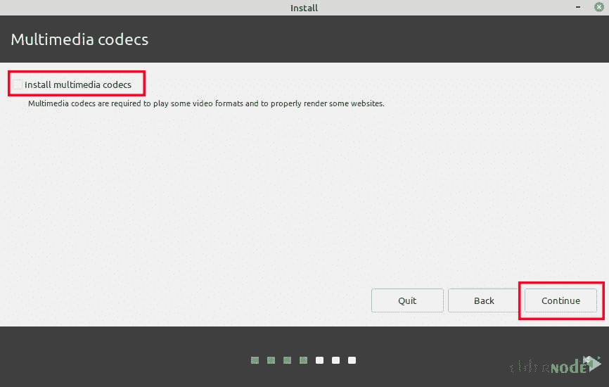

下一步选择**“在 Windows 10 旁边安装 Linux Mint】，点击**继续**。**

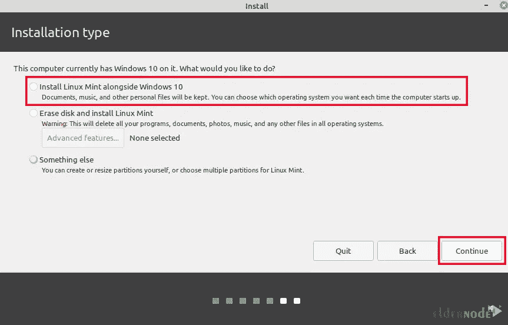

接下来，你应该给 Linux Mint 分配一些空间。分区调整操作开始。现在点击**继续**到**为 Linux Mint 创建一个分区**。

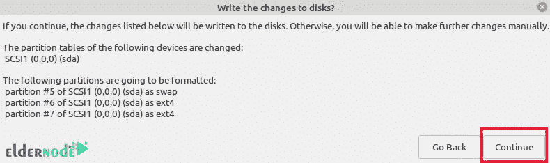

现在你应该选择你的**位置**并点击**继续**。

在这一步中填写你的**用户名**和**密码**并点击**继续**。

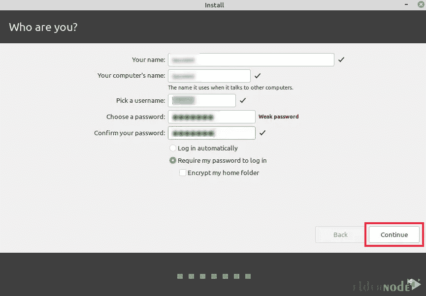

## **在 Windows 10 上安装 Linux Mint RDP**

现在 Linux Mint 安装应该开始了。

Linux Mint 安装完成后，点击**“立即重启”**。你应该移除你的 u 盘，然后按**回车**重启电脑。

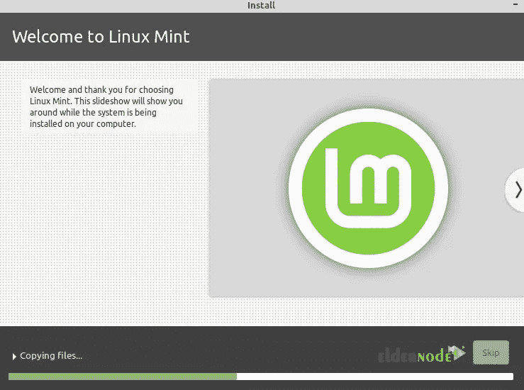

现在你可以选择是在 Linux 还是在 [Windows](https://blog.eldernode.com/tag/windows/) 下启动电脑。我们将选择 Linux Mint 并按下**回车**。

您应该再次输入您的密码并登录。

如果您的计算机是一个新的 UEFI 固件系统，Grub 引导程序将不会默认显示，设备将在 Windows 中自动启动。你必须按下**特殊功能启动**键启动进入 Linux，重启后，从那里按下选择更多你想启动的操作系统。

您可以进入 **UEFI** 设置，选择您的默认操作系统，然后**保存**更改以更改默认启动顺序。

## 结论

Linux Mint 已经发布，方便刚加入 Linux 的用户使用。在这篇文章中，我们教你如何在 Windows 10 RDP 上安装 Linux Mint。我希望这篇教程对你有用。