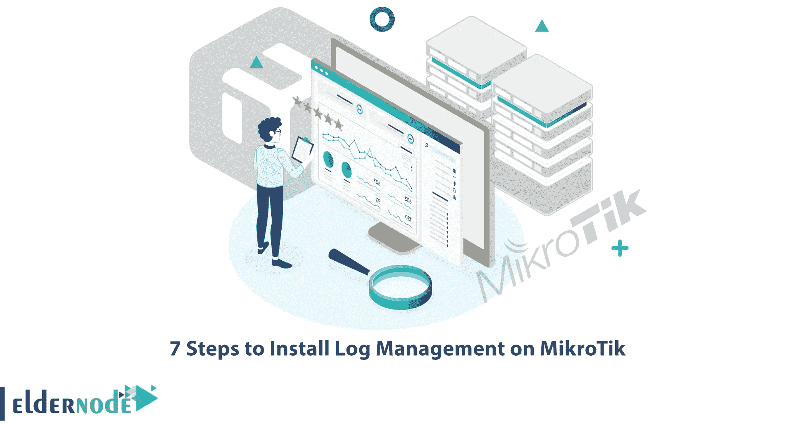

# 在 MikroTik 上安装日志管理的 5 个步骤

> 原文：<https://blog.eldernode.com/install-log-management-on-mikrotik/>

日志中的数据包含有价值的信息，可以通知技术团队应用程序的性能，并帮助他们发现问题。如果有效地进行日志管理，它可以帮助组织中的专业人员监控他们的程序并提高他们的性能。本教程将向您解释在 MikroTik 上安装日志管理的 5 个步骤。如果你打算买一辆 [MikroTik VPS](https://eldernode.com/mikrotik-vps-server/) ，你可以访问 [Eldernode](https://eldernode.com/) 网站上提供的计划。

## **如何在 MikroTik** 上安装日志管理

日志管理描述了用于生成、收集、集中、解析、传输、存储、存档和处置大量计算机生成的日志数据的所有活动和过程。您可以使用日志管理工具来管理由程序、系统、网络、软件或用户生成的所有日志，并根据组织的需求和策略进行处理。这不仅是系统管理员的热门话题，也是开发人员的热门话题。这样做的原因是，在许多 IT 部门中，日志的使用对于维护安全性、增强性能或故障排除非常重要。

### **1-下载并安装日志管理软件**

在 [MikroTik](https://blog.eldernode.com/tag/mikrotik/) 上安装日志管理的第一步是选择合适的日志管理软件。日志管理软件是一种用于检查网络设备生成的数据以发现安全威胁的程序。日志数据由路由器、交换机、防火墙、IDS/IPS、服务器、数据库和 web 服务器生成。日志管理工具会分析这些数据以发现安全威胁。最好选择有可视化仪表板并能提供大量图表的日志管理软件。

### **2-配置路由器的 Web 接口**

如果你搜索路由器的配置页面，你会发现很多有用的选项。无线路由器有各种可以配置的有用选项。另外，请注意，不同的路由器有不同的选项。不同的选项也会在不同的地方有不同的名称。

### **3-使用日志管理服务创建帐户**

在 Mikrotik 上安装日志管理的步骤之一是使用日志管理服务创建一个帐户。在安装过程中，您需要使用日志管理服务创建一个帐户。您可以使用日志管理服务将您的应用程序和基础结构数据连接到您的日志数据。

### **4-上传日志文件**

日志文件是计算机生成的数据文件，显示资源是否以最佳方式正常运行。它包含有关操作系统、应用程序、服务器或设备中的使用模式、活动和操作的信息。在这一步中，您应该将日志文件上传到您创建的帐户。

### **5-查看日志数据**

日志数据是在不同的系统或环境中收集和存储一段时间内的数据，并理解计算机生成的记录或日志的过程。它允许企业遵守安全政策、审计或法规，了解系统故障排除，也了解在线用户行为。

## 结论

日志管理是收集、存储、处理、组合和分析来自不同应用程序和程序的数据的过程。在本文中，我们解释了在 MikroTik 上安装日志管理的 5 个步骤。我希望这篇教程对你有用，并帮助你在 MikroTik 上安装日志管理。如果你有任何问题或建议，可以在评论区联系我们。