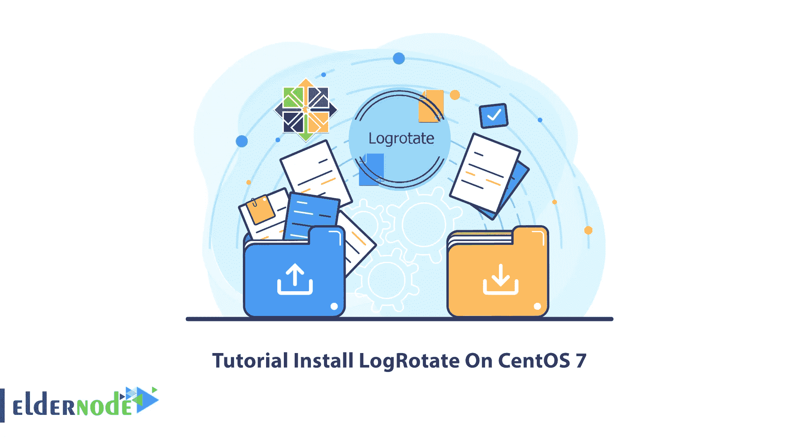

# 教程在 CentOS 7 - Eldernode 上安装 LogRotate

> 原文：<https://blog.eldernode.com/install-logrotate-on-centos-7/>



日志文件是由服务或程序生成的文件，用于通知它们的性能，以便网络管理员或程序员进行监控。如果日志文件变得非常大，var/log/也可能变得非常大。在 Linux 中，有旋转日志文件的工具。最常用的旋转工具叫做 LogRotate。这篇文章教你如何在 CentOS 7 上安装 LogRotate。如果你打算购买一台 [CentOS VPS](https://eldernode.com/centos-vps/) 服务器，你可以查看 [Eldernode](https://eldernode.com/) 网站上提供的套装。

## **什么是 LogRotate？**

LogRotate 是 [Linux](https://blog.eldernode.com/tag/linux/) 中的一项服务，通常每天运行一次，定义了归档日期的系统日志文件会被归档或删除。就功能而言，Logrotate 可以完全控制用户或软件本身在 Logrotate 的配置文件中指定的所有日志文件。它允许您轻松管理生成大量日志文件的系统。该服务还允许日志文件的自动旋转、压缩、删除和邮寄。

## **在 CentOS 7 上安装 LogRotate**

在本节中，我们将解释在 CentOS 7 上安装 LogRotate 的过程。首先，使用以下命令更新系统软件包:

```
yum update
```

使用以下命令在 CentOS 7 上安装 LogRotate:

```
yum install logrotate
```

**/etc/logrotate.conf** 配置文件表明，其他更具体的设置可以放在单独的**中。 **/etc/logrotate.d** 内的 conf** 文件。

如果下面一行存在且未被取消注释，将会发生这种情况:

```
include /etc/logrotate.d
```

### **在 CentOS 7 上配置 log rotate**

现在，您将了解如何在 CentOS 7 上配置 LogRotate。

首先，您需要在**/etc/log rotate . d/Apache 2 . conf**中插入以下内容，并检查每一行以表明其用途:

```
/var/log/apache2/* {      weekly      rotate 3      size 10M      compress      delaycompress  }
```

***注意:*** 你可能需要创建那个文件。

第一行中可用的块中的目录适用于 **/var/log/apache2** 中的所有日志:

**–>每周:**这意味着该工具将尝试每周轮换日志。

**–>旋转 3:** 这意味着只有 3 个旋转的日志将被保留，最旧的文件将在第四次运行时被删除。

**–>Size = 10M:**将旋转的最小尺寸设置为 10M。

**–>delay compress/compress:**过去，除了最近的日志之外，所有旋转的日志都应该被压缩。

您应该在配置文件后使用-d 选项执行一次试运行。如果 LogRotate 现在实际运行，它会做以下事情:

```
logrotate -d /etc/logrotate.d/apache2.conf
```

您可以使用下面的命令在日志循环日期之后对日志进行重命名:

```
dateext
```

同样，使用以下命令**防止旋转**发生:

```
notifempty
```

可以使用**/etc/log rotate . d/squid . conf**来旋转**/var/log/squid/access . log**:

```
squid.conf  /var/log/squid/access.log {      monthly      create 0644 root root      rotate 5      size=1M      dateext      dateformat -%d%m%Y      notifempty      mail [[email protected]](/cdn-cgi/l/email-protection)  }
```

如果要在循环进行时运行自定义命令，应将该命令放在循环后指令和结束脚本指令之间。

就是这样！

## 结论

LogRotate 是 Linux 中最常用的旋转日志文件的工具。在本文中，我们向您介绍了如何在 CentOS 7 上安装和配置 LogRotate。我希望这篇教程能帮助你在 CentOS 7 上安装和配置 LogRotate。如果您有任何问题或建议，可以在评论区联系我们。