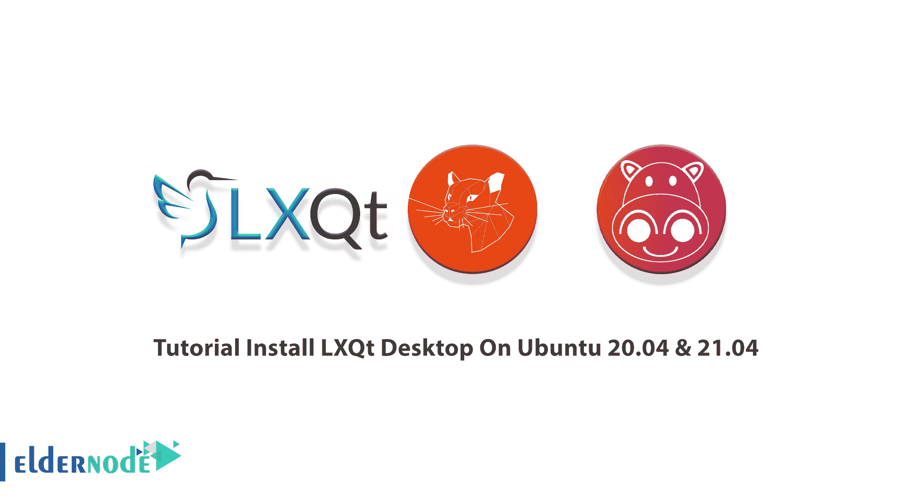
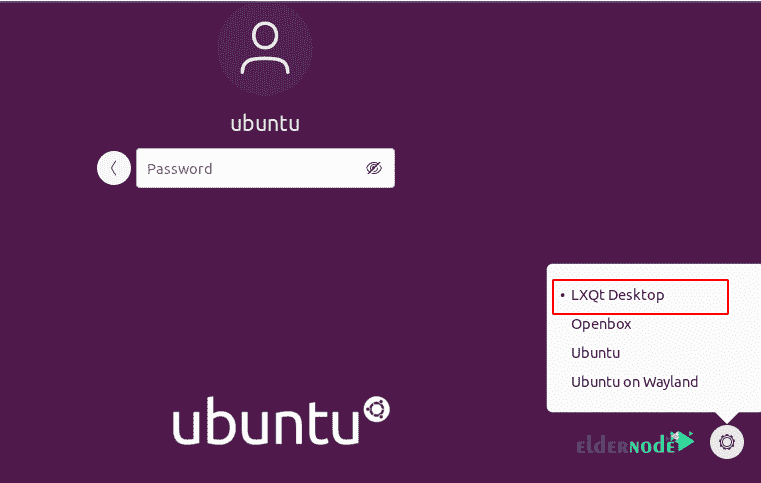
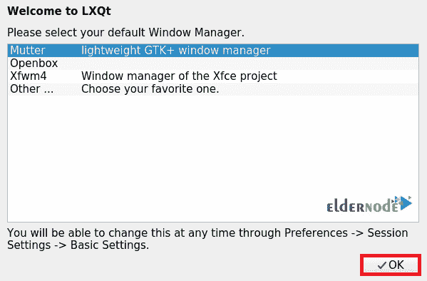
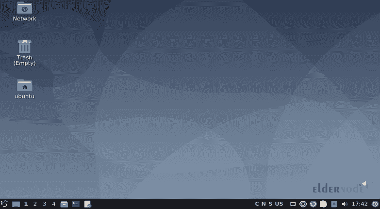
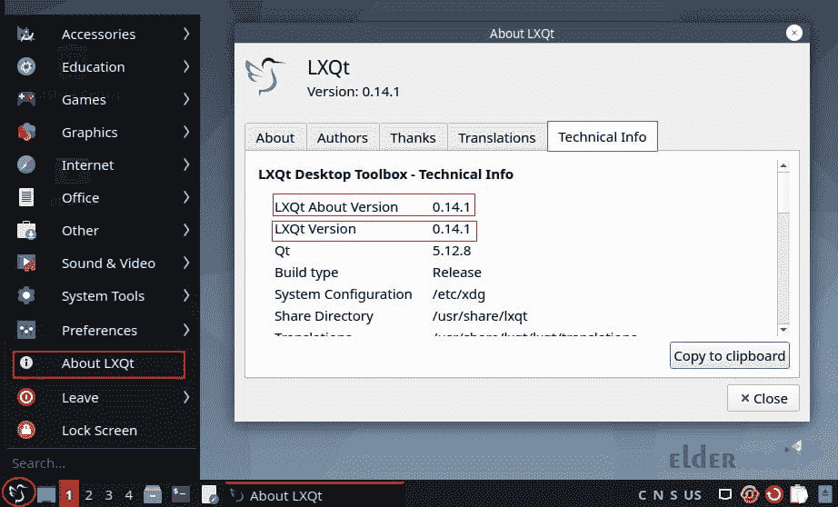

# 教程在 Ubuntu 20.04 和 21.04 上安装 LXQt 桌面

> 原文：<https://blog.eldernode.com/install-lxqt-desktop-on-ubuntu/>



LXQT 是一个免费的、开源的、轻量级的、用户友好的桌面环境。模块化的快速 LXQT 是 LXDE 桌面环境的后继产品。Lubuntu 和其他一些 Linux 发行版都有默认的 LXQT 桌面环境。它资源利用率低，用户界面优雅整洁。默认情况下，Linux 服务器没有安装桌面环境。所以，和我们一起通过这篇文章来回顾一下教程**在 Ubuntu 20.04 & 21.04** 上安装 LXQt 桌面。在 [Eldernode](https://eldernode.com/) 上有各种有趣的软件包，选择你想要的一个并购买自己的**Ubuntu VPS继续本指南。**

## **如何在 Ubuntu 20.04 上安装 LXQt 桌面&21.04**

LXQT 是满足桌面可用性需求的高级定制。也是基于 QT 而不是 GTK+和 LXDE 的精神继承者。大多数基于 Linux 的操作系统默认选择使用桌面环境。桌面 Linux 最流行的版本 Ubuntu 有一个变种，叫做 Lubuntu，提供 LXQt。如果您重视简单性、速度和直观的界面，LXQt 就是您所需要的。

### **LXQt 桌面功能**

LXQt 桌面环境的最新版本是 0.17.0，它有一些改进。让我们先回顾一下它的一些特性，然后再来看看这个新版本的特性:

1- pcmanfm-qt 文件管理器，一个用于 pcmanfm 和 libfm 的 qt 端口。

2- lxterminal，一个终端模拟器。

3- lxsession 会话管理器。

4- lxqt-runner，一个快速应用启动器。

5-配有集成节能组件。

6-支持多种国际语言。

7-支持几个键盘快捷键和许多其他小功能。

**而新版本的一些特性是:**

1-根据 Qt 5.11 构建的包。

2-增强的 libfm-qt 文件管理器。

3- qps 和 screengrab 现在在 LXQt 的保护伞下。

4-菜单相关的内存泄漏修复。

5-改进的 LXQtCompilerSettings。

6-新的 lxqt 主题组件。

7-改进了关机/重启的结束会话等等。

8-适度更新。

***注意*** :由于日程冲突，Lubuntu 21.04 将不会搭载 LXQt 0.17。因此，您将在今年晚些时候的发行版中获得 LXQt 0.17。

### **在 Ubuntu 上安装 LXQt 桌面的先决条件**

为了让本教程更好地工作，请考虑以下先决条件:

_ 拥有 Sudo 权限的非 root 用户。要进行设置，请遵循我们在 Ubuntu 21.04 上的[初始服务器设置。](https://blog.eldernode.com/initial-server-setup-on-ubuntu-21-04/)

_ 至少 2GB 内存

## **LXQt 桌面安装在 Ubuntu 20.04&21.04**

让我们通过本指南的步骤来回顾一下这个易于使用的桌面环境的安装。

*第一步:*

最新的 LXQt 版本是从默认的 Ubuntu 库中获得的**而不是**。因此，使用下面的命令**开始安装**:

```
sudo apt-get update
```

```
sudo apt install lxqt sddm
```

*第二步:*

用于使用 GUI 组件，如任务栏、登录管理器、屏幕保护程序、图标等。你需要安装 Openbox。要**安装 LXQT 和 Openbox** 包，运行:

```
sudo apt-get install lxqt openbox -y
```

*第三步:*

一旦安装了 LXQt，重启你的 Ubuntu 系统或者退出当前会话:

```
sudo reboot
```

*第四步:*

然后，选择 LXQt 桌面，在登录界面输入您的[强密码](https://blog.eldernode.com/how-to-create-strong-password/):



*第五步:*

当你第一次切换到 LXQt 时，它会要求你从列表中选择一个窗口管理器。你可以选择其中任何一个，然后点击确定。



*第六步*

如果您成功地通过了上述步骤，那么您的 LXQT 环境现在就准备好了:



*第七步:*

同样为了查看当前安装的版本，点击启动菜单并选择关于 LXQT 并选择技术信息标签。



**如何在 Ubuntu 20.04 上卸载 LXQt 桌面&21.04**

每当您决定从系统中删除 LXQt 桌面时，请使用下面的命令:

结论

## 在本文中，您了解了如何在 Ubuntu 20.04 和 21.04 上安装 LXQt Desktop。在任何其他基于 Linux 的操作系统中，您可能需要自己安装 LXQt。LXQt 在模块及其组件之间提供了适度的改进。它也适用于不太强大的机器。但是，如果您使用任何其他桌面环境，请让您的朋友在[社区](https://community.eldernode.com/)上了解它。

Anytime you decided to **remove** the LXQt desktop from your system, use the command below to do this:

```
sudo apt autoremove
```

```
sudo apt purge lxqt sddm
```

## Conclusion

In this article, you learned How to Install LXQt Desktop On Ubuntu 20.04 & 21.04\. In any other Linux-based OS, you will likely have to install LXQt yourself. LXQt provides moderate improvements across modules and their components. It also works fine with less powerful machines. However, if you work with any other desktop environment, let your friends know about it on [Community](https://community.eldernode.com/).