# 在 Kali Linux - Eldernode 博客上介绍和安装 MagicTree

> 原文：<https://blog.eldernode.com/install-magictree-on-kali-linux/>


虽然渗透测试报告是任何安全评估活动中的关键交付物，但是渗透测试人员可能会发现该报告是一个耗时且无聊的过程。为了简化制作报告的任务，您需要使用 Kali Linux 中可用的工具。MagicTree 是一款渗透测试生产力工具。由于它的树形结构和令人惊叹的数据管理和报告，它被称为 MagicTree。它允许数据整合、查询、外部命令执行和(耶！)报告生成。本文介绍了如何在 Kali Linux 上介绍和安装 MagicTree。要找到你想要的软件包，请访问 [Eldernode](https://eldernode.com/) 并购买一个便宜但重要的 [Linux VPS](https://eldernode.com/linux-vps/) 。

## **Kali Linux 上的 MagicTree 介绍**

[Kali Linux](https://blog.eldernode.com/tag/kali-linux/) 是基于 Linux 的操作系统，多用于渗透测试。Kali Linux 中有不同类型的工具来执行不同的操作。其中之一是报告工具，该工具旨在开发统计数据和信息以帮助分析。在本节中，您将了解 MagicTree 数据管理和报告工具，该工具可帮助您执行命令并将结果导出为报告。如果你已经用过或者听过，MagicTree 类似于**德拉迪斯**、**法拉第 IDE** 、**皮帕尔**。

MagicTree 是一个 Java 程序经典的桌面应用程序。它将根据它描述的真实世界的对象来组织数据。没有服务器，没有数据库，也没有监听套接字。但是它通过树形结构的节点来管理数据，这对于管理主机和网络数据特别有效。MagicTree 以树形结构存储数据。为此，它有几个节点来存储数据，如分支节点、简单节点、文本节点、数据节点、XML 数据节点、图片节点和汇总节点。它还允许保存查询和命令，以便在未来的项目中重用。

### **魔法树特性**

这个工具有一些独特的特性，比如数据查询和命令执行，允许用户从树中提取必要的数据，并将其提供给命令行工具。MagicTree 允许您导入 XML 数据，并为 [Nmap](https://blog.eldernode.com/install-nmap-on-linux/) 、 [Nikto](https://blog.eldernode.com/introducing-and-install-nikto-on-kali-linux/) 、 [Nessus](https://blog.eldernode.com/setup-and-configure-nessus-on-ubuntu/) 、 [Burp](https://blog.eldernode.com/tag/burp-suite/) 、 [OpenVAS](https://blog.eldernode.com/setup-and-configure-openvas-on-debian/) 、Qualys 和 Imperva Scuba 提供 XSLT 转换。让我们看看 MagicTree 的更多特性:

1-从网络块地址自动创建节点

2-从树中拖放对象

3-从 MagicTree 启动基于 CLI 的工具(Nmap、Nikto 等)

4-从其他工具导入结果(Nessus 等)

5-按严重性对调查结果进行排序

6-生成报告(*。odt，*。docx)

7-向节点添加文件附件

8-在树中搜索数据

9-支持直接从 GUI 运行 shell 命令，捕获命令输出

10-允许查询收集的数据并将其提供给 shell 命令

## **如何在 Kali Linux 上安装 magic tree**

magic tree**预装**在 Kali Linux 上，位于“ ***报表工具*** ”类别下。

您可以通过运行以下命令来安装 MagicTree:

```
sudo apt-get install magictree
```

### **如何在 Kali Linux 上使用 magic tree**

MagicTree 遵循树节点结构来管理主机和相关数据。加入我们这一部分来学习如何使用魔法树。

*第一步:*

要启动 [Kali-Linux](https://blog.eldernode.com/install-and-configure-kali-linux-on-vps/) 工具，点击**应用**，进入**报告工具**。然后，点击**魔法树**。

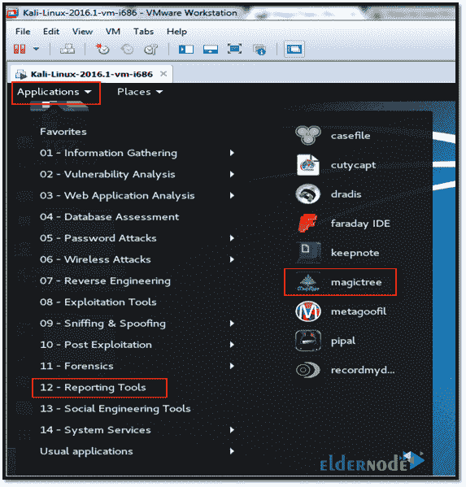

*

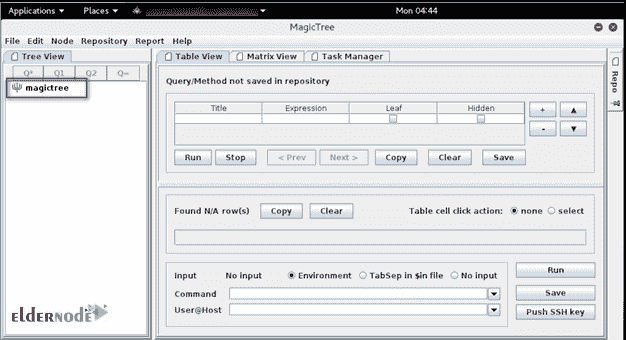

*第二步:*

然后，导航到“**文件**”、“**打开【T3”)，选择要上传的文件。**

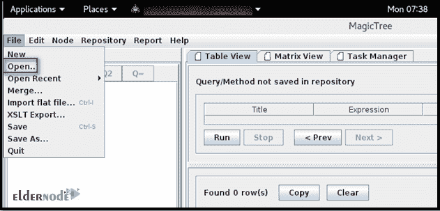

*

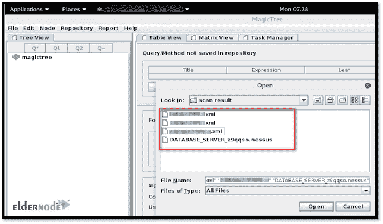

*第三步:*

魔法树将所有数据映射到树节点结构中。

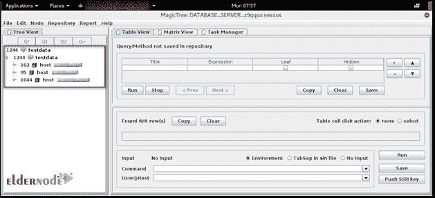

*第四步:*

您将能够在扩展单个节点时进一步查看数据:

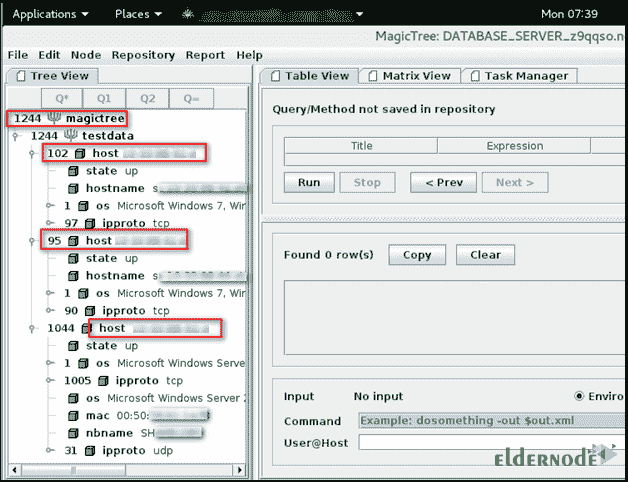

**卡利 Linux 上的 MagicTree 查询**

这个工具**允许查询**收集的数据，并将其提供给 shell 命令。从上表中选择任意数据。有不同的查询可用:

**Q*** :运行一个查询，选择与当前所选节点类型相同的所有节点。例如，如果我们选择 OS 并单击“ **Q*** ”按钮，它将列出所有类型为“ **OS** ”的节点。下面是所有节点的操作系统详细信息。

### 为获取数据而运行的查询出现在“**查询**字段下。因此，您可以根据需要修改查询:

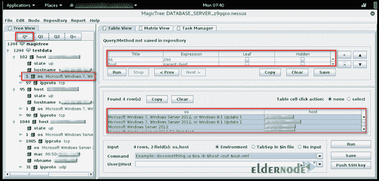

要**列出**所有类型为“ **OS** 和文本为“**微软 Windows 7** ”的节点，可以选择 OS 并点击“ **Q1** 按钮。在这里，您可以看到使用相同操作系统的所有主机:

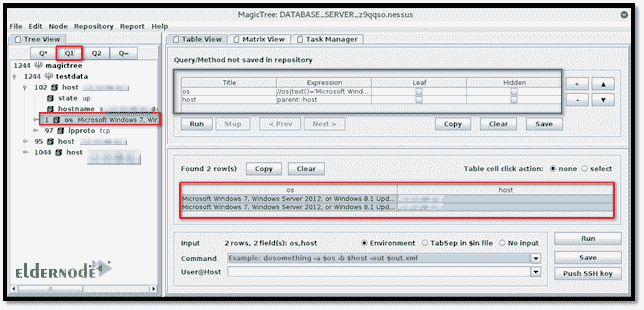

这样，您**从树中提取**必要的数据，并将其提供给命令行工具。

MagicTree 能够从用户界面运行 Nmap。为此，右键单击“**测试数据”**注意，转到“**创建子节点**，并单击“**简单节点**选项。

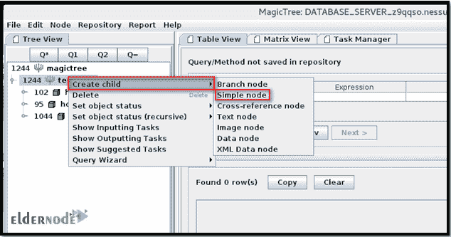

现在，输入主机详细信息并按**键输入**:

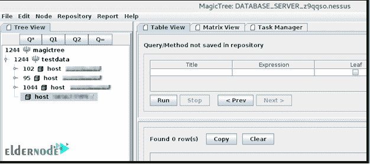

接下来，单击“ **Q1** 查询”按钮，在“**命令**字段中输入以下 Nmap 命令，然后单击“**运行**按钮:

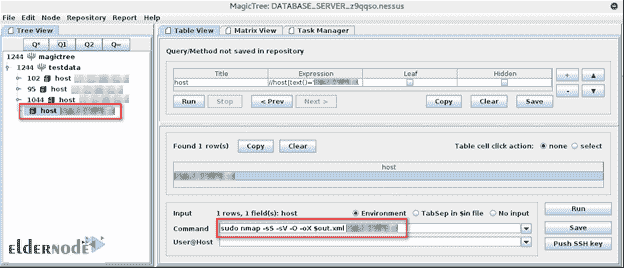

此时， **Nmap 扫描**已经开始。您可以在屏幕的左下方看到一个新创建的任务，而上方突出显示的部分显示了该任务的状态:

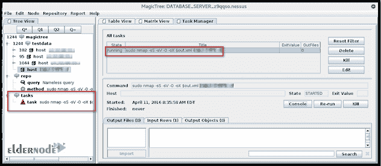

要检查扫描状态，需要点击**控制台**按钮并进入:

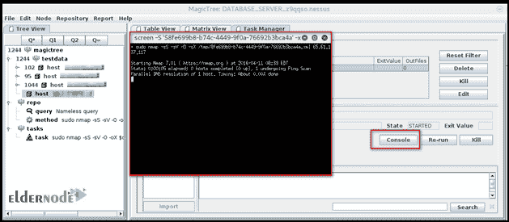

扫描完成后，您将在“**任务**节点下看到日志和 XML 输出:

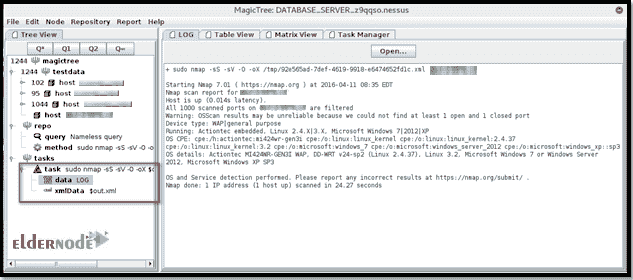

现在，点击 **xmlData** ，然后点击**合并 XML 数据**按钮，将结果合并到当前树中:

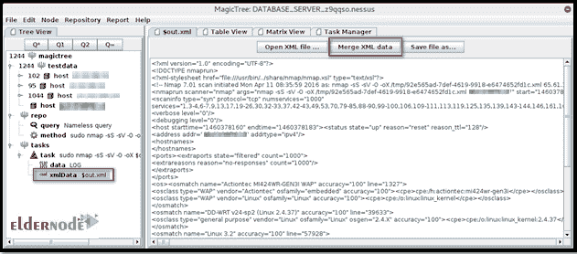

扫描结果将添加到您所需的主机中:

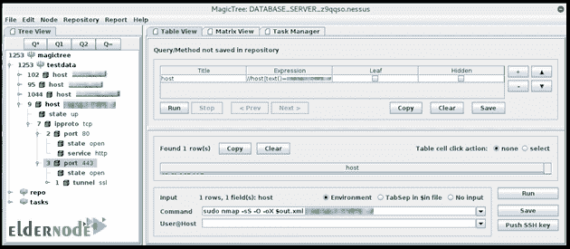

魔术树可以选择生成 Word 格式的报告。因此，您可以选择一个节点，导航到“**报告**”，点击“**生成报告**……”选项生成报告。

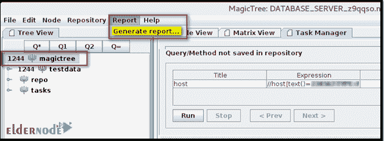

然后浏览可用的报告模板，选择一个，点击“**生成报告**按钮:

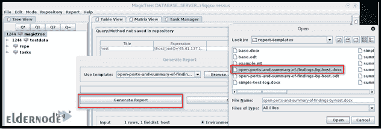

导航到一个位置以提取报告:

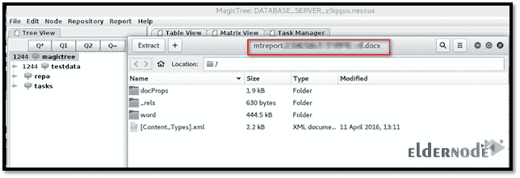

最后，Word 报告被下载并可以访问:

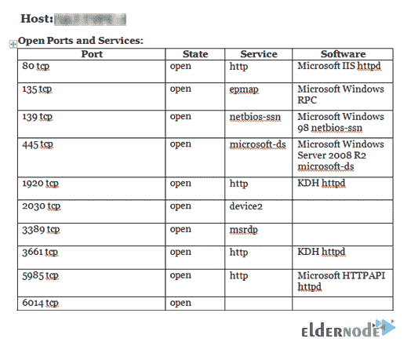

*****

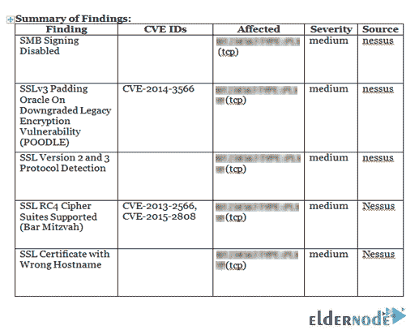

结论

在本文中，向您介绍了 MagicTree，您学习了如何安装和使用它。如果您使用任何替代方案，请在[社区](https://community.eldernode.com/)上与您的朋友讨论它们的不同之处。


## Conclusion

In this article, MagicTree was introduced to you and you learned How to Install and Use it. If you are using any alternative, discuss their differences with your friends on [Community](https://community.eldernode.com/).