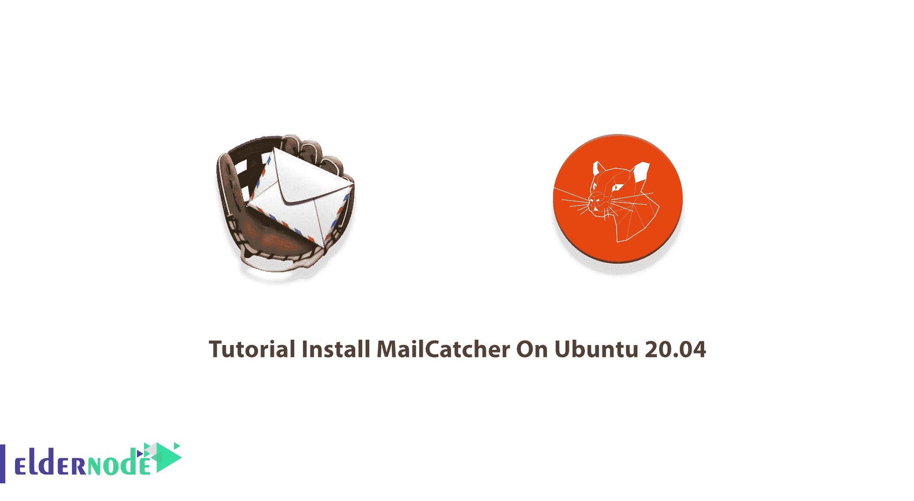
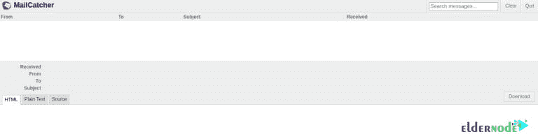

# 教程在 Ubuntu 20.04 上安装 mail catcher-elder node 博客

> 原文：<https://blog.eldernode.com/install-mailcatcher-on-ubuntu-20-04/>



开发者将 MailCatcher 描述为一个电子邮件测试工具。它运行一个超级简单的 SMTP 服务器，捕捉发送给它的任何消息，并在 web 界面上显示。MailCatcher 捕捉所有的电子邮件，并存储显示。它显示 HTML、纯文本和消息的源版本(如果适用)。在这篇文章中，我们将一步一步教你关于**教程在 Ubuntu 20.04 上安装 mail catcher**。如果你想购买一台 [Ubuntu VPS](https://eldernode.com/ubuntu-vps/) 服务器，你可以访问 [Eldernode](https://eldernode.com/) 中提供的软件包。

## **如何在 Ubuntu 20.04 上安装 mail catcher**

MailCatcher 是一个免费的工具，能够跟踪从任何网络或移动应用程序发送的电子邮件。这个工具就像一个假的 SMTP 服务器，你可以直接发送你的邮件，而不是发送到一个真正的 SMTP 服务器。应该注意的是，以这种方式发送的电子邮件只能到达本地服务器，并且可以在 web 界面中查看。或者也许这些电子邮件根本没有到达。

有趣的是，每个到达 Mailcatcher 的消息都可以被解析和分析。因此您可以检查整个邮件的文本、标题、附件和 HTML 代码。Mailcatcher 可以与任何支持 [SMTP](https://blog.eldernode.com/how-to-find-the-smtp-address/) 和 localhost 的框架一起工作。这个工具也可以通过 API 启动。在下一节，我们将介绍 Mailcatcher 的一些特性，然后我们将教你如何在 [Ubuntu](https://blog.eldernode.com/tag/ubuntu/) 20.04 上安装 MailCatcher。请加入我们。

### **邮件捕手简介**

Mailcatcher 可以帮助你彻底检查邮件的内容和标题。使用这个工具，您可以访问 HTML 版本的电子邮件，并检查邮件头(包括返回路径地址)是否设置正确。在发送邮件之前，您可以尝试链接、预览附件，并确定需要改进的地方。

使用 Mailcatcher 是免费的，这可能对预算很少的你有吸引力。Mailcatcher 能够防止应用程序的真实用户收到垃圾邮件。有了这个工具，你可以很容易地看到什么是真正有效的，什么是无效的。换句话说，你可以看到应该被激活的消息是否真的发送了。使用 Mailcatcher 工具，您还可以在用户执行一个简单的操作后通知大量电子邮件的发布，并在将其推向生产之前修复它。

### **邮件捕捉器功能**

在本节中，我们想向您介绍 MailCatcher 的一些特性。这些功能包括:

1.捕获所有邮件并存储起来以供显示。

2.显示邮件的 HTML、纯文本和源版本(如果适用)。

3.重写 HTML 以显示嵌入的内嵌图像等，并在新窗口中打开链接。

4.列出附件并允许单独下载部件。

5.下载原始电子邮件，以便在您的本机邮件客户端中查看。

6.替代默认 SMTP/HTTP IP 和端口设置的命令行选项。

7.如果您的浏览器支持 WebSockets，Mail 会立即显示，否则每三十秒更新一次。

8.作为后台守护程序运行，也可以选择在前台运行。

9.sendmail-analog 命令，catch mail，使得在 PHP 中使用 MailCatcher 更加容易。

10.消息间的键盘导航。

## **在 Ubuntu 20.04 | Ubuntu 18.04** 上安装 MailCatcher

在前面几节熟悉了 Mailcatcher 之后，现在在这一节，我们将教你如何在 Ubuntu 20.04 上安装 MailCatcher。安装 Mailcatcher 并不复杂，您只需要按照下面的步骤操作。第一步是使用以下命令**安装安装 Mailcatcher 所需的依赖项**:

```
apt-get update
```

```
apt-get install -y build-essential software-properties-common
```

```
apt-get install -y libsqlite3-dev ruby1.9.1-dev
```

请注意，如果没有执行上述命令，可以按如下方式输入:

```
apt-get install -y libsqlite3-dev ruby-dev
```

然后在下一步中，您可以通过运行以下命令轻松地**安装邮件捕捉器**:

```
gem install mailcatcher
```

### **如何在 Ubuntu 20.04 上使用 mail catcher**

一旦您按照上述步骤成功安装了 MailCatcher，现在就是开始的时候了。您可以通过运行以下命令来启动 MailCatcher。请注意，在下面的命令中，您必须输入您想要的 IP 地址，而不是**公共 IP 地址**。

```
mailcatcher --ip <Public IP address>
```

您现在可以登录如下所示的 web 界面，查看通过 Mailcatcher 应用程序收到的电子邮件。需要注意的是，在您的应用程序中，您可以使用 smtp 配置作为 **smtp://127.0.0.1:1025** 来发送电子邮件，或者您可以根据需要更改 SMTP 端口，**mail catcher–SMTP-port<port number>**。



## 结论

需要注意的重要一点是，Mailcatcher 不是一个 web 服务。所以你必须把它放在某个地方。为此，您需要设置一个服务器，然后按照本教程中的说明安装 Mailcatcher。由于 Mailcatcher 是用 Ruby 构建的，并且通常与 Ubuntu 一起安装，所以在本文中，我们试图教你如何在 Ubuntu 20.04 上安装 MailCatcher。