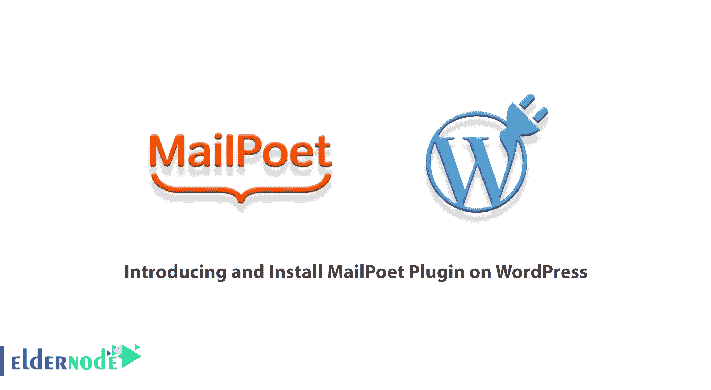
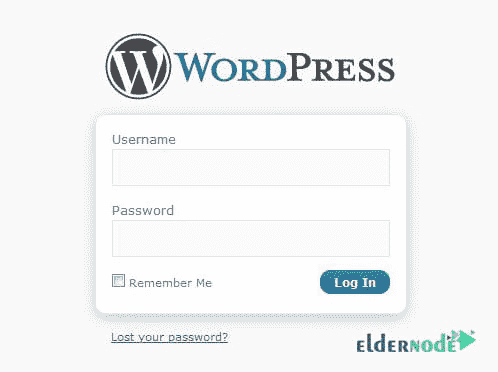
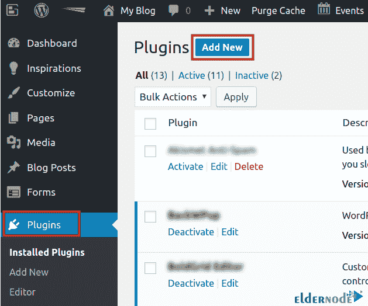
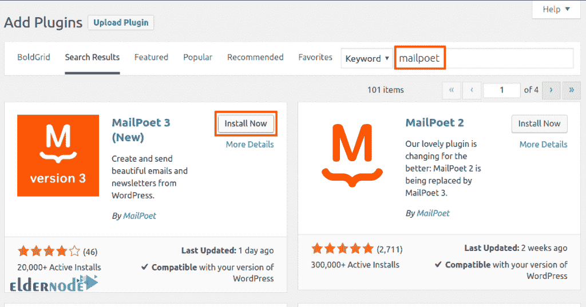
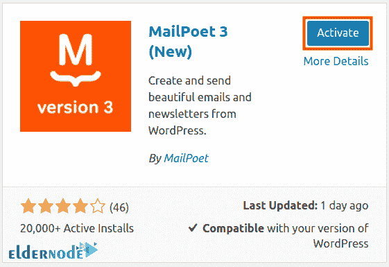
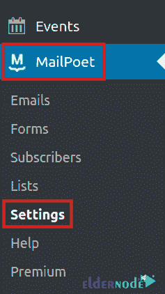
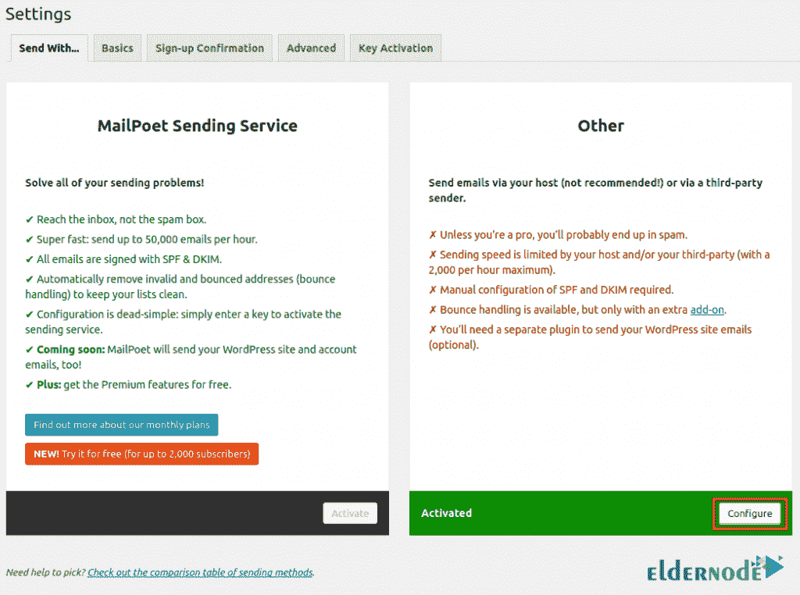
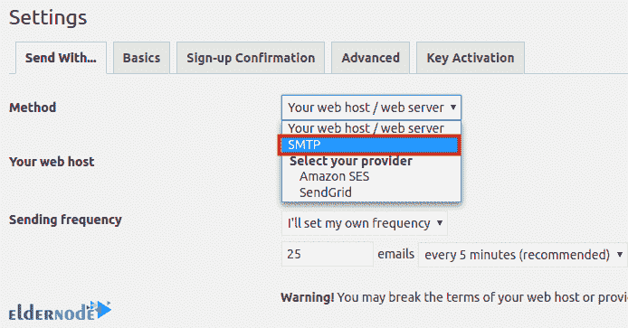
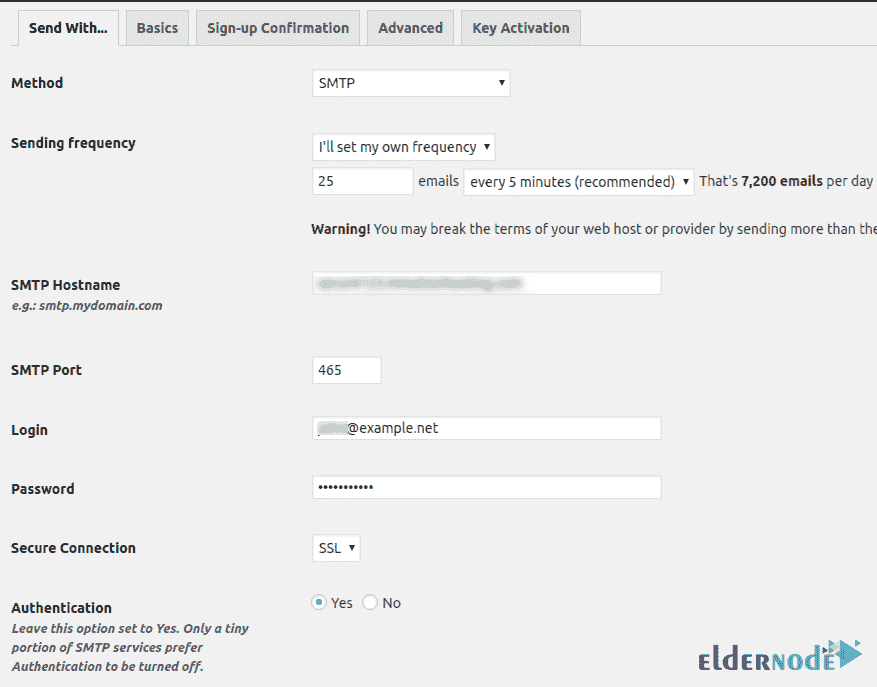
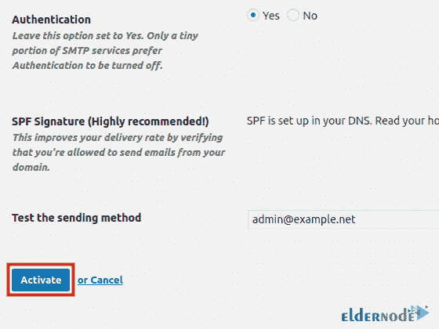

# 介绍并在 WordPress - Eldernode 上安装 MailPoet 插件

> 原文：<https://blog.eldernode.com/install-mailpoet-plugin-on-wordpress/>



在 WordPress 中发送各种简讯邮件或者创建邮件列表是所有站长应该做的必不可少的工作之一。这是增加网站流量和销售额的方法之一，你可以用最好的方式向目标市场，也就是你的受众，介绍你的网站活动以及你的服务和业务。MailPoet 插件是最好的 WordPress 电子邮件营销服务之一，这是一个专业和实用的插件，允许你创建一个表格，在可编程的时间框架内接收用户的电子邮件并向他们发送时事通讯。在这篇文章中，我们将教你如何在 WordPress 上引入和安装 MailPoet 插件。

## **介绍 WordPress 上的 MailPoet 插件**

在本文中，您将了解到一个时事通讯发送插件，即 MailPoet。我们建议你花些时间仔细阅读这篇教程。在下一节中，我们将提到 MailPoet 插件的一些特性。然后我们就直接进入主要讨论，如何在 [WordPress](https://blog.eldernode.com/tag/wordpress/) 上安装 MailPoet 插件。在最后一步，我们将教你如何设置邮件诗人。请加入我们。

### **MailPoet 插件功能**

MailPoet 插件是 WordPress 的一个专业的功能插件，它允许你在你的 WordPress 站点上创建一个接收用户电子邮件的表单，允许用户通过电子邮件发送时事通讯。WordPress VPS 站点的 MailPoet 插件的一些特性是:

1.能够统计成功的电子邮件

2.计算点击次数

3.计算打开的电子邮件数量

4.查看成员的能力

5.美丽的外表

6.能够在小部件中显示

## **如何在 WordPress** 上安装 MailPoet 插件

在这一部分，加入我们，一步一步教你如何在 WordPress 上安装 MailPoet 插件。为此，只需遵循以下步骤。要开始，你必须首先通过输入你的用户名和密码进入你的 **WordPress 仪表盘**。例如:

```
http://example.com/wp-admin
```



成功进入 WordPress 仪表盘后，在下一步，你必须点击左栏的**插件**。然后你必须点击**添加新的**，如下所示:



在下一步中，您必须在搜索字段中键入短语 **MailPoet** 并进行搜索。查看搜索结果后，您必须点击**立即安装**开始安装邮件诗人插件。



等待 MailPoet 安装完成。最后，要激活这个插件，你必须点击**激活**。



### **如何在 WordPress** 上设置 MailPoet 插件

在您根据上一节提到的教程成功安装了 MailPoet 之后，现在我们想教您如何设置它。现在，如果您仔细观察仪表板的左栏，您会看到已经添加了 **MailPoet** 选项。你必须点击它并选择**设置**。



如下图所示，从**发送…** 选项卡，在**其他**部分，您必须点击**配置**:



如图所示，点击**方法**部分前面的下拉栏。然后点击 **SMTP** 。



现在，您必须完成 SMTP 设置字段。



完成与 SMTP 设置相关的部分后，您应该最后点击**激活**以保存设置。



## 结论

邮件诗人是一个伟大的电子邮件营销插件。这个插件没有像 MailChimp 那样的独立在线服务，你甚至可以使用自己选择的电子邮件服务器发送电子邮件。它也很容易接受你以前所有的列表。在本文中，我们试图向您介绍 MailPoet 插件。然后在文章的后续部分，我们教你如何在 WordPress 上安装和设置 MailPoet。