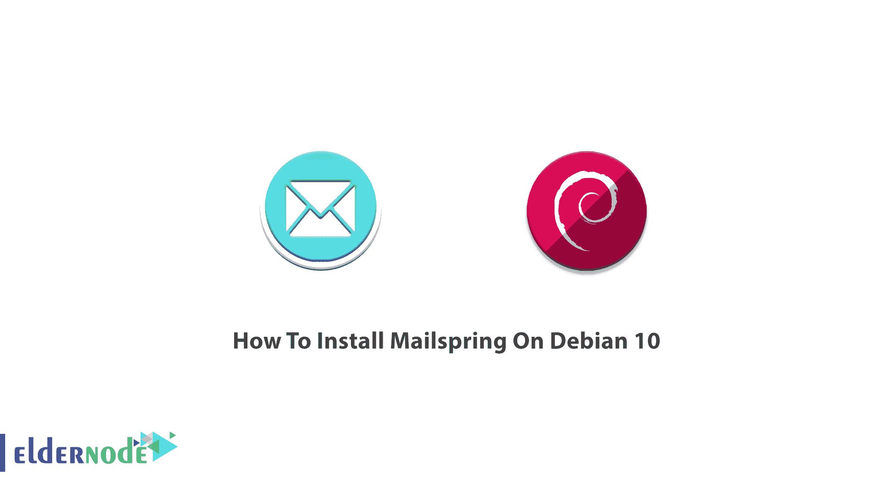
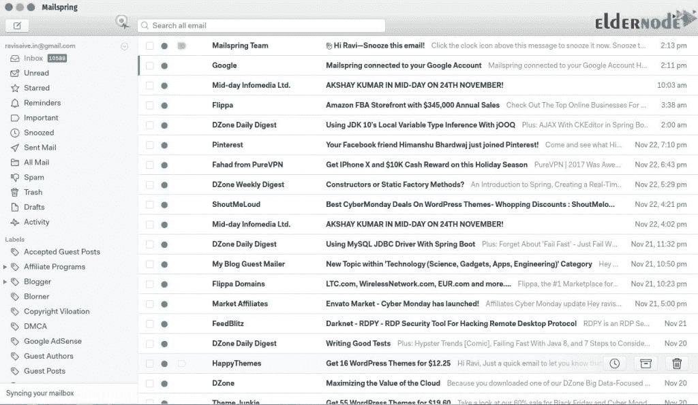

# 如何在 Debian 10 & 9 - Eldernode 博客上安装 Mailspring

> 原文：<https://blog.eldernode.com/install-mailspring-on-debian/>



Mailspring 是一个桌面电子邮件客户端。它作为一个流行的电子邮件应用程序而闻名，适用于工作中的人们和团队。Mailspring 提供了一些现代功能，比如统一收件箱、打盹、提醒、模板、离线搜索和对 Gmail 标签的支持。为了更好地发送邮件，提高工作效率，Mailspring 是个好主意。据报道，它是 Mac、Linux 和 Windows 的最佳电子邮件客户端。你将不会面临任何界面问题，因为你将能够轻松舒适地发送、接收和访问你的电子邮件。使用 Mailspring，你可以建立一个目标档案，访问社交媒体，并跟踪电子邮件。在本文中，你将学习**如何在 Debian 10 & 9** 上安装 Mailspring。在 [Eldernode](https://eldernode.com/) 上找到你考虑的软件包，然后购买你自己的 [Linux VPS](https://eldernode.com/linux-vps/) 。

为了让本教程更好地发挥作用，请考虑以下**先决条件**:

拥有 sudo 权限的非 root 用户。

要进行设置，请按照 Debian 10 的[初始设置进行。](https://blog.eldernode.com/initial-setup-with-debian-10/)

## **在 Debian 10 | Debian 9** 上安装 mail spring

如果这是你第一次安装 Mailspring，你需要创建一个 Mailspring ID 来使用这个应用程序。该 ID 与您的电子邮件帐户不同。因此，你可以使用任何电子邮件地址或密码。您的 Mailspring ID 包含了一些信息，比如暂停日期和邮件规则。通过这种方式，您可以重新安装 Mailspring，或者同时在两台计算机上使用它。



### **Mailspring 功能**

当您使用 Mailspring 时，以下功能将帮助您享受更多，感觉更舒适。

1-统一收件箱

2 点触控和手势支持

3-撤消发送

4-闪电般的快速搜索

5-主题和布局

6-本地化为 9 种语言

7-阅读回执、链接跟踪等

8-高级快捷方式

9-多个账户

10-拼写检查

11-翻译

12-简易 RSVPs

13-管理繁忙的收件箱

14-联系人和公司简介

15-快速回复模板

### **如何在 Debian 上启用快照**

要在 Debian 10 上安装 Mailspring，你需要在上面启用 snap。更详细地解释一下， [snaps](https://snapcraft.io/store) 是打包了所有依赖项的应用程序，可以在所有流行的 Linux 发行版上运行。

通过运行以下命令直接安装 snap:

```
sudo apt update
```

```
sudo apt install snapd
```

```
sudo snap install core
```

然后，使用下面的命令**安装邮件弹簧**。

```
sudo snap install mailspring
```

**注意** : Mailspring 不会在云端存储你的邮箱密码。只有支持功能所需的最少量的数据将被同步。暂停、稍后发送等功能。它还将使用哈希机制来识别电子邮件，并跨安装关联其元数据。

### **如何卸载 Mailspring**

如果您是一个 Mailspring ID，但您不再需要它，您可以登录到您的 [Mailspring ID dashboard](https://id.getmailspring.com/login) 并永久删除您的帐户。这样，所有与之相关的数据都将被删除，您可以随时重新创建一个新的。

## **结论**

在本文中，您了解了如何在 Debian 10 上安装 Mailspring。Mailspring 是开源的 Nylas 邮件客户端的一个分支，但是具有原生的 C++同步引擎，依赖性更少，性能大大提高。如果您升级到 Mailspring Pro，Pro 订阅将附加到您的 Mailspring ID。因此，您将能够在任何登录到您的帐户的计算机上访问 Pro 功能，而无需序列号。如果你有兴趣阅读更多，可以找到我们关于如何在 Centos 7 & 8 上安装 MailSpring 的相关文章。