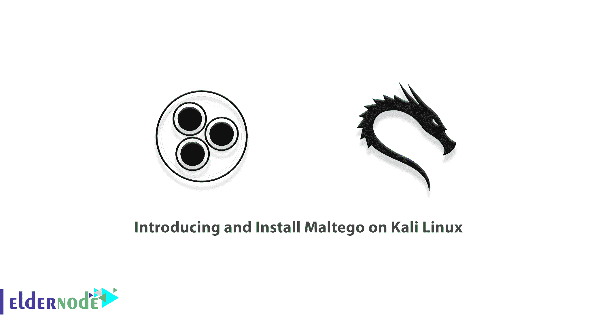
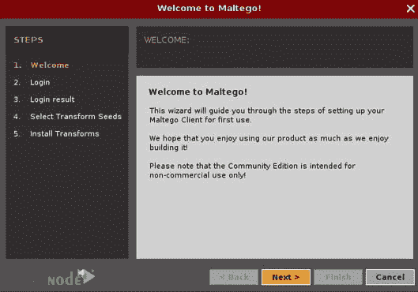
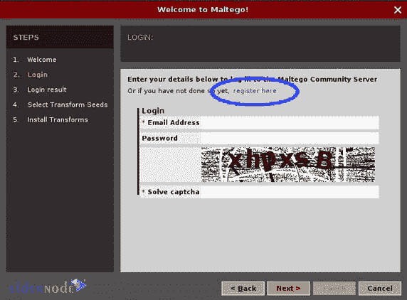
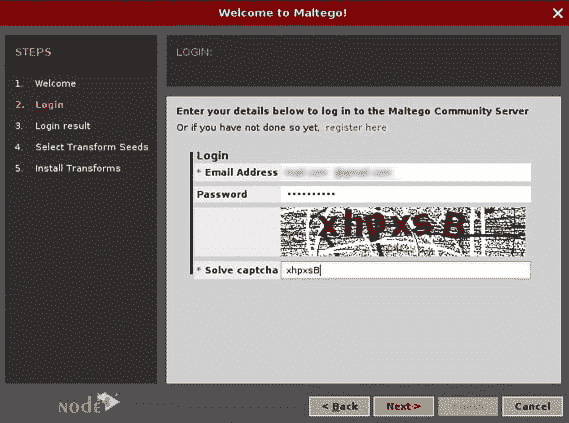
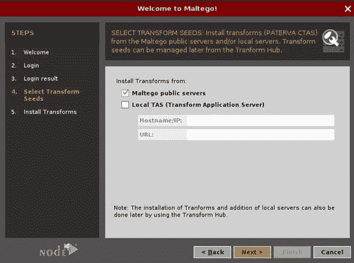
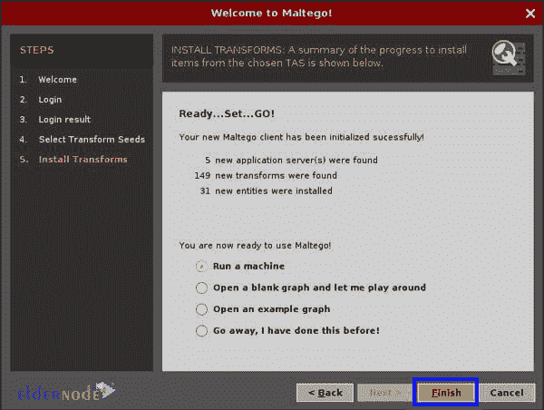
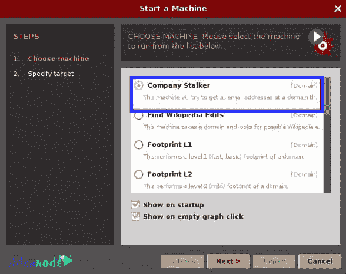
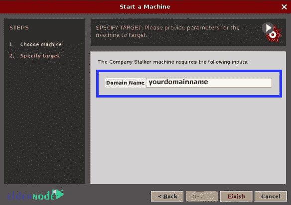

# Kali Linux - Eldernode 博客上介绍和安装 Maltego

> 原文：<https://blog.eldernode.com/install-maltego-on-kali-linux/>



Maltego 是黑客和专业人员非常流行的工具，用于促进取证操作和数据收集。例如，该工具全面分析系统并检查连接的连接、端口等。由于这个原因，这个工具变得非常流行，Kali Linux 操作系统已经包含了这个工具。即使在安装后的主菜单中，您也可以看到该工具并从中受益。在这篇文章中，我们将教你如何在 Kali Linux 上介绍和安装 Maltego**。你可以访问 [Eldernode](https://eldernode.com/) 中可用的包来购买一台 **[Linux VPS](https://eldernode.com/linux-vps/)** 服务器。**

## **Kali Linux 上的 Maltego 介绍**

Maltego 工具是一个独特的平台，用于为您想要在脑海中绘制的环境提供一个场景。Maltego 工具的独特优势在于，您可以轻松访问和映射真实世界的链接和关系。在下一节中，我们将看看什么是 Maltego，它做什么。然后我们提一下 [Kali Linux](https://blog.eldernode.com/tag/kali-linux/) 中 Maltego 工具的一些重要特性。下面，我们将教你如何在 Kali Linux 上安装 Maltego。

### **什么是 Maltego，它是做什么的？**

Maltego 工具是取证和数据收集领域最强大的图形工具之一。在黑客和[安全](https://blog.eldernode.com/tag/security/)领域，它也被称为收集关于足迹和信息收集操作的信息。

开源情报依赖于公开的数据。这种技术的基础是通常存在有价值的数据，但是因为数据不是集中的，所以我们简单地忽略它。这种技术收集各个领域的数据，并以集中的方式提供给用户。例如，在收集目标信息时，它会在互联网上搜索。

在下一节中，我们将介绍 Maltego 工具的特性。和我们在一起。

### **Kali Linux 中 Maltego 工具的特点**

Maltego tool 是一个程序，可用于确定人、社交网络、公司、网站、互联网基础设施(如域名、DNS 名称、IP 地址等)之间的真实关系。这些机构正在使用开源智能进行互联。

1_ 安装 Maltego 简单快捷。

2_ 它使用 Java 语言，所以可以在 Windows、Mac、 [Linux](https://blog.eldernode.com/tag/linux/) 上运行。

3_ Maltego 为你提供了一个图形界面，连接你即时准确的看到这些关系。

4_ 可以看到隐藏的连接。

5_ 使用图形用户界面(GUI ),您可以轻松查看关系。

6_ Maltego 使用一个强大而灵活的框架来实现个性化。

## **如何在 Kali Linux 上安装使用 Maltego**

由于 Maltego 在 Kali Linux 中是默认的，您可以按照下面的步骤来运行和使用它。在本节中，您可以通过进入**应用** > > **信息收集** > > **Maltegoce** 来运行 Maltegoce 工具。您也可以作为普通用户在终端中输入以下命令:

```
$maltego &
```

在下图中，您可以看到 Maltego 欢迎页面:



如您所见，当您在 Kali Linux 上运行 Maltego 时，会出现欢迎屏幕。您可以启动**设置向导**。然后点击**下一步**进入下一步:



下图供用户登录 Maltego。如果您在 [Maltego 网站](https://www.maltego.com/)上注册，您可以使用您的用户名和密码登录:



成功登录 Maltego 后，您将"**选择转换种子**并安装。现在，您已经准备好运行一台新机器来收集信息。



在下一步中，您必须选择**运行新机器**并点击**完成**。



成功完成上述步骤后，会出现一个**新向导**。请注意，您可以使用当前向导运行机器，也可以取消该向导，使用 Maltego 应用程序运行机器。如果你想用这个向导运行机器，你可以选择机器的类型，点击**下一步**。



需要注意的是，如果您选择公司跟踪者，那么您必须在新窗口中指定一个目标(域名)，提供域名(目标)并点击**完成**。



## 结论

Maltego tool 是一款开源的法医智能应用。Maltego 工具允许您探索和收集信息。然后以一种结构化的、有意义的方式展示这些信息。在本文中，我们试图教您如何在 Kali Linux 上运行和使用 Maltego。